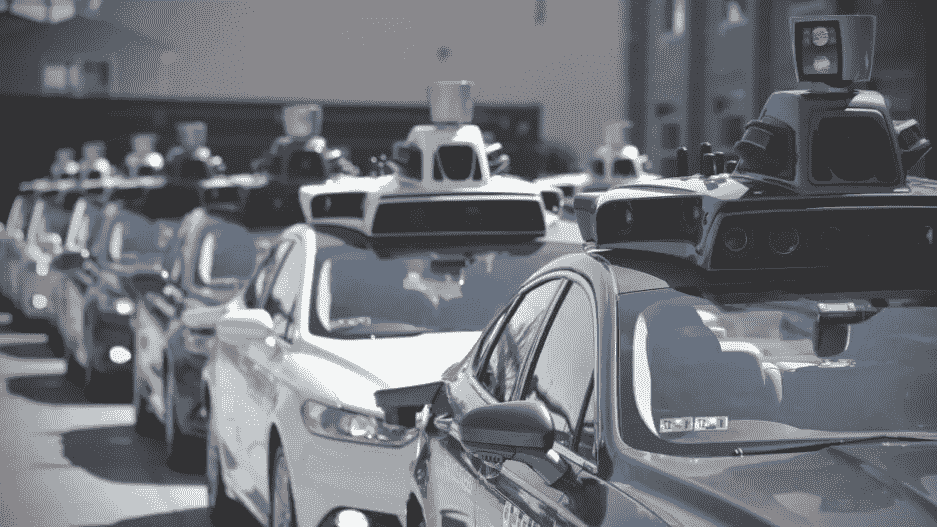
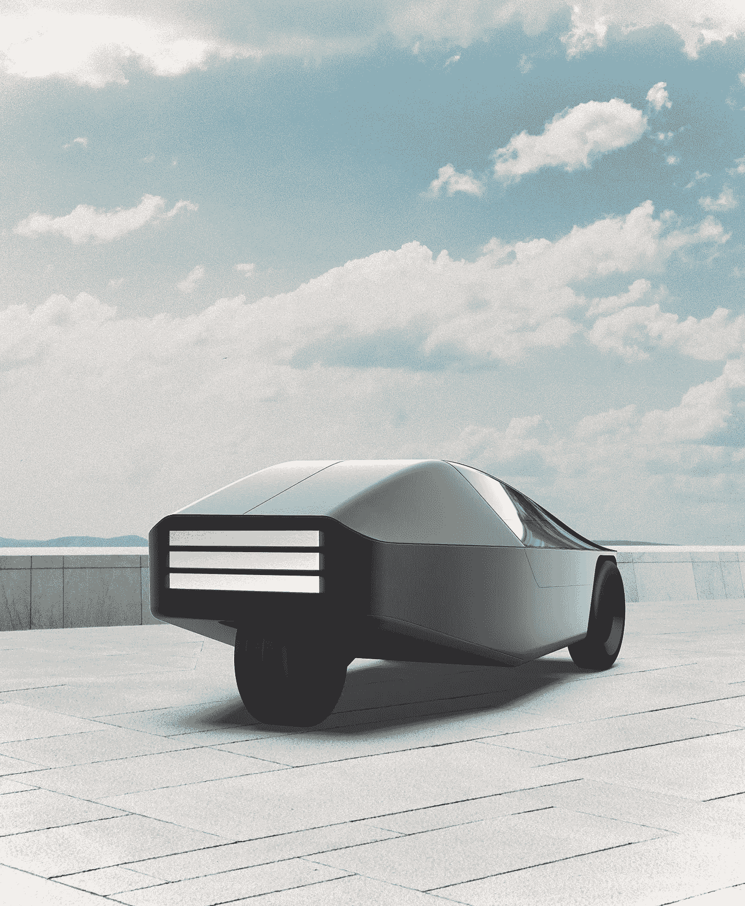

# 苹果汽车的道德困境

> 原文：<https://medium.com/geekculture/the-moral-dilemma-of-apple-car-405d0bdc40d4?source=collection_archive---------14----------------------->

## 自动驾驶汽车行业陷入了困境

Vectors provided by iStock. Graphic design by Daniel Nieblas.

三十年前，互联网刚刚开始彻底改变人类的交流方式。世人几乎不知道，结果会有多少权力落入少数技术官僚精英手中。自动驾驶汽车同样会以同样的方式改变人类的交通方式；在大约十年或二十年后，掌舵的技能将不再是必要的，就像在纸上写字的艺术几乎不复存在一样。

最近关于所谓的苹果汽车项目的新闻几乎没有给自动驾驶革命的可能性带来积极的关注。在一次又一次的民意调查中， [**将近一半的美国人说他们不会使用自动出租车或拼车服务**](https://www.theverge.com/platform/amp/2020/5/19/21262576/self-driving-cars-poll-av-perception-trust-skepticism-pave) 。根据自动驾驶汽车倡导组织 PAVE 的说法，三分之二的人认为这项技术的缺点将超过优点。

作为一家 AV 创业公司的创始人，我相信这项技术会拯救很多人的生命。它不仅代表了一个新兴的创新行业，可以挑战大型科技公司不断扩张的足迹，而且代表了一种蓬勃发展的文化，旨在让我们更接近公众的接受。

尽管衡量在脸书或推特上“写下”自己的想法的净收益可能会变得两极分化，但无人驾驶汽车将会以好的方式带来变革，这是一个值得考虑的原因:它们是更好的司机。在一次又一次的研究中，他们被证明是 [**卓越的决策者**](https://interestingengineering.com/how-safe-are-self-driving-cars) 当人为失误的几率降低到零的时候。子孙后代将记住每年死于可预防的车祸的数百万人，他们是被不太先进的社会容忍了太久的悲剧人物。

这提出了一个重大的道德困境:自动驾驶汽车被视为一种生存危险，因此有能力让我们的生活更安全的技术将不会得到充分利用，因为文化上反对使用它们。**要解决公众接受 AVs 的问题，我们必须首先解决行业内猖獗的不良道德。**

# #1 我们忽略了对 AV 的强烈厌恶

为自动驾驶汽车提供动力的神经网络已经侵入到如此可怕的监控范围内，一些开发人员已经拒绝继续研究它们。阿列克谢·博奇科夫斯基(Alexey Bochkovskiy)是一个名为“YOLO”的计算机视觉项目的首席机器学习工程师，一些 AV 极客认为该项目是制造自动驾驶汽车的重大突破“T2”。

> “我停止了(计算机视觉)研究，因为我看到了我的工作正在产生的影响。我热爱这项工作，但军事应用和隐私问题最终变得不容忽视。”

问问你认识的任何人，他们是否会使用自动驾驶汽车，如果你有我多年来的相同经历，你会得到几乎一致的“*”*不，背后有着多重原因。这种担忧通常不是一些人认为存在于公众意识中的机器人霸主偏执，而是对自动化及其后果的合理的政治和社会态度:优步/出租车司机的大规模失业，更多的财富和权力集中在硅谷，人工智能将在事故中做出生死决定的偏执等。

皮尤研究中心在 2018 年对一些人工智能领域的顶级专家进行了一项 [**膨胀性调查**](https://www.pewresearch.org/internet/wp-content/uploads/sites/9/2018/12/PI_2018.12.10_future-of-ai_FINAL1.pdf) 。从麻省理工学院的工程师到阿帕网的联合创始人，所有人都被问及他们最担心 2030 年的技术变革。最大的担忧不是大规模失业、大规模监控，甚至不是无人机战争。他们最担心的是人力资源的快速流失。

> 随着自动化系统变得越来越复杂，并且这些系统的所有权由精英掌握，人们对数字工具的盲目依赖正在加深。— **皮尤关于人工智能研究的调查对象**

无论是通过专家分析还是实地讨论，自动驾驶汽车的困境在这个等式中生动地展现出来:人们已经变得非常依赖智能手机和互联网的技术进步，并对其失望，并且知道在一个新的领域正在做出同样的承诺。难怪公众认为汽车不再是自由或独立的象征，而是大型科技公司规模化服务的一部分。

如果说互联网的兴起可以借鉴的话，那就是软件的突破本身并不能加速一项技术的接受。这是开发者关注人机设计本质的时候。在我们的情况下，改进设计需要重新思考技术公司将如何重塑城市环境。正如另一家专注于退休社区自动驾驶系统的初创公司 Voyage 所证明的那样，规模更小、更面向本地的企业可能会有效化解社区的鄙视。

# #2 机器人轴心日益增长的道德危机

这种关于自动驾驶汽车的核心循环——它们天生就缺乏动力——已被证明是合理的，因为最大的竞争对手对他们的工作方式有着相同的愿景，即要求客户完全依赖它们。就像物联网在我们日常生活中的应用一样，亚马逊(Amazon)、谷歌(Google)和苹果(Apple)等大型科技公司也在设想 [***【汽车即服务】***](https://www.wired.com/story/promises-broken-musk-offers-new-pledges-self-driving/) ，或者更普遍的说法是 robotaxi。

最大的开发者目前的心态表明，这些机器将成为剥夺权利的主要来源，在巨大的社会经济规模上。去年，Waymo 率先在一个主要的地铁区域推出了 robotaxi 服务，它仍然是美国的主要竞争对手。与此同时，在中国，AV 创新正在以惊人的速度发生，政府资助的 Pony A.I .和 WeRide 是大规模的 robotaxi 项目，其市场理念是，自动化的未来将是一个没有个人所有权的世界。

Image provided with permission by Jared Wickerham. [http://www.wickphotography.com/](http://www.wickphotography.com/)

> “人工智能将继续把权力和财富集中在以美国和中国为基地的几个大垄断企业手中。大多数人——以及世界上的部分地区——情况会变得更糟。”
> 
> — **马克·苏尔曼，Mozilla 基金会执行董事**

Waymo 的成功鼓励了大众汽车和通用汽车等大型汽车公司追求类似的大规模 CaaS，正如 [CNET 报道](https://www.cnet.com/roadshow/news/vw-group-self-driving-development-in-house/)“这导致许多汽车公司与较小的自动驾驶汽车专用初创公司合作。比如福特和 Argo 或者本田和 Cruise。”

但这种基于车队的模式在影音市场是不必要的，它扼杀了创新的潜力，从根本上剥夺了权利。

人们对自动驾驶汽车的担忧正成为全行业的预期。这是一个想象中的机器人轴心和操纵它们的企业巨头的世界。少数人将这项技术视为全球范围内的救命稻草，而许多人只看到广阔的生态系统，他们必须服从并为之付出，没有占有欲，两者之间的热情差距将继续扩大。

XEV 是一家意大利电动汽车初创公司，它已经 3D 打印了一辆价格低于 7500 美元 的汽车，这标志着一种新型汽车在工业生产中的潜力。所谓的增材制造将使面向 nice 的问题解决者成为可能，在这种情况下，权宜之计可以导致自动驾驶汽车的加速生产，这些汽车专门用于适应当地环境和社区的复杂性。

# # 3 "*" A . I "*可以是夸大的，疏忽的，致命的

自动驾驶汽车是带轮子的软件。它们是从被称为计算机科学的军备竞赛中延伸出来的系统，但消费者和开发者等持有一种模糊的想法，即人工智能是一种神奇的、有自我意识的生物，它将在车祸中选择谁生谁死。

作为一名开发人员，听到涉及特斯拉自动驾驶程序的致命车祸的消息令人不安。一家美国联邦机构曾警告说，特斯拉实际上是在把它的客户当作试验品。不幸的是，这在业内太常见了。就在两年前，优步也对一场致命的车祸负有责任，调查人员认为疏忽和狭隘导致了一条人命的丧失。

我的初创公司正在开发一款自动驾驶原型，旨在解决所谓的“*边缘情况*”的问题，或者更确切地说， [**任何可能升级为生死关头的遭遇**](https://www.washingtonpost.com/technology/2019/11/11/what-self-driving-cars-cant-recognize-may-be-matter-life-death/) 。边缘案例从根本上说是编码错误，像光线不足或信号丢失这样简单的事情都可能导致计算机视觉中的致命错误(优步的情况就是如此)。

事实上，我们所说的人工智能——机器学习、深度学习、神经网络——是错综复杂的编程水平。大多数 AV 开发人员使用传统的 C+语言基础，因此以非常传统的方式构建一个例程:它应该如何处理任何和所有可能的输入，以及它何时需要改革(或“学习”)处理它们的新方法？

换句话说，自动驾驶汽车无法做出选择，只有人类可以。什么叫做 *A.I* 。实际上是在一套预先确定的逻辑选择的相同借口下运作的；每一个都反映了人类的能力和局限性以及他们不断增长的计算能力。

开发者和消费者都不应该相信人工智能是完美的，也不应该总是更好。然而，我们可以与强大的理性合作:人类是有限的，因为情感往往模糊了理性和非理性选择之间的界限。人工智能的艺术必须是确保计算机程序不是由我们想象力的弱点来定义的，而是由我们想象力的优势来定义的。

# 努力

> 如果你退一步来看，这辆车，在很多方面，是一个机器人。自动驾驶汽车是一个机器人，所以你可以用自动驾驶做很多事情。我们看看苹果会怎么做。"
> 
> — **苹果公司首席执行官蒂姆·库克，**卡拉·斯威舍在“摇摆”播客上。

Rendering of three-wheeled roadster developed by my startup. ***“NILA”*** is a fast and sleek self-driving sports car designed for the L.A. Lifestyle. Image owned by Niebla.

目前，一些最大的 AV 开发商已经放弃了。优步完全取消了它的计划，而像特斯拉和大众汽车这样的汽车制造商[已经降低了他们对大规模 V 级自主的承诺](https://techcrunch.com/2019/04/22/tesla-plans-to-launch-a-robotaxi-network-in-2020/?guccounter=1)。谷歌的 Waymo 表面上处于领先地位，而苹果的不透明项目则提供了改变行业游戏规则的可能性。

但我们必须问自己，自动驾驶汽车的未来本质上是否是好的，特别是在一个日益集中化、技术官僚化的社会秩序中，少数企业帝国决定着它们的市场估值和扩张清单上的下一个目标。在一个由少数人的底线决定的世界里，人类的状况真的得到优先考虑了吗？一个人类能动性逐渐变得无足轻重的世界？

就像我们在互联网服务方面面临的道德危机一样——隐私、审查和言论自由的理念已经成为鲜明的焦点——如果汽车文化演变成又一个大型科技设备，我们将进入一个数百万人将失去自由感的世界，让位于卓越的智能机器系统。

我相信，毫无疑问，大胆而富有创意的初创公司可以改变公众对自动驾驶汽车的接受程度。随着激光雷达和 3D 打印等技术的普及和价格越来越低廉，我们有机会重新思考我们城市环境中等待解决的一系列问题。当我们知道解决自动驾驶汽车令人生畏的道德问题在我们的范围内时，只有到那时，这项技术的力量才会真正上升到改善人类交通的更大责任。