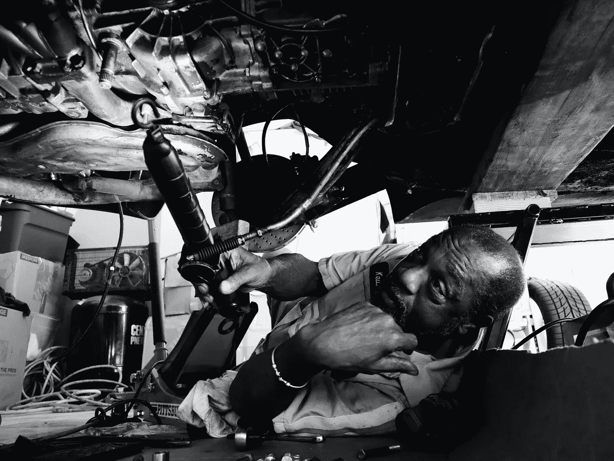
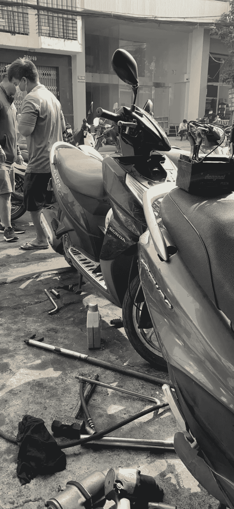
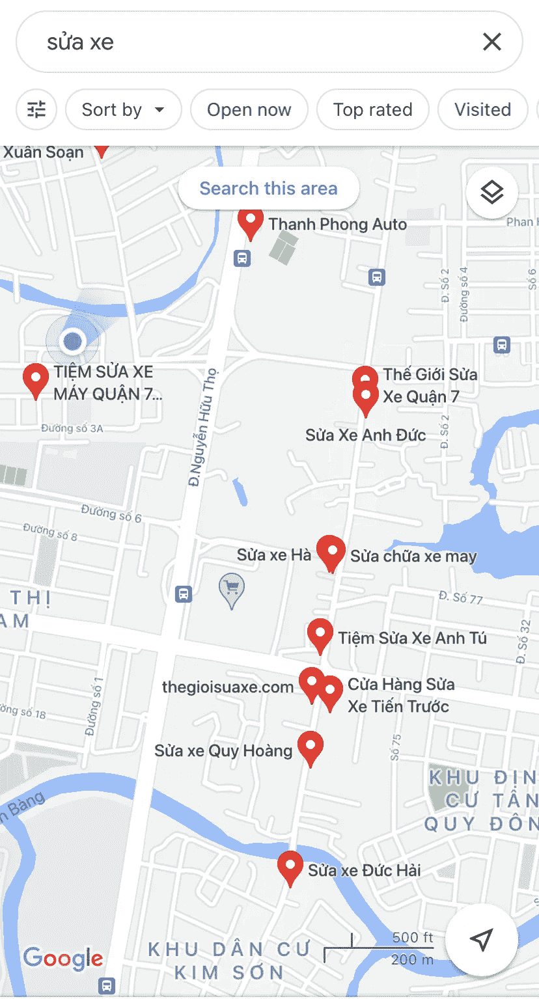
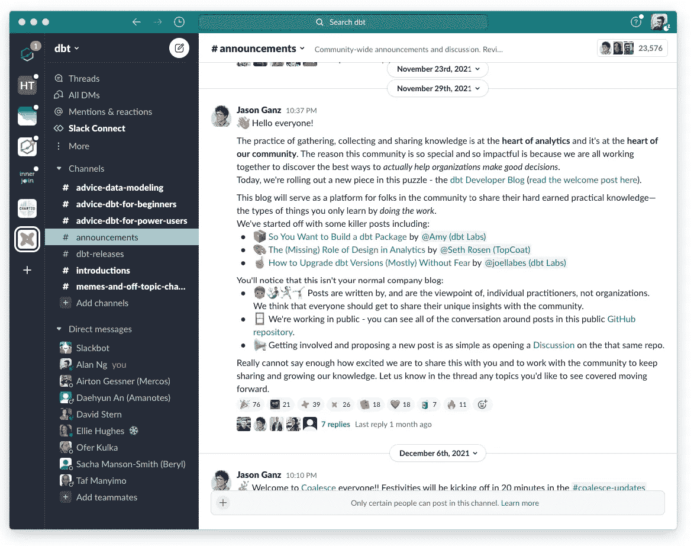
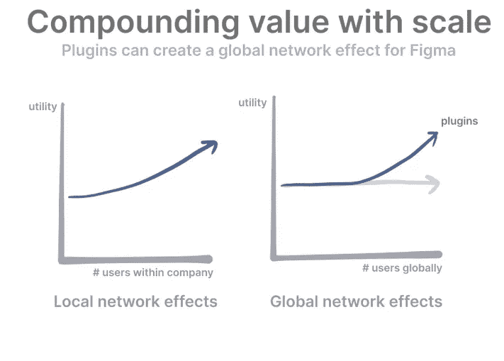

# 摩托车修理厂和产品管理

> 原文：<https://medium.com/geekculture/the-motorbike-repair-shop-and-product-management-705de9c245a9?source=collection_archive---------18----------------------->

## 在客户体验方面，有哪些数码产品可以从摩托车机械师身上学到东西

*照片由* [*瑞安*](https://unsplash.com/@ryking32?utm_source=unsplash&utm_medium=referral&utm_content=creditCopyText)*[*Unsplash*](https://unsplash.com/?utm_source=unsplash&utm_medium=referral&utm_content=creditCopyText)*

*上个月，我去一家摩托车修理店检修我的摩托车(经过 5 个月的闲置)。我来得相当早，不用等人。我的自行车被仔细检查，一些零件被拿掉了。我，尽管在过去的 5 年里紧张/疯狂地驾驶，对自行车一点也不*了解，比如问题，齿轮…**

*这意味着我完全不知道机械师在做什么，也不知道我的摩托车到底出了多大的问题。但是因为我是第一批顾客之一，我很冷。*

*直到。*

*我开始看到有人过来修理轮胎，或者给轮胎打气。有时候，很多人同时过来，把机械师从我的自行车旁拉开。*

*这可不好。*

*我突然意识到，这正是一个产品人员每天都会遇到的情况。*

# *产品管理和分心*

*作为一名产品经理，我每天都会收到很多来自客户的“紧急”请求。单独解决此类问题的技术努力相对较小，至少与高度战略性但耗时的项目相比是如此。因此，我经常陷入当问题出现时试图立即解决的陷阱。*

*“只需要一天时间”——我说*

*我希望生活能如此简单。[上下文切换杀死](https://blog.rescuetime.com/context-switching/)。(非常礼貌地:D)要求我们的工程师从当前的任务(讽刺的是，我每天都在督促他们在截止日期前完成任务)中转移出来，去解决其他更紧急的事情，这要求他们仔细阅读问题，与我讨论解决方案，结果只能回到主要项目，对正在发生的事情一无所知。*

*现在，我们不能简单而盲目地“跟随公司的愿景”，只关注我们的计划而忽略那些紧急的要求。这和机械师是一样的:他们不能告诉路人先等我的自行车修好，而我确实先来了*而且我会付给他们更多的钱！**

****

**Yep, that’s my bike, but the mechanic (in green) is looking at other bikes behind.**

**“这只是一个简单的轮胎漏气了，需要打气，仅此而已”——任何理智的顾客(甚至是我)**

**如果修理一个漏气的轮胎要花 30 分钟，自行车店还有什么用？**

**对于顾客来说，他们有一个问题，所以这是他们看到的一切。**

# **力学的精彩解答**

**机械师做的一件事让我很震惊。**

**他不断向我汇报当前的进展。**

**等等，让我提醒你两件事:1)我对摩托车一窍不通，2)他告诉我的事情我只听懂一半。**

**但这很有效。为什么？**

**因为我有**进步感**。人类讨厌不活动。这一事实迫使像[优步这样的公司展示汽车](/choice-hacking/how-uber-uses-psychology-to-perfect-their-customer-experience-d6c440285029)的实时位置，让他们的用户通过屏幕上的小动画汽车来娱乐。同样的事实也迫使航运公司/电子商务平台显示订单的进度。这也是推动 Meta Messenger 和 Instagram 的“动画打字泡沫”的同一事实。如果你环顾四周，它无处不在。人们都有不愿懒散的倾向。**

****

***Image source:* [*Uber Australia*](https://www.uber.com/en-AU/blog/car-colours-arriving-now/)**

**正如 Don Norman 在他的书[日常用品的设计](https://www.goodreads.com/book/show/840.The_Design_of_Everyday_Things?ac=1&from_search=true&qid=y6dqhq22tC&rank=1)中专业描述的那样，人们需要的是**反馈**。**

**屏幕上的优步汽车相当于机械师给我更新。我几乎不知道(我也不在乎)汽车的品牌或它必须经过的街道，我也不明白机械师说了些什么。我所理解的另一半机械师的说法是已经做了多少工作(“嘿，我们正在排出旧的发动机冷却液*，并且它几乎完成了*”)。这正是我想知道的反馈类型。我真的不关心正在做什么，我关心的是离我上路还有多少时间。**

**另一件同样对拯救我短暂的耐心起到巨大作用的事情是**职位**。**

**在越南传统的摩托车修理店，除了坐在你的自行车前面，你无处可坐，看着机械师对你心爱的自行车做的一切。这是因为这些商店通常很小，而且是由机械师和他们的家人目前居住的地方建造的。**

**在更现代的特许商店里，你有一个专用的房间，用一堵透明的玻璃墙与主要的固定房间隔开。**

****

***Do you see the glass wall separating the garage and the waiting room? Image source:* [*Topic.vn*](https://topic.vn/post/trung-tam-bao-duong-xe-may-honda-uy-tin-nhat-ben-tre-14709)**

**不管怎样，我们鼓励你去看看人们对你的自行车做了什么。**

**不管是不是有意为之，这都是提高客户满意度的伟大举措。[运营透明度已被证明能有效地](https://hbr.org/2019/03/operational-transparency)提高市民对当地政府的信任度、患者对治疗的参与度、食客对食物的满意度等等。**

**这让我想起了去日本餐馆/大排档时的那种快感。日本餐馆的内部通常被设计成顾客可以坐在厨房周围，并且可以观察端到端的烹饪过程。在一些高端餐厅，会专门为你(或你的团队)指定一名厨师，他们会在你面前“表演”烹饪艺术(看看 Youtube 上的“Omakase ”,获得更身临其境的:D 体验)**

****

***Omakase-style eating at a Japanese restaurant. Image source:* [*Tokyo Zebra*](https://www.tokyozebra.com/blog/sushimanner)**

**放大到数字产品，我们观察到“公共路线图工具”的兴起，鼓励用户查看并投票支持他们喜欢的功能，并查看这些功能的进展。一些流行的名字包括 [Canny](https://canny.io/) 、 [Uservoice](https://uservoice.com/) 和 [ProductBoard](https://www.productboard.com/) 。**

**当然，这样做是一把双刃剑，因为你很容易给自己和同事施加巨大的压力来实现你的承诺。但是做得好，你会为自己赢得一大批忠实的顾客。一个鲜明的例子是 Obsidian:这个应用程序只由两个人开发和维护，但在过去的两年里，它已经发布了大量的功能请求、错误修复和[公开承诺的功能](https://trello.com/b/Psqfqp7I/obsidian-roadmap)。他们的运输势头有助于两人团队与 Roam Research 展开正面竞争，Roam Research 在 2020 年的种子期筹集了 900 万美元。**

****

**Obsidian’s public roadmap. Image source: [Obsidian’s Trello](https://trello.com/b/Psqfqp7I/obsidian-roadmap)**

**这要追溯到进步感。我们至少可以控制“在我的自行车被修理的时候我应该去某个地方”或者“让我们在这里呆一会儿，因为事情就要结束了”。**

**再说一次，理解在这里起不了什么作用。在必须等待的情况下，客户想要的不是错误原因的解释(输入)，而是进度的通知(输出)。**

# **从这次经历中学习**

**人们希望感觉自己很重要，像这样给他们反馈会让他们觉得自己控制了整个局面。**

**我不敢想象我会这么快就把这个教训应用到我的工作中。**

**就在这个月，我与我们公司收入最高的客户之一进行了一次通话。尽管他们相信我们产品的理念和未来的路线图，但他们彻底失望了。他们告诉我，如果我们不能为他们提供特定的功能集，他们要么明年将与我们的合同增加两倍，要么寻找另一家供应商。对他们来说，我们缺乏一些我们的竞争对手拥有的所谓的“基本特征”，这使他们完全放弃其他供应商来与我们合作。**

**现在，让我们把他们要求的感性部分放在一边，因为…对我们的顾客来说，这总是一个感性的要求，对吗？**

**我想重点谈谈我们是如何处理这种情况的，这类似于摩托车修理工的技巧。**

**最重要的是解决懒惰的厌恶。在仔细记下他们的请求后，我们建立了一个概念页面来列出他们所有的请求、他们的关键级别和当前状态:“正在研究”、“正在讨论”、“正在开发”、“已发布”。然后，我们邀请我们的主要产品经理访问该页面，以跟进更多试探性问题。当我们的(沮丧的)客户渴望分享所有的痛点，而项目经理渴望新的见解时，输入的交流是活跃的。**

**我们甚至与他们建立了一个松散的联系渠道，以确保他们在任何时候都能感觉到被倾听，并可以将任何关键问题上报给我们，而不会像通过电子邮件发送时那样淡化其紧迫性。请注意，电子邮件和支持票一直是我们的主要支持渠道，我们很少为客户建立直接消息渠道。但这一次，非常需要这样的策略。**

**我觉得像这样建立一个即时消息渠道和让客户坐在技工工作的地方没有什么不同。同时，概念页面向客户提供了对组织内部实际情况的一瞥。**

**就在昨天，我与同样沮丧的客户通了电话。尽管我不得不重复一遍，我们还没有交付他们要求的任何一个功能，但他们比上次出奇地平静，甚至要求我讨论未来的合同。**

**救得好！**

# **懒惰厌恶:挑战**

**我从科技界学到的一件事是:对我的竞争对手有效的东西可能对我无效。**

**苹果零售运营高级副总裁罗恩·约翰逊(Ron Johnson)当时彻底改变了苹果商店的客户体验，并在苹果工作了 12 年后为自己赚了超过 4 亿美元。他被认为是约伯的头号人物。然而，[他在担任百货公司 J.C.Penny 的首席执行官仅 17 个月后就被解雇了。](https://www.talentism.com/post/the-myth-of-a-players)**

**同样，玛丽莎·梅耶尔，曾经在谷歌担任了 13 年的副总裁，[在雅虎工作了 4 年后，悲惨地失败了。](https://www.businessinsider.com/yahoo-marissa-mayer-rise-and-fall-2017-6#before-then-mayer-was-planning-to-take-a-job-at-consulting-firm-mckinsey-she-estimated-google-only-had-a-2-chance-of-surviving-but-she-was-fascinated-by-its-employees-and-what-the-place-could-teach-her-she-took-the-offer-from-google-and-worked-there-for-the-next-13-years-9)**

**如果不仔细考虑两者之间的关键区别，就简单地将摩托车商店模型引入数字产品，那将是幼稚的，这就是**规模**。**

**摩托车修理店的客户群仅限于当地居民，因为修理店在越南无处不在。如果顾客看到商店已经客满，他们会找到另一家商店，这就打消了扩大这些商店的需求。**

****

**A simple search and voila, there are 11 repair shops within a radius of 2kms**

**然而，一个无边框的数字产品可以拥有来自世界各地的客户。这些客户无法实际看到支持团队是否已经淹没在事故单中，因此他们没有理由推迟发送(像往常一样)紧急单。此外，支持团队是他们唯一可以去的“摩托车维修店”，因为他们属于世界上唯一的产品供应商。**

**当一个产品还很小的时候，从 CEO 到接听支持电话，每个人都会照顾最初的几个(勇敢的)客户(尽管我个人认为[每个人都应该阅读支持邮件](https://tuanmon.com/everyone-should-read-support-email/))。随着客户群的扩大，公司开始雇用专门的客户成功团队，并试图尽可能自动化客户与公司的互动过程(除非你是[超人](/swlh/superhumans-superpowers-a-product-review-6f21535b9a45)，其战略目标很大程度上取决于 1 对 1 的入职电话)。即便如此，我们也永远不会雇佣足够的人来帮助每一个需要帮助的人，尤其是在涉及时区、外语和边缘情况的时候。**

****换句话说，我们需要应对来自世界各个角落的懒惰厌恶。我们有一个普遍的懒惰厌恶问题。****

**这是社区的亮点。**

# **社区是避免大规模懒散的关键**

**当客户遇到产品问题时，他们会毫不犹豫地停下来解决问题。只要他们能找到解决方案，它从哪里来并不重要。从问题解决者的角度来看，社区、知识库和文档都是一样的。**

**因此，社区是整个产品体验的一部分。他们对处理顾客的懒惰厌恶和产品本身同样负有责任。**

**在某些情况下，它们甚至更有效。**

**首先，在线社区由来自世界各地的人组成，这解决了内部支持团队的时区挑战。当支持团队在睡觉的时候，离他们半天远的他们的社区粉丝还醒着，随时准备回答相邻时区的任何问题。当基于 Slack 这样的即时通讯平台时，这种模式可以放大自己的潜力。以 [dbt 社区](https://www.getdbt.com/community/)为例:它在短短几年内从 1k 成员增长到令人难以置信的 10k 成员，目前是地球上最受分析工程师欢迎的在线社区之一，也是 dbt 自身强大的销售线索磁铁。在这里，分析工程师不仅可以修理他们的“摩托车”，还可以和有类似问题的人出去聊天，或者向“摩托车前辈”请教。**

****

***The dbt community. Take a look at the left panel and you’ll see lots of support channels for dbt users and data practitioners.***

**第二，产品创作者可以利用社区的智慧来填补发展的空白。更具体地说，社区可以生产后来成为产品一部分的东西，而产品创建者没有资源来验证需求或执行。一个鲜明的例子是 [Figma 社区](https://www.figma.com/community/)。Figma 允许其用户创建插件并在社区上免费共享。因此，用户可以自己开发一个解决方案，然后插入 Figma 来使用，而不是等待 Figma 发布一个功能。这样，用户可以解决甚至 Figma 团队都无法想象或犹豫是否支持的边缘案例。这是 Figma 的一个明智之举，可以持续关注他们的核心客户，同时取悦那些不太理想的客户。**

****

***Global network effect as a result of Figma Plugin. Image source:* [*Kwokchain*](https://kwokchain.com/2020/06/19/why-figma-wins/)**

**第三，社区的价值随着时间的推移而复合。讨论越多，发现的用例就越多，新客户就越有可能在现有社区的问题中找到答案。随着社区积累更多的知识(从而获得更多的有机流量)，它也获得更多的 SEO 汁液，这有助于它获得更多的流量。换句话说，活跃社区存在的时间越长，用户回答的时间越短，对闲置厌恶的处理就越好。**

**当公司发展到一定程度，原来的社区不亚于一大群渴望答案的观众时，它就会产生新的社区。产品专家从原来的社区分支开始自己的，有自己的规则和传递知识的方式。例如，尽管微软已经建立了一个拥有近 54，000 名成员的大型 Excel 社区，但 Tiktok 的影响者 Kat Norton，[在 Tiktok 上分享 Excel 技巧，每天的收入仍高达六位数(你能相信吗？！).她在平台上有自己的社区，拥有超过 100 万名粉丝，每个视频都“注入了尽可能多的创意和乐趣”。](https://www.theverge.com/22807858/tiktok-influencer-microsoft-excel-instagram-decoder-podcast)**

****

***Kat is extremely popular on Instagram, too, with over 500k followers. Image source:* [*Instagram*](https://www.instagram.com/miss.excel/?hl=en)**

**尽管新的平台可能会采取不同于传统的基于论坛的、逐线程的形式，但它们仍然是充满同一产品粉丝的社区。它们只是在当前社区成熟后诞生的。**

# **回到产品经理**

**我认为建立和管理社区是产品经理，甚至是首席执行官的职责。除了对产品了如指掌的人之外，还有谁能更好地与客户保持联系呢？**

**我有一种强烈的感觉，社区应该从创业初期就开始建立和维护。我目睹了许多创业公司利用社区作为杠杆点来获得迭代和牵引力的故事。一个这样的故事是[kno etic 和他的创始人](https://review.firstround.com/a-founders-step-by-step-guide-to-getting-your-first-1000-community-members?utm_source=Firstround.com+Library&utm_campaign=ee6b6b98a1-joseph_quan&utm_medium=email&utm_term=0_d9bb43e05b-ee6b6b98a1-79883635)——全的旅程，他押注于 CPOs 社区，并成功地复活了他濒临毁灭的创业公司。我还没有发现任何创业公司在后期才开始建立社区的证据，所以如果你知道的话，我很想收到你的来信。**

**社区不可避免地会随着创业公司的成长而成长，而产品经理的责任是找出如何最好地将社区和产品本身的体验结合起来。这是我在目前的公司还在学习和观察的。希望我能很快分享一些关于这一点的东西。**

***原载于 2022 年 1 月 11 日 https://tuanmon.com**[*。*](https://tuanmon.com/the-motorbike-repair-shop/)***