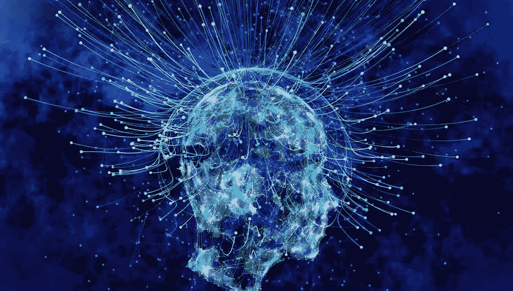
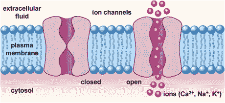

# 神经技术进化的下一个自然构件

> 原文：<https://medium.com/geekculture/the-next-natural-building-block-in-the-evolution-of-neurotechnology-6d0f418bc70c?source=collection_archive---------8----------------------->

## 非侵入性光遗传学模型

所有技术都会随着时间的推移而演变。现代平板电视通过数千个像素产生鲜艳的色彩，曾经是只有黑白色彩的密集立方体设备。曾经用于运输的马驱动的货车已经被高科技的发动机驱动的车辆所取代。这些技术的逐渐发展是非常符合逻辑的，因为一两个世纪前的社会既没有准备好发展也没有使用每种技术的现代版本，并且逐渐变化的速度适合于那个时期。

然而，如果一项技术没有适当的发展速度，它可能会破坏产品的成功。当一种产品对消费者来说发展得不够快时，这一点可能会得到证明，但如果一种产品的设计方式对当时的社会来说过于先进，那么更糟糕的结果可能会阻止这种产品进入市场。

这正是被称为光遗传学的新兴神经科学技术的情况。它的应用有可能以一种新的方式在治疗各种神经疾病方面具有革命性。不幸的是，由于多种原因，这种技术目前存在的方式对于其时代来说太先进了。不得不眼睁睁看着一项潜力如此惊人的技术因为来得太早而失败，这将是非常可怕的。但是我没有放弃光遗传学及其潜在的不可思议的未来，而是选择重新设计它。这个版本对今天来说更加可行。

## 目录

1.  光遗传学和动作电位的基础
2.  它的侵略性是如何阻碍它的发展和被社会接受的
3.  ChRmine 和 SOUL 模型已经朝这个方向努力了
4.  我如何使用分子生物学、计算软件和 DNA 比对选择最佳执行模型
5.  光遗传学如何被用作治疗神经疾病的新方法
6.  关键要点

## 光遗传学和动作电位的基础

所以我刚才告诉你它有很大的潜力，你可能看到了上面那个很酷的视觉，但是什么是光遗传学呢？光遗传学是一种神经科学技术，它使用光和遗传工程来控制大脑中神经元(主要是)的活动水平。

当神经元放电时，它是基于一个叫做动作电位的过程。神经元放电的频率由离子通道受体控制，离子通道受体将两侧的钠离子和钾离子分开。只要受体保持关闭，这两种离子就不会混合。然而，如果受体打开，两组离子能够混合。当钠离子和钾离子完全混合(去极化)时，它们会产生一个动作电位，导致神经元放电。

When ion channels open up, different types of ions can mix and depolarize to generate an action potential.

这是一个自然发生的过程，但在 21 世纪初，科学家们发现了一种方法，他们可以利用藻类中自然存在的一种叫做通道视紫红质的蛋白质来操纵这一过程。这种蛋白质在植物中的用途是帮助光合作用的过程。当阳光到达藻类时，通道视紫红质检测到它被激活的光的类型(蓝光)，然后向植物发出信号，表明它正在接收阳光，应该进行光合作用。科学家们意识到这不是利用蛋白质的唯一方式，这是他们开始在大脑中使用它的实验。

2009 年，光遗传学被发明。在这项技术中利用了通道视紫红质，因为它是通过手术注射到大脑中的特定神经元中的，同时还有一个侵入式脑计算机接口(BCI)作为光源植入附近。

根据命令，BCI 向转基因神经元的方向施加蓝光，正如他们在植物中所做的那样，视蛋白向神经元发出信号，表明它们正在接收光。然而，这一次，视蛋白不是发出进行光合作用的信号，而是向离子通道受体发出信号，让离子混合产生动作电位。这是因为通道视紫红质是一种执行神经元兴奋(增加活动水平)的视蛋白。

When blue light is applied to neurons edited to express channelrhodopsin, they can become excited.

在最初的发现之后，还发现了其他类型的视蛋白，它们可以接受不同颜色的光。虽然这些其他视蛋白中的一些也是兴奋性的，但新的视蛋白如卤视紫红质被发现是抑制性的(意味着用于降低神经元的活动水平)。

**其独特精确的性质**

这一发现并不是第一次发现可以操纵神经元活动水平的技术，但它肯定是最精确的。当时已经存在的其他方法，如深部脑刺激(DBS)和经颅磁刺激(TMS)都不精确，因为当他们向大脑发送刺激时，它会激活附近的每一个神经元。

光遗传学中的情况并非如此，因为**只有经过基因改造表达视蛋白的神经元才会对用于刺激视蛋白的光的颜色产生反应**。所有附近未被修改的神经元将没有反应，因此根本不会被刺激。

不仅如此，被编辑来表达其他视蛋白的神经元也不会有反应，因为它们可以接受不同颜色的光。这意味着一个人的大脑中可以利用许多不同类型的视蛋白，而一种类型对其他类型的刺激没有任何反应。

我相信你现在可以看到，这项技术非常酷。它目前仍处于开发的小鼠试验阶段，但仍然很酷。然而，它仍然在小鼠试验中的事实只是它的进化是非自然的，甚至不存在的事实的影响之一。让我们来看看这是为什么。

## 它的侵略性是如何阻碍它的发展和被社会接受的

对其发展提出重大挑战的光遗传系统的部分是侵入性脑计算机接口组件。目前，几乎所有的光遗传系统都需要这一块，以便向接收神经元传递足够的光，使它们被激活。然而，这产生了两个大问题。

**柱头**

首先是在社会污名方面。**尽管它们以不同的身份存在，但侵入性脑机接口仍然不被社会所接受。**这在很大程度上是因为这些设备被植入颅骨内部，不可拆卸，并且可以随时获取有关大脑活动水平的潜在个人信息。即使是光遗传学中使用的设备，其唯一目的是为某些神经元提供光，而不需要记录任何神经元活动，人们仍然不信任这些设备。

**对入侵性 BCI 的主要担忧是，它们会在一个人不知情或未同意的情况下提取个人信息(如他们的精神状态或诚实度)，或者通过脑对脑接口系统(BBI)将个人信息导出到另一台 BCI 设备。**

尽管事实上在光遗传 BCI 的背景下，这些都是极不可能和潜在不可能的，但它们仍然作为巨大的耻辱存在，使人们不太愿意购买产品，甚至接受需要长期植入侵入性 BCI 的治疗。这只是围绕这些设备的许多社会问题中的一个，其中许多都与基于侵入性计算机的设备的伦理有关。

There are many different concerns surrounding invasive brain computer interfaces.

**不合逻辑的进化和发展**

第二，更具体到光遗传学，在产品中使用侵入性脑计算机接口实际上阻碍了它的发展。**在脑机接口作为一种产品的最初发展中，非侵入性脑机接口在侵入性脑机接口发明之前已经存在了大约 74 年。**这是一个非常合理的发展，因为 EEG 等非侵入性技术在效率和不同应用方面变得更加先进，直到侵入性设备变得可行。

然而，光遗传学从来没有一种非侵入性的技术。它被发明为侵入性的，没有人会后退一步。这不仅会带来社会耻辱感，而且直接跳到侵入性模式也是不符合逻辑的，尤其是在看到最初的 BCI 在准备制造侵入性设备之前花了这么长时间在非侵入性设备上之后。

很明显，在这里后退一步更有意义，并致力于创建非侵入性光遗传学作为该技术的起始平台，这应该能够减少对该技术的担忧，并有更有效的发展，以便光遗传学可以变得广泛和商业化。

执行这一操作需要对现有技术进行一些编辑，因为最初的模型是在假设光遗传学将有创进行的情况下设计的。也就是说，过去已经有一些设计用于执行“非侵入性”或微创光遗传学的模型，我使用了这些模型中的每一个来设计我的模型。这是已经存在的。

## ChRmine 和 SOUL 模型已经朝这个方向努力了

有两个重要的模型，以前已经提出，显示出比标准更少的侵入性:灵魂模型和 chRmine 模型。两者都不是完美的非侵入性模型，但它们都显示了光遗传学的强大进步，证明设计有效的非侵入性模型是可行的。

**灵魂**

首先是灵魂模型。灵魂是最近在 2020 年 4 月发现的一种视蛋白，它的特殊之处在于它不需要大量或大量的光来激活。它被蓝光激活，用于刺激神经元。麻省理工学院的一个小组在一个微创光遗传学模型中利用了 SOUL，该模型不是必须将 BCI 完全放置在大脑内，而是可以将其放置在大脑外部的颅骨开口中。

**因为灵魂需要较少的光来激活，光源仍然足够强来从这个位置激活它。**这是一件大事，因为它表明光遗传学的侵入性可能比过去稍低，但仍然让设备一直在人的大脑中对许多客户来说是不可取的，而且仍然不是完全无创的。

**ChRmine**

非侵入性光遗传学的第二个进展是使用 chRmine，一种能接受红光的视蛋白。**基于其较长的波长，红光能够比蓝光更好地穿透颅骨，这使得斯坦福大学的一组科学家能够在非侵入性光遗传模型中使用红光，而 BCI 完全没有侵入性。**

这听起来可能很完美，而且仍然很棒，但不幸的是这个模型只能激活深入头骨 7 毫米的神经元。就上下文而言，人类大脑的平均体积为 1400 厘米，即 14000 毫米。这并不是说这个发现不令人惊讶和有意义，因为它是，但这个产品不是最终结果，还有很多需要改进的地方。

其中一个模型有一种不需要太多光线的视蛋白，但是使用的光线类型不足以穿透头骨。另一个有利于穿透头骨的光，但相应的视蛋白不能接收光，除非它在大脑的外围。这里的逻辑解是什么？将这两种方法结合起来，得到一个最优方法。

## 我如何使用分子生物学、计算软件和 DNA 比对选择最佳执行模型

我设计的执行计划非常涉及分子生物学，也需要一些蛋白质编辑。这样做的目的是编辑灵魂质粒以接受红光。

鉴于我还没有在任何类型的实验室工作过，因此无法接触到这些资源的物理版本，我所有的工作都是使用 Benchling 来得出我将要分享的结论的。Benchling 是一个流行的分子生物学软件，你可以通过计算来执行各种功能，以实验甚至编辑不同的 DNA 体。

**分子生物学词汇**

在深入本节之前，另一个重要的背景知识是解释我将使用的一些术语。如前所述，用于进行光遗传学的视蛋白通常在植物中发现(如单细胞藻类中的通道视紫红质)。为了从更大的藻类体中去除视蛋白，将其分离，然后克隆到质粒中。质粒是一种环状独立的 DNA 体，它与任何较大的 DNA 体(如植物)都是分开的。(注:我会把质粒和蛋白质互换使用。)

The round structure of plasmid DNA.

在质粒内部，有一些叫做激酶的小片段。在这种情况下，因为我们正在寻找视蛋白，这种激酶被称为蛋白激酶。它们是构成质粒的酶，都有不同的作用，共同帮助质粒整体发挥功能。

**蛋白质实验**

为了编辑我的灵魂视蛋白使其能接受红光，我知道我需要从一个能接受红光的视蛋白中提取 DNA，并将其编辑到我的灵魂视蛋白中。然而，这不是一件容易的事情，因为你必须非常小心地编辑蛋白质，以免破坏蛋白质。

降低蛋白质断裂的可能性并确保您编辑到初始质粒中的那部分蛋白质没有强烈反应的一种方法是选择一种与您的初始蛋白质尽可能相似的蛋白质。然而，这还远远不能保证成功。设计蛋白质的成功率可以从 1/1000 到 1/1000 万不等，这取决于突变体库。

我选择了两种受欢迎的能接受红光的视蛋白，可以在网上进行实验:ChRmine 和 Chrimson。我为它们中的每一个找到了质粒的向量(在线交互图模型),并分离出与每个质粒同名的特定激酶(分别为 ChRmine 和 Chrimson 激酶),因为这在属于那些组的所有视蛋白中是恒定的，因此是那些组中的视蛋白共有的特性(例如接受红光)的提供者。

然后我需要一个灵魂质粒。我在这里遇到了障碍，因为任何地方都没有公开的灵魂质粒。相信我，我到处都找遍了。我能找到的唯一与灵魂相关的东西是外显子，它不同于基因，你不能在外显子和基因之间进行比对。我对此的解决方案是使用一种类似的视蛋白，即光遗传学的母体视蛋白，也称为通道视紫红质。它也能接受蓝光，这是我们测试所需要的特性，所以在这方面，通道视紫红质的遗传学仍然适合这个测试。

然后我将通道视紫红质与两种红光激酶进行比对。在这个过程中，两种红光激酶的 DNA 都与通道视紫红质激酶相匹配，红色代表它们不同。目标是尽可能少地突出红色。

正如你可以从图片中看到的，Chrimson 更像是通道视紫红质。根据这些信息，我可以假设这可能是一个更好的工作候选人。**然而，鉴于蛋白质工程难以置信的低成功率，仍然测试所有候选人是很重要的。这个实验前测试的目的只是形成一个假设，并对蓝光视蛋白和一些不同的红光视蛋白之间的 DNA 变化有一个大致的了解。**

Alignment between the channelrhodopsin and chrmine plasmids. The red represents the parts of the DNA which differ (the yellow is insignificant, it simply is used to highlight sections as needed but isn’t doing anything here).

The same process performed with Chrimson. Keep in mind that the one large block at the end is simply because Chrimson is a longer kinase than channelrhodopsin (which doesn’t matter since the entire kinase won’t be extracted anyways), and clearly this alignment is otherwise far more similar.

蛋白质编辑的方法是用限制性内切酶。使其接受蓝光的通道视紫红质的特定结构域将从质粒中被切除(从通道视紫红质激酶本身)，并且使其接受红光的每种不同红光视蛋白激酶的片段也将从它们各自的质粒中被切除。

**当限制酶被用来从质粒上去除 DNA 时，一小段被称为粘性末端的 DNA 通常会保留在两侧，能够很容易地附着在与其相似的 DNA 末端上。**

**这就是为什么 Chrimson 的相似性有些重要，因为它将使新的 DNA 更容易锁定在粘性末端，**从那里，在最好的情况下，Chrimson 编辑的灵魂视蛋白之一对红光有反应，并准备好执行非侵入性光遗传学的优化版本。

## 光遗传学如何被用作治疗神经疾病的新方法

既然我们已经一起经历了这个旅程，为什么光遗传学需要被重新考虑为一个非侵入性的模型，至少在目前，以帮助它的发展和社会接受水平(然后讨论如何做到这一点)，让我们进入为什么这甚至是重要的。原因是因为**光遗传学有可能对患有各种神经疾病的人产生难以置信的影响。**

如前所述，SOUL 专门用于激发神经元。**兴奋可用于治疗神经退行性疾病等病症。这些疾病的前提包括阿尔茨海默氏症、帕金森氏症、亨廷顿舞蹈症、ALS 以及许多由神经元退化引起的疾病。**换句话说，随着时间的推移，某一组神经元的能力显著退化，结果是一组人的功能严重受损。

以帕金森为例。这种情况是由黑质中称为多巴胺神经元的神经元退化引起的，黑质是大脑中控制运动的区域。当这个区域的神经元停止正常工作或甚至完全停止工作时，一个人会经历许多不利影响，例如无法控制地握手、平衡障碍、站立困难、肌肉僵硬和不自主运动。这些效应对那些在日常生活中经历它们的人来说是一个巨大的挑战，并且会造成很大的损害。

然而，通过利用具有兴奋特性的视蛋白如 SOUL，这可以被解决。**当黑质中的多巴胺神经元被编辑以表达视蛋白，然后根据需要激活以兴奋神经元时，它们迫使这些神经元再次保持一致的活性。**即使这些神经元并不总是活跃或能够自己活跃，光遗传学也会对它们起到强制作用，使它们活跃，从而独立对抗这些神经元的能力下降以及帕金森病患者遭受的副作用。

光遗传学令人难以置信的精确特性和强大的时间控制(你可以以毫秒级的精度控制光遗传学在大脑上进行的精确时间量)不仅实现了一种治疗大脑疾病的新方法，而且实现了一种可能对数百万人的生活产生巨大积极影响的更精确的方法。

通过重新设计这项技术，使其不仅能减少社会对它的指责，还能更容易地尽快商业化，数百万人将能更快地接触到这项技术，并以他们真正感到舒适的方式使用。技术本身产生影响的能力将同样强大，但对它的担忧会少得多，这使得影响要大得多。

光遗传学是神经疾病治疗的未来，但社会还没有准备好接受它的入侵状态。这种新的非侵入性模型将有助于它通过更自然的进化，并影响数百万人。这看起来像是一种倒退，但实际上这只是对一开始一次向前迈太多步的一种重新调整。**这一次，眼前的目标暂时更加可行，因此它确实能够产生它一直想要产生的巨大影响。**

## 关键要点

1.  光遗传学是一种新兴的神经科学技术，它利用光和遗传工程来控制大脑中的神经元群。
2.  它通过编辑神经元来表达视蛋白，并将通过侵入性脑计算机接口传递的光应用于这些神经元。这使得视蛋白能够操纵动作电位的过程(神经元的放电)。
3.  该系统的侵入性脑机接口方面提出了挑战，因为它周围有很多社会耻辱，而且因为缺乏非侵入性模型作为获得这种最终侵入性技术的垫脚石，阻碍了它的发展。
4.  在过去，已经创建了两种用于无创或微创光遗传学的模型。一种使用灵魂视蛋白，它不需要太多的光来激活，但被蓝光激活，蓝光很难穿透头骨。另一种使用由红光激活的视蛋白(可以更容易地穿透头骨)，但根据 chRmine 需要多少光，它只能无创地进入大脑 7 毫米深处。
5.  我想通过编辑灵魂视蛋白来结合这两个模型的成功，使它们能够接受红光。
6.  最有可能成功编辑灵魂使其接受红光的遗传物质来自克里斯森·奥普辛斯，因为他们有相似的遗传物质。然而，这很难说，因为蛋白质工程的成功率如此之低，这使得测试所有潜在的候选人变得非常重要。编辑部分可以用限制性内切酶来完成。
7.  光遗传学是一项有用的技术，因为它可以开创一个治疗各种神经疾病的新时代，如帕金森氏症、阿尔茨海默氏症、焦虑症、抑郁症等。
8.  创造这种技术的非侵入性变体有可能对数百万人产生积极影响。

非常感谢你阅读我的文章，我希望你喜欢它！我叫刘冰·博恩施泰因，今年 15 岁。我对神经科学和生物技术的分支充满热情，尤其是当它们涉及到治疗神经疾病时。我很乐意在 LinkedIn 或 Twitter 上联系你，或者你可以在 rainabornstein@gmail.com 联系我，与我交谈或合作。我等不及收到你的来信了！