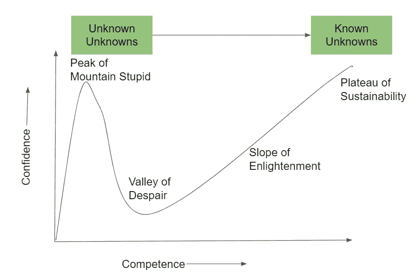
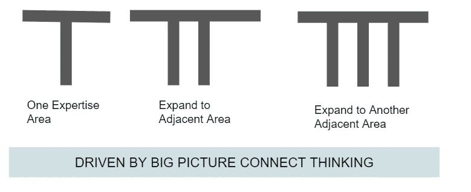
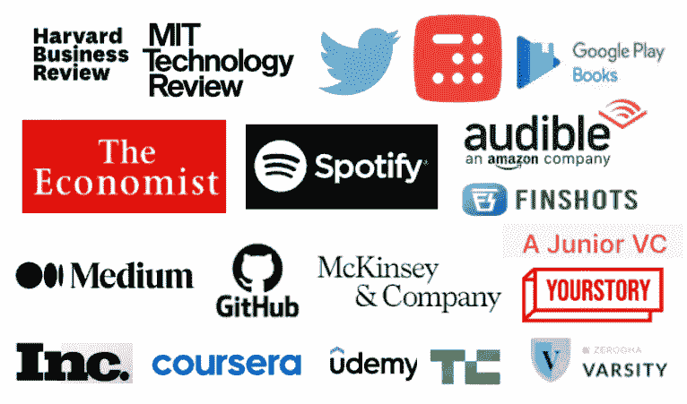

# 技术变革的步伐:我们真的能跟上吗？

> 原文：<https://medium.com/geekculture/the-pace-of-change-in-technology-can-we-really-run-with-it-86854f4d85f9?source=collection_archive---------11----------------------->

Photo by [Marvin Meyer](https://unsplash.com/@marvelous?utm_source=medium&utm_medium=referral) on [Unsplash](https://unsplash.com?utm_source=medium&utm_medium=referral)

很多年前，当我开始定期阅读博客/论文/文章/书籍，参加聚会/会议以赶上技术的进步。我以为有一天我会赶上科技发展的步伐，站在科技的顶端。随着时间的推移，我已经养成了广泛的阅读习惯、生产习惯和其他改善生活的方法。许多年过去了，大量的知识摆在面前，我仍然在想办法处理每天都可以获得的大量信息。技术发展速度如此之快，成千上万的伟大研究人员、企业家、技术公司正在进行如此多的创新，真的有可能跟上它的步伐吗？有没有一种方法可以改善我们的生活习惯，让我们从中获得更多？

Photo by [Roman Kraft](https://unsplash.com/@romankraft?utm_source=medium&utm_medium=referral) on [Unsplash](https://unsplash.com?utm_source=medium&utm_medium=referral)

在这篇文章中，我写下了我在旅途中学到的经验和对我有帮助的生活窍门。然而，正如我所说的，我仍然在寻找进一步提高的方法。我很乐意听取你的建议，无论你想推荐什么书/文章/最佳实践。这篇文章更多的是一个诚实的坦白，围绕着技术的步伐奔跑。

# 生产力

我不知道你们中是否有人有过这样的想法，希望我一天有 30 个小时。就此而言，我经常有这样的想法，一天要做这么多事情，时间却这么少。然后我明白了，成功人士管理家庭，在办公室承担很高的责任，在生活中做得更多。秘密在于管理时间，这是你最终会意识到时间是你拥有的最有价值的资产的地方。因为它是你拥有的最有价值的货币，所以你应该非常小心地使用它。

现在已经有数百本关于这个话题的书问世了，但是有效地管理时间确实不容易。

对我帮助最大的两个时间管理技巧是，

1.  第一，正念去理解我是如何无意识地在一天中把时间花在无产出的活动上。
2.  然后詹姆斯·克利尔在《原子习惯》一书中给出的诀窍，让我养成了几个好习惯，去掉了几个坏习惯。

# 阅读理解

这是另一个重要的方面，但经常被忽视。你不仅需要知道如何阅读各种文章/书籍，而且你需要在潜意识里成为这方面的专家。同样，你需要练习正念来意识到你的日常事务，这样你就可以找到自己的干扰物。

对我来说非常有效的两个技巧是，去除多任务处理和改变阅读速度。首先，如果你在笔记本电脑上看书，那么关闭所有浏览器标签，让互联网处于飞行模式可能会有所帮助。其次，你可能不需要阅读《经济学人》和 HBR 文章的每一个字，你可以快速浏览以获得你需要的信息。然而，你可能还是想多看几遍那篇复杂的技术论文，从中获取正确的技术信息。

Photo by [Clay Banks](https://unsplash.com/@claybanks?utm_source=medium&utm_medium=referral) on [Unsplash](https://unsplash.com?utm_source=medium&utm_medium=referral)

有很多关于阅读理解这个话题的书，但对我帮助最大的书是《如何更好更快地阅读》，作者是师范刘易斯。我早在 2001 年就读过这本书。但是从这本书里学到的东西仍然对我有用。

# 口语 *Vs* (听、写、读)

Photo by [Dylan Gillis](https://unsplash.com/@dylandgillis?utm_source=medium&utm_medium=referral) on [Unsplash](https://unsplash.com?utm_source=medium&utm_medium=referral)

你有没有意识到，当我们和朋友、同事交谈时，我们有多渴望轮到自己说话？

因为各种各样的原因，我们经常非常重视说话，我们都想对自己感觉良好等等。你可以读一下戴尔·卡耐基 的 [*如何赢得朋友和影响他人，他在书中的几个地方都提到了这个话题。对我来说，与其他三种交流方式相比，口语是一种被高估的交流方式。阅读作为阅读理解的一部分，我已经在上面的章节中提到了。下面详细讨论另外两个。*](https://www.amazon.com/How-Win-Friends-Influence-People/dp/0671027034)

让我们先来谈谈倾听，我们生活在一个每天与不同类型的人打交道的社会中，每个人都有他/她独特的热情和技能。你会惊讶地发现，在 45 分钟的午餐中，你能从一个热情的同事/朋友/陌生人那里学到多少关于一个话题的东西，然后通过阅读数百篇关于这个话题的文章。在这里，你需要做的就是问正确的开放式问题，并做一个积极的倾听者。你显然需要对这个话题真正感兴趣。如果你是一个积极的倾听者，那么我觉得你一直在向你周围的各种人学习。回到 2014 年，我已经养成了这个习惯，在办公室里抓各种各样的同事，讨论他们热衷的话题的一切。它极大地帮助了我了解一系列技术和非技术主题。

写作是我最近才意识到其价值的最后一项技能。现在，我这样做是为了检查我在任何特定主题上的知识。如果你对公共写作感兴趣，那么写作是永恒的。如果你对某个话题非常有信心，那么就打开一个 word 文档，看看你能写多少，你的想法有多有条理？这是一个地方，你会意识到别人会因为你的想法而阅读和评判你，任何人都可以证实你的说法。如果不深入了解这个主题，你肯定无法写出一个有条理的故事流。这是你开始尊重伟大作家的专业知识和创造力的地方。

# 说到底，都是 Ikigai:不是吗？

Image by Author : Inspired by [Ikigai book](https://www.amazon.com/Ikigai-Japanese-Secret-Long-Happy/dp/0143130722)

我们真的会对某个领域感兴趣，花几个小时一起阅读、倾听，而没有意识到我们正在花费的时间吗？是的，你可以，尤其是如果你已经找到了你的 Ikigai。

什么是 Ikigai？我找不到比 ikigai 的书中解释的更好的图表了。这本书实际上把 Ikigai 和日本市民漫长而幸福的生活联系在一起。

我建议凝视左边的图像，并把它与你的各种生活激情联系起来。这本书试图解释，如果你有一个兴趣领域不符合所有这四个重要的圈子(用红色文本突出显示)，那么生活中总会缺少一些东西。例如，让我们说你喜欢读小说，你真的在做它。这会是你的 Ikigai 吗？你在生活中仍然会有所欠缺，因为你仍然需要钱来生活等等。这当然是你的热情，但不是 Ikigai。

这是一个有趣的概念，我们可以很容易地将其与各种成功人士和我们周围的名人联系起来。

# 邓宁·克鲁格效应

现在让我们假设你已经找到了你的 Ikigai，你有效地利用了你的时间，并在这上面花费了数小时。但是，你仍然没有获得该领域的顶尖专业知识？原因可能是什么？

> 有些人希望它发生，有些人希望它发生，有些人让它发生。
> 
> **迈克尔·乔丹**

比如说，你正在学习吉他，但是在最初的几个月里，你仍然不能弹得很好，你试图学习新的技术，但是事情也没有进展。这就是你需要花些时间的地方，我可以举一个认知偏差效应的例子，叫做邓宁·克鲁格效应*或* 10K hrs 规则，由马尔科姆·格拉德威尔在[离群值书](https://www.amazon.com/Outliers-Story-Success-Malcolm-Gladwell/dp/0316017930)中解释。

因此，如果你看到下面的曲线，你需要通过下面的绝望之谷，以获得某个技术领域的某些能力，张贴这将是一个滚雪球效应。有时这需要时间，在此期间你应该足够耐心。同样，如果你找到了你的 Ikigai，你的热情应该能够带你穿过这个山谷。

Image by Author

按照我的理解，笨山顶峰其实是一个未知的未知领域。这就是我们在这个阶段更有信心的原因，因为我们不知道这个领域的复杂性。然而，随着时间的推移，我们在能力曲线上前进，我们到达了可持续发展的平台，一个已知未知的领域。在这个阶段，我们深入了解该领域，知道我们在该领域的优势和劣势。

# 单一到广泛的专业知识:

Image by Author

现在我们看到了在一个领域建立专业知识所需要的挑战和努力，但是博学的人呢？他们是怎么做到的？他们都是天生的天才吗？我们如何找出邻近的领域来进一步扩展我们的专业知识？这就是大局思维有所帮助的地方，让我再解释一下。

假设你在任何领域工作并开展某些活动，你应该始终关注你的结果如何被用来实现最终目标。这就是所谓的大图思维，它帮助你理解拼图游戏的其他各部分。那些其他的拼图可能是你的其他专业领域，你可能会发现它们也适合你的兴趣。你可能不需要花费大量的时间来获得这些领域的专业知识。

然而，我仍在试图找出博学者的人生旅程…

# 垃圾进垃圾出

我们需要有一套正确的来源来消费信息，主要是因为以下原因:

1.  往往新闻文章都是观点(很多时候是有偏见的)，没有数据的强大后盾。
2.  很多这样的网站发布了如此多的文章，你可能会因为点击诱饵文章的显示优先级而丢失重要的文章。

> 这使得拥有一套合适的网站变得至关重要，在这些网站上，信息是由专家提供的，并且在一定程度上有一种方法为 T2 量身定制信息。下面的应用程序集满足以上两个标准，并在经过多次迭代后，现在为我工作。

Image by Author : Icons of Various Technology Applications

# 结论:为什么谦逊很重要

以现在的技术发展速度，我经常发现自己周围的人知道的比我多得多。我不羞于承认我不知道，这是技术的一部分，或者我对这种技术还很陌生，或者我今天第一次听说。但是当专家也开始说类似的话时，你就会意识到技术变化的真正速度。

Tweet embedded

Francois Chollet 是著名的深度学习专家。在这里，你仍然可以看到他谦逊地承认技术的浩瀚和他对技术的贡献。

你也可以参考《自然》杂志 2016 年发表的这篇类似的文章:

> 今天，技术变革正以前所未有的速度加速，可能会创造一个我们难以想象的世界。

正如我之前所说的，我仍然在探索更多的方法来变得更有效率，从生活中获得更多。请随时分享你的学习，我很乐意听到你们所有人的反馈。到那时，干杯！