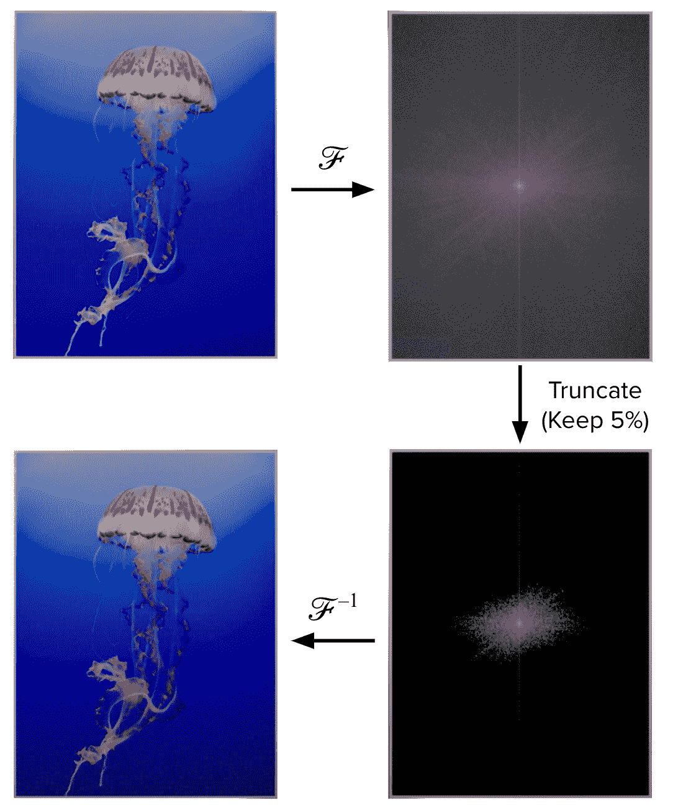
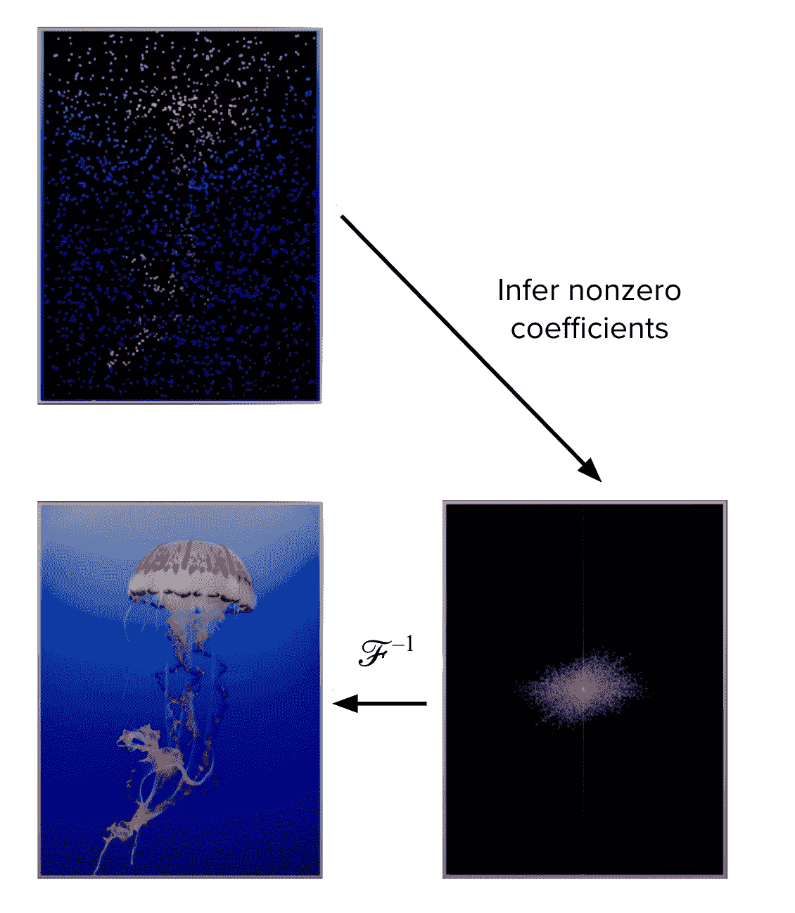
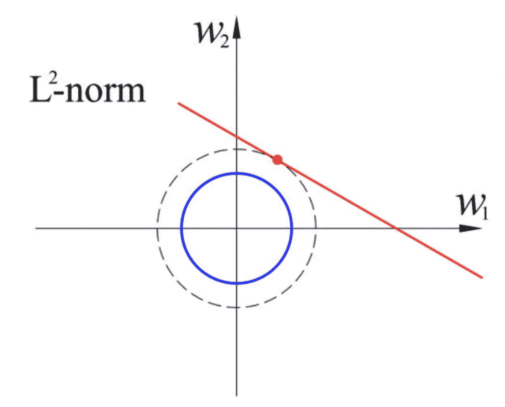
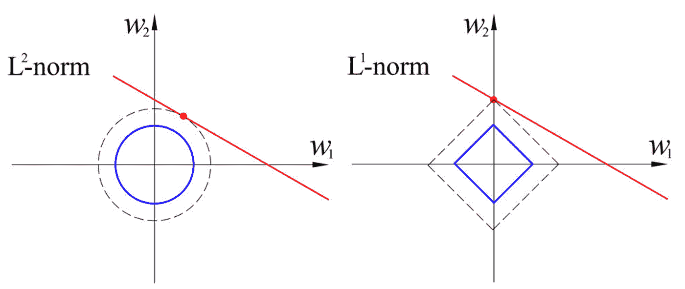

# 稀疏中的痛苦

> 原文：<https://medium.com/geekculture/the-pain-in-the-sparse-adee7e3c52ee?source=collection_archive---------11----------------------->

## 茎中的宝石:稀疏性简论

如果这篇文章只用几句话就结束了不是很好吗？我们俩的工作肯定会少一些，可以腾出一些时间去狂欢网飞...我是说，读本书。

不幸的是，没有人能做到。肯定会有大量信息丢失——你可能不知道我们到底在谈论什么，也无法通过你从几个词中得到的微小一瞥来重建丢失的信息。不太好。这意味着这不会是一篇很好的文章(我不是一个很好的作家)，我们不能这样。

## **压缩传感**

事实证明，在压缩传感领域，我们也同样难以简化信息！我们从一些高维信号开始，如音频或图像(通常需要大量的能量和存储来处理)，我们希望压缩它，而不会在重建中损失太多的质量或信息。毕竟，一张图片抵得上 1000 个单词，我们不希望它变成 10 个。

让我们首先来看看这个标准压缩示例。我们有一些信号，x(这种情况下是可爱的水母),我们可以用ℱS 来表示，其中ℱ是傅立叶变换，s 是稀疏向量，一个大多数元素为零的数组。你不必太担心傅立叶变换是什么，只要知道它是一种分解图像的好方法。

为了压缩图像 x，我们可以对其进行傅里叶变换(以获得右上图像)，丢弃许多系数，只保留比如说 5%(以获得右下图像)，最后对其进行逆变换，以获得相当忠实的图像(左下图像)。

这种标准压缩很容易做到，实际上已经内置在您的手机和电脑！

但是如果我们扔掉了 95%的系数，为什么我们首先要收集所有的信息呢？

如果我们只从图像的几个测量值开始呢？

## 稀疏压缩

假设我们得到的测量值只有原始图像 x 的 10%左右。让我们称这个测量值为 y。然后，我们可以写:

(回想一下，x = ℱS，这就是为什么 y = Cx = CℱS.)这里，c 就像一个像素掩码，随机选择 x 中像素的一些样本。这是一个*随机*样本，因为如果我们只有某个角落的测量值，我们真的无法准确推断图像的其余部分。

我们有一些度量 y(左上角的第一幅图像)，我们想尝试求解一个与 y 一致的稀疏向量 S。如果我们这样做了，那么我们就可以进行逆变换，以返回到原始图像 x 的精确值。

我们喜欢稀疏解决方案，因为它们可以更容易地被压缩(因为数组中的大多数条目都是零)，这意味着它们需要更少的存储，从而使用它们解决问题更加有效！

事实证明，实际上有无穷多个满足等式 y = CℱS 的，所以真正的问题是我们如何找到稀疏的 T1 来成功地压缩图像？

为了做到这一点，我们使用了一种叫做 L1 范数的东西，这种东西可以促进稀疏解！

## L1 标准

你可能已经熟悉了一种叫做 L2 范数的东西，这是你在几何中求点到一点的距离的方法。例如，如果 xy 平面上有一个点 W = (w1，w2 ),则该点到原点的距离是 w1 和 w2 的平方和的平方根。

或者，更清楚地说，

现在，回想一下，我们有无穷多个满足线性方程 y = CℱS.的解，所以，我们可以把它表示为一条可能的解的线，如下面的红线所示！

我们现在要稍微深入一点，所以请尽力跟上！如果这不完全合理，没关系，我会在最后阐明“故事的寓意”。

假设我们想找到一个具有最小可能 L2 范数的特定解。嗯，你在图像中看到的每个圆都有一个相等的 L2 范数(这是有意义的，因为圆上的每个点到原点的距离都是相同的，称为半径)。然后，我们可以让这个圆越来越大，直到它与红线相交。

这个交点是 L2 范数最小的点——瞧！

但是，记住，我们不想要最小的 L2 范数，我们想找到最稀疏的 s

因此，我们实际上想要做的是最小化 L0 范数，它只是计算向量 S 中非零项的数量，因此，如果我们寻找最小的 L0 范数，我们将找到非零项最少的向量，这正是寻找最稀疏解 S 的意义所在！

哦，停在那里。休斯顿，我们有麻烦了。不幸的是，L0 范数在技术上并没有被很好地定义为一个范数，这意味着我们不能轻易地最小化它——这实际上是一个组合难题！

原来，当人们意识到既然我们不能使用 L0 范数来寻找稀疏性，我们可以使用 L1 范数作为一个很好的替代品，这是计算的一个巨大进步！

等等，什么是 L1 规范？

我们再举一个和之前一样的例子。如果我们在 xy 平面上有一个点 W = (w1，w2)，那么 L1 范数就是 w1 和 w2 的绝对值之和。

或者，用数学的方法来写，

我们可以使用各种优化方法来求解具有最小 L1 范数解的解，它通常会给出我们想要的稀疏解！

等等，等等，为什么？

嗯，你在图像中看到的每一颗钻石都有一个相等的 L1 范数(与之前的圆圈相同)。然后，当我们生长这个菱形时，菱形与红线的第一个交点(也就是可能解的集合)通常在稀疏解处！例如，在此图像中，交点位于 w2 = 0 的点，这是一个稀疏解，因为两个分量(w1，w2)中的一个为零。这背后的直觉是，菱形比圆形更尖，这意味着它比圆形更有可能在稀疏解中与红线相交。

L1 范数促进稀疏解的思想在更高维度中推广得更好！这是因为这些菱形范数变得越来越尖，所以范数有更好的机会达到稀疏解。

这有点像你被刺猬戳到手的几率比被乌龟戳到手的几率高。

这个故事的寓意是:如果我们想找到一个稀疏解，我们应该最小化 L1 范数。

为了做到这一点，我们把我们的问题写成一个叫做凸优化问题的东西，其中我们在一些约束下最小化 S 的 L1 范数。(凸优化问题很好，并且通常更容易解决，因为凸性的性质使其在计算中有几个强大的理论工具。)

如果你好奇，我们的图像压缩方程的优化问题可以写成这样:

为了找到自己的解决方案，您可以很容易地编写代码(为变量添加一些附加条件)。

哒哒！我们现在已经知道如何用较少的工作来压缩图像，但不会有太多的信息损失。我认为这是一个成功，即使我们花了比几句话多一点的时间才到达那里。❤

如果你好奇的话，今年夏天，在麻省理工学院研究生陈墨和史蒂文·约翰逊教授的指导下，我在科学研究所做了一个寻找稀疏解的类似问题的研究。你可以在这里找到我的论文。

下次见！如果你觉得这很有趣，请务必关注我，了解下一期的最新消息。

同时，在我的 [**专栏中查看其他文章，点击这里**](https://apoorvapanidapu.medium.com/list/gems-in-stem-e5f24767d315) ！如果你有任何问题或意见，请发电子邮件到 apoorvapwrites@gmail.com 给我。

要成为第一个听到我所有新文章、最近事件和最新项目的人，请务必订阅我的简讯: [**信？我几乎不认识她！**](http://apoorvapanidapu.substack.com/)

*提醒一下:这个* [*专栏*](https://apoorvapanidapu.medium.com/list/gems-in-stem-e5f24767d315) *，STEM 中的瑰宝，是一个了解各种 STEM 主题的地方，我发现这些主题很令人兴奋，我希望也会让你兴奋！它总是会被写得相当容易理解，所以你不必担心没有背景知识。然而，它偶尔会在接近尾声时变得更高级。感谢阅读！*