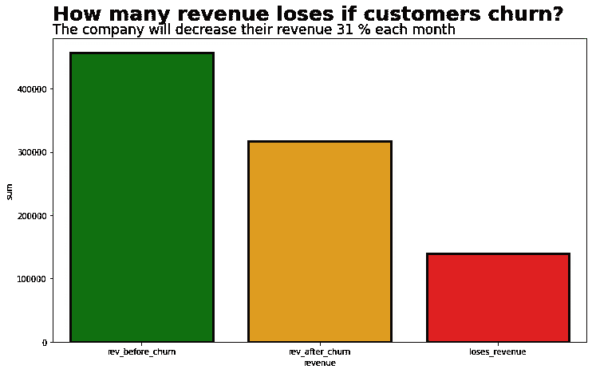
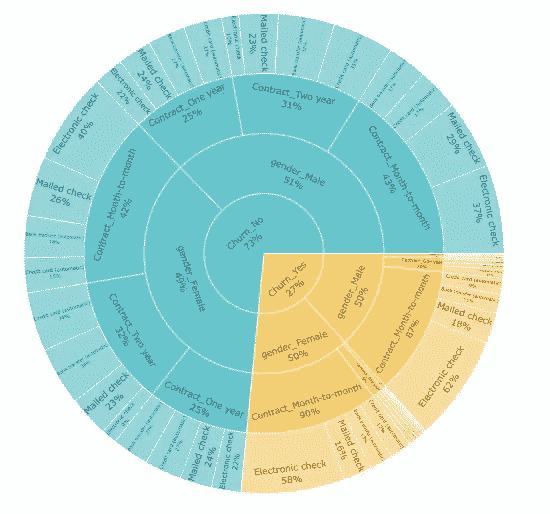
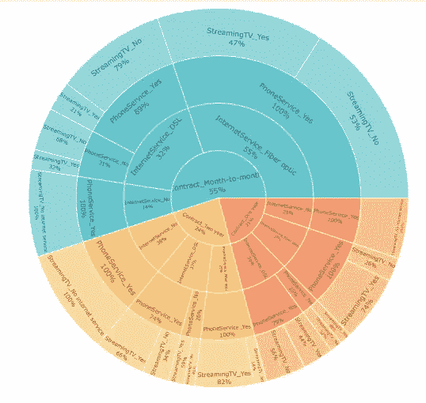
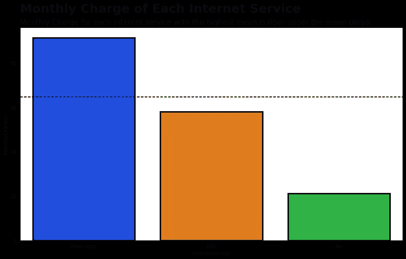
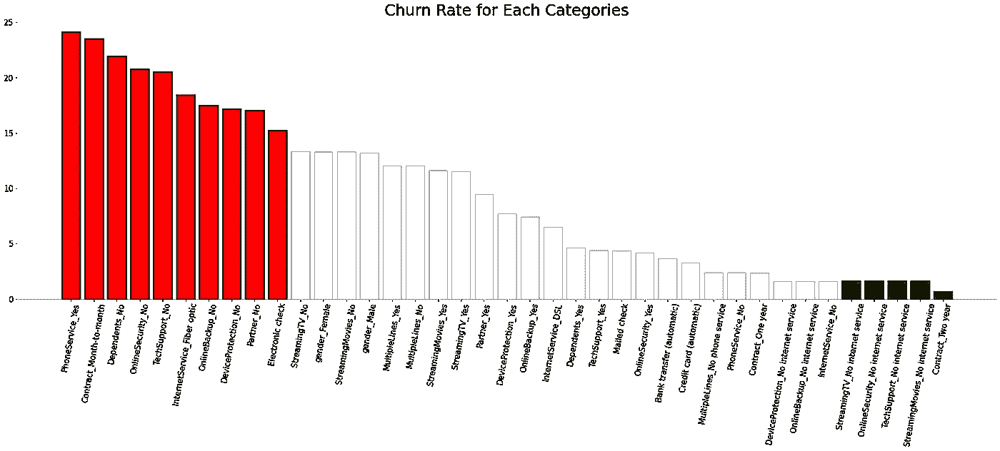
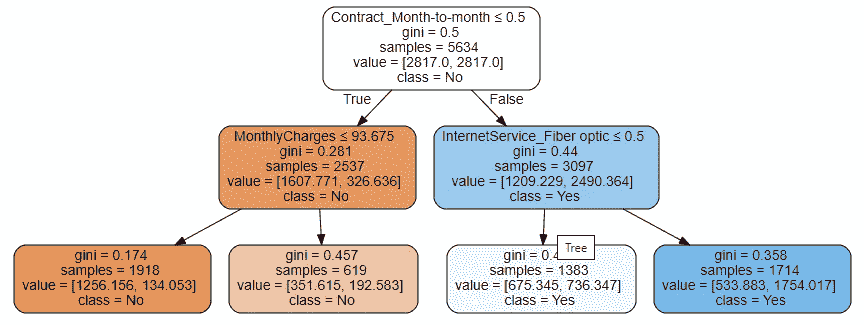
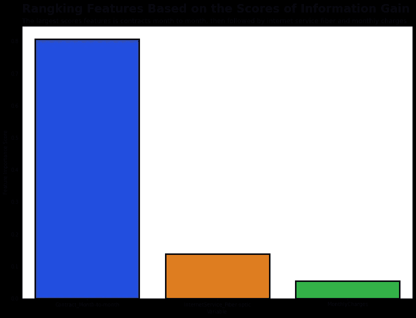
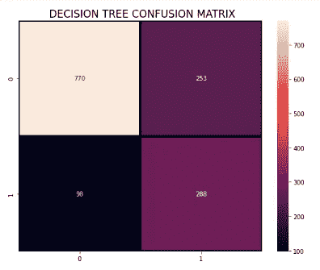
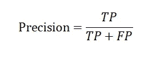
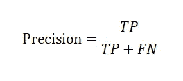

# 电信行业客户更容易流失的原因

> 原文：<https://medium.com/geekculture/the-reasons-why-customers-more-likely-to-churn-in-the-telecommunication-industry-6e0e8c36c737?source=collection_archive---------5----------------------->


Photo by [Jon Tyson](https://unsplash.com/@jontyson?utm_source=medium&utm_medium=referral) on [Unsplash](https://unsplash.com?utm_source=medium&utm_medium=referral)

你有没有想过，为什么一些客户更有可能终止他们在服务行业的合同？。

是的，原因有很多，但这种现象在商业领域造成了收入的损失，同时，成本生产还在继续。在本文中，我将使用决策树模型简要解释他们更有可能终止合同的原因。本文中的数据科学过程将使用数据挖掘的跨行业标准过程(CRISP-DM) [3]给出的循环过程，因此表格内容将包含这些步骤。

1.  商业理解
2.  数据理解
3.  数据准备
4.  建模
5.  估价

# 商业理解

在这个过程中，业务理解是至关重要的，因为我们应该理解要解决的问题，并仔细考虑使用场景。在本文中，我将向您展示电信行业中最常见的问题，即客户流失。在业务上，公司希望客户始终持续使用他们的服务。但是，也有一些客户将他们的服务/产品从他们的公司转到另一个公司。这种情况叫做流失。因此，公司必须防止这种流失，因为获得新客户比留住老客户更加困难和昂贵。

如何留住客户？

任何流失问题的子任务解决方案都是从历史数据中估计客户离开/不离开的概率，或者找到或多或少可能离开的客户群。在本文中，我想向您展示留住客户的子任务解决方案之一，即使用决策树来回答问题**“在电信行业的所有客户中，哪些客户可能会流失，原因是什么？”**。当我们知道哪些客户更有可能流失时，我们就可以制定策略，通过提供新的优惠来留住他们。决策树是用于分类数据(包括客户流失细分)的最流行的方法之一。使用决策树，我们知道客户转换服务/产品的原因。

# **数据理解**

确保您有可用的数据来构建解决方案，了解数据的优势和局限性非常重要，因为很少有与问题完全匹配的数据[3]。一般来说，移动电信行业中用于流失预测的特征包括客户人口统计数据、合同数据、客户服务日志、通话详情、投诉数据、账单和支付信息[4]。我从 [Kaggle](https://www.kaggle.com/datasets/blastchar/telco-customer-churn) 获得的数据，因此它将仅限于几个没有历史客户服务数据的功能。数据集仅包含以下信息:

*   上个月内离开的客户—这一列称为流失
*   每位客户已注册的服务—电话、多条线路、互联网、在线安全、在线备份、设备保护、技术支持以及流媒体电视和电影
*   客户账户信息——他们成为客户的时间、合同、支付方式、无纸化账单、每月费用和总费用
*   客户的人口统计信息—性别、年龄范围，以及他们是否有伴侣和家属

# **数据准备**

数据准备是准备数据以满足要求的一个阶段，通常是删除缺失值、将数据转换为不同类型或将数据转换为表格格式。台阶在下面。

## **首先，检查数据类型和缺失值**

1.  检查每个数据列的类型，我发现有一列不正确，它是定义为字符串的“总费用”列，但应该是整数。所以，我改变了数据类型。
2.  检查每一列的缺失值，我发现“总费用”有 11 个缺失值。用零填充它，因为总费用列中的每个 nan 值在任期列中也有零值，即任期列指示客户在该公司的总月数。因此，当客户第一次使用公司服务时，总费用应该为零。

## **其次，做一些探索性的数据分析**

**“如果客户流失，收入会损失多少？”如果客户流失，公司每个月会损失 31%的收入。这是一个很大的数字，所以公司应该防止流失。**



Image by Author

之后，我做了可视化，我发现大多数客户会流失，当他们的合同按月签订时，无论是男性还是女性。客户在各种合同中最常用的支付方式是邮寄支票和电子支票。



Image by Author

**“根据合同，他们更喜欢的服务到底是什么？”**

*   大多数逐月签订合同的客户更喜欢使用光纤类型的互联网服务，很少包括在线服务、备份服务等。
*   大多数签订了一年和两年合同的客户更喜欢使用 DSL 而不是光纤，后者也使用在线服务和在线备份。但是，签了两年合同的客户更有可能不使用互联网服务。


Image by Author

“如果客户不使用互联网服务，他们更愿意使用这项服务，这到底是怎么回事？”

*   大多数不使用互联网服务的客户更喜欢使用该公司的电话服务和流媒体服务。
*   所有使用互联网服务类型的客户都是光纤客户，他们也使用公司的电话服务，但使用互联网服务类型的客户不是 DSL 客户，DSL 客户更可能添加其他服务，如备份服务、安全服务和技术服务。



Image by Author

我使用 sunbursts 图表，因为它能够可视化从根到叶径向向外延伸的分层数据。根从中心开始，子元素被添加到外环。

问题**的假设:“为什么逐月签约的客户更有可能流失？”**

这是因为他们更喜欢为每个合同使用的服务类型。对于月结合同，他们更喜欢使用光纤而不是 DSL，DSL 的月费最高。同时，在合同中，一年或两年，他们更可能使用 DSL 或没有互联网服务，每月费用较低。



Image by Author

然后我们探究每个特性的流失率。计算流失率的方法是将流失的客户数除以客户总数。从这个分析中我们知道:

*   最高流失率来自使用电话服务和光纤服务的客户，这些服务是大多数客户在合同中每月使用的服务。
*   离职率最低的是那些签了两年无互联网服务合同的客户



Image by Author

结果与我们以前所做的分析一致。对客户流失影响最大的是合同、月费和互联网服务。但是，**“这个特性真的很重要吗？”。**让我们使用决策树进行检查，以了解最重要的属性，或者哪个属性最能提供信息，从而对将来会不会流失的客户进行细分。

## 在做决策树模型之前，我们应该把分类数据转换成数值数据。

台阶在下面。

*   删除对建模无用的列，如 customerID
*   将分类值编码为数值，因为机器不处理字符。同时，我不会用规范化或标准化来改变数字特征的尺度，因为尺度对决策树的结果没有太大影响。
*   拆分预测值和列目标的列
*   将列预测值和列目标数据分成两部分，分别用于训练和验证

```
from sklearn.model_selection import train_test_splitx_train = data_train.drop(columns=['customerID', 'Churn'])
y_train = data_train['Churn']x_train, x_val, y_train, y_val = train_test_split(x_train, y_train, test_size=0.2)
```

然后，让我们建立模型。

# 建模

模型的使用取决于企业的目标。如果您对流失原因感兴趣，应该使用决策树，如果需要流失和非流失的概率，朴素贝叶斯、逻辑回归可能更适合使用。如果只对预测率感兴趣，可以使用线性分类器和 SVM。本文的目的是了解客户流失的原因，因此合适的模型是决策树。在使用决策树开发模型之前，我想让您知道这个模型实际上是如何工作的。

## 首先，决策树是如何工作的？

*   首先，我们需要计算熵，熵用于测量一组普通数据中的无序度，这组数据表明片段有多纯/不纯。熵的范围从最小无序或集合具有相同成员时的零到最大无序或集合具有相等成员时的一。
*   第二，测量信息增益，以了解某个特征对目标的信息量有多大，或者单独测量该特征有多好。信息增益衡量熵的减少。利用熵，我们可以计算信息增益。
*   第三，把特征的最大信息增益作为根树。
*   第四，第二好的特征，即节点树，将出现在树的较高位置，但是为树选择的特征并不对应于它们在信息增益中的排序。这是因为分类树中的节点依赖于集合中高于它们的实例，同时，信息增益在整个群体中单独评估或单独评估。因此，某些内部节点的功能排名可能与全局排名不同。
*   最后，如果到达叶节点或者没有信息增益，则分区停止

构建模型的代码。

```
from sklearn import treeclf = tree.DecisionTreeClassifier(criterion='gini', random_state=1, max_depth=2, class_weight = 'balanced')clf=clf.fit(x_train, y_train)
```

结果如下

使用库 graphviz 显示决策的结果，您将得到下图。

```
import graphvizdot_data = tree.export_graphviz(clf, out_file=None)
graph = graphviz.Source(dot_data)graph.render("churn")
```



Image by Author

## **如何解读结果？**

*   如果(Contracts _ 逐月≤ 0.5)和(MonthlyCharge ≤ 93.675)，则 Class = No(客户更有可能**不流失**)。这表明，每月签约费用低于 93.675 英镑的客户将继续使用这项服务。
*   如果(Contracts _ Month-to-Month not≤0.5)和(InternetService_Fiber Optic ≤ 0.5)，那么 Class = Yes(客户更有可能**流失**)。这表明，在一两年内(不是每月)与互联网服务有合同的客户是光纤客户，他们将离开服务或流失。

此外，从上面的图表中，我们可以看到，最重要的功能是逐月合同，每月收费，互联网服务光纤。“重要”特征取决于计算信息增益的分数。你可以看到，下图



Image by Author

最大的特征得分是逐月合同，因此在决策树中，它将是如上图所示的根树。然后是互联网服务光纤和每月收费作为节点树。在我们拥有的所有特性中，这三个特性是最重要的。如果你想知道其他特征的信息增益分数，你可以设置 max_depth 大于 2，图形会显示更多的决策分支，更多的节点，更多的重要特征。如您所见，我设置 max_depth = 2，那么结果仅限于两次分割。

这个数据是不平衡的，这更多的是标签无流失而不是有流失，所以我设置 class_weight = 'balanced '来避免错误的结果，因为这个方法的一个弱点是不平衡的数据。

# 估价

评估阶段是对建模结果进行严格的评估，并在继续之前获得它们是有效和可靠的信心，也有助于确保模型满足最初的业务目标[3]。决策树评估使用精确度、召回率、f1 分数和准确度。下面的混淆矩阵对评估进行了说明。



*   一个实际上是**非流失者**(负/ 0)并被归类为**非流失者**(负/ 0)的人。这被称为**真负**，值为 770
*   一个实际上是**流失**(正/ 1)并归类为**流失**(正/ 1)的人。这被称为**真正**，数值为 288
*   一个实际上是**未流失**(负/ 0)而被归类为**流失**(正/ 1)的人。这被称为**假阴性**，数值为 98
*   一个实际上是**流失者**(正/ 1)并被归类为**非流失者**(负/ 0)的人。这称为**假阳性**，数值为 253

## 准确(性)

准确度表示在数据实例的总数中，正确为真阴性和真阳性的数量。


Image by Author

在本文中，精度将为(770 + 288)/ (770 + 288 + 253 + 98) = 0.75。所以，精度是 0.75。当数据不平衡时，准确性不是好的指标，因此这种情况会导致误导性的解释。

## 精确

理想情况下，精度应该是 1，因为这意味着没有错误的数据分类(假阳性和假阴性= 0)。



Image by Author

*   流失客户的精度(288)/ (288 + 253) = 0.5
*   无流失客户的精确度(770)/ ( 770 + 98 ) = 0.89

## 回忆

理想情况下，回忆应该是 1，因为它意味着没有错误的数据分类(假阳性和假阴性= 0)。



Image by Author

*   流失客户召回率(288) / (288 + 98) = 0.74
*   无流失客户的召回(770) / (770 + 253) = 0.75

## F1 分数

F1 评分是一个兼顾精度和召回率的指标，这些指标比精度更好。


Image by Author

*   F1 客户流失分数(2* (0.5*0.74)/(0.5+0.74)) = 0.6
*   F1 客户流失分数(2* (0.8*0.75)/(0.89+0.75)) = 0.8

该评估的结果如下


Image by Author

但是，这种评估仍然不令人满意，所以您可以设置一个超参数调整或使用另一个分类器模型来增加这些指标。

# 结论

根据决策树结果，客户更有可能流失的原因取决于他们使用的合同和服务。如果他们使用每月合同，每月费用高于 93.67 美元，他们会流失。大多数客户会逐月更换合同，因为它比其他合同更贵。所以，原因是合同，互联网服务类型和每月收费。

## 参考

1.  [电信客户流失| Kaggle](https://www.kaggle.com/datasets/blastchar/telco-customer-churn) ，这份参考资料帮助我了解数据以及应该分析什么样的指标
2.  福斯特·普罗沃斯特和汤姆·福西特合著的《商业数据科学》一书，这本书帮助我了解如何理解决策树，什么样的指标对理解和预测流失有用，以及如何解释结果
3.  [美国警察枪击事件旭日| Kaggle](https://www.kaggle.com/code/jamesvandenberg/u-s-police-shootings-sunburst/notebook) ，[Python 中的旭日图表(plotly.com)](https://plotly.com/python/sunburst-charts/)，这两个参考资料帮助我创建了旭日图表
4.  期刊文章“电信行业的客户流失预测”，作者:黄炳权、莫汉德·塔哈尔·凯查迪、布莱恩·巴克利。