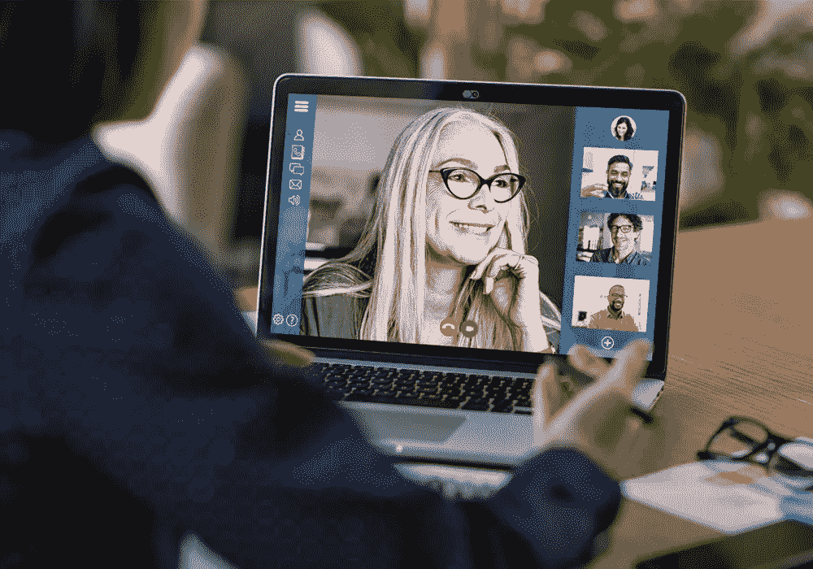
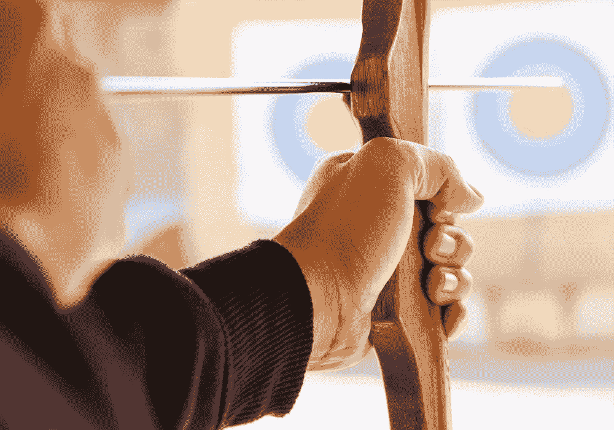

# 年轻设计师获得梦想工作的秘方

> 原文：<https://medium.com/geekculture/the-secret-sauce-for-young-designers-to-land-their-dream-job-92ad5dcbfcc2?source=collection_archive---------56----------------------->

​

大约七年前，我进入了设计行业。从事我的第一份工作背后的方法是在一个我可以学习，提高我的技能，并且有支持我的同事的地方工作。

基于我在谈判桌上两边的经历，我分享了一份我认为对年轻设计师有益的建议清单。突出危险信号，候选人可以做的事情，以增加获得理想工作的总体机会。请注意，所有这些都是我的观点。

# 📋一份清晰、简单、可浏览的简历。

> 第一印象总是重要的。你的简历是你发布的第一件东西。

*让观众保持兴趣。(图片来源:Shutterstock)*

*   **让它可浏览:**记住，观众只会浏览它。让它容易扫描，不要让事情过于复杂。将文本分成多个标题，并添加短段落和项目符号。
*   **说出你的故事:**作为设计师的你是谁？人们应该了解你什么？代表你自己，你现在做的工作，以及你将来想做的事情。
*   **回顾细节:**通读内容，检查拼写、语法和品牌/公司名称。
*   最后，**将其导出为 PDF 格式**——不超过两页。

# 📑始终包括你的投资组合。

> 基本原则:不要申请没有作品集的工作。在简历中加入作品集链接。没有投资组合，招聘团队就没有任何东西来评估你。

如果你一开始是一名设计师，你会说:“我还没有时间创作作品集”或者“我没有足够有趣的项目来展示”——这些都不能成为你的理由。

# 质量重于数量。

如果你没有太多的项目可以展示，那也没关系。).别担心。每个人都这样开始。你有独特的技能，专注于你喜欢的工作，展示你的方法，讲述项目背后的故事。

你可以在 [Dribbble](https://dribbble.com/) 、 [Behance](https://www.behance.net/) 或者像 [Semplice](https://www.semplice.com/) 这样的作品集制作网站上展示你的作品。它甚至可以像一个精心设计的 PDF 一样简单。

# 避免在多个嵌套的 Google Drive 文件夹中添加创意。

> 这可能对你来说很方便，但是从浏览者的角度考虑一下——点击无穷无尽的文件夹可能会导致看不到完整的图片。

展示你的作品，展现你的个性。(图片来源:Unsplash)

## 在你开始着手你的投资组合之前，想一想:

*   你投资组合的目标是什么？
*   你想怎样讲述你的故事？
*   您想包括哪些项目？按照工作类型、时间对它们进行分类，或者把你印象最深刻的项目放在最上面。
*   对于您添加的每个项目/工作示例，请指定问题陈述、目标、假设、过程、角色、解决方案、收获、贡献和结论。
*   最好的办法是在你处理这些问题的时候把它们记录下来。
*   总的来说，考虑周到地应用设计元素。首先让它可读，然后让它在视觉上吸引人。

# 🔎求职——知道你在找什么。

> 寻找合适的工作可能是一个乏味的过程，但你需要耐心。在寻找你梦想中的角色时，有几件事你可以记住。

*知道自己在寻找什么。(图片来源:Shutterstock)*

# 做你的研究。

> 了解一下角色，公司文化，成长机会，甚至行业薪资标准，这样到时候你就知道期待/要求什么了。

# 有一个集中的目标。

列出几个看起来令人兴奋的机会，不要申请你遇到的每一个角色*(这可能会让人精疲力尽)。*下一个问题变成了，你如何决定申请哪一个？在进行研究时，您可以:

*   了解公司、公司文化和核心价值观。有没有让你产生共鸣的？
*   查看公司的社交媒体平台，看看他们是否提升了员工，反之亦然。
*   了解你未来的雇主。在 LinkedIn 上和他们联系，表达你的兴趣——这有助于吸引注意力，表明你真的感兴趣。从一开始就建立联系，而不是仅仅为了跟进申请状态而联系他们。

# ✏️技能测试/作业——全力以赴。

发挥创造力，发挥你的优势，创造一些你会自豪地加入你的作品集的东西。不要使用现有的模板。

*勇于冒险，不要害怕尝试。要有创意。(图片来源:Shutterstock)*

*   玩转字体设计，引入有趣的视觉元素。微小的细节是极其重要的:获得视觉层次，格式，间距，字距的权利。
*   不要模仿你在公司网站、社交媒体平台上看到的东西。招聘团队试图了解你能带来什么。
*   正确使用雇主的品牌。他们共享品牌指南是有原因的。正确拼写品牌/公司名称，例如 Axelerant 而不是 catalyst。
*   你可以多加一页来解释你的概念/思考过程。
*   不要使用股票网站现有的模板；招聘团队迟早会发现。
*   避免延迟或平均作业提交。如果你没有时间/精力，就不要继续申请了。尊重您自己的时间，与参与此过程的人一起，通知招聘团队无法继续申请。

# 💬面试是双向的。

在面试开始/结束时，请随意提问。在你做研究的时候，如果有什么对你来说很突出或者没有意义的事情，一定要记下来。

*虚拟连接世界(图片来源:Shutterstock)*

远程工作是新的常态。如果你已经知道你申请的职位很遥远——读一读，扩大你的理解，然后问一些具体的问题。

在被问及不成功项目的面试中，不要直接指责别人。诚实、透明地讲述体验——从项目细节(设定背景)开始，描述目标(你/你的团队的目标是什么),最后，你面临的挑战是什么，你希望未来如何改变。

这不仅关系到你的工作，还关系到你如何融入团队的工作环境。你可能会与招聘团队中的一两个成员互动，但总会有一个内部团队在时机成熟时参与进来进行评估。

# 🌱反馈、成长和职业阶梯。

建立你的人际网络，寻求反馈，寻找导师。

*关注重要的事情——增长。(图片鸣谢:GettyImages)*

招聘过程可能会让人不知所措。你没入围不代表你不好。评论者可能在寻找其他东西，或者其他人能够提供他们行业内优秀的工作实例。当你的申请没有通过时，感到失望是很自然的，一定要寻求反馈——这将帮助你成长。

拓展你的设计技能。有时候成长也意味着软技能。确定你想如何成长，并评估机会是否会促进这种成长。

# 🤔不确定你是否会被录用？还是申请吧。

相信你的直觉，按下按钮。

*迈出第一步。(图片来源:Shutterstock)*

仔细阅读工作描述中的要求部分。你的技能、经验和兴趣与工作描述中提到的细节几乎相符吗？如果你的后脑勺有一个小小的声音在说:*“也许我不适合这个角色，”*不要怀疑自己。事实是没有人是合格的。这是一个持续的学习过程，随着时间的推移，你会越来越好。

# 🔥我们走吧！

从基础知识开始你的旅程，在成功和失败中变得更好。确定你的超能力，并围绕它建立你的职业生涯。

作为一个新手，你可能不喜欢呆在一个令人愉快的地方，但是请记住，你不会失去任何东西。作为一名设计师，你在你的旅程中所做的任何尝试都会变得更好。所以，不要停止行动。

今天就启动你的梦想吧！(图片来源:Shutterstock)

一路顺风。梦想确实会实现，要有耐心；可能*需要一段时间才能到达*！🚀

​