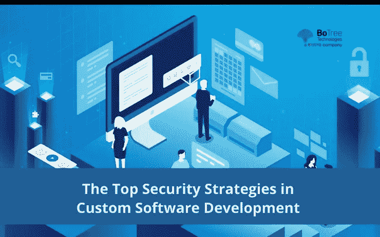

# 定制软件开发中的顶级安全策略

> 原文：<https://medium.com/geekculture/the-top-security-strategies-in-custom-software-development-d14a8e06561d?source=collection_archive---------15----------------------->

全球企业软件支出为 6050 亿美元。

越来越多的公司探索定制软件开发来数字化他们的运营。

软件解决方案简化了业务流程和工作流程。B2B 和 B2C 软件开发解决方案使公司能够实现运营效率。

创建定制企业软件解决方案的一个主要元素是[数据安全性](https://dzone.com/guides/application-and-data-security)。用户的机密数据是公司不能忽视的一个方面。因此，安全性在自定义开发中扮演着重要的角色。

安全软件开发正在激增。公司正在广泛采用 DevSecOps(开发+安全+运营)方法。随着政府限制的出现，安全性和治理现在变得至关重要。

# 为什么数据安全很重要？

一次[数据泄露](https://dzone.com/articles/data-breach-what-does-a-compromise-look-like-and-h)的全球平均成本为 380 万美元，而 51%的组织支付赎金以从他们的系统中清除[勒索软件](https://dzone.com/articles/understanding-ransomware-and-how-to-protect-agains)。

数据是每个企业的关键要素。它使他们能够获得有价值的商业见解并做出更好的决策。不幸的是，今天，由于全球范围内发生的[网络攻击](https://dzone.com/articles/cybersecurity-data-and-automation-what-you-need-to)的数量，数据变得易受攻击。

安全性变得至关重要，因为:

那么企业和公司如何提高数据安全性呢？他们有哪些方法可以减少网络攻击并消除系统中的漏洞？

# 定制软件开发的顶级安全策略

安全性应该是软件开发服务中的一个关键要素。开发软件的公司需要采取适当的预防措施，以确保没有漏洞和威胁能够进入系统。

以下是企业在[定制软件](https://www.botreetechnologies.com/blog/custom-software-development-mistakes/)开发中可以遵循的顶级安全策略:

# 1.安全软件开发策略

*   每个企业在利用[定制软件开发](https://www.botreetechnologies.com/blog/customized-software-what-is-it-types-and-examples/)服务时首先需要的是一个安全的软件开发策略。
*   这种策略包括在软件构建过程中要遵循的指导方针和最佳实践。此外，该策略应包含有关查看、评估和监控应用程序的详细说明，以降低安全漏洞的风险。
*   该政策还必须披露开发过程中每个团队成员的责任。适当的培训是必要的，以确保团队理解政策并遵循行业标准。它应该是定制软件开发的强制性文档，以确保每个人都遵循指南。

# 2.安全意识培训

*   当安全软件开发服务的文档准备好时，培训就变得必要了。然而，它不仅仅包括政策措施以及如何遵循这些措施。
*   安全意识培训是一种全面的方法，开发人员可以从中了解常见的安全漏洞。他们还从事实际项目，帮助他们了解应用程序中网络威胁的起起落落。
*   意识培训中要教的一件重要的事情是帮助开发人员理解他们最有可能犯错误的地方。然后，当他们很容易地识别出 bug 时，他们会很快消除它。

# 3.更新您的软件和系统

*   今天，大多数安全漏洞来自过时的软件和传统系统。因此，更新软件并切换到现代企业系统变得至关重要。
*   黑客和网络攻击者知道旧软件中的安全威胁，可以轻松穿透保护层。此外，由于开发人员使用的许多软件工具都是开源的，他们需要一份软件材料清单来保存所有组件的清单。
*   定期打补丁将使开发人员能够掌握自己的游戏，并更好地保护数据。新的软件补丁也确保网络攻击者不会轻易用旧的方法攻击系统。

# 4.进行定期的代码审查

*   代码评审是[企业软件开发公司](https://www.botreetechnologies.com/software-development-company)的一项重要活动。在过程的早期识别并修复代码中的[错误](https://dzone.com/articles/lifecycle-of-a-testing-bug)有助于避免常见的安全隐患。
*   测试代码和修复错误是一个常见的步骤。然而，当应用程序变得有点过时时，黑客可以很容易地渗透到应用程序中。他们知道什么是违规行为，以及如何利用这些违规行为。
*   签入新代码的另一个方面是检查由于代码更改而可能出现的任何安全漏洞。定期的代码审查很方便，因为它们确保没有任何东西被忽略。

# 5.数据加密和访问控制

*   加密数据已经成为定制软件开发的重点。如今，没有一家公司的运营离不开数据加密政策。此外，还必须有安全的密码恢复方法、强有力的密码强制执行和多因素身份验证。
*   如果有适当的访问控制，人们知道他们可以访问什么，每个人都实现了透明。此外，当数据被加密时，黑客进入系统的机会更少，并且访问控制被定期修改。
*   加密敏感信息将只允许授权用户访问。它变成了网络攻击者难以穿透的简单防火墙。因此，数据加密对于定制软件开发中的网络安全至关重要。

# 6.渗透测试

*   最后但同样重要的是，渗透测试是软件开发服务的一个很好的安全策略。企业可以雇佣一个[渗透测试](https://dzone.com/articles/what-penetration-testing-and)团队，轻松提供最佳解决方案。
*   该团队将进行安全漏洞测试，并使用黑客用来评估系统安全性的相同工具。然后，当他们发现安全问题时，开发人员可以很容易地修复它们，而不用担心任何问题。
*   通常，渗透测试应该每月或每季度进行一次，以确保应用程序始终保持安全。它还将减轻围绕第三方软件使用的任何担忧。

# 结论

客户[软件开发](https://www.business2community.com/tech-gadgets/top-custom-software-development-methodologies-for-enterprises-02448430)的需求越来越大，这也是安全性成为主要关注点的原因。数据安全性对于赢得用户的信任和确保机密信息永远不会被共享至关重要。上述 6 种安全策略可以帮助公司实现更好的数据保护，并保护其应用程序。

【https://dzone.com】最初发表于**。**