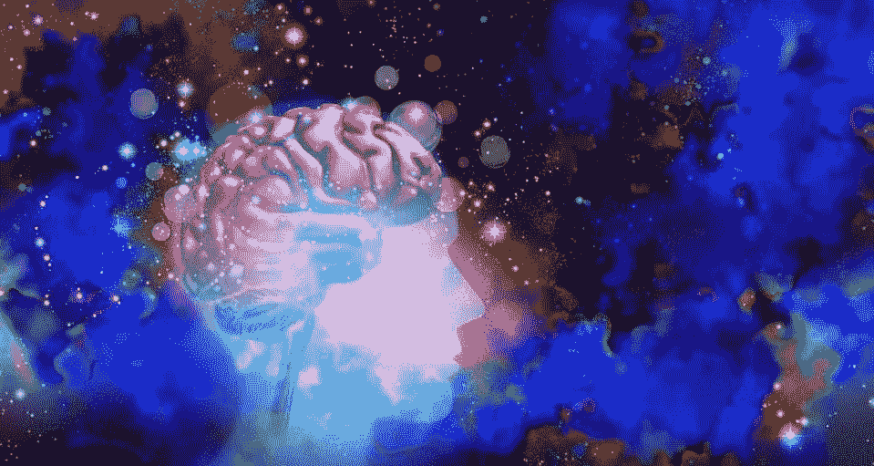
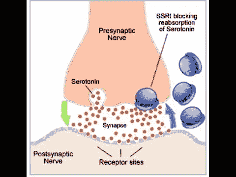

# 这些以前被禁止的药物可能开启精神药物治疗的新时代

> 原文：<https://medium.com/geekculture/these-previously-forbidden-drugs-may-unlock-a-new-era-of-psychiatric-medication-1ea6e28aae24?source=collection_archive---------10----------------------->

## 医疗用迷幻药的发展

Source: Forbes

迷幻药:当大多数人听到这个词时，他们会想到污名化的非法物质和疯狂的毒品旅行，这些都涉及到比生活更大的幻觉。他们会想到“神奇蘑菇”和大型社交聚会等术语。虽然这种观点可能描绘了这些药物在过去的典型观点，但已经发现它们在医学领域的发展中具有巨大的前景。迷幻药的感知改变能力可能是我们几十年来面临的抗抑郁危机的解决方案。

**目录**

1.  SSRIs 的问题是
2.  迷幻药的医学应用史
3.  什么是迷幻药，哪些与医学领域最相关？
4.  迷幻药是怎么起作用的？
5.  关于迷幻药有哪些主要的担忧和未解答的问题？
6.  今天对迷幻药有什么研究？
7.  关键要点

## SSRIs 的问题是

自 20 世纪 80 年代推出以来，用于治疗精神疾病(抑郁、焦虑、强迫症等)的主要药物类别。)是选择性血清素再摄取抑制剂(SSRIs)。这些药物通过增加中枢神经系统中神经递质血清素的量来发挥作用。血清素的工作是在神经元之间传递信号，所以当 SSRIs 阻止大脑的血清素被重吸收时，它必须继续传递更多的信号。这导致大脑高效运转和良好的心情。流行的 SSRIs 包括左洛复、百忧解和塞来沙。

SSRIs block serotonin from being reabsorbed into the presynaptic neuron. Source: Simply Psychology

从这个描述来看，SSRIs 听起来可能很吸引人。**然而，越来越多的患者患有难治性抑郁症，这意味着他们不受 SSRIs 和其他传统类型的抗抑郁药物的影响。**据估计，多达 1/3 的成年重度抑郁症患者(MDD)有这个问题，通常被称为难治性抑郁症(TRD)。各种其他精神疾病，如强迫症(OCD ),也有大量人群对 SSRIs 的治疗产生抗性。

针对这些问题，许多制药研究公司试图创造 SSRIs 的新替代品，通常针对其他神经递质，如 GABA 或多巴胺，而不是血清素。然而，这些新疗法有许多有害的副作用，如焦虑、自杀念头、肝损伤、恶心、头痛、便秘、呕吐等。此外，这些药物及其制造的新奇性产生了意想不到的后果，使它们变得异常昂贵。例如，新批准的用于治疗产后抑郁症的 Brexanolone 在获得保险公司的援助之前，目前的费用高达 34，000 美元。

这些问题已经使许多精神病学团体的成员清楚地认识到，需要一种更安全、有效和更经济的 SSRIs 的新替代品。然而，制药行业正在逐渐远离精神药物领域的研究和投资。因此，许多著名机构不再试图开发未来的新药，而是对过去的方法产生了新的兴趣。

## 迷幻药的医学应用史

**迷幻药是致幻药物的一种，可以改变人的感知和意识状态。**它们的使用可以追溯到古希腊，在那里，一种效果与现代 LSD 非常相似的植物被用于神圣的仪式。然而，直到 20 世纪初，这种特性才出现在合成药物中。德国制药公司默克于 1912 年研制出 MDMA(又称摇头丸或莫利)，瑞士科学家艾伯特·霍夫曼于 1938 年首次合成了麦角酰二乙胺(LSD 或酸)。霍夫曼还被认为发现了另外两种迷幻药，包括裸盖菇素(俗称“神奇蘑菇”)，这是当今最常见的迷幻药之一。

In its natural form, psilocybin exists in small mushrooms with tall stalks. Source: ABC News

一旦迷幻药被合成为药物形式，人们很快意识到它们在医学领域的巨大潜力。在 20 世纪 50 年代的一段时间里，LSD 特别是一种流行的治疗各种精神疾病的方法。然而，随着时间的推移，迷幻药越来越多地用于狂欢或家庭聚会，并最终根据 1970 年的《受控物质法案》在美国成为非法。这项法律宣布迷幻药为非法，因为它们被滥用的可能性很高，超过了其医疗效用的吸引力。

1971 年，前总统理查德·尼克松(Richard Nixon)向毒品宣战，这使得科学家们不管他们的意图如何，探索迷幻药都变得更加具有挑战性。在此期间，迷幻药的研究很少，在接下来的十年里，SSRIs 是现代医学的一个激动人心的介绍。然而，**鉴于 21 世纪 SSRIs 的各种问题和制药业的状况，迷幻药最近被许多机构重新审视。**

## 哪些迷幻药与医学领域最为相关？

虽然其他迷幻剂在治疗疾病(尤其是精神疾病)方面有望成功，但迄今为止的**研究主要集中在 LSD、psilocybin 和 MDMA** 。这些药物都是血清素激动剂。5-羟色胺激动剂是一类激活 5-羟色胺受体的药物，在这种情况下，5-羟色胺受体是一种被称为 5-羟色胺受体的类型，在治疗根植于抑郁或焦虑的病症中是关键的。此外，无论是直接还是间接，这些药物中的每一种都会增加多巴胺的水平。多巴胺是与大脑奖赏系统相关的神经调质，能诱发幸福感和满足感。

在精神疾病的大背景下，已探索了上述每种迷幻剂来治疗不同的一组疾病。MDMA 已在很大程度上被研究作为一种治疗 PTSD、社交焦虑和临终患者焦虑的药物。Psilocybin 主要用于研究 OCD、成瘾和耐治疗性单相抑郁症。最后，LSD 正被研究用于治疗广泛性焦虑和单极性抑郁症。

## 迷幻剂是如何发挥作用的？

在科学层面，关于迷幻剂如何在大脑中发挥作用以及是什么让它们在治疗精神疾病方面如此有效，仍有许多问题。我们所知道的是**迷幻剂改变了大脑中各种神经元亚群的放电速度。**由于上述药物诱导的 5-羟色胺增加跨大脑区域发生，因此迷幻剂影响的不是一种功能，而是多种功能的组合，因此更难准确定位大脑在暴露于迷幻剂时经历的确切过程。

虽然有许多理论可以解释为什么迷幻剂会产生同样的效果，但其中一个更受欢迎的理论是丘脑过滤器模型。丘脑这个词来源于被称为丘脑和下丘脑的大脑区域。这两个区域参与我们的大脑如何过滤和解释信息，然后将其分配到其他区域。

Highlighted in red is the thalamus, the region of the brain which receives and filters external information. Source: Psychology Today

当一个人处于迷幻状态时，丘脑过滤模型表明，其丘脑在过滤外部信息方面受到的损害程度与通常情况下相同。这会导致感觉超负荷，更多的想法和观察会通过这个过滤器。**大量额外的想法渗透到大脑中诱发梦幻般的幻觉，并使处于迷幻状态的人获得对自己和周围世界的全新视角。** **这一新观点与血清素的增加(血清素的增加可以引发更快乐的感觉)一起，使许多人能够重温令人沮丧或创伤的经历，并挖掘出令人难以置信的新见解。**

虽然丘脑过滤器模型是解释大脑对迷幻药反应的更受欢迎的模型之一，并在一定程度上得到现代研究的支持，但肯定还有其他关于迷幻药在大脑中如何工作的理论。这些包括迷幻药诱导大脑奖励系统的改变，功能性地改变 5-HT 受体，或直接引发神经可塑性(大脑改变和生长的能力)的增加。然而，这些都只是简单的理论来解释关于迷幻药的一个悬而未决的主要问题。

## 关于迷幻药有哪些主要的未解之谜？

如上所述，科学家们继续努力解决的头号问题是迷幻药在大脑中究竟是如何工作的。尽管事实上使用医学批准量的迷幻药已被证明对人体健康无害，但许多好奇的人仍希望发现这些药物如何起作用的真相。这一发现不仅标志着科学界的一个重要里程碑，也有助于治疗师确定如何优化迷幻辅助治疗。

这导致了下一个问题，因为不知道迷幻药物利用的作用机制已经成为科学确定进行迷幻辅助治疗的最佳方式的障碍。为了尽可能地帮助患者，并利用他们对世界的新观点来发展思维模式的持久转变，迷幻医学治疗的治疗成分是至关重要的，因此回答这个问题将使治疗师能够使迷幻治疗对精神疾病患者更加有效。

此外，科学家仍在探索迷幻药的适当剂量。剂量需要足以体验有效迷幻疗法所需的变化，但又不能太大，以免引发大脑化学变化引起的疾病，如致幻剂持续感知障碍(患者随机体验先前药物旅行的感觉，这种情况通常与 LSD 有关)、血清素综合征或药物诱发的精神病。

科学家希望进一步了解的最后一个问题是，如何预测患者对给定治疗的反应或成功率。这可能会通过使用机器学习模型来尝试，这将需要大量的研究来训练和完善。然而，创建这样一个模型是整个医学领域的研究人员继续努力的目标。多伦多大学等机构已经成立了研究机器学习模型的小组，该模型能够预测癌症治疗的药物反应，一旦达到这一标准，它将变得更容易在其他医学治疗中复制。

## 今天对迷幻药有什么研究？

许多精神病学家和药理学家对迷幻药作为精神疾病治疗手段的未来充满希望，特别是对那些有难治性症状的患者。**由于迷幻药在医学应用方面的明显潜力，耶鲁大学、约翰·霍普金斯大学、斯坦福大学、西北大学、加州大学洛杉矶分校和世界各地的许多其他大学都有专门的实验室或教育项目来研究迷幻药对精神疾病的作用**。

最近的一项研究显示了这一领域的明显潜力，该研究在 NYU 兰贡进行了成功的第一轮研究，通过使用合成裸盖菇素和迷幻辅助疗法，显著减少甚至治愈了许多酒精成瘾。该研究是一项双盲随机试验，参与者在 12 周内接受了两剂裸盖菇素，并任选第三剂。对于许多患者来说，迷幻治疗引发了象征性的幻觉和新的视角转变(例如，一名患者报告说看到一个酒精瓶子在沙漠中分解成沙子)，这使他们能够从一个新的、更坦率的角度看待自己的酒精成瘾。

**作为治疗的结果，实验组中 83%的患者酗酒减少，48%的患者完全戒酒。**研究参与者约翰·科斯塔斯甚至认为他在研究期间接受的治疗挽救了他的生命。这项研究旨在证明迷幻剂在以新的方式治疗各种迷幻障碍方面的主要潜力，并为那些与酒精中毒或其他危及生命的成瘾作斗争的患者展示了希望。

鉴于迷幻药几十年来的污名和它们在社会中的声誉，许多人对使用迷幻药治疗疾病仍持怀疑态度。一个常见的担心是，它们会因过量而导致成瘾或死亡；然而，值得注意的是，迷幻药实际上是已知用于中枢神经系统的最安全的药物之一。针对这些应用讨论的药物(即裸盖菇素、LSD)不会使人上瘾，并且没有任何因摄入医疗实践中讨论的标准剂量而导致的用药过量死亡。

尽管有这样的怀疑论者，但对于那些关注事实的人来说，很容易看到主要的潜在迷幻疗法，以及它们对数百万受困于精神疾病的人可能产生的巨大影响。只有时间能证明一切，但从今天的角度来看，迷幻药似乎有潜力开启一个治疗难治性精神疾病的新时代，并永远改变精神病学领域。

## 关键要点

1.  选择性 5-羟色胺再摄取抑制剂(SSRIs)是目前主要的精神药物。许多患者对这些药物有耐药性，新的替代药物具有许多负面副作用，因此需要新的解决方案。
2.  迷幻药是一类致幻药物，多年前曾用于治疗抑郁症，但在 20 世纪 70 年代被美国政府禁止后失去了其流行性。最近，他们重新引起了许多科学家对精神病学应用的兴趣。
3.  LSD、MDMA 和 psilocybin(神奇蘑菇)是目前医学应用研究最多的迷幻药。它们都是血清素激动剂，这意味着它们增加了大脑中血清素的量。
4.  关于迷幻药的工作原理有许多理论，但最流行的理论之一是丘脑过滤模型，该模型认为迷幻药会降低大脑中一个叫做丘脑的区域过滤外部信息的能力，导致对自己和周围环境的感知发生重大变化。
5.  当用于医疗领域时，合成浓度的迷幻药以小剂量给病人服用。然后，他们经常出现幻觉，并在药物的影响下接受治疗，因为药物经常使患者经历重大顿悟或思维模式的转变。
6.  关于迷幻药仍有许多未解的问题，但许多大学已经建立了实验室，甚至指定了专门的部门来研究迷幻药在治疗精神疾病方面的应用。
7.  迷幻药可能会改变对单极抑郁、焦虑、强迫症、创伤后应激障碍、酒精中毒或其他成瘾以及严重社交焦虑等疾病的治疗，这些疾病损害了数百万人的生活。

非常感谢你阅读我的文章，我希望你喜欢它！我叫刘冰·博恩施泰因，今年 16 岁。我对神经科学和生物技术的分支充满热情，尤其是当它们涉及到治疗神经疾病时。我很乐意在 LinkedIn 或 Twitter 上联系你，或者你可以在 rainabornstein@gmail.com 联系我，与我交谈或合作。我等不及收到你的来信了！