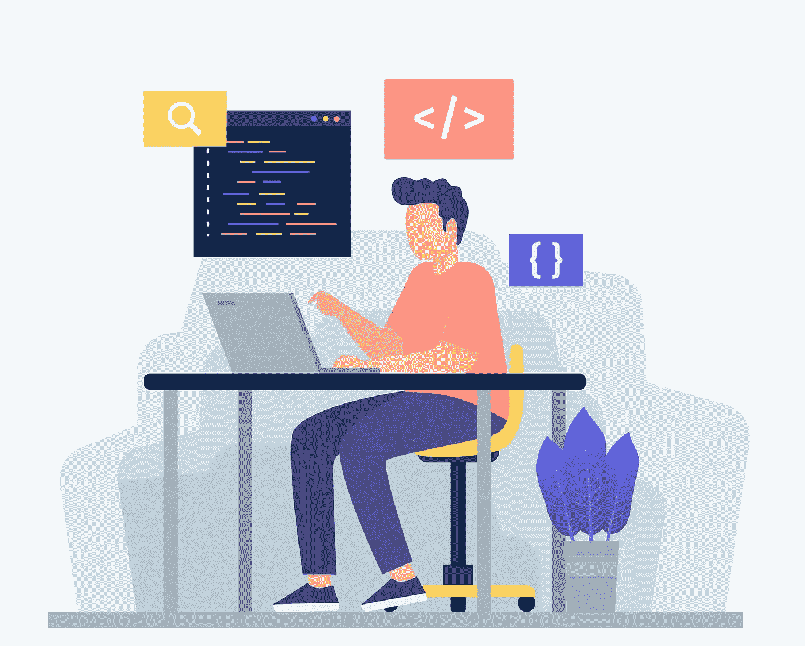

# 做了两年软件工程师，我学到了一些东西

> 原文：<https://medium.com/geekculture/things-i-learned-from-2-years-of-being-a-software-engineer-f4e3f908cde3?source=collection_archive---------18----------------------->

2021 年 6 月标志着我在科技行业担任软件工程师两周年。在这段时间里，我觉得我学到了很多关于软件工程的知识，我想与我所有的工程师同事分享我学到的一些东西和一些技巧。这是我做软件工程师两年来学到的八件事。

Source: freepik

**1。少即是多**

当我在科技行业开始职业生涯时，我认为你写的代码行数越多，你就越有经验。但事实恰恰相反。你写的代码行数与你对该语言的精通程度成反比。有经验的程序员写的代码更少。这并不意味着他们用复杂的一行程序炫耀他们的领域知识。优秀的程序员编写简单易读的代码。

**2。先学基础**

由于网上有无限量的教程，任何人都可以在没有学习计算机科学和编程基础的情况下开始制作应用程序或游戏。虽然我喜欢这一点，但在我看来，了解像通用数据结构和各种算法这样的基础知识对你作为软件工程师的职业生涯大有帮助。在更深层次上了解一切是如何工作的，将有助于你更有效地解决复杂的问题。此外，学习编程的基本概念有助于您轻松地从一种语言切换到另一种语言。

**3。不要落入教程陷阱**

我知道即使你对使用的语言或框架一无所知，也很容易一头扎进开发过程。互联网上有大量的内容/教程，没有经验的人很容易开始开发，但是不要陷入教程陷阱。在进入开发的有趣部分之前，先试着理解语言/框架的基础。浏览你正在使用的语言或工具的官方文档，弄清楚它是如何工作的，然后开始开发。

每当我遇到堆栈溢出时，大多数时候都是因为我对这项技术没有足够深刻的理解。它有时会有所帮助，但不应该用来掩盖对语言或框架的肤浅理解。

当你陷入一个问题时，不要盲目地从堆栈溢出中复制代码，而是尝试使用文档找出解决方案。我并不反对使用堆栈溢出，我也同意它是解决任何开发相关问题的一个惊人的资源。但是去栈溢出应该是你最后的选择。此外，在将复制的代码粘贴到您的代码库之前，努力理解它是如何工作的。从长远来看，这将有助于您解决类似的问题，而不会在堆栈溢出上浪费时间。

**4。模块化你的代码**

将你的代码分成更小的块。识别软件中可以被分成独立模块的部分，这些模块只做一件事。将代码模块化使其易于理解和维护。要记住的黄金法则是“一个函数/方法应该只执行一个任务”。如果您遵循这个规则，它会使您的代码更具可读性和可重用性。将来为你工作的开发人员会感谢你的。

**5。正确地重构和注释你的代码**

提高一段代码的质量和可读性的最简单的方法之一是给出有意义的变量名，并遵循一致的命名约定。总是尽量使用描述性的变量名，即使它很长。您可以遵循任何命名约定(snake_case、PascalCase 或 camelCase)，但要与代码中使用的任何命名约定保持一致。正确地注释代码也将有助于组织和赋予代码意义。但是千万不要过度。

**6。不要专注于单一技术/框架**

我想说，作为一名软件工程师，我很幸运有机会从事多种技术和框架的工作。我从事过嵌入式系统领域、Android 应用程序开发、扩展现实，甚至 Alexa 技能开发。这帮助我对软件工程的每个领域有了更广泛的了解，反过来也提高了我的系统设计技能。如果你擅长某一项技术，如果你正确地掌握了核心概念，你可以很容易地适应另一项技术。

给所有初级开发人员的建议:不要试图只成为一种技术的专家。技术日新月异。因此，不要专注于单一的技术或编程语言，理解基本概念，你将能够轻松地从一种技术/框架切换到另一种。此外，你从一个技术栈中获得的知识将帮助你理解另一个层次上的其他技术栈。例如，我在嵌入式系统方面的经验让我对事物如何在幕后工作(软件如何与硬件交互)有了更好的寄存器级理解，这极大地提高了我为 Android/移动应用程序编写的代码的效率。

**7。要求代码评审——寻求建设性的批评**

在我看来，代码审查被严重低估了。代码评审为开发人员提供了一个学习新的优化技术和提高代码性能的机会。有一双新鲜的眼睛来审视你的代码总是好的。如果您的组织中没有人审查您的代码，请要求审查。

**8。休息一下**

当你被困在一个问题上时，不要几个小时都埋头苦干。休息一下，去散散步，去看一段 YouTube 视频，听听音乐，做一些能把你的注意力从代码上转移开的事情，然后停下来思考 10 到 15 分钟。当你平静的时候，回到你的电脑前，相信我，你会有一种全新的清晰感。