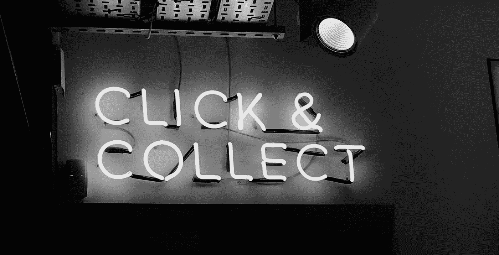

# 在给自己贴上自动化工程师的标签之前，请三思

> 原文：<https://medium.com/geekculture/think-twice-before-labelling-yourself-as-an-automation-engineer-18105fb6830d?source=collection_archive---------25----------------------->

## 自动化脚本只是工作的一部分

> 打破传统的 QA 孤岛，让开发人员能够进行质量检查。

长期以来，就业市场一直将自动化标榜为金蛋，任何没有自动化的公司都会觉得自己错过了机会。

不难看出为什么自动化即服务会非常有用，如果你想让它点击同一个按钮，它会点击无数次，直到你满意为止。

但是要警惕自动化，以及招聘熟练的“测试自动化工程师”的招聘广告。

Photo by [Marija Zaric](https://unsplash.com/@simplicity?utm_source=unsplash&utm_medium=referral&utm_content=creditCopyText) on [Unsplash](https://unsplash.com/s/photos/label?utm_source=unsplash&utm_medium=referral&utm_content=creditCopyText)

## 对新质量保证工程师的考虑

自动化是令人兴奋的，作为刚接触测试世界的 QA 工程师，我们立刻被它吸引，就像飞蛾扑火一样。当我开始我的测试生涯时，我完全不知道我在做什么。幸运的是，我加入的团队已经有了一些测试人员。

我开始手工做事情，阅读需求，一点一点地浏览产品，参加所有的 scrum 仪式，同时一路积累我对产品的知识。

最终，我成为了一个自动化套件的唯一贡献者，这个套件在我加入之前就已经存在，由团队的一名成员构建。

我很兴奋！我正在学习编码，弄清楚如何调试测试，熟悉 Jenkins，生成报告，最终我让他们在一个巨大的监视器上运行，供整个团队观看，我完全被吸引住了。

考虑动手建立自己对测试的基本理解。学习测试技术背后的理论，并找出应用一种技术优于另一种技术的最佳时机。通过 [**探索性测试**](/geekculture/exploratory-testing-the-ultimate-weapon-fe43467ee7ca) 表达你的创造力，用自动化**支持**你的测试努力。

## 自动化的现实检查

几年后，当我在几家不同的公司工作时，现实是，并不是我参与的每个项目都使用了自动化。

我曾经处理过有自动化的项目和没有自动化的项目，这两种方法对团队和我来说都非常好。

招聘“测试自动化工程师”的工作错误地标注了测试人员的含义，这给新测试人员以及更广泛的团队造成了混乱。

现实是，被雇佣为“测试自动化工程师”的人不会把 100%的时间花在编写自动化脚本上。他们的工作范围可能表明他们的雇主期望某种形式的自动化技能，但日常活动将包括自动化以外的任务。

自动化是一种工具，不是一个头衔。它是一个帮助开发人员和测试人员减少一些费力工作的工具。

Photo by [Henrik Dønnestad](https://unsplash.com/@spaceboy?utm_source=unsplash&utm_medium=referral&utm_content=creditCopyText) on [Unsplash](https://unsplash.com/s/photos/street-art-takeaway?utm_source=unsplash&utm_medium=referral&utm_content=creditCopyText)

## 结束的

自动化是这么多团队多年来痴迷的闪亮工具，我们希望在任何事情上都使用它。那句话的关键词是“工具”，自动化只是工具。

将自动化视为有限的资源，并在需要时应用它。自动化的需求通常来自管理团队，他们认为这是必需的(金蛋)，但是要弄清楚你是否真的需要自动化。权衡一下自动化的好处，记住在你的测试旅程中考虑自动化的缺点，在给自己贴上“自动化工程师”的标签之前三思。

**成为活跃媒介会员无限制访问，在这里注册******！👏🏽****