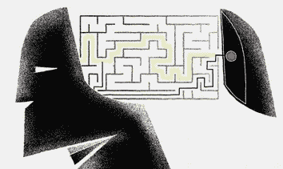
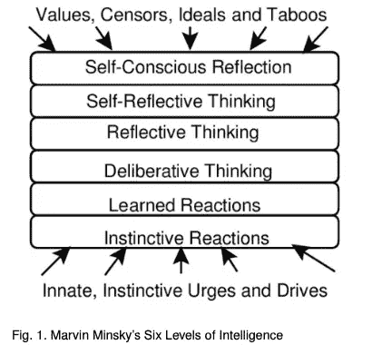
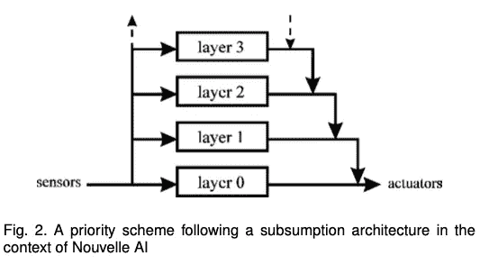
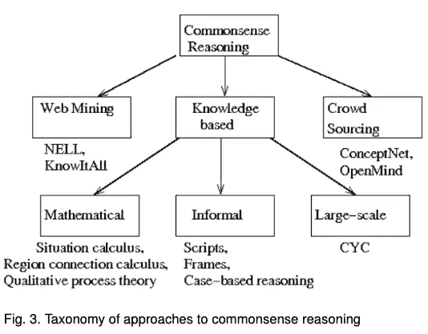
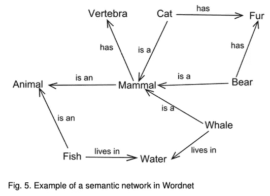
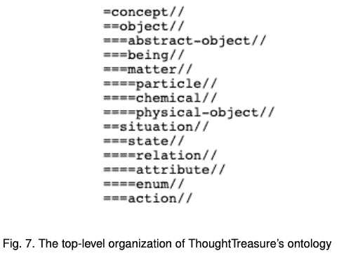
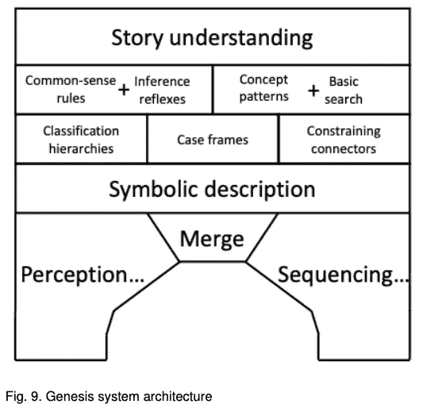
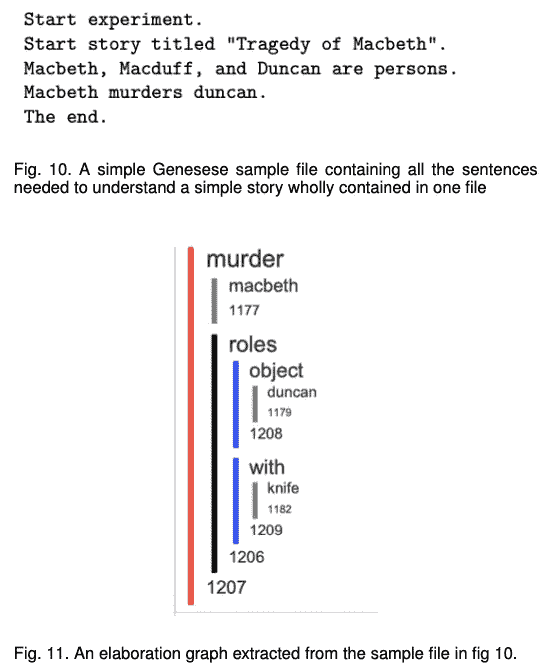
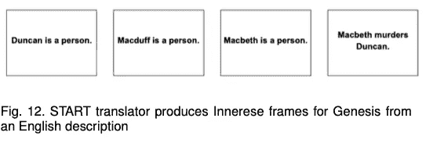
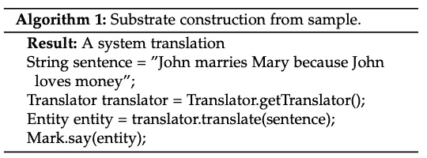

# 思考思考:麻省理工学院的创世纪故事理解系统

> 原文：<https://medium.com/geekculture/thinking-about-thinking-mits-genesis-story-understanding-system-ed7398d2a820?source=collection_archive---------13----------------------->

> 这篇文章简要回顾了故事理解在概念上的开始。它触及相关的理论考虑，清除关于这种项目的内部工作的误解，并且把读者的观点转移到常识推理中的操作的新范例。特别是，这篇文章介绍了以前的工作所获得的见解，并深入研究了被认为是最成功的尝试故事理解和操作的研究项目。

对于法裔阿尔及利亚哲学家阿尔贝·加缪来说，宇宙是无理性的，无意义的，然而人类却不顾一切地想在其中找到原因和意义。这种迫切的需求，加上人类有限的知识，推动社会发展出许多对社会有用的含糊不清的手提箱词。因此，在幸福的无知中，他们避免思考超出他们回答能力的问题。

例如，在语言学中，一些单词单独使用并不能洞察一个聪明的观察者的内心活动。然而，不知不觉中，它们让我们无法解释工作原理。无色、冰冷和逻辑的“思考”与神秘和复杂的“情感”形成对比，误导许多人并使他们停止思考。

然而，少数好奇的人感兴趣的是，大脑如何适应众多的单词定义，并能够将一套含义和过程应用于其余的单词以建立理解。相应地，一个过程可能涉及空间推理，另一个过程涉及家庭纽带，另一个过程涉及贪婪等等。

在这一点上，在思考思维方面，许多研究告诉认知科学家，虽然人类的一些行为是反应性的，但他们和其他动物似乎依赖于某种形式的预测模拟。一种心智建模能力，如果你愿意的话，在幕后，根植于正在发挥作用的感知系统。

事实上，神经科学研究中的一系列深刻观察表明，想象的行为似乎会刺激大脑中参与执行这些行为的某些区域。这样，一个想象的假设场景可以使大脑利用缓存的有用知识来加速解决问题。

特别是，这些观察提出了这样一种观点，即预测能力能够及时洞察系统的益处，并通过探索可负担的行动和有效的策略来为其提供背景。

因此，在合理的范围内，许多人认为我们人类的智力与其他灵长类动物的智力的区别在于这种预测能力的程度。因此，明智的做法是承认人类足智多谋的智慧是由于在几个维度上的各种合作形式的思维，以及由其支配的无数知识表示。

事实证明，人类如何部署他们的感知系统与这种预测模型相一致，这是一个富有成效的领域，可以进一步探索人类创造力的计算需求。

*“如果感知之门被清理干净，一切都会呈现出它本来的样子，无限的”* —威廉·布莱克。

**认知架构**

同样地，人们不能通过研究计算机主板上的元件来揭开运行在计算机上的软件的神秘面纱；人们无法通过观察神经元及其化学来解释大脑的内部运作。它们只是比期望的抽象低了多个层次。

误入歧途，许多人冒险使用单一的还原论方法来设计智能系统，但没有一个人坚持到最后。毕竟，他们的解决方案并没有解决认知中的核心障碍。因为，尽管在许多科学学科中，将复杂现象划分为组块是一种核心方法，但在认识论和本体论意义上，一些现象需要整体方法来解释。控制论就是这样一个非简化论观点被接受的领域，系统论也是如此。

这样的关键考虑，最终导致人工智能研究者在世纪之交同意人类的信息处理架构类似于多层次的认知架构

一方面，他们一致认为人类的预测模拟能力完全依赖于大脑创造复杂和嵌套的符号描述的能力。另一方面，他们认为一个可能的实现必须结合并利用几种现有的人工智能技术来进行知识表示和常识推理，如逻辑、启发式搜索、基于案例的思维、神经网络以及进化和遗传算法。

为此，在 2002 年 3 月 IBM 托马斯·J·沃森研究中心组织的首次会议上，提出了一个重要的问题来测试未来实现的能力。他们的共同观点是，故事理解的任务为评估常识推理系统提供了一个全面的测试平台。此外，一个非常像认知和情感项目(H-Cogaff)和六层架构模型 six 的认知架构可以克服故事理解和操作中的组合爆炸问题。

相反，新大赦国际反对这种做法。它的机器人专家 inceptor 在 20 世纪 80 年代开创，坚信在一个简化的模拟世界中，使软件成为可能的假设、确定性和简化不一定会转化为现实世界中的有效解决方案。新人工智能不是慢慢增加系统的复杂性，而是通过与现实世界互动，将重点转移到收集常识上。它倾向于构建能够容忍真实世界固有噪音的大规模具体化模型。值得称赞的是，通过部署基于规则的代理，它产生了一些令人印象深刻的解决方案。然而，对它的主要批评仍然基于它未能产生任何类似于在它试图模仿的真实昆虫中观察到的行为复杂性的东西。

**常识**

在这种情况下，常识一词成为焦点。对普通人来说，它被认为是合理而实用的判断。然而，这是一个微妙的术语，属于手提箱词的范畴。从字面意义上来说，它可能指的是大多数人所共享的关于世界的一系列获得的见解和基本事实。在另一种情况下，它可能指的是那种对每个人来说都被认为是简单、明显和自然的推理。

前者可以用计算机相关的术语来看，是数百万个存储的数据点，这些数据点告知系统关于世界的信息，如关于空间、时间、社会线索、几何图形等的数千个小实现。后者，可以被忽视为一种错觉。事实上，就推理而言，人们发现最简单的也许是一套高度进化的复杂过程。

这句话描述了莫拉维克悖论。它认为无意识过程是最难逆向工程的。从这个意义上说，进化发展人类非凡的感觉运动知识花费的时间越长，就越难在一个利用知觉和运动技能的问题解决系统中重建它。

唉，总的来说，在科学界，关于如何描述常识知识以促进常识推理，存在着大量的分歧。从长远来看，虽然一些精心设计的科学问题对先验所需的事实数量有所限制，但常识推理问题却没有这样的限制。除此之外，它们还带来了许多挑战。这些可能以不完整的初始知识、对近似概念的需要、非单调推理、反思自己的推理过程的能力等形式出现。

尽管如此，许多企业试图通过建立大规模的世界知识库来获取这种类型的知识。他们将自己的起源追溯到 20 世纪 90 年代，最引人注目的是 Cyc、OpenMind 和 Freebase 等项目，这些项目已经慢慢积累了各种常识知识的大型数据库。与此同时，其他的知识提取系统，如 WordNet，则集中于广泛地索引特定种类的知识。在这种情况下，词汇和语义关系，如上下义关系、蕴涵关系等等。然而，令人遗憾的是，这些努力在捕捉常识推理及其难以捉摸的过程方面没有取得重大成功。然而，不可动摇的是，人们仍然希望故事理解可以成为研究这种推理的工具。

**故事理解**

在自然语言处理的大框架下，故事理解随着不同的研究问题和目标而分支。相应地，分叉产生了两种不同的方式来考虑一个故事。

一种是经典的自底向上的方法，它着眼于文本和书面工件分析。第二种是自上而下的方法，处理叙事的高层次认知结构。

前者是自然语言处理研究的对象。后者考察了如何利用本体论和语义学来暗示一个句子的意图。

自顶向下策略的一个当前特别有用的部署是以情感分析的形式出现的。尽管还处于起步阶段，但目前的实施可以聚集正面和负面的反馈，这可以使品牌挖掘客户情绪，并反映对其产品和服务的态度。

尽管这可能令人印象深刻，但研究社区面临的障碍继续阻止了扩展故事理解解决方案以成功处理数百个以前从未见过的故事的可能性。这一令人垂涎的进展实际上受到三个基本问题的阻碍。

*   首先，我们必须认识到自然语言的结构是复杂的。通常，文本由句法歧义、复合名词、直接和间接引语、状语等组成。因此，把简单的主谓宾语句映射成简单的命题几乎不是问题。
*   第二，一个系统需要大量存储的关于世界的概念，以及一种解决词汇歧义的方法，以便开始理解为儿童设计的简单故事。
*   第三，伴随歧义词带来的多种解释的极大的可能性空间是理解过程中的一个主要问题。

回顾过去，尽管目前所理解的愿景仅在 20 年前通过创建一个专题讨论会而达成一致；自 20 世纪 70 年代以来，seed 尝试见证了许多关于该主题的有前途的研究项目的创建。其中最值得注意的如下。

*   测试行动推理系统。
*   SAM 和 PAM 的故事理解系统产生于脚本和计划是复杂事件的合适描述的想法。
*   利用故事主题和空间/时间地图的 BORIS 系统。
*   填鸭式的连接系统
*   AQUA 是一个基于案例的系统，应用解释模式来回答浏览故事时遇到的不规则情况。

请记住，这些系统只适用于它们被设计的特定故事，当向上扩展时会失败。难以捉摸的是，他们的目标是很久以前在人类头脑中实现的工程壮举。自然能够以某种形式描述内部事件，也能够通过利用符号描述来描述外部事件，从表面上看，自然创造了足智多谋的人类，人类也可以结合这些描述来创造更多的故事和新的叙事结构。

一个著名的研究项目试图利用一个可比较的预测模型来捕捉故事中描述的心理和生理事件。值得称赞的是，它使用并扩大了现有 Wordnet 常识库的范围。它通过增加规划层来加深理解，并试图将众多参数与故事事件相匹配。此外，除了允许简单地检查模拟内容之外，它还能够成功地回答有关它所承担的两个故事的问题。

尽管如此，思想宝藏被证明无法扩大规模，因为它与 Cyc 和类似项目追求的意识形态相同。它捕捉到的知识虽然丰富，但被证明是脆弱的，无法理解现实世界带来的巨大可能性。

**背景和三大支柱**

经过反思，就自然有机体而言，通过有机体的感知系统，语境被获得并有机地还原到必要的细节水平。然而，当手动编码的故事模型积累离散的断言来表示关于世界的知识时，它们试图引导常识推理的努力没有取得成功。

向上扩展的持续失败的一个可能的含义是，常识推理是高度语境化的。也就是说，与无所不包的存储库规划策略不同，常识收集在必要时发生，基于感知系统，并由一组反过来有助于降低复杂性的目标来管理。

因为上下文太大，无法编纂。为了辨别哪个意思是想要的或者哪个可能性被考虑，一个人必须确保当前的系统目标被正确地识别，并且该目标的原因被很好地考虑，以便系统相应地缩小范围。

在这方面，格式塔心理学成为焦点。这种感知理论的创始人观察到，事物的意义或价值就像它们的颜色一样被立即感知。就像外貌特征一样，一个被感知的事物向观察者发出了某些可能的价值或关系的信号。本质上，这是一种需求特征，既不能被记忆中的简单图像捕捉到，也不能被内在反应捕捉到。相反，它被认为是经验的一个特征。

格式塔心理学认为，只有当对象处于个体的现象经验领域时，需求特征才会出现。唤起有趣的相互关系的动态关系。一方面，可提供性的概念描述了相对于单个单元的环境属性。

另一方面是有效性，它阐明了单个单元的属性，使其能够作用于启示。

沿着这些思路，需要一种新的表述来引出一个易处理的问题。一个预想的有能力的系统能够快速地将故事情节分割成常识知识的非正式领域，建立领域间的关系，在内存中注释这些领域，并记录它们的频率以供将来考虑。换句话说，基于语料库的方法绕过了对大型知识库的需求。

实际上，明确地说，这种旁路需要一种可能的实现，这种实现从一开始就受益于一组手动注释的常识域。由研究人员提取，这些，源自为幼儿园水平设计的一组有限的早期读者故事。并且，以一种典型的方式，植根于机器学习原则，接下来是一个系统进程，它可以在这样的故事的开发和测试集上被监控。

自然地，在这个距离上，可以形成关于系统概括得如何的意见。当对新的未见过的故事进行测试时，研究可以顺便模仿儿童的教育发展，并根据需要通过发挥在国家教育系统建立的年级水平上阅读的故事来提升系统遇到的故事的水平。

这样做的结果是，所设想的系统的推理和理解技能可以通过每个年级可用的标准化测试来进一步评估。并且，在这一点上，可以建立比较性能。

事实上，重新审视一下，相似的实现应该弱化故事理解核心的三个基本问题，并可能利用以前的工作为自己谋利。其中最相关的如下:

*   快速知识形成技术，如 OpenMind。
*   沙纳汉的时间形式化
*   RCC 空间形式化
*   库伊佩斯的空间语义层次
*   真实世界知识的 NETL 表示
*   Cyc
*   WordNet
*   思想宝库

总的来说，重要的是要认识到，从学术角度来看，这样的合并并不容易实现。然而，从长远来看，这种努力应该允许研究人员专注于该过程的每一步，并鼓励在合作模块的架构内部署最合适的技术。

**创世纪故事理解小组**

到目前为止，文章认为我们自己的语言和感知系统的合作似乎是人类智慧奇迹的相关表现。令人欣慰的是，这一说法与行为感知实验相一致，这些实验不仅加强和提供了猜想。

事实上，他们告诉我们，人类参与者根据他们认为看到的回答研究问题。根据研究评估，他们的反馈在个人感知系统的活动记录中找到了根源，而个人感知系统又通过对手头实验任务的自上而下的关注来整理。

尽管如此，这种编组如何规定信息是如何组织的，以及当前关注焦点之外的信息是如何被利用的，仍然是个谜。

同样，行为知觉研究者提出了注意力有不同形式的观点。而且，可以说，他们认为这些形式围绕着可用处理资源的分配。

事实上，出于同样的原因，一个有能力的常识推理系统应该利用一个类似的视觉问题解决模块来扫描并报告给它的语言模块来回答问题。一个视觉模块，实际上是讲述一个故事，并将它所感知的动作传递给一个伴随的故事理解系统。

反之亦然，正如行为感知研究人员指出的，如果任务支配了观察者的注意力，那么这意味着语言提供的问题转化为视觉空间。在中，它指导视觉模块的搜索，进而从想象的场景中推断相关的知识，并帮助解决给定的问题。

正是本着这种精神，一家美国合资企业看到麻省理工学院的 CSAIL 研究小组和海军研究办公室调动资源，以确定一些相关的问题，并邀请进一步的重点研究。他们的努力最终导致了一个新的研究小组 Genesis 的诞生，以及随后 Genesis/Language 和 Genesis/Vision 的实施。两个模块协同工作。

前者是要求视觉模块通过想象一个动作来回答问题的组件。后者使用可视例程从存储的然后被调用的场景中创建和加载答案。

事实证明，联合倡议的软件基本上是成功的。它设法将语言提供的问题转化为视觉问题，反之亦然。在那里，它画图画，想象从未直接经历过的情景，从一种一次性的替代体验中学习。顺便提一下，创世系统受益于一种预测模拟能力。

**创世纪系统**

在高层次上,《创世纪》展示了回答抽象理解问题、创建简短摘要和连贯地填补故事空白的能力。类似地，它演示了因果关系的自动发现，并可以从它所面对的故事中提取构建精化图。最重要的是，它能够探索可能的结果，并回答关于其推断理解的问题。

在寻求新的改进时，这些令人印象深刻的结果是有限的。目前，它们是通过低级常识规则和高级概念模式的结合来实现的，所有这些都在一个可适应的传播器架构中。

这种体系结构遵循一种新的范式，与面向对象编程中的接口和抽象思想略有相似。虽然，更准确地说，它是基于这样一种思想，即系统的基本计算元素可以被概念化为一组盒子和电线。每个盒子不断地检查它的端口，对它能处理的信息作出反应，忽略它不能处理的信息。

这种体系结构的创始人认为扩展软件系统的行为不应该是一个漫长而艰难的过程。更确切地说，他们认为一个优秀的架构带来了模块化，使得平滑地组合、扩展和复制计算模块变得容易。

因此，传播器架构可以被视为类似于电路。它本质上是并行的，并显示由数据流决定的多方向计算顺序。

在这一点上，必须指出的是，这种架构的任何实现都必须通过交叉检查部分计算来检查其完整性，因为错误肯定会出现，并且需要解决。

然而，Genesis 的体系结构允许互补进程的简单同步，进一步的研究表明它是基于四个 Java 类的基础之上的。这些是实体、关系、功能和序列类。

一个实体类存储一个线程列表，该列表指定了其他类的成员资格、一个名称以及一个区别索引。一个函数类，告诉我们哪个实例是从哪个对象派生的。关系类描述系统中对象的连接。最后，一个序列类保存了一组这样的元素。

事实上，如果有必要建立对应关系，可以将函数描述为 Java 实体，将关系描述为 Java 函数，将序列描述为 Java 实体。

在这种情况下，创世纪需要一种语言来解释和编码故事。而且，恰当地说，它的创造者将它与英语的一个子集语言 Genesese 融合在一起。这种语言是建立在 START 解析器之上的，并且可以由 START 解析器进行解析，START 解析器通过它如何生成语义网以及它如何充当 Genesis 的内部语言 Innerese 的翻译器来展示它的有用性。

这种翻译产生了大量的实体-关系-实体三元组，这些三元组被《创世纪》进一步处理，随后变成故事元素的描述。这反过来允许创世纪建立关系，分类，行动，属性和事件，以努力推断理解。

综上所述，我们可以观察到基因到内部基因的解析和翻译过程是创世纪知识创造的核心。在一个封闭的圈子里，被解析的基因产生语义网络，这些语义网络被翻译成内部语言。反过来，Innerese 通过 START 的生成器生成 Genesese 表单以方便我们使用。在语言学中，这里对应的解析和翻译可以用人类的术语分别描述为对文本的理解和生成。

为了进一步探索，人们显然会发现两个概念维度在起作用。第一层是表示层，处理案例框架、分类层次结构和约束连接器。第二个是计算层面，涉及常识规则、推理反射和概念识别。

同样，人们发现创世纪处理的故事是以某种方式呈现的。如果你还记得，为了引导这个过程，研究人员试图捕捉非正式的常识领域，这样他们就可以让系统模仿他们的理解过程。为了做到这一点，故事是在主题角色框架中描述的。我的意思是，框架由一个演员、一个行为或财产以及在故事中履行某些角色的其他实体组成。因此，行动者是关系的主体，其他实体在序列中串在一起，也成为呈现所涉及信息的关系。

由此，可以创建假设推理和心智模型并进行推理。这是如何实现的，从某种意义上说，集中在这样一个观点上，即人类的推理只有在能够根据可能发生但实际上没有发生的事情来解释决策时才有用。为了让这种情况发生，研究人员开发了一套规则，其中最值得注意的是推定规则。

事实上，这条规则创造了假定的事实，并试图从这些事实中填补故事的空白，解释某些行为或事件。另一方面，解释规则产生因果联系，因此当故事文件中没有描述动作或事件时，解释规则提供动作或事件的解释。

相应地，在故事文件中，存在规则的排序。目标是指导创世星在某个特定时刻应该如何运作。如果用户需要解释，则编写一个这样的规则，以此类推。这种排序实际上可以控制 Genesis 如何理解或向用户呈现对某些问题的意见，并且反过来这可以被利用来创建对所做的假设及其评估的改变。

在这一点上，这篇文章将读者的注意力吸引到麻省理工学院的 Genesis 实现上，该实现是公开可用的，一旦人们熟悉了该小组主页上提供的文档，就可以进一步改进。他们的系统已经工作了很多年，已经成功地展示了一种工作能力，而不像它的前辈那样局限于一两个故事。也就是说，Genesis 为未来构建更好的解决方案提供了一个平台，通过这样做，许多研究项目都在利用它来创建更智能的系统，无论是在商业场景还是在医疗保健领域。