# iOS 中的多线程-第 1/4 部分

> 原文：<https://medium.com/geekculture/threads-in-ios-gcd-nsoperation-part-1-64e460c0bdea?source=collection_archive---------1----------------------->

## gcd，线程，多线程，进程

每个用户期望的最重要的一点包括在更短的时间内执行高要求的任务，最佳的用户体验，没有冻结的用户界面，等等。现在每个设备都支持多个 CPU 核心来实现这一点。多个内核允许同时运行多个进程。这可以通过使用多线程来实现。

***是什么过程？*** 进程是运行在计算机上的程序。

***什么是螺纹？*** 线程是可以由运行时执行的指令序列。

***什么是多线程应用？我们可以说这个应用是多线程的，因为它使用了不止一个线程。***

***多线程有什么用？*** 多线程是一种提高应用程序性能的模式，在多个线程上调度工作，可以并行执行更多的工作。

## **怎样才能实现多线程？**

您的设备有多个 CPU 内核。为了利用这些内核，您需要使用多个线程。并行执行工作也被称为**并发**。

## 我们为什么需要并发？

*   利用 iOS 设备的硬件:现在所有的 iOS 设备都有一个多核处理器，允许开发人员并行执行多个任务。您应该利用这一特性，从硬件中获益。
*   为了更好的用户体验。

`***Creating multiple thread can be achieved by bellow three ways in iOS***`

1.  手动创建和管理线程
2.  使用 GCD(中央调度):
3.  操作和队列(n 操作)

***使用多线程有什么坏处吗？***

当我们比较性能时，多线程是有益，但也有一些缺点。

1.  每个线程在创建过程中都需要一些时间。
2.  它将占用应用程序和内核空间。
3.  死锁:多线程会导致死锁
4.  优先级反转
5.  生产者-消费者问题

`**Kernel Data Structures**` **:** 内存用于存储与该线程相关的数据结构和属性。它消耗大约 1KB 的内存

`**Stack Size**` **:** 每个线程都有自己的堆栈大小。主线程的堆栈大小为 1MB，根据使用情况，堆栈大小可以小于 1MB。默认情况下，辅助线程分配有大约 524KB 的堆栈空间。不会立即创建完整的堆栈。实际堆栈大小会随着使用而增长

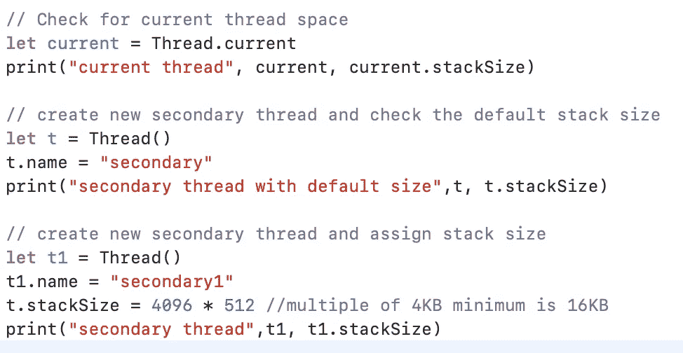

Pint main and secondary thread stack size

> 您可以使用`stackSize`在线程开始前设置默认堆栈大小。该值必须以字节为单位，并且是 4KB 的倍数。在线程启动后设置堆栈大小会改变属性大小

***什么是主线？***

每个进程至少有一个线程。在 iOS 中，启动进程的主线程通常被称为主线程


is used to check current running thread is main thread or not

## 手动创建和管理线程:

这就让开发人员来管理所有的并发性。开发者需要创建和管理线程。

您可以通过两种方式创建线程

1.  我们可以如下创建线程实例:使用下面的方法，线程将立即开始执行。

```
Thread.detachNewThreadSelector(<Selector, toTarget: , with:>)
```

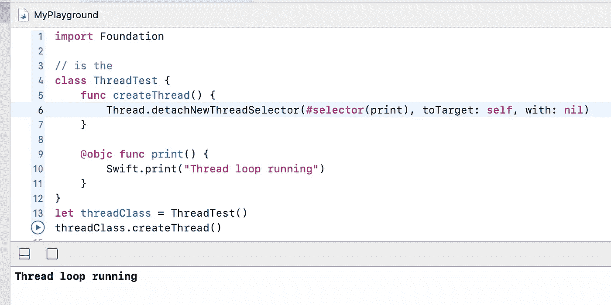

2.可以使用 init()方法创建线程，如下所示:如果你只是初始化线程，那么它不会像上面那样立即执行代码。需要显式调用 thread.start()方法来执行。

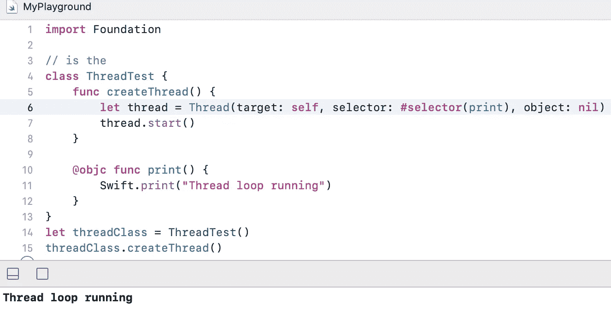

我们甚至可以打电话。cancel()为了取消执行，执行(Selector，with:，afterDelay: TimeInterval，inModes: [RunLoop。模式]]延迟后执行动作。

`***Disadvantages of above method to create threads:***`

1.  开发人员负责创建新线程，并随着系统条件的变化动态调整线程数量
2.  小心管理它们，一旦它们完成执行，就从内存中释放它们
3.  利用同步机制(如互斥、锁、信号量)来协调线程之间的资源访问，这甚至会增加应用程序代码的开销
4.  线程管理不当可能会导致应用程序内存泄漏
5.  默认情况下，我们创建的线程没有自动释放池，维护执行顺序很困难

为了解决这些问题，我们有下一个方法来使用 GCD(大中央调度)创建线程:

## **GCD(大中央调度):**

GCD 是线程管理代码的抽象，使处理线程变得更加容易和高效。它将所有线程创建和管理工作下移到系统级。

它为开发人员提供了一个便于任务调度的 API。哪个线程用于执行任务是由 Grand Central Dispatch 处理的，而不是开发人员，并在适当的调度队列上执行它们。

`***What is Dispatch queue?***` 是队列顶部的抽象层

GCD 管理一组调度队列。它们通常被称为队列。提交给这些调度队列的工作是在一个线程池上执行的

GCD 负责所有线程的创建、管理和调度。这也有助于跟踪你的应用程序中的线程总数，它不会导致泄漏。

`***What Is a Queue?***` 队列是可以在主线程或后台线程上同步或异步执行的代码块

一旦创建了队列，操作系统就负责管理它，并为 CPU 的任何内核提供处理时间。多个队列得到相应的管理，开发人员不必处理管理问题。

Queues 遵循第一顺序(FIFO)，这意味着首先执行的队列也将首先完成。

`**Dispatch queue can be created as follows:**`


## ***什么是同步(sync)或异步(async)任务？***

`***Synchronous***`基本意思是你可以一次执行一件事，而且你必须完成当前的事，才能继续下一件。`***Asynchronous***`意味着你可以一次执行多件事情，并且你不必为了继续下一件事情而完成当前的事情。

`***what is task?***` 任务可以指任何你想执行的代码块。

***如何实现同步或异步任务？***

这可以通过使用同步或异步队列调用`sync`或`async`方法来实现。这就是我们所说的串行队列或并发队列。

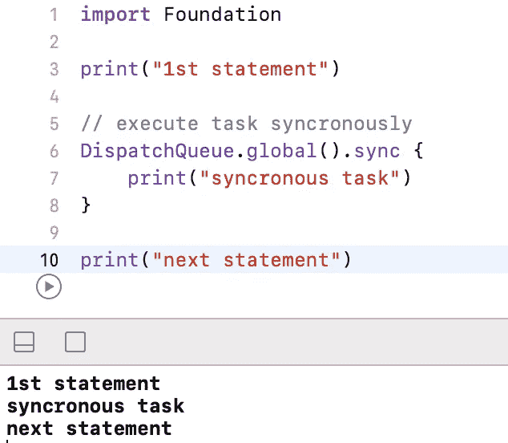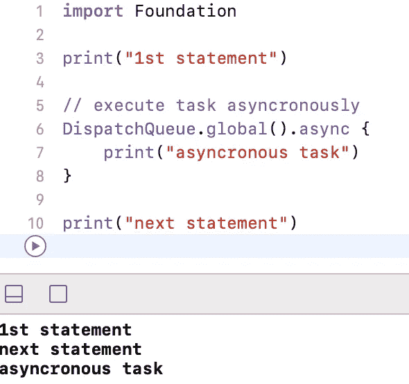

sync and async call with global queues.

`***1\. Serial Queue/Synchronous queue***` **:** 有助于执行同步任务，即一次执行一个任务。

这意味着启动该操作的线程将等待任务完成后再继续。

任务将按照添加的顺序开始，并且总是按照相同的顺序完成

串行队列的`**advantage**`是可预测性，这意味着我们知道哪个任务先执行。

`**disadvantage**`是性能下降。第二个任务需要等到第一个任务执行完毕。

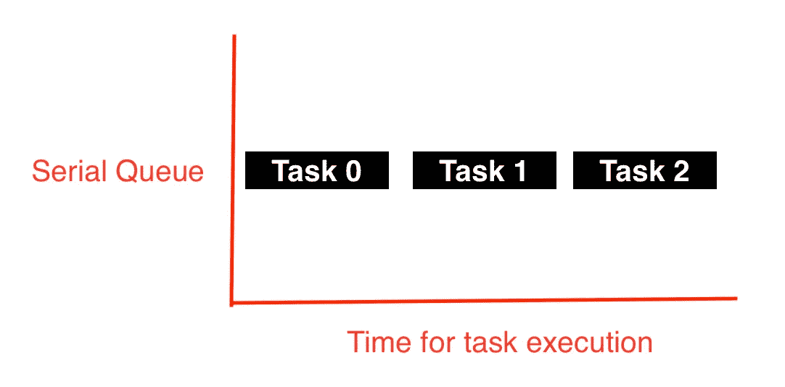

e.g for serial queue

`**2\. Concurrent Queue/Asynchronous queue**`:允许我们一次执行多个任务。

任务将按添加的顺序开始，但可以按任何顺序完成，因为它们可以并行执行。

任务将在由调度队列管理的不同线程上运行。这将在后台完成任务，并在任务完成时通知您。不需要等到任务完成。

并发队列的`**advantage**`是不可预测的

`**disadvantage**`是提高性能。可以在更短时间内执行多个任务。

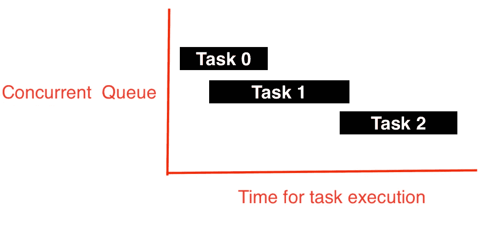

e.g for concurrent queue

## 用哪个？

串行队列利用了 CPU 优化和缓存，有助于减少上下文切换。苹果公司建议在你的应用程序中每个子系统设置一个串行队列——例如一个用于网络，一个用于文件压缩，等等

## ***从广义上讲，GCD 提供了三种队列供您选择:***

1.  主调度队列(串行，预定义)
2.  全局队列(并发，预定义)
3.  私有队列(可以是串行或并发的，您可以创建它们)

**主队列和全局队列:-**

每个应用程序都可以访问一个主队列和几个后台队列。

主队列与主线程相关联。那是什么意思？安排在主队列上的工作保证在主线程上执行。

Grand Central Dispatch 还管理许多在后台线程池中执行工作的并发队列。这些调度队列也称为全局队列。


This code will run on main thread

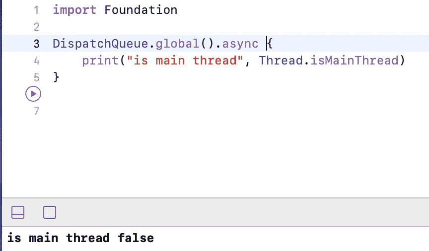

This code executes on global queues

默认情况下，全局队列是并发的，通过`sync`和`async`方法执行代码

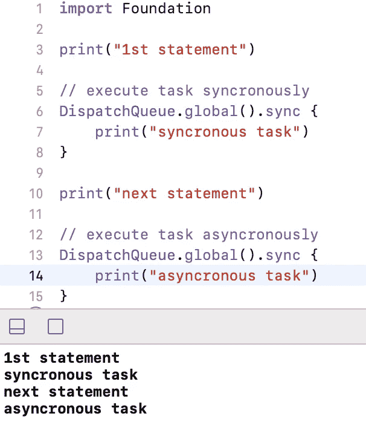

**私有队列(可以是串行或并发的，您可以创建它们):-**

您可以使用`sync`或`async`任务创建自己的`serial`或`concurrent`调度队列，如下所示:

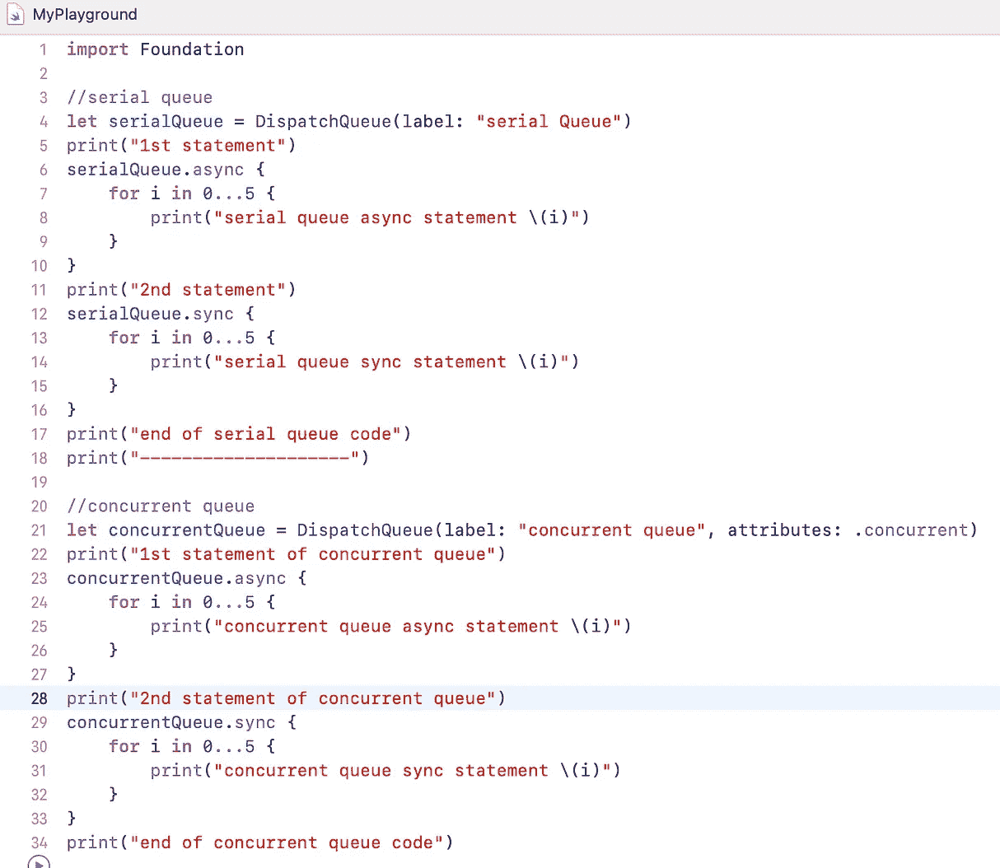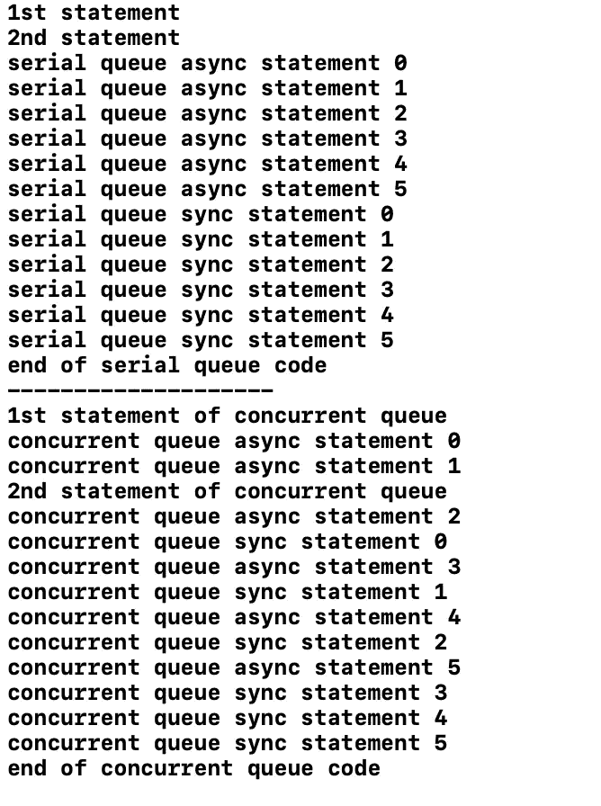

1\. code 2\. output

*   `**async — concurrent**`:代码在后台线程上运行。控制立即返回到主线程。它不会阻止对 UI 的任何更新。该块不能假设它是该队列中唯一运行的块
*   `**sync — concurrent**`:代码在后台线程上运行，但是主线程等待它完成，阻止对 UI 的任何更新。该块不能假设它是该队列中唯一运行的块。

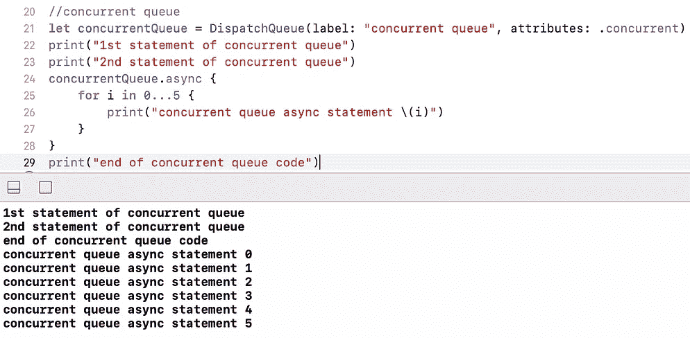

concurrent sync and async

*   `**async — serial**`:代码在后台线程上运行。控制立即返回到主线程。它不会阻止对 UI 的任何更新。该块可以假设它是该队列中唯一运行的块
*   代码在一个后台线程上运行，但是主线程等待它完成，阻塞了对 UI 的任何更新。该块可以假设它是该队列中唯一运行的块。

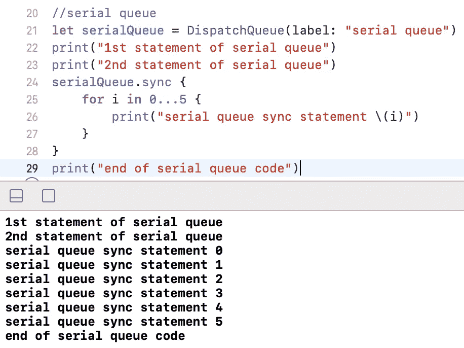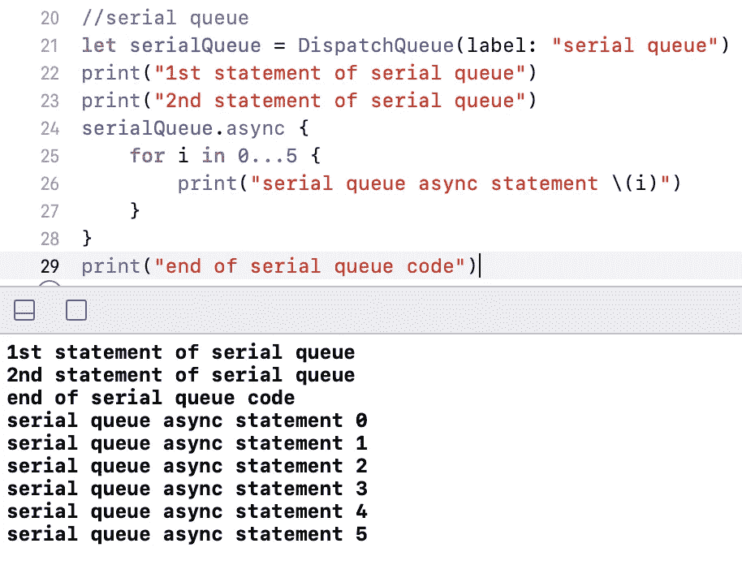

serial sync and async

`**You can also create private queue as follows:-**`


**参数:-**

***标签:*** 定义队列的名称。它有助于识别调试工具中的队列，如仪器、崩溃报告。建议我们使用反向 DNS 命名约定


***qos(服务质量)*** :该值决定系统调度任务执行的优先级。类型包括用户交互、用户启动、实用程序和后台。优先级越高，分配给该队列的资源就越多。

1.  `***User-interactive:-***`

*   这表示为了提供良好的用户体验，需要立即完成的任务。
*   将其用于需要低延迟的 UI 更新、事件处理和小型工作负载。
*   在应用程序执行期间，该类中完成的总工作量应该很小。
*   这应该在主线程上运行。

2.`***User-initiated:-***`

*   表示从用户界面启动并可以异步执行的任务
*   它应该在用户等待即时结果的时候使用，并且用于需要继续用户交互的任务。
*   这将被映射到高优先级全局队列中。

3.`***Utility:-***`

*   这表示长时间运行的任务，通常带有用户可见的进度指示器
*   将它用于计算、I/O、网络、连续数据馈送
*   本课程旨在节能。
*   这将被映射到低优先级全局队列中。

4.`***Background:-***`

*   这代表用户没有直接意识到的任务。
*   将其用于预取、维护和其他不需要用户交互的任务
*   这将被映射到后台优先级全局队列中。

5.`***Default:-***`

*   此 QoS 的优先级介于用户启动和实用程序之间。
*   没有分配 QoS 信息的工作被视为默认工作，GCD 全局队列在此级别运行。

6.`***Unspecified:-***`

*   这表示缺少 QoS 信息


> `*background*` *的优先级最低，而* `*userInteractive*` *的 qos 最高*


mapping priority with qos class

> 最高优先级的 qos 任务首先完成，然后最低 qos 任务完成其执行。

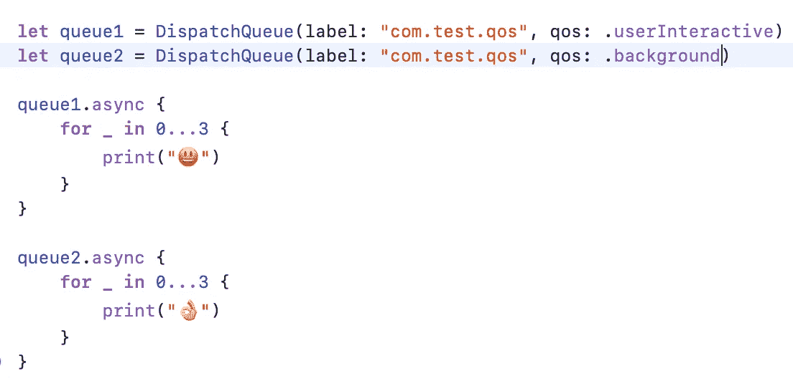

与用户交互 qos 相比，后台 qos 具有最低优先级，因此用户交互块首先完成执行，然后完成后台任务。

***属性:*** 它包括`concurrent attribute`来创建一个并发执行任务的调度队列，或者它的值为`initiallyInactive`，表示队列最初是不活动的。一旦`active()`被调用，它将被激活。

如果此参数为零，将创建一个串行队列。


two option in attributes

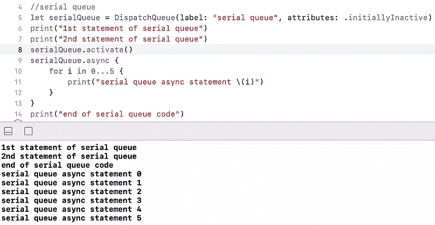

1\. queue is not active 2\. queue is active

> 主线程的 qos 始终是用户交互的，您可以如下设置全局队列的优先级


***自动释放频率:*** 自动释放由队列调度的块创建的对象的频率。


> `DispatchQueue.AutoreleaseFrequency.never`不设置自动释放池并不意味着`autorelease`对象永远不会被释放，因为 GCD 依赖于拥有自己`autorelease pool`的线程，但它仍然是不确定的。这是全局队列的默认值
> 
> 注意:当您使用 Objective-C 对象调度闭包时，如果您看到与 GCD 使用相关的内存峰值，您可能希望显式添加一个`autorelease pool`。

使用`autorelease pool`确实会增加一些开销，并且分配/释放大对象可能会对性能产生重大影响，这就是为什么一次释放所有`autoreleased`对象比一个接一个地释放更有益，但这取决于用例。

***目标:*** 执行块的目标队列。调度队列的优先级继承自其目标队列。

它有三种类型

1.  `**.main**`:。main 将在主线程上运行。主线程主要用于 UI 工作。该队列具有最高优先级。
2.  `**.global()**` **:** 主要用于其他与 UI 无关的工作。全局队列有三个低优先级，默认为&高。该队列具有第二高的优先级，有 3 种不同的类型。
3.  `**nil**` **:** nil 是最低优先级，将低于任何全局队列。它没有优先级，只是需要完成。

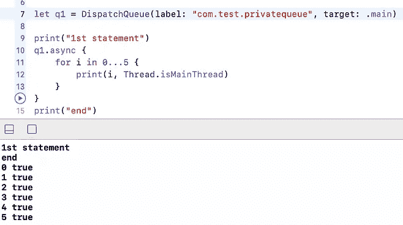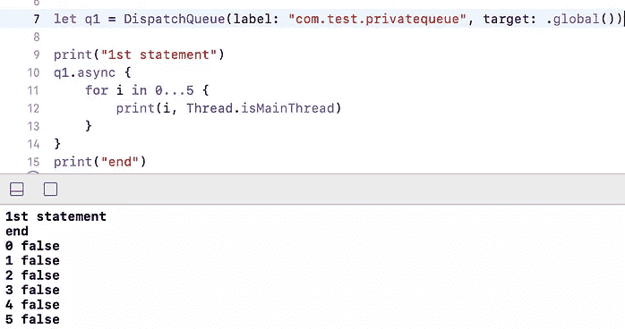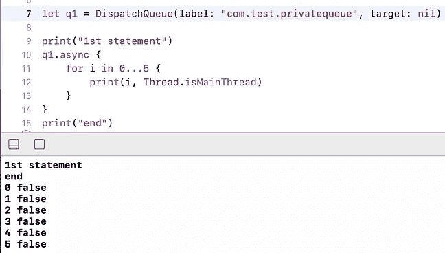

***目标队列用途:***

1.  如果您将自定义队列的目标设置为低优先级全局队列，则自定义队列上的所有工作将以低优先级执行，高优先级全局队列也是如此。
2.  将自定义队列定位到主队列。这将执行提交给该块的所有代码块，这些代码块将在主线程上执行。
3.  将自定义队列定位到其他自定义队列。它将创建一组队列和多个彼此序列化的队列。通过挂起/恢复它们的目标队列，有助于同时挂起和恢复。

## **GCD 的优势:**

*   最高的抽象。为开发人员提供轻量级的 API 来处理多线程。
*   GCD 负责所有线程的创建、管理和调度。
*   这也有助于跟踪应用程序中的线程总数
*   它不会引起泄漏。
*   开箱即用的队列有两种:`main`和`global`。
*   可以创建更多的队列(使用`DispatchQueue`)。
*   可以请求独占访问(使用`dispatch_barrier_sync`和`dispatch_barrier_async`)。
*   最大线程池大小的限制大约是 66(最大 GCD 线程池大小)+主线程+一些其他随机的非 GCD 线程。

## GCD 的缺点:

1.  如果操作在队列中或正在运行时不能停止，则不能取消该操作
2.  您不能暂停正在排队的操作
3.  您无法找到队列中有多少挂起的操作。
4.  您不能定义并发操作的最大数量。

# 注意:

*   **有关 DispatchWorkItem、DispatchGroup、DispatchBarrier、DispatchSemaphore、DispatchSources 的更多信息，请阅读第 2 部分** [**博客**](https://manasaprema04.medium.com/multithreading-in-ios-part-2-3-fe0116ffee5)
*   **关于 NSOperation 的更多信息请阅读 part-3** [**博客这里:**](https://manasaprema04.medium.com/threads-in-ios-part-2-c4f44e885f5f)
*   [**参考博客了解面试问题，了解多线程问题**](https://manasaprema04.medium.com/27632d180f39)

享受你的编码。 **我希望你能从这篇博客**中学到一些东西。**请** ***点击下面的鼓掌按钮👏去帮助别人找到它！。跟我上*** [***中***](/@manasaprema04) ***。***