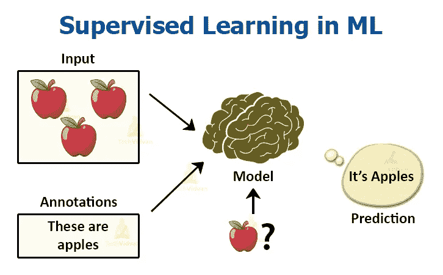
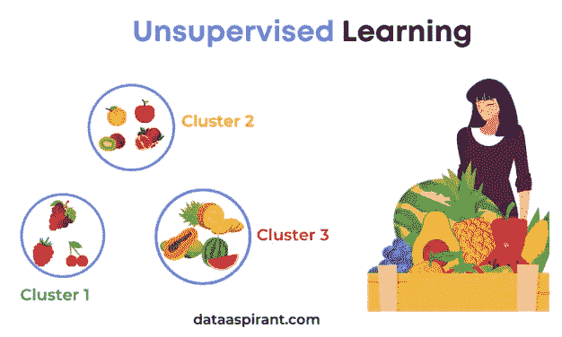

# 机器学习的三个主要类别及用法示例。

> 原文：<https://medium.com/geekculture/three-main-categories-of-machine-learning-with-examples-of-usage-41e2d136c66f?source=collection_archive---------12----------------------->

机器学习是人工智能的一个子集，主要关注他们的经验，并基于这些经验进行预测。这背后的主要概念是研究如何构建展示这种迭代改进的应用程序。

有许多方法来构建这个想法，但主要有三个主要的公认类别。

# **1。监督学习**

监督学习是最基本的机器学习类型之一，它是在标记数据上训练的。在训练结束时，算法会找到给定参数之间的关系。在适当的情况下，监督学习非常有效。

这是一种学习机制，模型是用已经可用的正确数据集来训练的。我们从已经标记为输入和输出的训练数据集开始。模型明确地知道要识别什么。该模型正在训练，直到它能够识别我们提供的类似数据。用于检测输入数据集中的模式和相似性。在这种模式中，人为干预的程度相当高。

主要有两种类型的监督学习问题，即分类和回归。在分类中，数据被分类到不同的标签中。在回归中，它表示连续量的预测。分类的一个例子是将电子邮件标记为垃圾邮件或非垃圾邮件。一个回归的例子是湿度随温度变化的预测。线性回归、逻辑回归、K 近邻、随机森林是监督学习中使用的算法的例子。监督学习广泛用于风险评估和销售预测。

**人脸识别**:脸书使用监督学习算法来识别人脸，删除编造的账户。拥有一个可以拍照、搜索人脸、想象照片中的人(标记)的系统是一个受监督的过程

**垃圾邮件分类**:现代电子邮件系统遇到了垃圾邮件过滤器。垃圾邮件过滤器是一个监督学习系统。这些系统用于过滤掉恶意电子邮件，因为用户不会受到它们的骚扰，并提供来自电子邮件系统的标签(垃圾邮件/非垃圾邮件)。

# **2。** **无监督学习**

无监督学习与监督学习完全相反。它从数据集中推断模式，而不参考已知或标记的结果，并提供大量数据，并提供理解数据属性的工具

我们将未标记或未标记的行数据作为输入，并获得有意义的输出数据。这种技术类似于人类思维对事物进行分类的方式，因此被称为人工智能。人类的干预是最小的。模型必须学会在观察之前绘制数据集。

主要有两种类型的无监督学习问题，即聚类和关联。在聚类中，数据按照用户的使用模式进行分组，以便进行有针对性的营销。在关联中，它识别数据中的隐藏模式，并使用它们来生成预测。聚类的一个例子是由某个电信提供商识别人们的互联网和蜂窝使用，并将他们分组为不同的优先级类型，并向他们中的每一个提供最佳的促销。

关联的一个例子是超市中的客户产品购买模式识别，其中经常同时识别两种商品并将其放在货架上，因此客户可以轻松地将它们放入购物车，而无需经过不同的货架。k-均值、C-均值是在无监督学习中使用的算法的例子。无监督学习广泛用于推荐系统和检测异常。

**对用户日志进行分组**:无监督学习的优势在于能够对用户日志和问题进行分组。这可以帮助企业识别客户的关键问题，并通过改进产品或开发常见问题解答来解决常见问题。

**推荐系统**:视频推荐系统已经被 YouTube 或网飞满足。这些系统通常放置在无人看管的地方。也许我们只知道它的持续时间，它的类型，等等。推荐系统可以看到我们之前观看的数据中的关系，并及时提出建议。

# **3。** **强化学习**

[强化学习](https://it.toolbox.com/article/openais-robot-learns-to-solve-a-rubiks-cube-with-one-hand-peter-welinder-research-lead-openai-shares-insights)直接受到人们在生活中如何从数据中学习的启发。它的特点是一种算法，可以自我改进，并使用试错法从新的情况中学习。

> “在不使用预定义数据集的情况下，模型可以从错误中学习”

是能给出的最简单的术语。这意味着我们将模型暴露在未知的环境中，让它做事情。对于它所做的积极的事情，我们给它积极的分数，对于它所做的错误，我们给它消极的分数。这个模型在许多体育活动中更有用。

强化问题分类主要有三种类型，即基于策略、基于价值和基于模型。一种基于策略的方法，观察代理在特定环境中的行为。在基于价值的方法模型中，它观察代理在特定环境中采取的不同行动，以及这些行动是好是坏。在基于模型的方法中，它观察代理如何在特定环境中学习。Q 学习、深度 Q 学习、策略梯度是在强化学习中使用的算法的例子。强化学习广泛应用于训练代理人玩游戏。

**电子游戏**:强化学习最常见的地方之一就是学习玩游戏。看看谷歌的强化学习应用，Alpha Zero，还有 AlphaGo 哪个学会了下围棋。马里奥就是一个常见的例子。

**资源管理**:强化学习是驾驭复杂环境的好方法，它可以处理平衡某些需求的必要性。谷歌的数据中心使用强化学习来平衡满足电力需求的需要。

# 一会儿见…👏