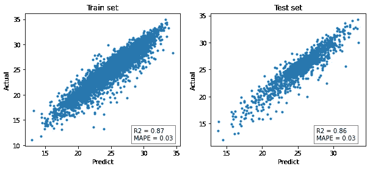
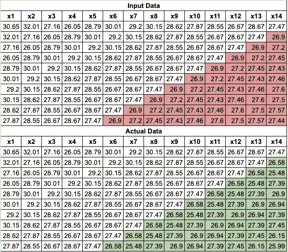

# 使用普通机器学习算法的时间序列预测

> 原文：<https://medium.com/geekculture/time-series-forecasting-using-ordinary-machine-learning-algorithms-b6d6d63c1e86?source=collection_archive---------9----------------------->

# 介绍

时间序列数据有一个非常独特的特征。时间相关性、趋势、季节性和自相关性是使时间序列与其他类型的数据如此不同的众多因素中的几个。因此，处理时间序列通常需要特殊的技术和算法。来自深度学习领域的自回归模型家族、递归神经网络(RNN)及其子代(LSTM 和 GRU)的 ARIMA 和萨里玛。这些都是专门为时序问题设计的。

然而，这些模型带来了额外的复杂性，有时这是不可取的，尤其是当您在一个不仅关注准确性，还关注资源和可解释性的行业中工作时。普通的机器学习模型有可能解决时间序列问题吗？如果不是，会有多糟糕？

在这篇文章中，我们将回答这些问题。我们开始吧！！！

# 问题定义

我们在这个实验中要用到的问题是时间序列预测。预测是时间序列数据最常见的机器学习任务，包括根据历史数据训练模型，并使用它来预测未来值。

## 数据

这项研究的数据来自 NASA 兰利研究中心的每日温度。数据集包含从 2000 年 1 月 1 日到 2021 年 9 月 10 日的每日温度记录。数据看起来是这样的:

Daily temperature data since 2000.

数据被分成训练集和测试集。训练集包含从 2000 年 1 月 1 日到 2018 年 12 月 31 日的数据，而测试集数据从 2019 年 1 月 1 日开始。

## 模型、输入和输出

我们要建立的模型是基于这样一个假设，即过去的观测值和未来的观测值之间存在线性关系(如果你熟悉自回归模型，这就是同一个假设)。简而言之，该模型使用过去(本例中为 14 天)的每日温度来预测未来的每日温度。这个模型在数学上是这样的:

为了训练这个模型，我们必须将数据转换成以下格式:

# 建模

既然我们已经对问题以及输入和输出的格式有了清晰的定义。我们可以开始建立一个模型。

## 相关分析

在训练模型之前，可视化特征和目标之间的相关性总是一个好主意。这是我们的训练集的相关矩阵的样子。

目标值和所有特征之间存在正相关。另外，观察越接近目标，就天数而言，相关性越强。看来我们关于线性关系的假设是有效的。此外，这表明我们应该没有问题拟合我们的模型。

## 模型性能

由于相关性分析显示了很强的线性关系，我们对数据进行了线性回归，结果如下所示:

看起来很有希望。这两个评估指标在两个集合上都是好的和相等的。所以，让我们来预测未来的温度。

Linear Regression forecasting result

嗯，结果看起来很糟糕。另外，在最初的几个步骤之后，模型基本上一遍又一遍地输出相同的值。相关性高，准确度也高，误差相当低。怎么了?

## 误差分析

为了调查，我们需要猜测根本原因是什么。学习算法不太可能是问题，因为考虑到准确性和误差指标，它做得很好。所以，第一个猜测是我们的数据有问题。让我们检查前 10 个样本，并与相应时期的实际数据进行比较。

Predictions vs Actual

好了，现在我们知道是怎么回事了。我们使用以前的观察作为特征，输出作为第二天的输入馈送给模型。由于预测有误差，它影响下一个预测，从而损害下一个预测，以此类推。

这违反了 [*IID*](https://en.wikipedia.org/wiki/Independent_and_identically_distributed_random_variables#:~:text=Identically%20Distributed%20means%20that%20there,each%20other%20in%20any%20way.) 假设，即每个样本的误差应该是相互独立的。在训练环境中，所有的输入都是精确的。但是当模型被部署时，输入是有缺陷的，所以它完全失败了。

## 新方法

在之前的实验中，由于累积误差，滞后特征无法预测每日温度。所以，我们需要想出没有同样问题的新功能。但是，除了每日温度，数据集只有*时间戳*。能有多大用处？

事实证明这可能有用。仔细观察每日气温图，很明显，有一个周期。气温在年初持续上升，直到第四个月，然后开始下降。此外，循环的长度大致相等，如下图所示。

假设，如果我们可以定位时间戳在循环中的位置，它可以粗略地指示温度。因此，我们将时间戳转换成具有本地化功能的特征，例如年中的某一天、年中的某一月和月中的某一天。

Timestamp features

特征和目标之间的关系明显是非线性的，因此，选择随机森林(具有 50 个估计量)作为回归量。训练之后，这是预测的样子。

RandomForest forecasting result

好的，看起来比上一次的尝试要好。预测比线性回归模型更接近实际。

让我们来衡量一下预测有多准确。我们从之前的实验中了解到，一步预测的准确性并不能反映模型在长期内的表现。因此，我们将使用新的指标—整个预测期的平均绝对误差(MAE)、均方误差(MSE)和平均绝对百分比误差(MAPE)。

该模型的平均误差为每天 1.53 度，MSE 为 4.34。此外，可以注意到误差不是均匀分布的，而是集中在日温度波动很大的时期。

# 结论

实验表明，像 RandomForest 这样的通用机器学习算法在时间序列问题上的表现并不差。事实上，考虑到其简单性，该模型可能是时序数据的一个不错的选择，特别是在资源或透明度是一个问题的情况下。