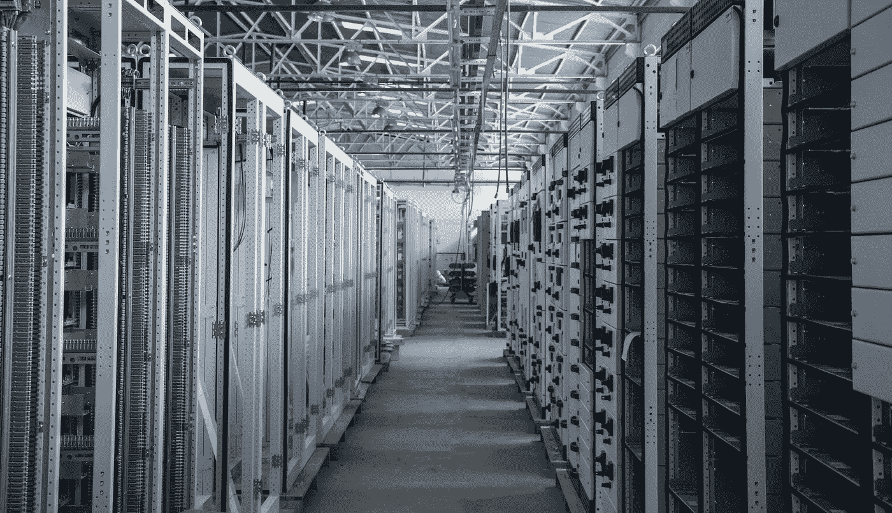

# 拥有，还是不拥有

> 原文：<https://medium.com/geekculture/to-own-or-not-to-own-831116c5f04e?source=collection_archive---------54----------------------->

我认为云计算是这十年的一个主要流行词。现在，将 AWS 或 GCP 经验视为一份工作的必要条件非常普遍。

毫无疑问，这并不奇怪——如今每个人都在部署云。让我们更深入地了解一下云，从公共云部署的利与弊开始。

让我们试着乐观一点，从公共云产品的优势开始。这将很容易，因为专业人士真的很大，可以立即看到。但是让我们列举几个。

**快速设置**

一旦你开始一个项目，只需要点击几下鼠标就可以为它建立基础设施，这真是难以置信！使用 Docker 或 Kubernetes，您可以在不到一分钟的时间内部署您的应用程序。这无疑是公共云的一个主要卖点，因为如果您打算购买自己的硬件，通常需要长达 4 周的时间才能将新的闪亮服务器交付到您的 DC。

**便宜开始**

为概念验证或 MVP 设置基础架构并不需要很多钱。这里有几个 CPU 内核，那里有几千兆字节——您的应用程序运行在真正的分布式环境中。你需要做的只是准备一张 10 美元的信用卡。如果与典型的中级 1U 服务器 4500 美元的价格相比，这是相当可观的。

**不需要额外的员工**

如果你不拥有硬件，你也不必维护它。所以你不需要雇佣所有的人员来维持硬件的运转。如果你的团队真的了解 DevOps(这不是你团队中某个人的头衔),你会没事的。

每个硬币至少都有两面，公共云产品也是如此。然而，这也有一定的不对称性:如果在你开始使用它们之前很久，优点就能马上被看到，缺点有时就不会那么明显。

**供应商锁定。**

廉价的块存储。特定于供应商的数据库系统。容器编排系统。机器学习管道。

每当您集成某些专有基础架构组件时，您还会受到另一条束缚。如果您的项目严重依赖于某个特定的功能才可行，或者从某个给定的专有组件进行迁移所需的工作量太大，那么您就会受到所选平台的物理限制。

供应商锁定从来都不是一件好事，这你是知道的。API 可能会改变。法律政策可能会改变。价格可能会改变。一切都可能在一夜之间改变，如果你已经被锁定，你将不得不接受他们为你带来的任何改变。否则你会被挤出这个行业。

**每美元的绩效。**

主要的云基础设施供应商通常倾向于销售虚拟 CPU 核心。听起来很简单，但严酷的事实也很简单:内核做得不够。比方说，一家供应商在其“CPU 优化”虚拟机中提供的英特尔至强 E5–2650 v4 是 2016 年推出的 CPU。五年前。

所以，你将会为一台 5 年前的机器的性能支付一大笔钱。如果与采用现代 CPU 内核的现代计算机相比，性能将会下降 2 倍，因为英特尔和 AMD 通常会宣布 15–25%的年同比性能提升。更不用说现代服务器中使用的更快的内存了。因此，如果您的计算绑定 API 请求在公共云中平均需要 200 毫秒，那么在私有硬件上只需要 100 毫秒。或者，您可以使用相同数量的内核处理两倍多的请求。

**平台限制。**

云似乎是无限的。事实上，这只是一个乏味的数据中心，充斥着老式的机架式服务器。数据中心的服务器数量有限。所以一个人可以租用多少硬件资源是有物理限制的。硬件选项也有限制。你可以很容易地在你拥有或租用的普通 DC 中携带任何你需要的硬件，只要它符合电力和安全要求，但它几乎无法与主要的云平台一起工作。

另外，只要在网上搜索“配额增加 _ 平台名称 _”的客户反馈，看看一旦你的项目突然启动，你迫切需要额外的资源，情况会有多糟糕。

谈到基础架构，没有什么灵丹妙药，无论是公共云还是私有云都不应被视为一体。在项目的不同阶段，完全不同的基础设施方法可能是有益的。就我个人而言，无论我从事什么工作，我都尽量将移动性作为核心要求。如果将项目的某个部分或者整个项目转移到私有硬件上是有意义的，那么这种转移在技术上必须是可行的。反之亦然——如果使用公共云更便宜——项目设计中不应该阻止这种情况。多亏了 Docker 和 Kubernetes，现在比 10 年或 15 年前容易多了。

从第 0 天开始为改变做计划:以一种能够保持移动性的方式设计您的系统。此外，即使在高利润的企业中，成本也很重要，如果迁移到公共云或从公共云迁移可以改善您的成本结构，请提前考虑这一点。

还有一点要记住:云只是你租用的别人的电脑。