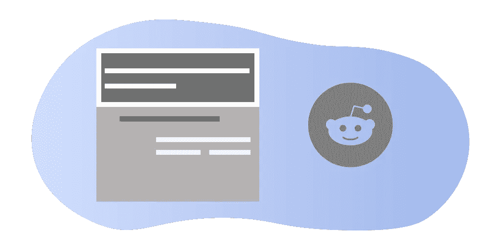

# 十大系统设计面试问题

> 原文：<https://medium.com/geekculture/top-10-system-design-interview-questions-10f7b5ea123d?source=collection_archive---------3----------------------->

Image Source: Author

*原文由 Educative 联合创始人法希姆·哈克撰写*

在我作为微软和脸书的高级软件工程师和面试官的 10 年里，我和**数百名应聘者**一起工作过，他们解决了不同的系统设计问题。

开发人员倾向于与 SDI 问题作斗争，因为它们是如此开放，并且通常需要一种批判性思维，而这种思维在其他编码面试挑战中是没有的。

虽然 SDI 问题会随着时间的推移而变化，但有些问题在各大公司的面试中仍然很受欢迎。

今天，我们将探讨**十大**最常被问到的系统设计面试问题、每个问题中你必须解决的常见问题，以及一些帮助你解决这些问题的工具。

**这是我们今天要讲的内容:**

*   任何问题的提示
*   1.设计聊天服务
*   2.设计拼车服务
*   3.设计一个 URL 缩短服务
*   4.设计社交媒体服务
*   5.设计一个社交留言板
*   6.设计文件存储服务
*   7.设计视频流服务
*   8.设计一个 API 速率限制器
*   9.设计一个邻近服务器
*   10.设计一个提前输入的服务
*   接下来学什么

# 任何 SDI 问题的提示

*   **通过陈述你所知道的来开始每一个问题**:列出系统所有需要的特征，你期望这种系统遇到的常见问题，以及你期望系统处理的流量。列出过程让面试官看到你的计划技巧，并在你开始解决问题之前纠正任何可能的误解。
*   **叙述任何权衡**:每个系统设计选择都很重要。在每个决策点，列出该选择的至少一个正面和负面影响。
*   **让你的面试官澄清**:大多数系统设计问题都是故意含糊其辞的。问一些澄清性的问题，向面试官展示你是如何看待这个问题的，以及你对系统需求的了解。
*   **讨论新兴技术**:总结每个问题，概述系统如何以及在哪里可以从**机器学习**中受益。这将表明你不仅为当前的解决方案做好了准备，也为未来的解决方案做好了准备。

Image Source: Author

# 1.设计一个像 Facebook Messenger 或 WhatsApp 这样的全球聊天服务

对于这个问题，您将设计一个允许用户通过互联网相互聊天的服务。对话可以是一对一的，也可以是多人的群聊。只有对话中包含的人才能访问消息。

## 必需的功能

*   信息必须通过互联网发送和接收。
*   服务必须支持一对一和群聊。
*   应该存储消息以供以后查看。
*   用户应该能够发送图片和视频以及文本消息。
*   消息在传输过程中应该加密。
*   消息应该以最小的延迟可见。

## 常见问题

*   如果在没有互联网连接的情况下发送邮件会发生什么？连接恢复时是否发送？
*   如何在不增加延迟的情况下加密和解密消息？
*   用户如何接收通知？
*   消息是从设备中提取(服务器定期提示设备是否正在等待发送消息)还是推送到服务器(设备提示服务器它有消息要发送)？

## 要考虑的工具

*   将数据库模式分成多个表:用户表(包含用户 ID 和联系人)、聊天表(包含聊天 ID 和参与用户 ID 的列表)和消息表(包含对聊天 ID 的引用的过去的消息)。
*   使用 WebSocket 在设备和服务器之间进行双向连接。
*   使用推送通知来通知成员，即使他们离线。

Image Source: Author

# 2.设计一个像优步或 Lyft 这样的拼车服务

这个问题要求您创建一个拼车服务，将用户与附近的司机匹配起来。用户可以输入一个目的地，并发送他们的当前位置，附近的司机会在几秒钟内得到通知。

然后，该应用程序会跟踪司机和用户当前位置之间的路线，然后从用户的位置到目的地。

## 必需的功能

*   该系统必须跟踪所有用户和司机的当前位置。
*   用户和司机在运输途中必须收到最新的行程信息。
*   必须在流程的不同点支持成千上万的用户，并相应地进行扩展。
*   驱动程序和用户都必须持续连接到服务器。

## 常见问题

*   如何在繁忙时期保持低延迟？
*   司机和用户是怎么配对的？迭代所有驱动程序来寻找欧几里德距离是低效的。
*   如果驱动程序或用户失去连接会发生什么？
*   如何存储所有缓存的位置数据？

## 要考虑的工具

*   使用 S2 几何库将位置分割成像元。仅计算与用户在同一单元的驾驶员的距离。
*   使用分布式存储来存储所有用户的位置，每个用户的位置数据大约只有 1Kb。
*   如果位置数据暂停，设备会继续报告其先前的位置，同时等待重新连接。
*   在提示最近的驾驶员出行后留出缓冲区。如果他们拒绝，就去找下一个司机。

Image Source: Author

# 3.设计一个类似 TinyURL 或`bit.ly`的 URL 缩短服务

这个问题要求你创建一个像 TinyURL 或`bit.ly`一样缩短长 URL 的程序。这些程序获取一个长 URL 并生成一个新的唯一的短 URL。他们还可以获取一个缩短的 URL，并返回原始的完整 URL。

## 必需的功能

*   返回一个比原始 URL 短的 URL
*   必须存储原始 URL
*   新生成的 URL 必须能够链接到存储的原件
*   缩短的 URL 应该允许重定向
*   必须支持自定义短网址
*   必须同时支持许多请求

## 常见问题

*   如果两个用户输入相同的自定义 URL 会怎样？
*   如果用户比预期的多怎么办？
*   数据库如何调节存储空间？

## 要考虑的工具

*   使用哈希来链接原始和新的 URL
*   使用 REST API 对高流量进行负载平衡，并处理前端客户端通信
*   使用多线程一次处理多个请求
*   使用 NoSQL 数据库存储原始 URL(存储的 URL 之间没有关系)

Image Source: Author

# 4.设计一个大众社交媒体服务，比如脸书、推特或 Instagram

对于这个问题，你将设计一个像 Instagram 这样被我的十万用户使用的社交媒体服务。用户应该能够查看由跟踪用户发布的新闻提要，并建议用户可能喜欢的新内容。

面试官通常想听你深入讨论新闻提要。

## 必需的功能

*   强大的新闻馈送和推荐系统
*   用户可以发表公开帖子
*   其他用户可以评论或喜欢帖子
*   必须舒适地同时容纳许多用户
*   系统必须高度可用

## 常见问题

*   知名用户会有数百万的关注者，相对于标准用户，他们是如何被处理的？
*   系统如何按年龄给帖子加权？旧帖子比新帖子更不容易被浏览。
*   `read`和`write`聚焦节点的比例是多少？可能会有更多的读请求(用户查看帖子)或写请求(用户创建帖子)吗？
*   如何提高可用性？系统如何更新？如果一个节点出现故障，会发生什么？
*   你如何有效地存储帖子和图片？

## 要考虑的工具

*   使用滚动更新和副本节点来最大限度地提高可用性。
*   使用经过训练的机器学习算法来推荐帖子。
*   创建一个分别存储名人和用户的数据库模式。
*   使用社交图来进一步追踪追随习惯

Image Source: Author

# 5.设计一个社交网络和留言板服务，比如 Quora、Reddit 或 HackerNews

对于这个问题，您将设计一个类似论坛的系统，用户可以在其中发布问题和链接。

其他用户可以查看问题并发表评论。问题有代表其主题的标签，用户可以跟随标签来查看关于特定主题的问题。用户有一个新闻提要，突出显示他们关注的标签和相关主题中的热门问题。

## 必需的功能

*   用户必须能够创建公共职位和应用标签
*   帖子必须按标签排序
*   其他用户必须能够实时发表评论。
*   该数据库必须存储每个职位的数据(视图，upvotes 等)。)
*   新闻订阅源必须显示来自被关注标签的帖子和来自用户喜欢的其他标签的帖子。
*   必须支持高流量的观众和新职位。

## 常见问题

*   我们的产品只需要在网络上工作吗？
*   用户上传的图片/链接存储在哪里？
*   系统将如何确定相关标签？订阅源中显示了多少来自未关注标签的帖子？
*   帖子是如何在服务器网络中分发的？

## 要考虑的工具

*   使用 SQL 数据库映射关系数据(用户有帖子，帖子有评论/喜欢，类别有相关帖子，等等。)
*   使用多线程和负载平衡器层来帮助支持更高的流量。
*   使用分片来打破系统。考虑按类别分片，在一台机器上存储相同标签的帖子。
*   使用机器学习和自然语言处理来寻找标签之间关系的相关性

Image Source: Author

# 6.设计一个全球性的文件存储和共享服务，如 Dropbox、Google Drive 或 Google Photos

对于这个问题，您将创建一个同步的、跨平台的存储系统，比如 Dropbox。用户可以存储文件和照片，并从其他设备访问它们。

## 必需的功能

*   用户应该能够通过网络保存/删除/更新/共享文件
*   应该保存旧版本的文档以便回滚
*   文件更新应该在多个设备之间同步

## 常见问题

*   文件存储在哪里？
*   你如何处理更新？你会重新上传整个文件吗？
*   小更新需要完整的文件更新吗？
*   系统如何处理两个用户同时更新一个文档？

## 要考虑的工具

*   使用分块将文件分成多个部分。更新只是重新上传部分，而不是整个文件。
*   使用像亚马逊 S3 这样的云存储来处理内部数据库。
*   让客户端不断检查服务器，以确保应用并发更新。

Image Source: Author

# 7.设计一个像 YouTube 或网飞这样的全球视频流服务

这个问题要求你创建一个像 YouTube 一样的在线视频流服务。这项服务将存储和传输数百 Pb 的视频数据。它还必须存储统计数据(查看，喜欢，查看次数等)。)并允许用户发表评论。

您的解决方案必须可伸缩，以支持成千上万的并发用户。

## 必需的功能

*   视频应该可以上传到网上
*   用户应该可以通过互联网接收到不间断的数据流
*   应该为每个视频存储和访问视频统计数据。
*   评论必须保存并与视频一起显示给其他评论
*   应该支持几千个用户的高流量

## 常见问题

*   您的服务将如何确保各种互联网质量下的流畅视频流？
*   您的服务如何应对流速度的突然下降(缓冲、质量下降等)。)?
*   视频是如何存储的？

## 要考虑的工具

*   使用云技术存储和传输视频数据。
*   使用机器学习来建议新的视频内容。
*   防止延迟的不一致连接的中断。用户查看的是几分钟前的数据，而不是新来的数据。

Image Source: Author

# 8.为 Firebase 或 Github 等网站设计一个 API 速率限制器

对于这个问题，您将创建一个 API 速率限制器来限制服务在给定时间段内可以接收的 API 调用的数量，以避免过载。

面试官可以在不同的规模上问这个问题，从单台机器到整个分布式网络。

## 必需的功能

*   设备被限制为每小时 10 个请求
*   如果用户的请求被阻止，限制器必须通知用户。
*   必须处理适合其规模的流量。

## 常见问题

*   您的系统如何衡量每小时的请求数？如果用户在 1:20 发出了 10 个请求，然后在 2:10 又发出了 10 个请求，那么他们在同一个 1 小时窗口内发出了 20 个请求，尽管时间发生了变化。
*   分布式系统的设计与本地系统有何不同？

## 要考虑的工具

*   使用滑动时间窗口来避免每小时重置。
*   保存一个计数器整数而不是请求本身，以节省空间。

Image Source: Author

# 9.设计一个类似 Yelp 或附近的地方/朋友的邻近服务器

对于最后一个问题，您将设计一个邻近服务器来存储和报告到像餐馆这样的地方的距离。用户可以根据距离或人气搜索附近的地方。该数据库必须存储全球 5 亿个地方的数据，但具有低延迟。

## 必需的功能

*   存储多达 5 亿个位置。
*   位置必须唯一标识，并有相应的数据，如质量审查和服务时间。
*   搜索必须以最小的延迟返回结果。
*   用户必须能够按距离或质量搜索结果。

## 常见问题

*   你是如何存储这么多位置数据的？
*   如何实现快速搜索结果？
*   你的系统如何处理不同的人口密度？严格的纬度/经度网格将导致基于密度的不同响应。
*   我们如何优化经常搜索的位置？

## 要考虑的工具

*   使用关系数据库存储位置列表和相关数据。
*   使用缓存来存储最受欢迎的位置的数据。
*   使用分片按区域分割数据。
*   在特定的动态网格中搜索位置。如果一个单元格中有超过 500 个位置，则将格网分割成 4 个较小的单元格。重复，直到你只需要搜索不到 500 个位置。

Image Source: Author

# 10.设计一个搜索引擎相关的服务，如提前输入

此服务将部分完成搜索查询，并显示 5 条建议来完成查询。它应该实时适应高搜索内容，并向其他用户建议。

例如，“海鹰赢得超级碗”将在事件发生的几分钟内被建议。

## 必需的功能

*   该服务应该将部分查询与流行查询相匹配。
*   小的拼写错误应该被改正，例如“dgo → dog”
*   应该根据查询猜测 5 个最可能的选项
*   结果应该随着查询的编写而更新

## 常见问题

*   你纠正拼写错误的力度有多大？
*   如何在不导致延迟的情况下更新选择？
*   如何确定最有可能完成的查询？它适应用户的搜索吗？
*   如果用户打字非常快会发生什么？建议只有在完成后才会出现吗？

## 要考虑的工具

*   使用自然语言处理机器学习算法来预测下一个字符。
*   使用马尔可夫链来排列顶部查询的概率。
*   每小时或每天更新 ML 算法，而不是实时更新，以减轻负担。

# 接下来学什么

这些问题可以帮助你理解在系统设计面试中你应该解决什么类型的问题。练习解决和解释这样的问题是准备下一次面试最有效的方法。

*快乐学习！*