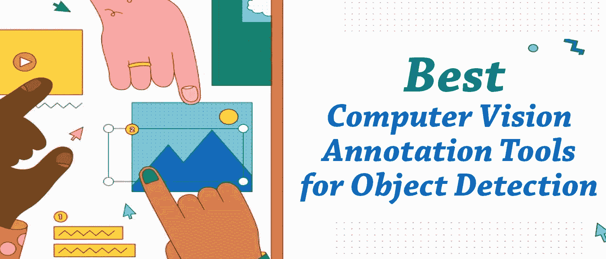

# 用于物体检测的五大计算机视觉注释工具

> 原文：<https://medium.com/geekculture/top-5-computer-vision-annotation-tools-for-object-detection-922aa910348b?source=collection_archive---------9----------------------->

Image Credit: [Cogito Tech](https://www.cogitotech.com/)

计算机视觉是人工智能的一个分支，专注于教会机器如何正确地解释来自图像、视频帧和其他来源的数据。

为了利用现代计算机视觉技术，我们通常需要使用[带注释的数据](https://www.cogitotech.com/services/live-annotation)来监控深度学习模型。如果我们想利用[计算机视觉技术](https://www.cogitotech.com/computer-vision-training-data)比如在新的数据集上进行物体检测来识别我们独特的物品，我们需要收集包含这些东西的特定实例的照片，并给它们贴上标签。

# 1.标签

Labellmg 是一个开源的图像处理和标注工具。它是用 Python 编写的，具有基于 QT 的图形用户界面。

这是一种简单而免费的给照片加标签的方法。获取 LabelImg 的最简单方法是使用 pip，这意味着您使用的是 Python 3。在命令提示符下，键入 pip3 install。然后在命令提示符下键入 labelImg 来运行该应用程序。对于标签，Labellmg 采用 VOC XML 或 YOLO 文本文件。VOC XML 是更一致的对象识别标准。

# 2.计算机视觉注释工具(CVAT)

英特尔推出了计算机视觉注释工具(CVAT)，这是一款免费的图片标记工具。它也是免费和开源的。CVAT 是一个易于使用的工具，可帮助您创建边界框，并为建模准备您的计算机视觉数据集。

CVAT 还可以用作视频注释工具，以及用于语义分割、多边形注释和其他任务。尽管 CVAT 平台存在某些缺点，例如:

*每个用户只能完成 10 项任务。*

*最多可以上传 500 兆字节的数据。*

# 3.视觉对象标记工具(VOTT)

使用计算机视觉，微软团队建立了一个视觉对象标记工具(VOTT)，以识别和标记电影和图片。如果你的数据托管在 Azure Blob 存储中或者你使用 Bing 图片搜索，你可以直接通过他们的网站使用 VOTT。

在本地安装 VoTT 最简单的方法是使用每个版本的安装包。Mac OSX 版 VoTT、Linux 版 VoTT 和 Windows 版 VoTT 的安装包都是可用的。

# 4.拉贝梅

2012 年，麻省理工学院计算机科学和人工智能实验室发布了 Labelme，这是一个开源的注释库。它可以根据注释(以及多边形、圆形、直线和点注释)来识别、分割和分类对象。它还允许您对视频进行注释。

该软件是跨平台的，使用 Qt4(或 Qt5)和 Python (2 或 3)在 Ubuntu、macOS 和 Windows 上运行。

# 5.矩形标签

RectLabel 是一个图像注释工具，用于识别照片，以便可以识别和分割边界框对象。Rectlabel 支持 PASCAL VOC 格式。还可以自定义标签对话框，以便它可以与属性一起使用。

(作者最初发表于:[https://hacker noon . com/top-5-computer-vision-annotation-tools-for-object-detection](https://hackernoon.com/top-5-computer-vision-annotation-tools-for-object-detection))