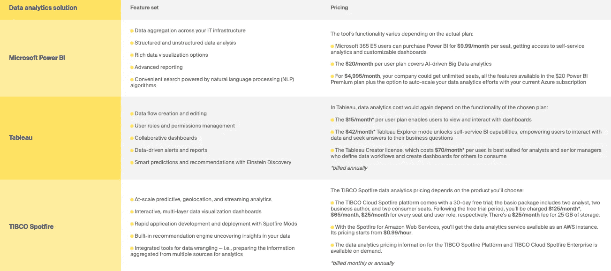

# 影响数据分析成本的五大因素

> 原文：<https://medium.com/geekculture/top-5-factors-affecting-the-cost-of-data-analytics-c06842310093?source=collection_archive---------2----------------------->

*   构建和实施一个[定制集成数据分析解决方案](https://itrexgroup.com/services/data-analytics/)至少需要**15 万到 20 万美元**。大多数选择 SaaS 数据分析产品的公司最终都要向 T4 支付每年 10，000-25，000 美元的供应商和维护费用
*   数据分析的成本取决于多种因素，包括企业数据的数量和质量、数据分析需求、数据分析工具的选择、定制工作和组织灵活性。
*   为了降低数据分析成本并获得更快的回报，您的组织需要定义明确的数据目标，制定数据管理策略，选择主要用例，并在收集利益相关方反馈的同时逐步扩展您的分析工作。

数据是推动企业运转的燃料。

大多数公司只是在疫情期间才意识到这一点，因此数据分析支出在过去两年中飙升。安永会计师事务所(Ernst & Young)最近的一项研究显示，93%的首席执行官[认为数据和分析是他们目前最优先的 IT 投资](https://www.ey.com/en_us/consulting/how-companies-are-investing-in-data-and-analytics)。

无论如何，企业在利用[定制大数据应用开发](https://itrexgroup.com/services/big-data/)或采购现成的分析工具时追求的是什么目标？

根据 MicroStrategy 在 2020 年进行的 BI & Analytics 调查，63%的企业在数据分析工具上花费巨资以提高效率，而 51%的受访者寻求改善财务绩效。

The benefits of becoming a data-driven company are huge. But how much does data analytics cost? Source: [MicroStrategy](https://www.microstrategy.com/en/resources/research-and-reports/the-bi-analytics-survey-21)

人们不会一时兴起就简单地采用数据分析解决方案。

数据分析新手可能很难在公司的 IT 基础架构中收集正确的信息，并为进一步的分析做准备。SaaS 分析工具可能很难定制和跨多个用例扩展。无论员工的技术背景如何，让他们能够在日常工作中使用分析见解是很少有企业能够成功完成的任务。

这些技术和组织挑战，加上数据分析的高成本，减缓了企业对分析的采用。

我们已经告诉了您公司在试图[将大数据归结为有意义的见解时所面临的障碍](https://itrexgroup.com/blog/5-big-data-challenges/)，所以今天让我们来谈谈数据分析成本。

# 影响数据分析成本的关键因素

1.  数据的数量、性质和质量
2.  您的数据分析目标，以及最符合这些目标的工具
3.  数据分析供应商费用
4.  数据分析软件定制和开发工作
5.  组织灵活性和变革意愿

# 因素 1:数据的数量、性质和质量

回到 2016 年，普通公司[管理着 162.9TB 的数据](https://cdn2.hubspot.net/hubfs/1624046/IDGE_Data_Analysis_2016_final.pdf)；在企业中，数据量通常超过 347TB。

六年过去了，[的公司看到他们的数据每月增长 63–100%](https://www.matillion.com/resources/blog/matillion-and-idg-survey-data-growth-is-real-and-3-other-key-findings)。每家公司的数据源数量的中位数已经达到 400 个，而 IDG 和 Matillion 去年调查的 20%的公司声称正在从 1000 多个来源获取信息，以满足他们的商业智能(BI)和数据分析需求。这些来源通常包括电子商务平台、客户数据库、项目管理软件、社交网络和物联网系统等。

分析师估计 80–90%的业务数据是[非结构化的](https://itrexgroup.com/blog/your-unstructured-data/)。这些数据包括图像、视频、音频文件、不可编辑的文档和传感器读数，因此您不能将其存储在传统的关系数据库中。

与驻留在内部或基于云的数据仓库中并已成熟用于 BI 工具和仪表板的结构化数据不同，非结构化数据属于[数据湖和数据湖库](https://itrexgroup.com/blog/data-warehouse-vs-data-lake-vs-data-lakehouse-differences-use-cases-tips/)。由于数据湖在默认情况下不具备计算能力，因此公司应该精心准备非结构化信息，以用于流分析、数据仓库辅助分析或人工智能驱动的算法处理。

这就是为什么数据分析的成本包括与设计端到端[数据管理战略](https://itrexgroup.com/blog/data-management-strategy-benefits-principles-steps/)相关的费用，为公司范围的数据聚合建立完整的数据存储基础设施，以及将非结构化数据纳入统一格式。总体而言，这些费用[占总数据分析成本](https://venturebeat.com/2021/07/22/why-unstructured-data-is-the-future-of-data-management/)的三分之一。

# 因素 2:您的数据分析需求，以及最能满足这些需求的工具

根据贵公司的数字成熟度和发展阶段，您可能需要工具来:

*   **描述性数据分析**。当你挖掘历史数据来确定发生了什么，什么时候发生的，以及为什么发生的时候，你是在利用描述性分析。本质上，它是所有商业智能和报告工具的支柱，可以提供**特定的或固定的报告**。前者回答特定的商业问题——例如，有多少用户点击了你的横幅广告。后者可以是由你的社交媒体或 PPC 专家制作的月度报告。
*   **诊断数据分析**。这种类型的分析包括将历史数据与其他信息进行匹配，以找出事情发生的原因以及可以采取的措施。如果你的销售经理上个月完成的交易异常少，你可以求助于诊断分析来提高他们未来的业绩。为此，可以应用两种技术:

-第一种方法称为**查询和下钻**。这种分析确定了事件的根本原因。回到我们的销售部门的例子，你的经理业绩平平的原因可能是长期病假。

**-发现和警报**是第二种方法。这项技术可以让你捕捉到问题的早期迹象，并在灾难发生前采取行动。例如，数据分析平台可以通知你销售经理在月中长时间缺勤，这样你就可以加倍努力发展业务。

*   **预测数据分析**。借助预测分析，您的公司可以发现特定事件之间的相关性并确定趋势，例如，根据目标地区和受众人口统计预测销量。为此，数据专家转向统计和预测建模:

**-统计建模**有助于找到不同参数之间的依赖关系，比如地理位置和收入。

-有了这些数据，就有可能进一步计算特定地区各种目标受众的销售额——这就是**预测建模**派上用场的地方。

*   **规定性数据分析**。在大数据和[人工智能算法](https://itrexgroup.com/blog/ai-types-subsets-use-cases/)的支持下，规范性分析工具不仅可以注意到重复出现的模式并识别事件的根本原因，还可以推荐最佳行动方案来避免问题、提高员工生产力并降低公司的运营成本。为了做出智能预测，你的数据分析平台将实施**优化和随机测试技术**。

随后，我们需要不同的工具来执行这些类型的分析，而数据分析成本将随着平台的功能集、复杂性和集成能力成比例增加。

ITRex 集团首席执行官兼联合创始人 Vitali Likhadzed 表示，我们可以将现代数据解决方案分为三类:

*   **独立的工具和实用程序。**这一类别包括 Apache Kafka 和 RabbitMQ 等开源产品，以及 Tableau 和 Power BI 等 SaaS 产品。这些工具解决特定的业务或技术任务，例如，[可视化运营数据](https://itrexgroup.com/services/data-visualization/)，确保 IT 系统之间的数据交换，防止交易欺诈，或使用 RFID 标签定位放错位置的库存。但从公司范围的数据分析实施角度来看，这些工具只是更复杂系统的一个组成部分。
*   **工业 SaaS 平台**如 SAP、Snowflake、Salesforce 和 TIBCO Spotfire。这些系统提供了管理运营数据的单一平台。得益于针对特定场景、使用案例和整个行业的广泛模块和设置选择，工业平台可以满足您公司的大部分数据分析需求。例如，Salesforce 的 Einstein 甚至根据它在公司 it 基础设施中收集的历史和实时信息做出智能预测。问题是，这种系统可能太难定制，或者缺乏适合您所在行业的现成模块。当谈到数据分析成本时，随着时间的推移，随着您的业务增长并开始产生更多数据，实施 SaaS 平台也可能变得过于昂贵-毕竟，大多数 SaaS 供应商的计划都与存储和计算资源有关。
*   **集成的企业级数据生态系统**整合了工业 SaaS、开源和定制数据分析工具。这种系统可以在您的 IT 基础架构中聚合数据，非常适合公司范围的分析。您还可以使用[人工智能功能](https://itrexgroup.com/services/artificial-intelligence/)来丰富您的数据生态系统，以发现结构化和非结构化数据中的重复模式，预测可能影响您业务的事件和场景，并自动化繁琐的任务。定制数据系统是独立于供应商的、可扩展的，并且是为您的流程、业务功能和使用场景定制的。这有助于释放新的机会和收入流，从而最大限度地提高您的数据分析投资回报。

这组工具提供了可比的数据分析能力。撇开实施成本不谈，独立和工业 SaaS 产品的主要缺点是缺乏灵活性。

准确地说，Tableau 和 Power BI 在一个部门或一组任务中拥有合理的灵活性。由工业 SaaS 平台支持的数据分析解决方案受供应商限制；如果你将来决定换到另一个平台，你将不得不从头开始重写整个系统，并在员工培训上投资数百万美元。

另一方面，集成数据生态系统的实施成本可能很高，但它提供了最大的灵活性，符合行业标准，并且最适合您的需求。

# 因素 3:数据分析软件定价

如果您选择现成的数据分析解决方案，这可能需要很少或大量的定制，您的数据分析成本将产生供应商许可费。

让我们看看流行的数据分析工具的价格，以及它们在功能方面提供了什么:

我们来算一下，好吗？

如果您的组织选择像 SAP 这样的高级解决方案，您的数据分析计划每月可能会花费您至少 14，000 美元，这还不包括软件配置和员工培训费用。

根据 1PATH 进行的[调查，46%的中小型企业花费 10，000 美元到 25，000 美元购买数据分析工具，而 41%的受访者每年支付等量的维护费用。](https://1path.com/wp-content/uploads/2020/10/Data-Analytics-Survey-1.pdf)

Extended implementation timelines, high data analytics software costs, and failure to ensure company-wide access to intelligent insights are haunting data projects across small and medium-sized companies. Source: [1PATH](https://1path.com/wp-content/uploads/2020/10/Data-Analytics-Survey-1.pdf)

尽管大多数供应商都很清楚数据分析的成本问题，并试图使他们的产品大众化，但公司仍然需要大约四个月的时间来实施标准的 BI 解决方案并开始从中受益。

# 因素 4:数据分析软件定制和开发工作

数据分析工具并非生而平等。

一些即插即用的解决方案，如 Power BI 和 Tableau，无需大量定制即可快速洞察。然而，他们的智能很少延伸到描述性和诊断性分析之外，并且不能在整个公司范围内扩展。

SAP 和 Salesforce 等更高级的工具可以让您在整个组织中获取、汇总、处理和分析数据，但这说起来容易做起来难。

我们以 Salesforce 为例。尽管该平台提供了丰富的插件和工具来将其与您的 it 基础设施和第三方服务同步，但您[可以轻松地花费 **$10，000–100，000**](https://dev.co/salesforce/development-cost/) 来调整该工具，以最适合您独特的业务需求。

这就是为什么一些公司选择围绕他们的数据、流程和目标创建定制的数据分析工具，即使这种方法将涉及更高的前期投资。

如果您选择这条路，定制数据分析平台会给贵公司带来多少成本？

## 案例研究:ITRex 为一家领先的零售商创建了一个人工智能驱动的自助 BI 解决方案

ITRex 集团与一家零售巨头合作，在 20 多个国家经营超过 10，000 家杂货店、折扣店和大卖场。该客户希望创建一个基于[人工智能的自助式 BI 平台](https://itrexgroup.com/case-studies/ai-powered-big-data-platform-for-retail/),为分散在全球各地的三百万员工提供对关键信息的按需、无障碍访问。

在[发现阶段](https://itrexgroup.com/blog/product-discovery-choosing-between-waterfall-agile-kickoff/)之后，我们概述了项目范围:

*   打破公司不同技术系统之间的孤岛，实现不间断的数据来源和聚合
*   跨公司的 IT 基础架构检测、修改和删除不准确、不完整或不相关的数据
*   创建一个主数据存储库，作为所有组织数据的单一真实来源
*   开发一个门户网站，提供公司所有数据源和信息的 360 度全方位视图，这些数据源和信息以不同格式提供，包括 PDF 文件、文档、Excel 电子表格、电子邮件、图像等。
*   [构建自助 BI 平台](https://techreviewer.co/companies/itrex/ai-powered-self-service-bi-and-big-data-platform)让用户(无论其技术背景如何)能够解读数据见解并创建临时报告
*   实施高级安全和基于角色的访问控制机制

我们创建了一个涵盖多个创新功能和技术组件的数据生态系统:

*   节点和边驱动的图形数据结构，支持复杂的查询并简化算法数据处理
*   通过 Hashtag 搜索和 Hashtag 自动完成功能在海量数据中进行有效搜索
*   通过自定义 API 与第三方系统集成
*   与构成客户 IT 基础架构的不同应用程序和系统集成:Office 365、SAP、Atlassian products、Zoom、Slack 和 enterprise data lake 等
*   通过查询大量数据源来创建和共享详细报告的选项
*   内置协作工具
*   基于角色的安全机制限制对存储在图形数据库中的敏感信息的访问

数据分析平台每天可以处理多达 800 万个查询，满足非技术员工的需求，他们以前必须从客户的内部 IT 团队请求报告。

该平台的核心优势是跨用例的灵活性和可伸缩性。无论我们的客户需要制作一份财务报告，了解消费者行为，还是调整他们的定价策略，该系统都可以做到。

例如，数据生态系统通过建议公司是否应该修理或更换设备和其他资产来帮助公司降低运营成本，这只是其可能的应用之一。

Vitali Likhadzed 估计开发和实施这样一个数据分析解决方案的成本为 **$150，000–200，000**——我们在这里谈论的是一个非常基础的系统版本。有可能在三个月内推出最小可行产品(MVP ),而全面实施平均需要六到九个月。

# 因素 5:组织灵活性和变革意愿

组织敏捷性被广泛定义为公司快速响应和适应不断变化的市场需求的能力，在数据分析实施中发挥着关键作用。

虽然与数据分析成本、组织敏捷性(或缺乏组织敏捷性)没有直接关系！)将影响您的数据解决方案部署时间表，进而影响价值实现时间。

Exasol 最近的一项调查表明 [65%的组织在工作中采用数据驱动方法时遇到了员工抵制](https://www.exasol.com/exasol-cloud-report_adopting-data-driven-methods/)，尽管 73%的受访者最初认为他们不会面临此类障碍。员工不愿意使用数据分析系统的原因包括缺乏对公司整体数据战略的了解(42%)以及对数据分析优势的了解有限(40%)。

如果你的供应链管理公司已经使用 Excel 电子表格 25 年，你不能强迫你的员工在没有适当入职的情况下开始使用 Tableau、SAP 或定制的自助 BI 系统，学习需要时间。除了员工培训成本，你还必须解雇一些员工，雇佣懂技术的员工。

# 如何开始数据分析、降低成本并更快实现回报

考虑到高数据分析成本和延长的项目周期，您可能想知道是否应该首先利用大数据分析。

让我们搞清楚一些事情:如今，成为一家数据驱动的公司不再是一个令人信服的优势，尽管难以捉摸——而是在数字经济中生存的关键，在数字经济中，数据领导者和数据落后者之间的鸿沟[将在短短三年内变得不可逾越](https://www.techtarget.com/searchbusinessanalytics/news/252480939/Many-employees-still-resist-data-driven-culture)。

好消息是，通过遵循以下步骤，您可以降低实施数据分析的成本，并更快获得收益:

*   **定义贵组织在数字化转型方面的使命和目标**。在这样做的时候，利用研究和规划框架，如 PESTEL/TEMPLES、VRIO、波特的五种力量和 SWOT。确保你的目标是具体的、可衡量的、可实现的、相关的、有时限的(SMART)。
*   **通过数据分析确定您想要解决的业务问题**。为此，你可以进行 IT 基础设施审计，与员工交谈，开展客户调查，将你的绩效指标与你的竞争对手的绩效指标进行比较，如果需要的话，[还可以聘请外部技术顾问](https://itrexgroup.com/services/technology-consulting/)。experts‌可以帮助您评估组织的数字化成熟度和敏捷性，为您提供现实的数据分析成本和工作量估计。
*   **赢得高管层对项目执行的支持**。必须展示所选数据分析用例将如何帮助组织实现步骤 1 中列出的 SMART 目标。一旦您获得了许可，您就可以使用像 MoSCoW、RICE 或 Kano 这样的框架来对批准的用例进行优先级排序。
*   **了解你的数据**。在开发和实施数据分析之前，我们建议您筛选您的数据，以确定可以提供即时见解的信息(即热数据)和不需要主动管理的信息(即冷数据)。您可以将冷数据移至成本更低的存储设备，[将数据存储和备份成本降低高达 75%。](https://venturebeat.com/2021/07/22/why-unstructured-data-is-the-future-of-data-management/)
*   **构建您的愿景**。设计您的数据分析解决方案架构的蓝图，并验证它不受技术和基础架构的限制，不受供应商限制，并且是为扩展而构建的。
*   **创建端到端的数据管理策略**。在这里，您应该特别注意核心数据治理和民主化原则。前者将涵盖公司数据的管理、质量和安全性，以及用户角色和访问权限。后者将允许任何员工，无论其背景如何，访问数据、提问并生成不同类型的报告。
*   **着手实施数据分析**。与您的内部数据团队或外部开发人员一起，您需要为优先用例创建数据组件，留下一个横向扩展和扩展创新功能以支持其他场景的选项。最终结果将是您的数据平台的 MVP，它将涵盖基本用例，并包含足够的功能，以便从第一天起就获得价值，同时优化数据分析成本。
*   **迭代你的完美之路**。在 MVP 实现之后，您需要收集来自业务涉众的反馈，进行必要的调整，并跨其他用例扩展您的数据分析工作。这就是您获得端到端数据生态系统的方式，它消除了您的团队、部门和 IT 基础架构组件之间的孤岛，为公司范围的数据分析铺平了道路。

最后但并非最不重要的是，‌brace 改变了自己。除了在您的组织内促进数据素养并明确传达成为数据驱动型公司的好处之外，您还应该促进跨职能团队的发展，尽量减少层级，并鼓励组织各级的决策。

> *如果您需要帮助来定制独立的或基于平台的数据分析产品(或者从头开始开发定制的数据生态系统！)，我们很高兴陪伴您的转型之旅！只需* [*放下 ITRex 团队一行*](https://itrexgroup.com/contact-us/) *来讨论你的数据分析需求。*

*原载于 2022 年 6 月 29 日 https://itrexgroup.com***。**