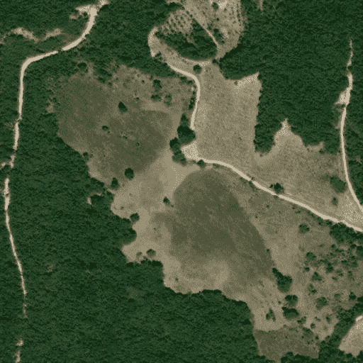
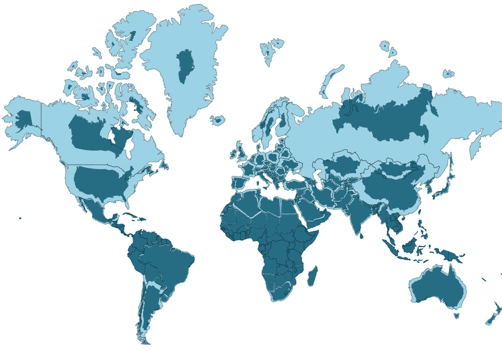
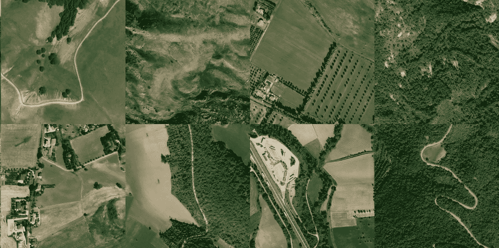
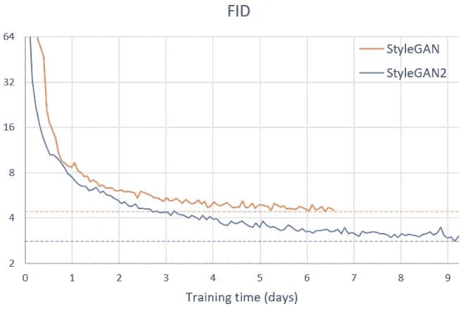
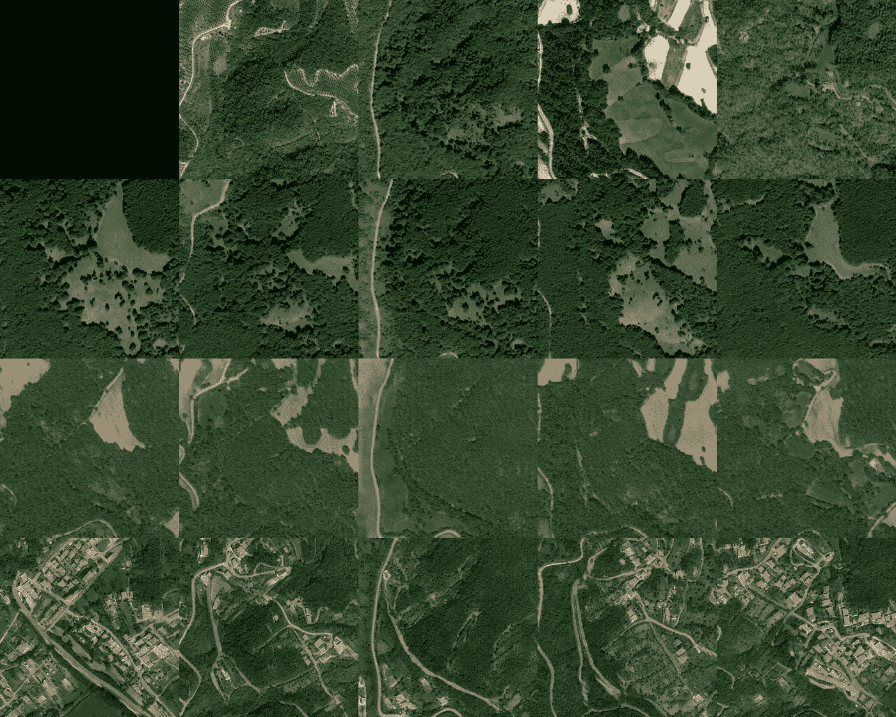

# 该景观不存在:使用 StyleGAN2 生成真实的景观图像

> 原文：<https://medium.com/geekculture/train-a-gan-and-keep-both-your-kidneys-bcf672e94e81?source=collection_archive---------21----------------------->



# 动机

[生成对抗网络](https://arxiv.org/abs/1406.2661)是一个带有叙事的机器学习算法。定义这种深度神经网络的架构令人想起 1950 年的黑色电影:两个竞争对手相互策划——一个是制造假货的策划者(生成器)，另一个是试图从假货中辨别真假的专业侦探(鉴别器)。高潮剧情转折？我们的英雄侦探一直在帮助伪造者制造更好的*赝品！*

在实践中，GANs 可以产生惊人的现实输出。[这个人并不存在](https://thispersondoesnotexist.com/)展示了英伟达的 StyleGAN2，它生成了顾名思义并不存在的人的肖像——并且具有不可思议的真实感。对于业余爱好者来说，可悲的是，训练最先进的网络通常需要大量的计算资源和大量的数据。StyleGAN 的第一次实现花了[超过 41 天](https://github.com/NVlabs/stylegan)来完全训练，并需要 8 个特斯拉 V100 GPUs。这还不包括超参数搜索！

去年年底，发布了对 StyleGAN2 增强机制的改进，称为[自适应鉴别器增强](https://arxiv.org/abs/2006.06676)，据称它可以稳定较小数据集上的训练。这激起了我的兴趣:有没有可能只用我可以免费获得的资源来训练一个像 StyleGAN2 这样的网络？看得更深一点，这似乎是可能的，所以我决定一头扎进去。

# 生成数据集

存在大量公开可用的图像数据集，可用于训练类似 StyleGAN2 的网络。但由于这个项目是一个实验，我认为建造一些新奇的东西会更有趣。我在 [GIS](https://en.wikipedia.org/wiki/Geographic_information_system) 行业有经验，并选择利用这一点来创建大规模遥感影像数据集(即卫星摄影)。这实质上意味着我会收集一堆看起来像你在谷歌地球上看到的东西的图像——森林、湖泊、城市等的俯视图。每个人都喜欢在谷歌地球上浏览卫星或航空图像；运气好的话，看看我训练过的模型的输出也会很有趣！

我需要多少数据？StyleGAN2 的作者发表的[论文](https://arxiv.org/abs/1912.04958)描述了两个经过完全训练的模型，一个生成人脸图像，另一个生成汽车图像。训练这些模型的数据集分别包含 70，000 和 893，000 幅图像。包含人脸的数据集 FFHQ 比汽车数据集 LSUN Car 更加结构化和一致。由于这种结构，对于 FFHQ，StyleGAN 被训练来近似的目标分布比对于 LSUN Car 更窄。这使得人脸模型可以用更少的训练样本进行归纳。为了获得可比较的结果，我的数据集需要大约 100，000 张落入一个狭窄领域的图像。这意味着需要获得大量一致的数据。

## 采购图像

寻找高质量图像的可靠来源实际上是这个项目中最耗时的部分。我走了很多条路，最终选择了一条我觉得值得走下去的路。

网上有很多免费的遥感数据来源。我的第一个方法是使用来自 [Landsat 8](https://en.wikipedia.org/wiki/Landsat_8) 的图像，这是一颗由美国宇航局开发的卫星，带有中等分辨率的多光谱传感器(即每个像素大约 15 米宽)。Landsat 计划几乎覆盖了整个世界，这使得它成为创建大规模空中影像数据集的一个有吸引力的选择。然而，在用[美国地质勘探局的地球探测器](https://earthexplorer.usgs.gov/)下载了一段数据后，我遇到了一些意外情况:

1.图像是平的，但地球不是。陆地卫星图像是使用墨卡托投影提供的，墨卡托投影将地球上的坐标转换成笛卡尔坐标。这对于很多应用程序来说都很好，但是会引入一种假象，即靠近赤道的要素看起来比远离赤道的要素小得多。如果不对此进行校正，整个数据集会变得不均匀，迫使模型学习更广泛的输出分布，并增加过度拟合的可能性。



The size of nations in the Mercator projection (light blue) compared to their actual size (dark blue). Source: Neil Kaye

2.从远处看，世界的大部分并不那么有趣。

这些问题都是可以解决的，但本着实验的精神，我决定继续四处看看。

在美国地质调查局的平台上浏览数据时，我注意到了一些东西:他们在地图浏览器上提供了一个分辨率非常高的底图，其最大分辨率约为 Landsat 8 的 50 倍。有了这种高分辨率图像，可以对更小的地理区域进行采样，并且不需要校正投影失真。更好的是，大量有趣的人造建筑在最大变焦水平下清晰可见。EarthExplorer 没有提供直接下载这些数据的选项，但浏览一下 Chrome 的开发工具，就会发现这些图像的 URL:


Looks like the imagery is hosted by arcgisonline.com

通过这个 URL 和一些谷歌搜索，一个指定用于导出的[端点](https://www.arcgis.com/home/item.html?id=226d23f076da478bba4589e7eae95952)出现了，它只需要一个免费的 ArcGIS 开发者帐户。不错！

现在我有了可以加载到 GIS 工具中的高分辨率影像，我在意大利找到了一个有趣的区域，并将其导出为一组 512x512 像素的 PNG 切片。我选择了罗马周围的一个地区，它看起来相当均匀，但也有一些有趣的特征，如葡萄园、农场、小村庄和大城镇。这产生了大约 280，000 张图像。

## 准备数据集

ArcGIS 提供的地图质量已经非常高了，因此只需做最少的数据集清理工作。我最终过滤掉了不包含任何数据的图像(高分辨率图像并不适用于整个地区)，以及只包含水的图像。这是用一个简单的 python 脚本完成的:

```
for i, file in enumerate(os.listdir(tiles_dir)):
    file_path = os.path.join(tiles_dir, file)
    img = cv2.imread(file_path)
    if img.std() < 6 or img.std() < 20 and img[:,:,1].sum()/(512**2) < 42:
        shutil.move(file_path, os.path.join(filtered_dir, file))
```

第一个检查`img.std() < 6`，过滤掉不包含任何信息的图像，并导出为带有一些文本的纯灰色光栅。第二项检查`img.std() < 20 and img[:,:,1].sum()/(512**2) < 42`，过滤掉绿色通道上平均亮度值较小的低信息影像。这被调整为专门和几乎完全检测海洋的图像，这对于建模来说并不有趣。

清理后，完整的数据集包含不到 200，000 张图像，足以训练一个网络！



A random sample of training images

Nvidia 提供了一个有用的脚本`dataset_tool.py`，将图像转换成`.tfrecords`。在运行这个程序并将数据集上传到一个新启动的 GCP 计算实例之后，这个模型就可以接受训练了。

# 培养

StyleGAN2 的作者最初在 8 个特斯拉 V100 GPUs 上训练了 FFHQ 模型 9 天 18 小时。这个数字是针对单次训练的，不包括超参数搜索。令人遗憾的是，我没有 8 个特斯拉 V100 GPUs，也不想花大约 4600.00 美元在谷歌云平台上配置它们。然而，我确实获得了分配给新 GCP 账户的 300 美元免费额度，这足以让一个 V100 云实例运行不到 5 天。尽管我的计算能力不到研究人员使用的十分之一，但我认为我仍然可以得到一些看起来不错的结果，原因有两个:

*   可以在较小的图像上进行训练，从而减小网络的规模并提高训练速度
*   训练可以在损失完全收敛之前提前停止

使用 512*512 像素图像而不是本文中使用的 1024*1024 图像，理论上允许模型在使用相同数量的 GPU 内存的训练期间看到四倍多的图像。考虑到限制因素，这似乎是值得的妥协。查看 GitHub 上官方 StyleGAN2 库的训练曲线，可以看到大多数性能提升发生在训练的前几天，而在其余几天，性能提升开始趋于平稳。一些非常粗略的粗略计算可以近似得出这种范式的预期性能:

5 个培训日* (1 个 GPU/8 个 GPU)*(4 个图像/1 个图像)= 2.5 个培训日

这是一个巨大的盐粒，但近似值表明，使用更小的图像和更少的 GPU，可以预期与原始作者在大约 2.5 天的训练后实现的性能类似。再看看公布的训练曲线，看起来相当于 2.5 天的训练应该会产生一些有趣的结果。



Nvidia’s training curves of published StyleGAN models trained on FFHQ dataset with 8 GPUs. FID (Frechet Inception Distance) is a measure of the difference of hidden layer activation distributions between real and generated images. Source: github.com/NVlabs/stylegan2

在现实中，有许多影响训练速度的混杂因素。训练速度不太可能与图像大小成线性比例，多 GPU 训练使用更大的批量大小，因此训练步骤更大或更精确，这会影响梯度下降期间采取的路径。尽管如此，这仍然是一个有用的健全性检查，它验证了该方法，并表明模型的预期性能应该在“不错”附近。

# 结果

开发这个数据集和训练这个模型的实际过程远没有这篇博文描述的那么简单和连续。我尝试了一些其他的数据源，尝试了不同的图像分辨率，甚至尝试了假彩色合成图像。在解决了一些错误和错误开始后，我有两天半多一点的时间来训练最终的模型。不完全是我所计划的，但希望仍然足以得到一些强有力的结果。

再次绘制 FID 与时间的关系图，可以看出模型性能在训练停止时开始收敛。这是一个好消息，因为这意味着过早停止训练可能不会损失太多的表现。


Training curve of my model, with same y-scale as Nvidia’s graph.

最终的 FID 略高于 12.05。这比我从 Nvidia 在各种数据集上的结果推断出来的预期要高一点，这可能是由于网络不足或数据集难以建模。由于我工作时的资源限制，我无法执行健壮的超参数搜索，不得不求助于使用研究人员提供的默认配置(这似乎工作得相当好)。虽然可以通过更彻底的搜索来训练更好的执行模型，但我觉得结果相当令人满意:

This video was rendered by sampling points randomly from the input distribution, interpolating them using SciPy’s implementation of cubic spline interpolation, and feeding them into the network.

虽然看起来很有趣，但这个插值视频也揭示了一些关于训练模型的有趣信息。该模型似乎没有过度拟合；几乎视频中的每一帧看起来都像一幅有效的风景，并且模型没有从记忆的输出跳到记忆的输出。从点到点的平滑过渡表明，该模型正在成功地生成新的和多样化的图像，并且没有遭受[模式崩溃](https://developers.google.com/machine-learning/gan/problems#mode-collapse)。

同样有趣的是以下 SytleGAN 的作者称之为*风格混合*的可视化。风格混合是在推理过程中向不同的风格块输入不同的潜在向量的实践。StyleGAN2 具有多个样式块，每个样式块对应于不同的抽象级别，这意味着可以改变图像的低级特征(例如地理特征或地形)，而无需修改高级特征(例如树木、建筑物、道路等的存在)。)，或者反之亦然。可以生成图像矩阵，其中每列的低级特征保持不变，每行的高级特征保持不变:



An example of style mixing. Styles from images in the top row and leftmost column are mixed to produce hybrid images. Topography is kept the same within columns, while terrain type is kept the same within rows.

# 反光

## 对未来工作的思考

如果我再做一次，我可能会花更多的精力来优化昂贵的 V100 实例。GPU 只在大约 80%的时间内运行，剩下的 20%用于数据处理，而这些本来可以离线完成。我很想看看更多的训练时间，甚至超参数搜索，将如何提高模型的输出。

尝试从 512 维的潜在空间中分离出人类可以解释的特征是很有趣的，也许可以用主成分分析。Nvidia 有年龄、头发颜色、面部方向等孤立的特征。我很想知道我的模型会有什么特点。

用于空间插值的某种框架将会非常有趣。在手机上查看地图时，你看到的不是一个不连续的图像网格，而是一个马赛克，看起来像是地球表面的一幅大图。递归神经网络可能能够实现类似的东西，尽管将 RNNs 与 GAN 架构集成肯定不是微不足道的。

## 最后的想法

我对一切的结果很满意。这是一个有趣的项目，我已经达到了我的目标:证明用一个新的数据集和有限的计算资源在(某些)最先进的网络上实现合理的性能是可能的。我也从观看插值视频的人那里获得了很多积极的反应，即使没有技术背景——它似乎有一种普遍令人着迷的东西，这是机器学习的一种品质，让我非常兴奋。