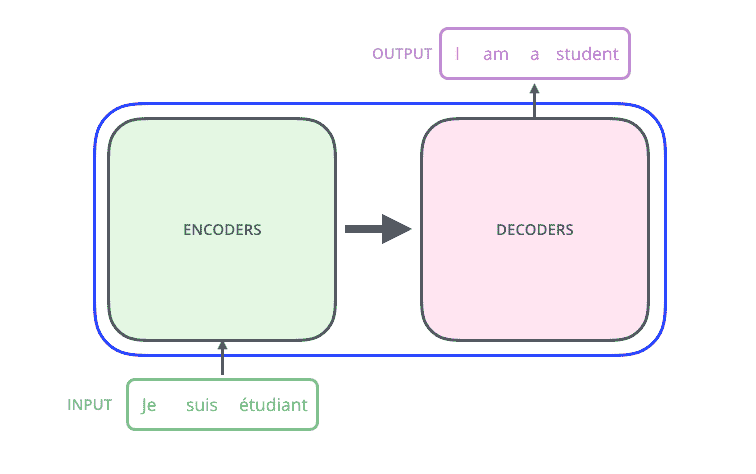
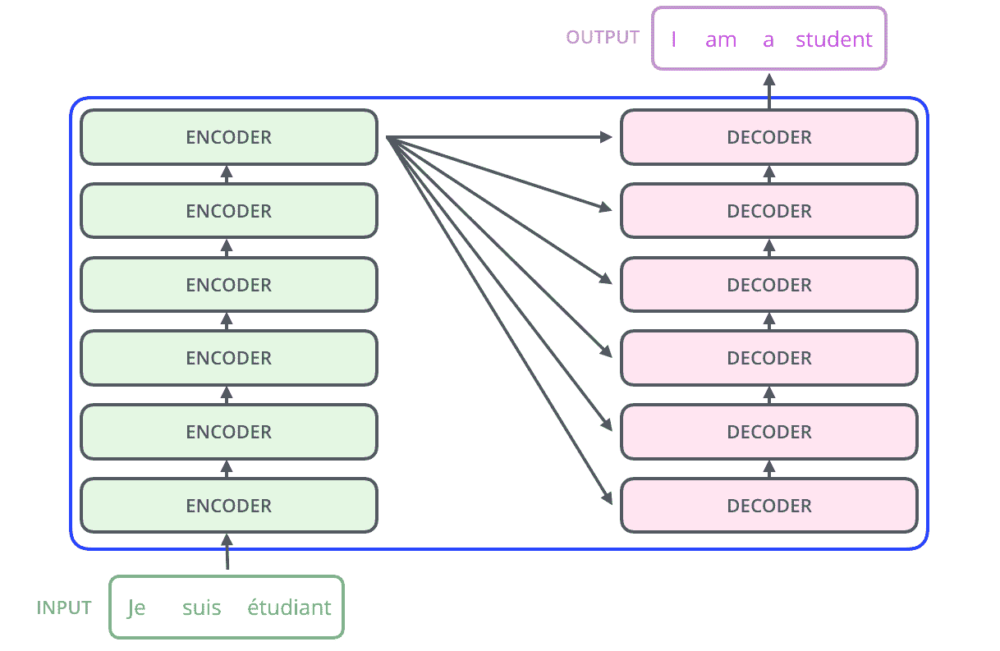
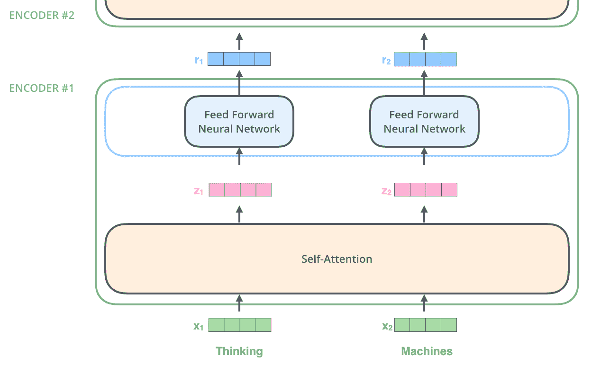
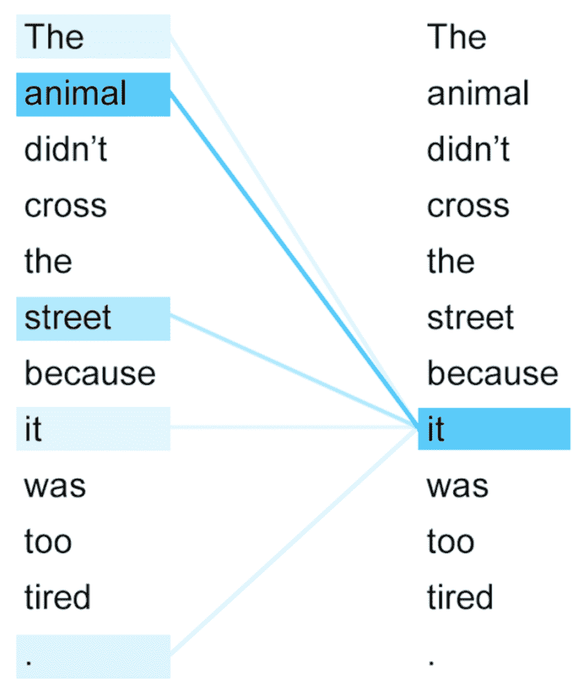
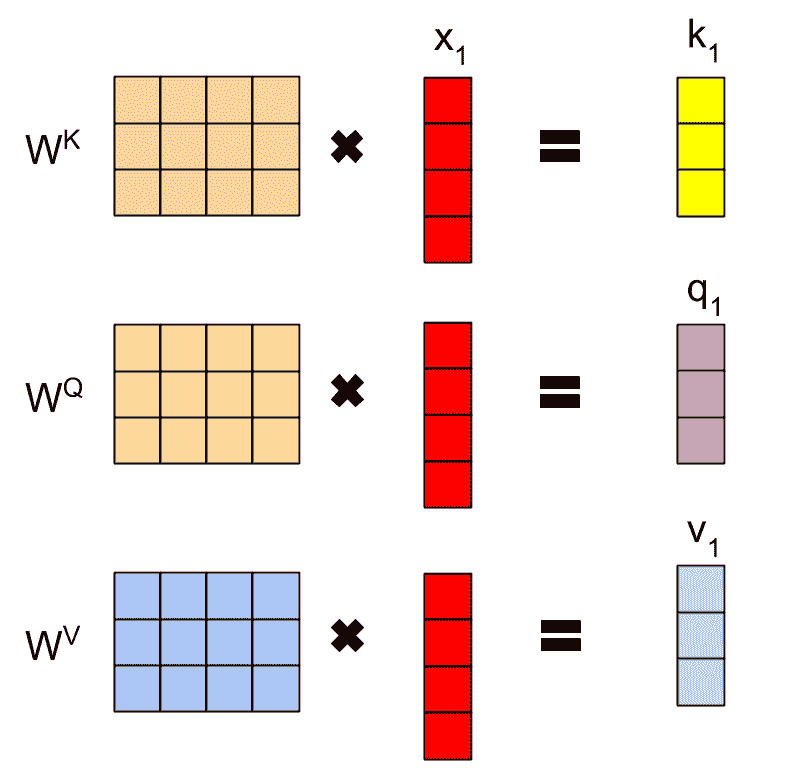
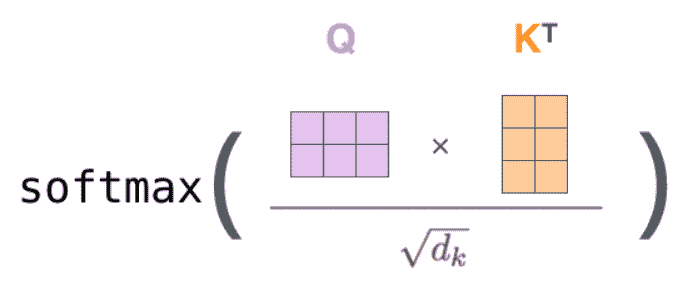
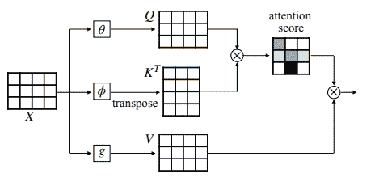

# 变形金刚(电影名)

> 原文：<https://medium.com/geekculture/transformers-231c4a430746?source=collection_archive---------1----------------------->

Transformer 模型已经成为大多数 NLP 任务中的首选模型。许多基于变压器的模型，如伯特、罗伯塔、GPT 系列等，被认为是自然语言处理中最先进的模型。虽然 NLP 在所有这些模型中都势不可挡，但变形金刚在计算机视觉领域也越来越受欢迎。变压器现在用于识别和构建图像、图像编码等等。虽然变压器模型正在接管人工智能领域，但对这些模型有一个低层次的理解也很重要。这个博客旨在让读者了解 Transformer 和基于 Transformer 的模型。这包括模型组件、训练细节、度量和损失函数、性能等。

# 先决条件

*   嵌入
*   序列建模
*   rnn 和 LSTMs

# 一点背景

如今，基于神经网络的模型在计算机视觉和自然语言处理(NLP)领域越来越受欢迎。但回到 21 世纪初，NLP 并不太受欢迎，人工智能的乐趣仅发生在计算机视觉中。通过 ImageNet 挑战赛和 AlexNet、ResNet、GANs 等模型，计算机视觉在当时越来越受欢迎。成为头条新闻。计算机视觉是如此的吸引人，以至于 NLP 在图片中并不重要。

然而，与此同时，NLP 也通过像 Word2Vec 这样的模型取得了一些进展。Word2Vec 是谷歌在 2013 年发明的神经网络模型。该模型可以生成与上下文无关的文本数据嵌入。Word2Vec 模型是 NLP 领域的一个关键突破，因为这是第一个可以基于单词的语义生成嵌入的模型。

然而，这还不够。传统神经网络的一个基本缺点是它们不能记忆东西。这对于机器翻译、图像字幕等序列应用来说非常重要。然而，2014-2015 年流行的递归神经网络(RNN)克服了这一缺点。同样，RNN 模型也提出了许多挑战，如消失梯度、爆炸梯度、处理长期依赖性等。

这个问题后来被另一个被称为 LSTMs 的模型系列解决了。LSTM 模型最初是在 1997 年发明的，但是在 RNNs 发明之后才流行起来。LSTMs 可以被认为是自然语言处理领域的一个重大进展。LSTMs 可以处理消失/爆炸梯度问题，以更聪明的方式记忆东西。LSTMs 还有其他变体，仍被许多公司广泛使用。其中包括双向 LSTM、GRUs 等等。如果你想了解更多关于 LSTMs 的内容，我推荐你去看看我之前的博文。

 [## 长短期记忆网络

### 介绍

medium.com](/analytics-vidhya/long-short-term-memory-networks-23119598b66b) 

正是在 2017 年，NLP 取得了关键突破。谷歌发布了一篇名为“注意力是你所需要的”的研究论文，其中引入了一个叫做注意力的概念。注意力帮助我们只关注需要的特征，而不是所有的特征。注意机制导致了变压器和基于变压器的模型的发展。

# 为什么是变形金刚

ltm 很棒。但是也有一些限制。第一个是 LSTMs 很难训练。这主要是因为较长的训练时间以及训练期间的高记忆要求。LSTMs 主要用于克服 RNNs 的消失/爆炸梯度问题。但事实证明，LSTMs 只能在一定程度上解决这个问题。LSTM 的另一个缺点是它很容易过度拟合，并且很难包含正则化技术。所以现在我们知道，LSTMs 不能把我们从所有这些问题中完全解救出来。那现在怎么办？

变形金刚来了。变压器的发明可以被认为是 NLP 的“BAM”时刻。那么变形金刚提供了什么额外的好处呢？让我们首先对变压器有一个高层次的概述，然后我们可以在接下来的会话中深入了解它的组件及其工作原理

# 变形金刚(电影名)

在很高的层面上，变压器可以被视为一个编码器-解码器模型，其中编码器将我们的输入转换成一个矢量。这些编码输入被提供给解码器，解码器试图将向量转换成自然语言或可解释语言。现在，如果我们考虑上述过程，我们可以将其与机器翻译(例如:将法语句子转换为英语)或图像字幕(为图像生成字幕)联系起来。当我们使用转换器进行机器翻译时，我们将输入的句子(一个法语句子)交给编码器。编码器会将文本转换成矢量。现在，这个向量被传递给解码器，在那里它把它转换成一个英语句子。同样的方法也适用于图像字幕，其中输入将是图像，输出将是描述图像的句子。

编码器和解码器模块实际上是编码器和解码器的堆栈，如图所示。输入进入第一个编码器堆栈。它将把输入转换成另一个向量 Z，然后这个向量被传递给下一个组件，依此类推。来自最终编码器层的输出将被提供给解码器堆栈。所有编码器都具有相似的结构和相似的层，只是权重不同，并且是在训练过程中学习的。类似地，解码器也具有类似的结构。

这些都可以。但是与之前的型号相比，《变形金刚》有什么特别之处呢？

*   变形金刚能比 LSTM 更好地处理长期依赖
*   解决消失/爆炸渐变的问题
*   编码是双向的
*   支持并行化

随着我们的前进，每一点都将变得更加清晰。

# 编码器堆栈

由于所有的编码器堆栈都是相似的，为了理解相同的内容，我们将采用单个编码器模块。现在，编码器需要对我们的输入进行编码。在编码时，它需要确保解码器模块获得所有相关信息进行解码。现在它是如何工作的？让我们来看看编码器的结构。

从上图可以看出，一个编码器单元包含两个模块——自关注模块和前馈神经网络。我假设你已经熟悉前馈神经网络，所以我不会解释。让我们把注意力集中在自我关注层。

## 自我关注层

如果你记得在 RNNs 和 LSTMs 中，为了产生当前的隐藏状态，我们需要一些关于先前事件的记忆。从过去或未来的事件中获取信息是非常重要的，因为它有助于我们了解背景，这反过来会使预测更加准确。在变压器编码器中，想法是相似的，但是有一些变化。

在编码器中，我们将输入的句子拆分成单词。现在从图 3 中，我们可以看到每个单词都被转换成了一个向量。在生成这些向量的同时，如果我们也能得到上下文，那不是很好吗？类似的过程也发生在自我关注层

例如，考虑一个句子

这只动物没有过马路，因为它太累了

现在想象我们需要翻译这句话。为此，首先，我们需要对它进行编码。现在，在编码时，我们将这个句子中的所有单词传递给编码器(同时传递)。现在，当我们开始编码时，我们知道，为了对一些单词进行编码，还需要一些上下文。例如，“它”这个词——不管它是指动物还是街道。现在，这就是我们使用自我关注机制的地方。最后，我们将得到一个注意力矩阵，其中包含每个单词在编码特定单词时的重要性。上面例子中的注意力矩阵看起来像这样。牢房越暗，就越需要注意。

现在，一旦我们得到了注意力矩阵，下一步就是计算向量 Z。现在这个 Z 将是每个单词的编码向量表示。这个向量是如何计算的呢？

## 注意矩阵和编码向量— Z

第一步，我们需要处理我们的输入(已经作为向量嵌入)，计算注意力矩阵。我们已经知道什么是注意力矩阵，现在让我们看看它是如何计算的。

## 注意力矩阵

注意力矩阵是使用两个向量计算的——查询和关键字。还有一个向量叫价值向量，用在后期。对于输入句子中的每个单词，都有一个查询、键和值向量。现在，这些向量是通过将输入单词(嵌入)乘以一个矩阵来计算的，如下所示

如上图所示，每个输入单词向量(图中的 x1)乘以一些矩阵，生成键、查询和值向量。用于乘法的矩阵通过反向传播来学习。假设我们已经将输入维数(输入字数)固定为 L，权重矩阵的维数为 *dxd* 。当我们为所有输入单词计算这些向量时，这些向量的维数将是 *1xd。*现在，当我们连接所有输入单词的所有这些向量时，合成向量将是 *Lxd。*

好了，现在我们有了这三个向量。我们现在如何计算注意力矩阵？一旦我们得到这些向量，注意力矩阵的计算如下

最后的 softmax 层是为了确保注意力矩阵将包含 0-1 范围内的值。一个值，指示某个单词在对当前输入单词进行编码时的高度重要性。注意矩阵的顺序为 *LxL*

现在下一步是计算矢量 **z** 。这个向量是通过将价值向量乘以关注矩阵来计算的。因此，这将产生一个维度为 *Lxd* 的向量，这表示 L 个维度为 d 的向量。计算 z 向量的整个过程如下所示

在对特定的单词进行编码时，查询、键和值向量将帮助我们更多地关注重要的单词(基于注意力权重),并从无关的单词中获取很少或没有信息。现在，这些向量被传递到下一个编码器单元，并重复相同的过程。

现在是时候看看一个完整的编码器单元是什么样子了

我们可以在这里看到更多的特征

*   位置编码—这是一种表示单词在句子中位置的方法
*   归一化图层-图层归一化将归一化每个图层输出的分布
*   剩余连接-剩余连接或跳过连接将防止消失/爆炸梯度问题，并防止过度拟合的机会

# 解码器堆栈

既然我们已经了解了编码器架构及其工作原理，那么就很容易理解模型的解码器部分了。

从上图中，我们可以看到编码器和解码器非常相似，只是在解码器端多了一个单元。这是编码解码器的注意力。让我们从解码者的角度来理解注意力机制

*   自我关注——这与编码器的工作原理相似。但是这里有点不同。如果你还记得，编码器中的自我关注，对于当前单词，我们必须考虑所有单词对应的键、值和查询向量。这意味着，当前单词必须考虑过去和未来的单词，这使得这个过程是双向的。但是解码器的功能是预测下一个字。因此，在计算当前单词的注意力向量时，我们只能考虑过去的单词，因为未来的单词还不为我们所知，它是可以预测的。这使得解码器关注过程是单向的
*   编码器-解码器注意力-这一层将计算编码器和解码器之间的注意力，并告诉我们每个编码器矢量分量在预测下一个单词时有多重要

# 输出层

模型的最后一部分是获得所需格式的输出。例如，如果任务是机器翻译，那么输出应该是所需语言的句子，如英语或法语。现在，我们如何获得单词或句子形式的输出？

让我们假设，在我们的任务中，目标语言是英语，我们的词汇表中总共有 1000 个单词。现在，Transformer 模型中的最终输出层是一个 softmax 层，其大小等于词汇表的大小。输出的值将从 0 到 1，这实际上是每个单词输出的概率。例如，如果在时间 t=1，输出向量是这样的

那么 t=1 时的输出字将是“am”。像这样，每个输出字都会被预测，直到达到<eos>条件。</eos>

# 培训详情

变形金刚接受了海量数据的训练。训练是通过反向传播算法完成的，使用的损失函数是交叉熵损失和 Kullback-Leibler 散度。

# 变压器变化

尽管变压器可以被认为是所有 NLP 工程师的一个重大“发现”时刻，但它也带来了一些挑战。转换器本身的自关注机制存在与二次记忆和二次计算时间需求相关的问题。一些其他类似的架构也被引入来缓解这些问题，包括[稀疏变压器](https://openai.com/blog/sparse-transformer/)、[长成形器](https://arxiv.org/abs/2004.05150)、[表演器](https://arxiv.org/abs/2009.14794)等。

# 最后的想法

我希望你喜欢这篇文章。本博客试图涵盖变压器及其架构的基本概述。不过，我也跳过了一些细节，比如[多头注意力](https://towardsdatascience.com/transformers-explained-visually-part-3-multi-head-attention-deep-dive-1c1ff1024853)、[位置编码](https://kazemnejad.com/blog/transformer_architecture_positional_encoding/)等。，我强烈建议您阅读更多关于相同的内容。

如有任何疑问或建议，欢迎通过 [LinkedIn](https://www.linkedin.com/in/vinitha-v-n-5a0560179/) 或 [Twitter](https://twitter.com/Vinitha_vn) 联系我