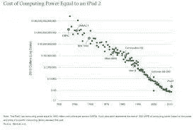
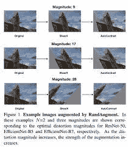
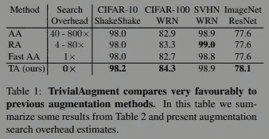
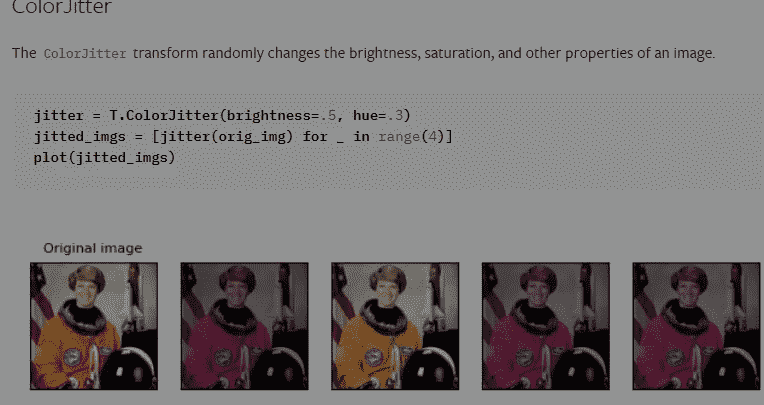

# TrivialAugment:数据扩充的下一次发展

> 原文：<https://medium.com/geekculture/trivialaugment-the-next-evolution-in-data-augmentation-a218339a2687?source=collection_archive---------4----------------------->

## 机器学习(图像分类)符合德国效率

深度学习需要大量的计算能力才能达到很好的效果。用于映射特征之间关系的深度和复杂模型的训练成本非常高。除此之外，我们还需要大量的输入数据，这些数据的收集、清理、标记以及在模型中的实际使用都非常昂贵。一旦你有了一个模型，我们需要部署它，以便它可以被使用。如果我们幸运的话，事情到此结束。然而，许多种类的数据容易受到诸如[数据漂移](https://www.youtube.com/watch?v=qBmAwvGKvas&ab_channel=Devansh%3AMachineLearningMadeSimple)([1 分钟的视频将向你介绍这个想法](https://www.youtube.com/watch?v=qBmAwvGKvas&ab_channel=Devansh%3AMachineLearningMadeSimple))等现象的影响，所以你必须继续监控和重新训练你的数据。

Costs of Computing keep getting cheaper. This has fueled the Tech Boom

到目前为止，计算(和电力)成本的降低以及实现机器学习的高回报已经允许了 ML 的繁荣。这导致了一种趋势，越来越多的研究人员和团队正在开发*复杂*昂贵的模型和程序，只是为了达到边际性能收益。 [**TrivialAugment 的作者:无需调优的最新数据扩充**](https://arxiv.org/abs/2103.10158) 与这一趋势背道而驰。它们表明，简单的技术可以用来实现最先进的结果。作为一个已经说了一段时间的人，我非常兴奋地为这篇文章分解这篇论文。我们将涵盖该协议的基础知识，为什么它对机器学习很重要，以及它能够产生的结果。要做到这一点，让我们首先了解数据增强的基础知识。

# 数据扩充-背景

[数据扩充是机器学习中的一项强大技术](https://www.youtube.com/watch?v=tidkr28xaZ0&ab_channel=Devansh%3AMachineLearningMadeSimple)。它包括获取输入数据并通过应用函数对其进行修改。然后，我们使用合成生成的数据和原始数据作为模型的输入。如果做得好，DA 将允许我们的模型更好地推广到现实生活中的噪声输入，同时也有助于推广到看不见的分布。[谷歌研究人员能够使用更少的资源击败庞大的机器学习模型，使用数据增强作为他们的支柱之一](https://medium.datadriveninvestor.com/the-next-big-thing-in-image-classification-self-training-with-noisy-student-for-improving-22d52dc74dda)。

Our functions can often create augmented images very different from the original. This is a good thing

人们对数据增强政策进行了大量研究，这并不奇怪。研究人员开始使用机器学习来评估数据集，以找出最佳的增强政策。这是昂贵的，但它推动性能到一个新的水平。看起来 DA 策略将涉及复杂的超参数调整，并且复杂的策略是最好的。然后，RandAugment 出现了。

RandAugment had only 2 hyperparameters but could produce many different images by varying them

RandAugment 如此简单，以至于它的性能没有意义。它只需要超参数- N 和 m。然后它会随机应用 m 量级的 N 个增强。这不仅是一种产生大量增强图像的廉价方法，而且完全胜过其他任何方法。

RandAugment pulled ahead of the competing Data Augmentation policies across various architectures

自然地，RandAugment 接管了世界。[要了解更多关于该协议的信息，请阅读本文](https://medium.datadriveninvestor.com/why-randaugment-is-the-best-data-augmentation-approach-4a48f22b2152)。看到 RandAugment 的性能，TrivialAugment 的作者更进了一步。

# 微不足道的增加

TrivialAugment 进一步简化了这一点。如前所述，RandAugment 有两个超参数。这仍然是潜在的大量调整。所以作者决定他们将自动化这个过程。TrivialAugment 随机选择一个增强，然后以选定的强度应用它。不相信我，看看报纸上的这段话:

> TA 的工作方式如下。它接受图像 x 和一组增强 A 作为输入。然后，它简单地从 A 中均匀地随机采样一个增强，并将该增强应用于具有强度 m 的给定图像 x，该强度 m 是从可能的强度{0，.。。30}，并返回增强的图像。

与 RandAugment 不同，TA 只对每幅图像进行一次增强。它还对强度进行均匀采样。这意味着，虽然 RA 仍然需要花费一些资源来检查具有不同超参数配置的数据集，但 TA 不会这样做。

Pseudocode for TA. Unlike RA, the augmentation strength is not fixed.

这可能看起来太简单而没有效果。从逻辑上讲，它不可能超越当前的政策。然而，它确实如此。下面你可以看到 TA 与其他流行的增强政策的对比。

AutoAugment (AA) and RandAugment (RA) are the most popular methods for augmentation. TA manages to outperform

这里的结果令人印象深刻(特别是考虑到开销)。作者展示了 TrivialAugment 在各种架构上的图像分类任务中优于/匹配许多其他增强策略的几个其他示例。不言而喻，它这样做的同时使用**很少的资源**。

# 关闭

由于各种原因，TrivialAugment 显然向前迈进了一大步。它的表现令人印象深刻，但我认为它的最终贡献远远大于此。我希望这篇文章能引发更多的第一性原理思考。我们可能做了大量可以简化的假设。回过头来评估我们认为正常的东西，检查某样东西是否真的是测试过的最简单的版本，这是很有价值的。下面是该报的一段引文，很好地总结了这一点。

> 第二，TA 教会我们永远不要忽略最简单的解决方案。有很多复杂的方法可以自动找到增强策略，但是**最简单的方法到目前为止被忽略了**，尽管它的性能相当或者更好

TAs ability to generalize across different architectures and augmentation spaces is impressive

这并不是说 TrivialAugment 是机器学习的第二次降临。与 RandAugment 和其他策略不同，它在对象检测任务中没有很好的性能(这里需要调优)。在某些扩展空间上，它的表现也优于更复杂的策略。

话虽如此，TA 的表现向我们展示了一些重要的结论:

1.  简单的方法可以达到很好的效果。
2.  如前所述，重要的是评估当前的实践，看看是否有尚未测试的更简单的技术。

这篇论文在构思和执行方面并不复杂。但并不是一切都需要如此。除了这篇论文，我建议看看 [PyTorch 文档](https://pytorch.org/vision/main/generated/torchvision.transforms.TrivialAugmentWide.html)。这将有助于你实现自己的技术。

这篇论文实际上是我的一个读者推荐给我的。如果你遇到任何你想让我研究的有趣的论文，请确保在下面分享/评论它们。很想去看看。

An example of one of the many augmentations available

如果你喜欢这篇文章，看看我的其他内容。我定期在 Medium、YouTube、Twitter 和 Substack 上发帖(所有链接都在下面)。我专注于人工智能、机器学习、技术和软件开发。如果你正在准备编码面试，看看:[编码面试变得简单](https://codinginterviewsmadesimple.substack.com/)，我的每周简讯。您可以以每天不到 0.5 美元的价格获得高级版本。高级版将解锁每周编码问题的高质量解决方案、特殊讨论帖子和一个伟大的社区。它帮助了很多人做准备。

为了帮助我写更好的文章和了解你[填写这份调查(匿名)](https://forms.gle/7MfQmKhEhyBTMDUD7)。最多花 3 分钟，让我提高工作质量。

如果你也有任何有趣的工作/项目/想法给我，请随时联系我。总是很乐意听你说完。

以下是我的 Venmo 和 Paypal 对我工作的金钱支持。任何数额都值得赞赏，并有很大帮助。捐赠解锁独家内容，如论文分析、特殊代码、咨询和特定辅导:

https://account.venmo.com/u/FNU-Devansh

贝宝:【paypal.me/ISeeThings 

# 向我伸出手

如果你想讨论家教，发短信给我。查看免费的罗宾汉推荐链接。我们都得到一个免费的股票(你不用放任何钱)，对你没有任何风险。不使用它就是在浪费钱。

查看我在 Medium 上的其他文章。:[https://rb.gy/zn1aiu](https://rb.gy/oaojch)

我的 YouTube:[https://rb.gy/88iwdd](https://rb.gy/88iwdd)

在 LinkedIn 上联系我。我们来连线:[https://rb.gy/m5ok2y](https://rb.gy/f7ltuj)

我的 insta gram:[https://rb.gy/gmvuy9](https://rb.gy/gmvuy9)

我的推特:[https://twitter.com/Machine01776819](https://twitter.com/Machine01776819)

如果你正在准备编码/技术面试:[https://codinginterviewsmadesimple.substack.com/](https://codinginterviewsmadesimple.substack.com/)

获得罗宾汉的免费股票:[https://join.robinhood.com/fnud75](https://www.youtube.com/redirect?redir_token=QUFFLUhqa0xDdC1jTW9nSU91WXlCSFhEVkJ0emJvN1FaUXxBQ3Jtc0ttWkRObUdfem1DZzIyZElfcXVZNGlVNE1xSUc4aVhSVkxBVGtHMWpmei1lWWVKNzlDUXVJR24ydHBtWG1PSXNaMlBMWDQycnlIVXNMYjJZWjdXcHNZQWNnaFBnQUhCV2dNVERQajFLTTVNMV9NVnA3UQ%3D%3D&q=https%3A%2F%2Fjoin.robinhood.com%2Ffnud75&v=WAYRtSj0ces&event=video_description)