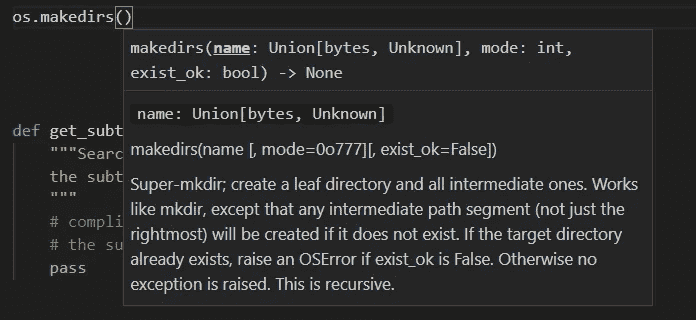
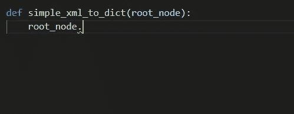
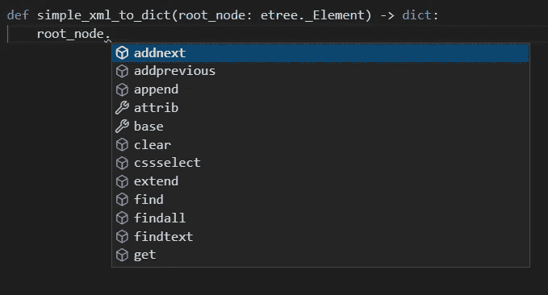
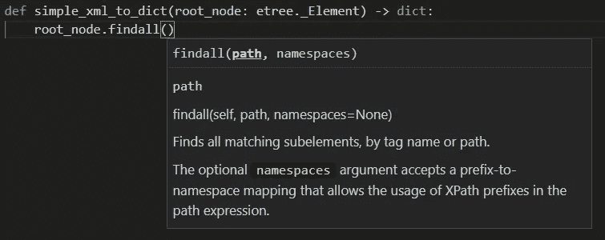

# 类型提示，简单编码(在 Python 代码中添加类型信息)

> 原文：<https://medium.com/geekculture/type-hinting-easy-coding-add-types-info-in-your-python-codes-db569a5b4618?source=collection_archive---------12----------------------->

## 为什么应该在 Python 代码中添加类型，以及如何开始。


Although dynamically typed, Python allows users to provide type information for all variables (arguments, return values, local and global variables). (screenshot with Visual Studio Code)

Python 是一种动态类型语言，这意味着您不需要向 Python 声明您使用的变量的类型。尽管如此，从 3.5 版开始，Python 允许用户以上图所示的方式为变量(参数、返回值、局部和全局变量)提供类型提示。虽然受到许多人的称赞，但许多其他开发人员觉得这个功能多余、奇怪而且丑陋。

> “类型？加油！我选择 Python 是为了让我的生活更简单。现在你让我声明类型？”
> 
> “如果我的函数既适用于字符串，也适用于整数，那该怎么办？你是让我写一些 Python 函数模板吗？这样的事情存在吗？”
> 
> “我实际上尝试过使用‘打字’模块进行类型提示，但当我开始认真使用它时，它太麻烦了。”

在这篇文章中，我将首先给出添加简单类型提示的例子，并展示文本编辑器如何利用这些提示更好地为您服务。然后，我将更深入地研究类型提示，并介绍一些稍微高级但非常有用的类型概念。最后，我会给出自己的建议，告诉你如何从类型提示开始，我认为这可能对初学者有用。

# 为什么添加类型可以使编码更容易？

我宣传 Python 提示的主要原因是**通过提供类型提示，你的文本编辑器有更多的信息来帮助你**。

现在很多人使用相当智能的文本编辑器(比如 *PyCharm* 、 *Visual Studio Code* 、 *Atom* 、*Sublime Text* 、 *vim* 等)来提高编码效率。这些文本编辑器有很好的功能，例如语法高亮、自动完成建议以及在您键入时在工具提示框中显示帮助信息(参见下图中的示例)。



Whenever possible, modern text editors automatically display help information in a tooltip box while you type. (screenshot of an example in Visual Studio Code)

然而，由于 Python 的动态类型特性，您的文本编辑器通常没有足够的信息来决定如何帮助您。而当您使用的变量大多是原始类型(`str`、`int`等)时，这似乎不是一个很大的优势。)，当处理具有复杂内部结构的类时，您的编码体验可以提高很多。

让我们举一个真实的例子。假设我们正在编写一个函数，将一些简单的 XML 转换成 Python `dict`对象。要在您最喜欢的文本编辑器上尝试下面的实验，您需要`pip install lxml`。*注意，不需要预先了解这个包或 XML。我们仅用它来说明类型提示。*(如果你有兴趣，你可以在[https://lxml.de/tutorial.html](https://lxml.de/tutorial.html)找到一个关于`lxml`包和元素树(etree) API 的很好的教程，但是你真的不需要阅读这篇文章。这个计划的所有细节都与我们无关。)

现在让我们在文本编辑器中键入下面的函数头(我在这里使用 Visual Studio 代码，但也可以随意使用您喜欢的代码)。

```
def simple_xml_to_json(root_node):
```

注意，尽管作为函数的作者，我们知道参数`root_node`是`lxml`中 etree 元素类的一个实例，Python 并不真正关心你何时编写这个函数。**事实上，我们甚至不需要导入这个包就可以在函数中使用它。**有趣的是，许多开发人员认为这是 Python 的福音而不是诅咒。好了，让我们继续尝试在函数体中使用这个`root_node`对象。

受我的文本编辑器的影响，我通常只输入`root_node.`(带“点”)，并期望为我弹出一个属性和方法的列表。相反(并不奇怪)，这里什么也没发生:



Without information about the type of the “root_node” argument, your text editor has no idea how to help you. (screenshot with Visual Studio Code)

同样，**您不会得到任何关于** `**root_node**` **的帮助信息(例如:自动完成建议)，因为您的文本编辑器不知道它实际上是什么**。我们如何向文本编辑器提供这些信息呢？通过提供类型提示！

现在让我们添加类型提示，看看会发生什么。



With some type hints, your text editor can immediately provide you with autocomplete suggestions. (screenshot with Visual Studio Code)

现在，我们能够利用自动完成功能，快速找到我们正在寻找的属性或方法。更好的是，在我们选择一个方法并键入`(`之后，我们看到那个方法的文档弹出来并向我们问候。不需要去任何文档网站，我们可以很快了解所有关于该方法和如何使用它。



Method docstring displayed while you are coding. (screenshot with Visual Studio Code)

# 深入一点类型提示

既然我们已经看到了类型提示如何帮助我们更有效地编码，让我们介绍一些更高级和有用的概念。这里有一个警告:你可以非常深入和抽象地进入复杂的技术性类型暗示的主题。在这里，我将只介绍当你开始在代码中添加类型提示时常用的概念。

还是那句话，没有比例子更好的了。看看下面的函数，它执行线性搜索并判断目标元素是否存在于集合中。为了便于说明，我添加了一个非常人为的可选整数参数`upper_limit`，默认值为`None`。如果给这个参数一个正整数，这个函数只搜索集合`l`直到这个限制。(是的，我知道，这是一个做作的关键词论证。暂时忍耐一下。)

An example function to demonstrate some adcanced type hints.

返回值的类型提示很简单，现在作为练习留下来(见下一个片段)。当我们键入 hint 参数时，我们会立即产生以下问题:

1.  我已经为第一个参数`l`使用了名称“集合”,但是它可以是一个列表、一个元组或者任何支持 for 循环迭代的东西。我们应该给它什么类型？
2.  为了使`target`和`l`中的元素之间的比较`==`有意义，它们必须是相同的(或可比较的)类型。然而，我们并不真正限制这种类型到底是什么。它们可以都是整数、字符串等。**我们所要求的就是** `**target**` **的类型和** `**l**` **中的元素是相同的。我们能在不指定类型的情况下做到这一点吗？**
3.  `upper_limit`变量肯定是整数，但可以取`None`值，类型为`NoneType`。我们如何允许一个变量是`int`或`NoneType`的类型？

让我们逐一解决这些问题。

## 可迭代类型

有经验的读者可能已经从上面问题 1 的描述中认识到`l`到底是什么。这是一个 **Python 可迭代的**。从技术上讲，Python iterable 并不是真正的类型，而是一种协议。任何支持迭代方法(类定义中的一些特殊方法)的类都被定义为可迭代类型。关于 Python iterables 的讨论值得单独写一篇文章。这里你需要知道的是，如果你能做`for x in obj`，那么对象`obj`就是可迭代的。比如列表，元组都是可迭代的。文件处理程序(由`open`方法返回的对象)是可迭代的，因为您可以通过`for line in fhand`来迭代文件的行。

我们如何暗示`l`是一个可迭代的对象？好消息是，iterables 在 Python 中无处不在，它的类型提示已经被创建了。你需要做的就是从`typing`模块导入`Iterable`。

现在我们的函数变成了下面的(我从现在开始省略函数 docstring。我这里还加了返回类型，是`bool`。

An example using Iterable type from typing module

注意这里我们只说了`l`的类型是可迭代的，但是没有提供任何关于`l`的元素类型的提示。元素可以是任何类型。我们可以通过暗示 iterable 元素的类型来改进这一点。例如，要声称`l`中的所有元素都是整数，只需用`Iterable[int]`代替`l`。

这里我们遇到了问题 2。同样，我们只想声明`target`和`l`中的元素属于同一类型，但不限制这种类型实际上是什么。它们可以是整数、字符串或任何其他支持`==`的类型。

“类型变量”的想法扭转了局面。

## 类型变量

对于问题 2，我们需要一些通用类型(或类型占位符)。您可以使用`typing`模块中的`TypeVar`来定义这样一个占位符。下面是这个函数现在的样子。

这里我们声称`l`是一个 iterable，它的元素是类型`T`(可以是任何具体类型)，而`target`是同类型的变量`T`。太好了！

现在让我们来看最后一个论点。我们倾向于选择`upper_limit: int=None`,因为它是一个整数。然而，这一行没有意义，因为它的默认值`None`本身不属于类型`int`。(请注意，如果您这样做并调用函数，您的代码将会运行！Python 本身并不真正为您检查类型。顾名思义，它们只是类型提示，而不是类型声明。然而，`upper_limit: int=None`简直令人费解。)

## 联合和可选

解决这个问题至少有两种方法。首先，我们可以声称`upper_limit`是`int`或`NoneType`类型。`typing`模块中的`Union`类型用于解决这种“非此即彼”的情况。利用`Union`，我们可以写出`upper_limit: Union[int, NoneType]`。

由于`None`是许多可选变量非常流行的默认值，`typing`模块还引入了另一个名为`Optional`的家伙来满足我们的需求。比如`Optional[int]`和`Union[int, NoneType]`本质上是一样的。

是时候完成我们的功能了

# 给初学者的最后几句话

如上一节所示，您可以深入研究 Python 的类型提示系统，很快事情就会变得很糟糕。虽然掌握类型提示非常有价值，特别是对于一些大组织和大项目，但是对于初级开发人员来说却是不必要的复杂。幸运的是，Python 允许您逐渐采用类型暗示知识和实践。如果你的代码没有类型提示，甚至是错误的类型提示，Python 不会拒绝运行你的代码(同样，类型提示不会改变 Python 的动态类型本质，在运行时会被解释器忽略)。我个人的建议是，利用这个渐进的特性。当您添加类型信息时，请确保您添加了正确的信息，但没有必要键入任何提示。

还要注意，有类型检查工具(例如:`mypy`)可以用类型提示检查你的代码(就像编译源代码时编译器所做的)。然而，它可能会对初学者造成一些最初的挫折，并使您过早地陷入更高级类型的泥淖中，这暗示了一些不必要的技术性问题。如果这让你感到沮丧，那就先不要这样做，只有在你对类型提示更加熟悉之后再来做。

在我看来，下面是一些添加类型提示会对你或你的代码用户有所帮助的例子:

1.  **参数是某些类的实例的函数**。正如我们在上面所演示的，如果类本身有很好的文档记录和类型提示，当您使用这个参数时，您可以立即从您的文本编辑器中获得有用的帮助。
2.  **如果你正在编写一个模块(供自己或他人使用)，试着给每个函数(参数和返回值)或类(类变量和方法)添加类型提示**。这将确保模块的用户可以获得帮助。事实上，在这种情况下，我建议编写格式良好的 docstrings，但这将值得另一篇文章讨论。

我真的希望这篇文章将成为对那些开始编写精彩 Python 项目并正在寻找提高代码质量的简单技巧的人的邀请。请在评论中告诉我你的想法，并让我知道你可能会对哪些编码主题感兴趣。这将鼓励我写更多有用的文章。

编码快乐！