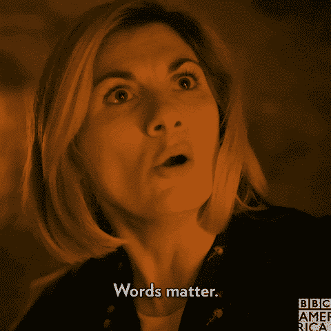
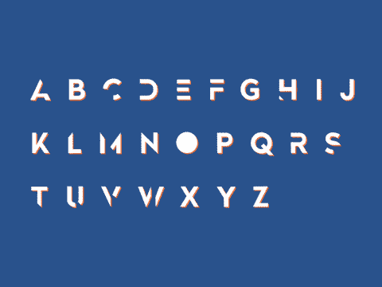
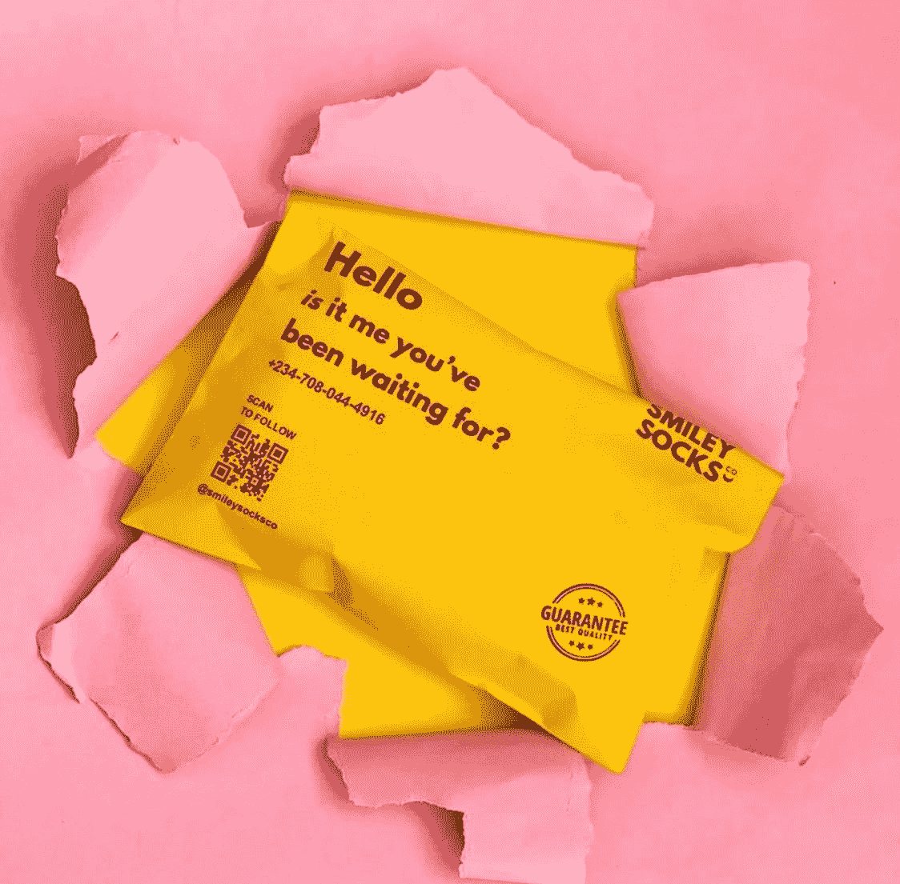
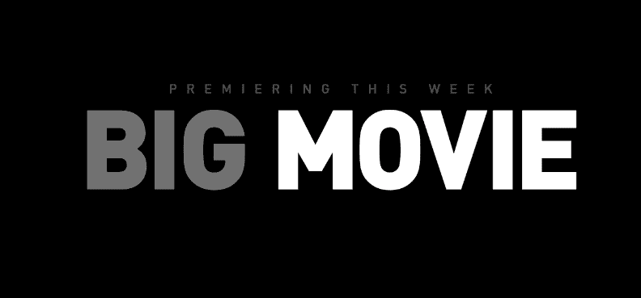
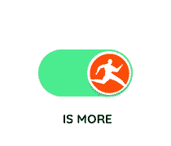

# 排版，字体和设计。

> 原文：<https://medium.com/geekculture/typography-fonts-and-design-674f2dbbe92c?source=collection_archive---------28----------------------->

文字是我们人类日常生活的一部分。从推文，到书中的一行，到阅读考试的说明，到遵循网站上的步骤，以及你现在正在阅读的这些。它们就在我们周围，虽然看起来微不足道，但我们离不开它们。

文字也超越了书写它们的语言。虽然通常情况下，普通人更关注他们遇到的文字的意义或信息，但设计师(阅读超人)知道文字超出了这一范围，这就是印刷术的用处。

印刷术是一种以清晰易读、视觉上吸引人的方式排列字母和文本的艺术。这是每一个有意的步骤，都是为了让文本有一个预期的外观。没有好的排版就没有好的设计。事实上，伟大的排版是伟大设计的一个要素。它在文本的功能性(即易读性)和美观性之间取得了平衡。

排版是如此强大，如果利用得好，它可以以一种特定的方式影响读者的决定。品牌认知度也可以通过排版来建立。例如，有一种观点与 Smiley Socks(尼日利亚袜子品牌)的产品包装相关联。通常，当这种设计出现在任何不是笑脸袜的包装上时，笑脸袜仍然会留在人们的脑海中。如果利用得好的话，这就是印刷术的强大之处。

接下来的问题是，你如何创造伟大的排版？你是如何有意识地安排信件和文本的？对于一个初学者来说，无穷无尽的字体和字体选择可能会让人不知所措，学习何时以及如何恰当地使用它们可能会令人困惑。但不会太久。

因为有很多关于字体设计的东西需要学习(这里无法详尽解释)，这篇文章将被限制在以下几个方面:

1.  字体和字型的区别
2.  字体类型
3.  影响字体选择的因素

字样不是字体，字体也不是字样。尽管它们一直被交替使用，特别是被非设计师或非专业人士使用，而且它们之间的区别在大多数人中间是模糊的，但从技术上讲，它们是不同的。简单地说，字样是一组具有相似设计特征的字体，而字体是字样的一个版本。

例如，漫画无是一种字体，它有漫画无女士粗体，漫画无女士，漫画无女士斜体等。作为字体。因此，就像一个艺人可以推出一个有 10 首歌的专辑，但你不会用专辑名称来代替一首歌，字样也不同于字体。字体是字体册中的一个轨迹。

一般来说，有五种字体。它们是衬线字体、无衬线字体、草书字体、幻想字体和等宽字体。**然而，最广泛使用和接受的是 Serif 和 San Serif** 。今天设计中使用的字体属于这两种类型。

衬线字体是一种带有装饰性笔画或词干的字体，附在主字母上。它们用于更传统或经典的环境中。另一方面，San 衬线只是简单的字体，没有额外的笔画或词干。它们被用来描绘极简主义和现代主义。它们也很容易阅读，并经常用于电脑和手机屏幕。

有了无穷无尽的字体和字体选择，这里有一些因素可以指导设计师选择合适的字体和伟大的排版:

*   **谁是你的观众？**

信息的受众在影响设计中使用何种字体方面起着重要作用。这是因为，如前所述，文字传达的信息不仅仅是这些文字的含义。这也是如何出现这样的话，预计会使其观众的感觉。为了达到预期的效果，设计师必须决定谁是他的观众，并找到吸引这些观众的东西。

例如，为孩子设计时，没有字体的漫画比使用 Heveltica 更合适。然而，一个律师会发现在他的名片设计上没有漫画是很不合适的，因为这不符合他作为律师的正式感。

*   **你传达信息的目的是什么？**

这与第一个密切相关。但这是了解你的观众的另一端。了解你的听众是一回事，能够识别你要传达给听众的信息以及他们的期望是另一回事。你对字体和版式的选择通常会引起一定的反响。设计师在传递信息时寻求的反应也会影响字体的选择。我要他们停下来看看吗？我要他们再看一眼吗？我想让他们看到这个时感觉良好吗？这条信息的“为什么”是什么，我如何通过信件传达它？

*   **创造对比:**

在决定文本的安排时，创造活力和独特排版的一个重要方式是用对比来处理文本。对比可以通过颜色、重量、风格、间距和尺寸来实现。大字体的页眉和小字体的正文是由对比形成的。对比可以是将句子中的一个单词着色以示强调，也可以是相同的字体但不同的粗细。当对比在不同的方法中使用时，它可以用来实现伟大的排版。记住，在排版的游戏中，对比确实是王道。

*   **层级:**

这决定了你想让你的读者首先看到和阅读的文本，并通过字体、颜色或其他方式突出它们。当你想强调一个单词或一个句子时，它会影响你对字体的选择。

*   **一致性:**

虽然看起来有这么多的选项可供选择，设计师在尝试时可能想尝试各种字体，但一个项目最好有 2 到 3 种字体。与其通过使用多种字体来创造多样性，更好的选择是对比两种或三种字体。在挑选字体时，少就是多。

*   **测试培养基:**

在结束一个特定的设计或排版之前，一定要在预期的最终媒介上进行测试，确保它看起来像你想要的样子。

总之，没有好的或坏的字体，只有不好的字体使用，对排版的掌握可以防止在任何设计中出现这种情况。用一位设计天才的话说，“排版就像时尚和家具。除了极少数功能上的例外，这个世界不需要新的服装或家具设计，但人们希望看起来与众不同，或者通过它们的外观唤起一种特殊的感觉”。

设计师的责任是能够使用看似规则的字体来帮助品牌看起来独特和不同，并通过使用这些字体来创造一种精心设计的体验。

这就是印刷术的意义。