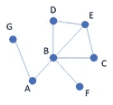
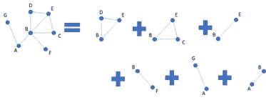

# 通过图的循环基理解群落动态

> 原文：<https://medium.com/geekculture/understanding-community-dynamics-through-cycle-basis-of-graphs-6a74aff94d41?source=collection_archive---------35----------------------->

Graphs are the emerging tools to understand the group behaviour of the interconnected world we live in

随着我们周围的世界在日益全球化的道路上继续根除其传统的本地设置，试图通过大量的行为和背景数据来理解其演变性质的业务需要一种新的*通用语* —网络语言。

如果不将个体行为置于群体动态的背景下，就不可能理解个体行为。因此，要理解个体，就必须理解群体行为。但是我们所说的群体行为是什么意思呢？更重要的是，什么是团体？

种族文化身份主导社会规范并根据祖先、社会关系、特征和基因相似性定义相似群体的时代正在迅速消失。相反，全球化的世界产生了一种新型的功能团体。一起工作的人。共享业务的人。经常光顾同一家商店的人。尽管他们在文化、种族和可能的经济背景上存在巨大差异。

纯粹从数据的角度来看，这意味着需要改变我们的算法来理解群体和群体行为。长期以来，定义和理解群体的主要工具是各种聚类方法。但是所有这些方法都是在寻找相似组的共同原则下工作的。但要真正理解 21 世纪的群体行为，我们需要理解功能性群体——利用网络社区。

网络是图表。节点和边。每个个体都是一个节点。两个人之间关系的强度是由相邻边的重量来表示的。简单。

但是，等等，我们可以用这些抽象图形解决什么问题呢？它们与分析个人行为有很大不同吗？难道我们不能简单地汇总社区成员的行为吗？

让我们看一个例子。让我们想象一个 11 人的足球队。现在一个自然的问题可能是任何这样的团队形式是否有可能赢得冠军。你可能已经明白了，仅仅根据球员的名字和名气做出这样的预测是不切实际的。我们玩的是 4-4-2 组合吗？我们是否在右后卫的位置上安排了合适的球员？玩家们一起玩了很久了吗？这些考虑就是我们所说的社区的*结构特征*。

作为一支足球队的成功不仅仅取决于它的球员名单，要理解一个社区的行为，仅仅汇总其成员的属性，或者我们所说的*节点特征*，是远远不够的。

既然我们已经确立了*结构特征*在理解群体行为中的重要性，我们就准备面对一个大问题——我们如何量化结构这个相当抽象的概念？如果我们能做到这一点，那么我们就能解开一系列其他问题的答案——两个社区在结构上有多大不同？一个社区的内在结构在多大程度上决定了它的成功？对于一个给定的社区，结构是如何随着时间的推移而演变的？

但是，从表面上看，这个问题似乎很棘手。不仅结构的本质与节点数无关，而且与边数无关。例如，下面的示例中，社区(a)和(b)正好有 4 个组成节点和 4 条共享边。但显然它们在结构上是不同的。

**图 1 —** *具有相同成员数量的社区可以有非常不同的结构*

每当我们面对一个抽象问题时，不可避免地我们需要能够分解成许多更简单的单元块，然后让这些单元的独特组合定量地定义抽象对象。用更数学的术语来说，我们正在描述一个向量空间。假设 *V* 是所有“抽象”对象的集合(例如，在我们的例子中是图形社区)。如果我们能从同一空间找到更简单的物体(即更简单的图形)

到这样的程度

如果系数是“数字”，那么抽象对象可以被合理地量化为有序元组

但为此，我们需要定义这些抽象对象的某种形式的“加法”,以及将一个抽象对象与一个“数”相乘意味着什么。这些“数字”到底是什么？

碰巧的是，对于我们的抽象对象，即图形社区，我们可以定义这样的结构。让我们从一个有 n 个节点的图 G 开始。现在假设 K 是具有 n 个节点的完全图，即其中所有节点都相互连接的图。所以很明显 G 是 k 的子图。

现在让 X 是 k 的子图的集合。同样，我们知道 G 属于 X。这意味着我们已经得到了我们正在寻找的抽象对象的集合。我们需要做的就是在 x 的元素之间提出一个‘加法’方法。

设 G，H 是两个有 n 个节点的子图。我们需要定义 G+H，一种方法是考虑图的异或并。换句话说，如果 E 是 G 或 H 中的边，但不是两者都是，那么我们把它保留在 G+H 中，但如果它是两者的边，那么它就不包括在和中。举个例子，

**图二。******图的添加示例****

******

***不难看出，这种加法具有我们所熟悉的和的所有优良性质，例如交换性、结合律等。同样很容易看出，如果你添加一个子图 N(没有边的图),你会得到同样的图。所以在某种程度上，空图就像正常加法中的零一样。到目前为止还不错，是吧？***

***现在来看“数字乘法”。原来我们只能乘以 0 和 1。乘法很简单。如果你把任何图乘以 0，你得到的是空图。和预期的一样，乘以 1 后，图形保持不变。***

***很简单，不是吗？嗯，还有最后一个问题。如果我们尝试添加一个图本身呢？从加法的性质我们知道，***

***(1+1) G = 1 X G + 1 X G = G + G = N = 0 X G***

***这意味着我们需要“数字”本身在加法下以某种方式表现，即我们需要采用二进制加法方法，其中 0+0=0，0+1=1+0=1，但 1+1=0。***

***好了，现在我们被覆盖了，并且在 x 中有了一个合适的向量空间，我们能像承诺的那样找到一个基表示，然后完成它吗？当然，但是在那之前我们需要稍微绕道。***

***你看，我们会发现，我们希望用作基础的“简单”图形块可以有两种类型。首先，我们有单股连接的节点，我们称之为*路径*。是的，我们可以很容易地看到一些例子。***

******

***在示例(a)和(b)中，显然我们各有一条路径，而(c)包含 3 条单独的路径。因此，我们已经可以看到，计算不同长度路径的数量开始让我们深入了解图的结构。***

***但是还有另一种类型的基本“简单”图——*循环*。它们正如其名字所暗示的那样。我们已经在*图 1.a* 中见过其中一个，从技术上讲是一个四冲程发动机。但是自行车可以有不同的尺寸。***

******

***它们可以根据我们定义的加法规则相加。因此，我们可以谈论所有线性循环组合的空间——*循环空间*。***

***很简单—我们已经有了*路径*和*周期*。它们足以自底向上描述任何图吗？事实证明确实如此。任何有 n 个节点的图都可以分解成~n/2 个边不相交(即不共享边)*路*和*圈。这是一个我们不会试图证明的定理，但我们肯定可以举例说明。在下面的例子中，我们将继续使用前面定义的图形相加的概念。****

*****例 1。*****

******

*****例二。*****

******

***厉害！现在要量化，我们只需要计算*周期*和*路径！*但是等等，并不是一个图中的所有圈都是初等的，在图 3 的*图中，****

*****图三。** *带有循环和路径的示例图****

******

***我们有 3 个*周期*，它们彼此线性相关，如下所示***

******

***因为图是有限的，所以会有一个有限的最小独立的*圈*集合，它可以通过它们的线性组合生成图中所有的*圈*。显然，任何这种组合中的系数不可避免地会是 0 或 1。这些最小循环是独立的，因为它们都不能写成一个或多个循环的和。换句话说，我们在谈论一个基础——一个*周期基础。*另一个定理指出，如果图中有 p 个节点和 q 条边，那么这种最小独立*圈*的数目是(q-p+1)。***

***另一方面，设 E 是图中不属于任何*循环*的边。我们称这样的边为*非循环边*。现在考虑由非循环边的线性组合获得的所有可能的子图。这样的组合不可能是一个*循环*,因为根据定义，形成该组合的边不可能是*非循环的*。让我们把所有这些组合的空间称为*路径空间。*我们也可以得到那个空间的基，称之为*路径基。****

***最后，我们可以将任何图分解为其*循环基*和*路径基*的线性组合。我们将这种线性组合的系数称为*帧*。这些系数也是二进制的。但是我们可以做得更好一点。我们可以在分解中计算出*k-循环*的数量，并在图分解中计算出*k-路径*(长度 *k* )的数量。这两组数字一起对图形结构的必要量化进行编码。***

***是时候举另一个例子了。这是图 3 中图表的基本表示。***

*****图 4。**图分解成*循环基*和*路径基。****

******

***正如我们可以看到的，在分解中有两个 3-环和 4 个 1-路径，这使我们能够将结构量化为[(2，0，0，0)，4]。换句话说，该图可以写成两个 3-圈、无高阶*圈*和 4 个*无环边*的和。这成功地将图的结构映射到我们非常熟悉的欧几里得空间。这将允许我们通过将这些点标绘为在真实欧几里得空间中具有值的通常时间序列，来回答诸如社区的结构如何随时间演变的问题。在下一章，我们将以世界贸易关系为例，讨论它们是如何随着时间的推移而演变的。***

***(未完待续)***