# 通过聚类分析了解美国各地区

> 原文：<https://medium.com/geekculture/understanding-us-regions-through-cluster-analysis-4ab87472b899?source=collection_archive---------9----------------------->

美国人在交谈中通常提到美国南部或中西部等地区，但我们在提到它们的边界时往往会有不同意见。DC 在南方吗？堪萨斯城在中西部吗？大西洋中部到底算不算一个地区？问任何十个美国人这些问题，你会得到十一个不同的答案——至少如果我自己的家庭是这样的话。那么我们到底为什么要使用这些分组呢？如果我们要使用它们，有没有更好的方法来定义它们？

区域化——在概念上将一个大区域划分成更小区域的做法——在媒体和话语中无处不在。通过将不可能的复杂整体分解成更小、更同质的行动者，区域化让我们将差异和趋势提炼为更容易理解的叙述。对于美国这样一个具有巨大多样性和深刻分歧的国家来说，这种方法是持续的，也是必要的。人口普查局将美国划分为四个地区和九个更小的区域，评论员们滔滔不绝地谈论着“[锈带，或者“](https://en.wikipedia.org/wiki/Rust_Belt)[红蓝美国”，记者科林·伍德尔德的 2011 年畅销书《T7 美国民族，T8 和 T9》引起了轰动，他声称美国可以被理解为 11 个具有不同历史根源的相互竞争的国家。然而，这些区域化的尝试有统计学依据吗？它们仅仅是习俗或文化，还是美国真的可以分裂成具有显著客观差异的不同地区？为了找到答案，我决定做一个聚类分析。](https://www.seattletimes.com/nation-world/nation/election-reveals-deeper-divides-between-red-and-blue-america/)

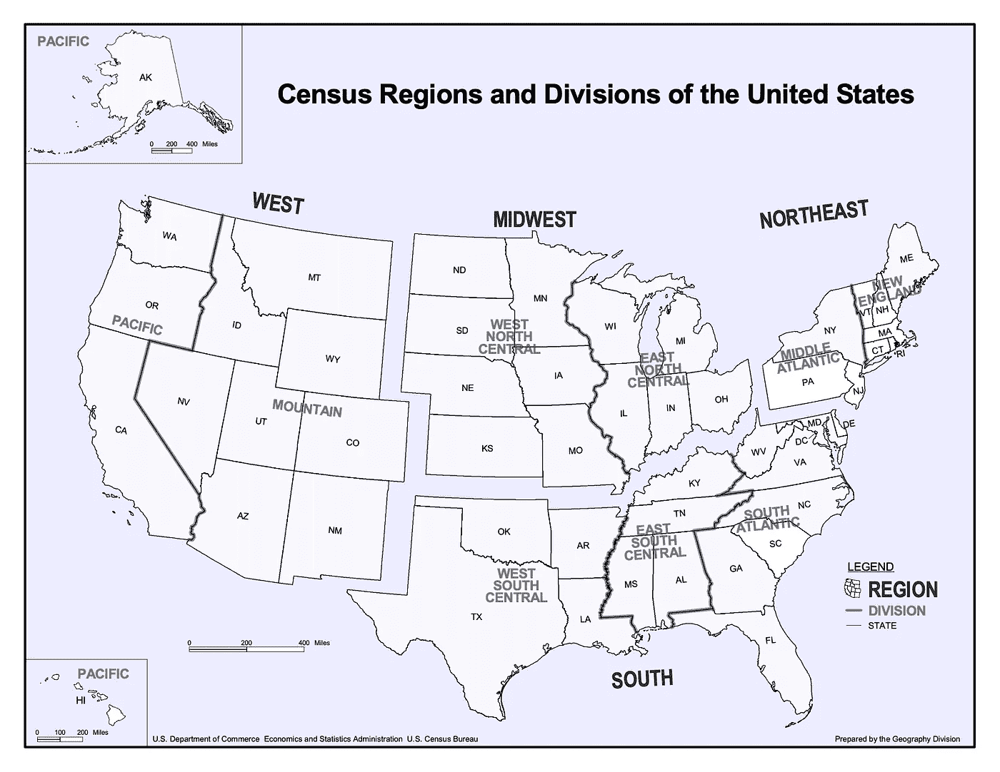

US Regions as defined by the US Census Bureau

正如我在上一篇文章的[中解释的，聚类是一种无监督学习，其中一种算法用于将观察值分配到先前没有定义的类别中。简单来说，就是用数学把东西分类到新的组里。如果传递给聚类算法的要素存在显著的区域差异，我们可以预期聚类边界会反映这些差异。如果地区差异不显著，集群的分布将更加分散，反映出城市和农村地区的差异，而不是地区差异。为了获得覆盖整个国家的广泛数据集，我使用了](/geekculture/introduction-to-clustering-ff905d79bef9)[县一级的贫困、人口、失业、收入和教育数据集](https://www.ers.usda.gov/data-products/county-level-data-sets/)，这些数据集是由[美国农业部经济研究局](https://www.ers.usda.gov/about-ers/)准备的。使用县级数据有一些缺点-县在人口(从不到一百到超过一千万)和面积方面有很大的差异，西部县通常包含大片任意的土地-但县和相当于县的区域覆盖整个国家，是美国少数几个对所有区域平等收集和维护数据的分区之一。至关重要的是，县也有 FIPS 编码，这是地理区域唯一标识符的标准编码。整个联邦政府都使用 FIPS 代码来标识州和县，允许跨部门和跨时间地连接县级数据。ERS 提供的关于不同主题的县级数据来自联邦政府的不同部门，但由于 FIPS 编码，这些数据经过一些清理后可以合并成一个单一的数据集。最终，聚类基于七个人口统计和经济统计，第八个统计，贫困百分比，被清除，但保留在聚类中供以后使用。我不会在这里进入太多的技术细节，但对于那些感兴趣的人，我在脚注*和[中提供了一些信息，完整的码本和数据可在我的 Github](https://github.com/peckben1/Capstone) 上获得。

那么结果如何呢？看一看:

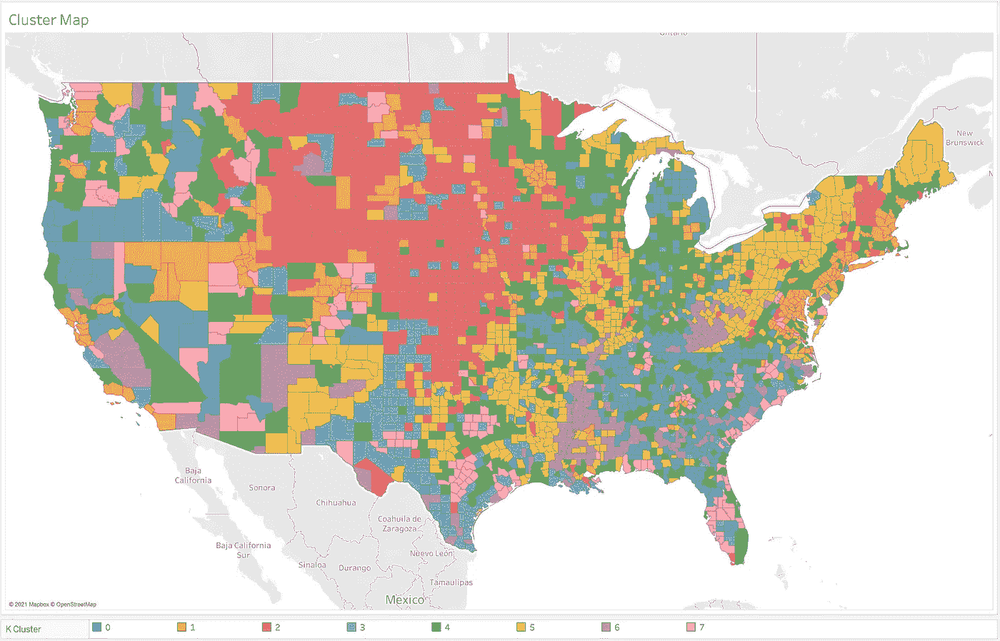

Map generated by the author using Tableau, as are all following graphics unless stated otherwise

尽管完全没有地理特征，但这八个聚类显示了显著的地理一致性，尤其是在该国东部地区，那里的县较小。虽然星团有些混杂，但一眼就能清楚地看出，红色星团 2 统治着大平原，绿色星团 4 斜着穿过中西部，点缀着橙色星团 1 的斑点，阿巴拉契亚北部是黄色星团 5 的狭长地带，终止于紫色星团 4 的密集斑点。每一个集群都是由它自己独特的趋势组合定义的，随着更深入的分析，甚至更明显复杂的地区，如美国南方腹地，也开始形成清晰的区域模式。我为每个集群准备了一个图形**和描述。请记住，该描述通常适用于集群，可能并不完全适合集群中的每个县。事不宜迟，让我们依次介绍这八个集群。

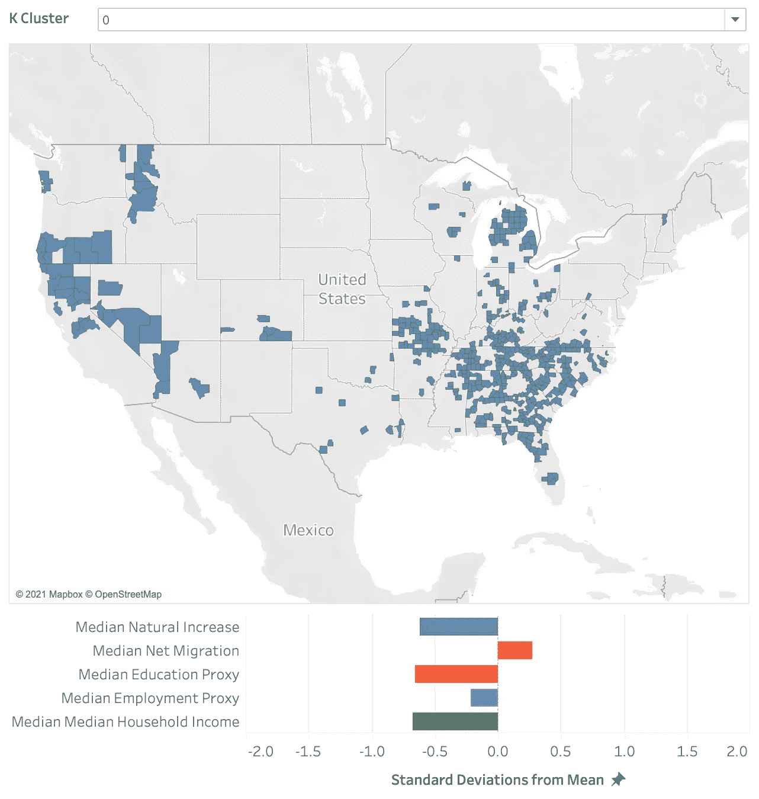

**集群 0:衰落的农村**

这组国家的教育和收入水平低于平均水平，就业水平略低于平均水平，自然增长率(出生和死亡的差额)也是所有国家中最低的。他们有一个积极的衡量标准是净移民——来这些县的人比离开的人多。这些大部分是农村的县构成了南方腹地、密歇根下半岛北部、加利福尼亚北部和俄勒冈南部以及欧扎克高原的大部分。随着新来者的涌入，他们无法跟上人口自然负增长的速度，他们的人口正在逐渐减少。事实上，这些县都不在大平原或东北部。

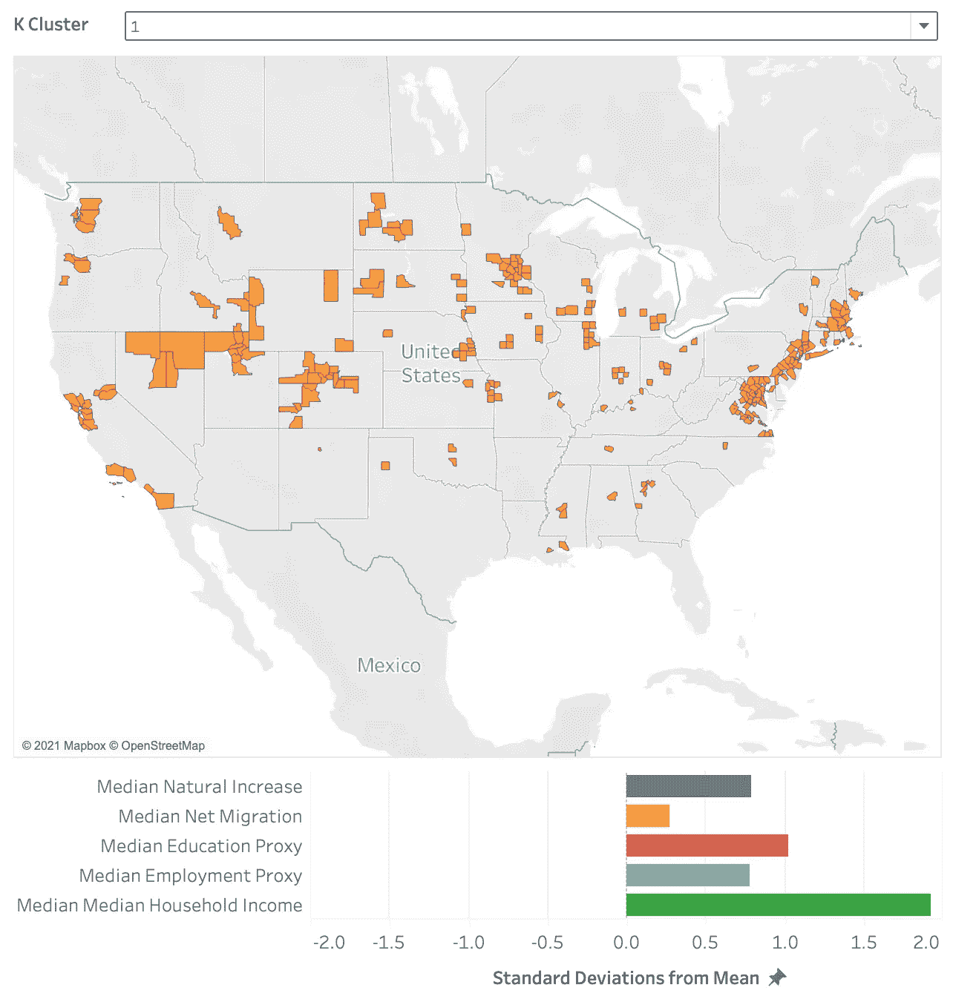

**集群 1:富裕的城市**

并非所有这些县都是城市，许多主要城市中心也不在其中，但它们是城市化程度最高、人口密度最大的集群，平均人口超过 15 万。这些县在所有指标上都高于平均水平，但尤其突出的是他们的高教育水平和天文数字的家庭收入中位数，在这两个方面，他们领先于所有其他集群。他们在东北大都市最为突出，但也在海湾地区、盐湖城大都市地区、科罗拉多中部和明尼阿波利斯-圣保罗大都市形成重要群体。全国范围内的主要城市通常伴随着至少一个来自该集群的县，并且它们经常与集群 4 一起出现。第 4 组在南方明显不太常见。

**集群 2:中心地带**

这个星团统治了大平原，出于某种原因，也统治了佛蒙特。它所在的县大多是农村地区，教育程度高得惊人，就业率也是所有集群中最高的，但收入仅略高于平均水平。随着平均自然增长率和净移民率显著下降，这些国家已经很少的人口随着人们的离开而减少——也许是为了在收入更高的地方利用他们的教育。也许是地理上最一致的群，群 2 实际上有效地描述了一个地区的现状。

**集群 3:回家**

第三组在统计上有点古怪。在西德克萨斯和墨西哥湾沿岸的部分地区占主导地位，并分散在其他地方，它展示了荒谬的高自然增长率——超过下一个集群的一半——但强烈的负净迁移。人们正以很高的速度离开这些县，但他们仍在增长，因为人们的出生速度更快了。此外，第三组国家的教育水平很低，收入低于平均水平，就业率略高于平均水平。第 3 组中的许多县是农村，但它也包括美国一些最城市化的县，包括洛杉矶县、达拉斯县、哈里斯县(德克萨斯州休斯顿的所在地)以及皇后区、布鲁克林区和布朗克斯区。这是一个在统计上很强的分组的主要例子，但是在没有使用算法的情况下，不太可能发生在人类分析师身上。

**集群 4:郊区**

像集群 1 一样，该集群的名称是一个宽泛的概括:其中的一些县明显是城市(例如，伊利诺伊州库克县)，而其他县则相当农村，但非常一般地说，它们的人口中等，在每个指标上都略高于平均水平。该集群主要集中在中西部的一个狭长地带，但它的名字体现了它更广泛的作用:集群 4 中的县不一定是郊区，但它们经常围绕集群 1 和集群 7 中的县。看看下面大亚特兰大、东北大都市和德克萨斯三角的三个例子，就明白我的意思了——集群 4 的绿色县环绕着集群 1 和 7 的橙色和粉色县。

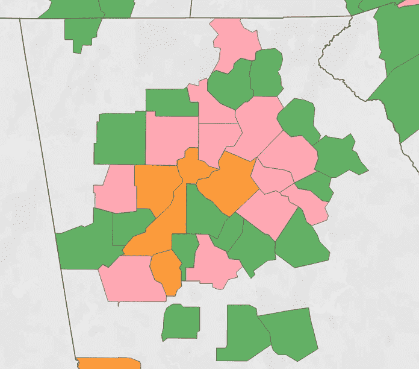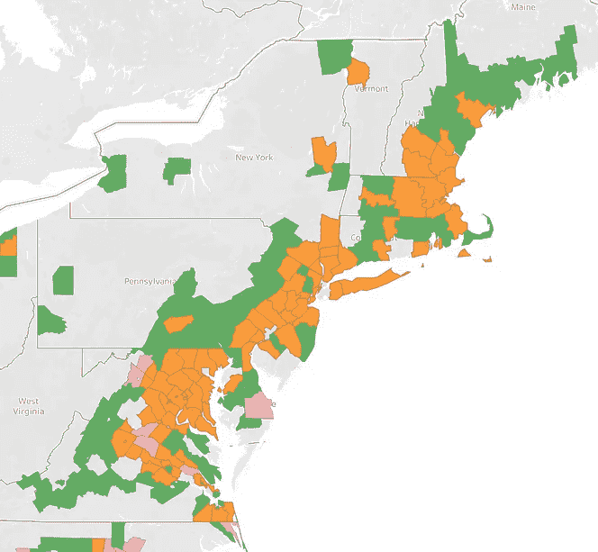

Interactions between clusters 1, 4, and 7 in Greater Atlanta, the Northeast Megalopolis, and the Texas Triangle, respectively.

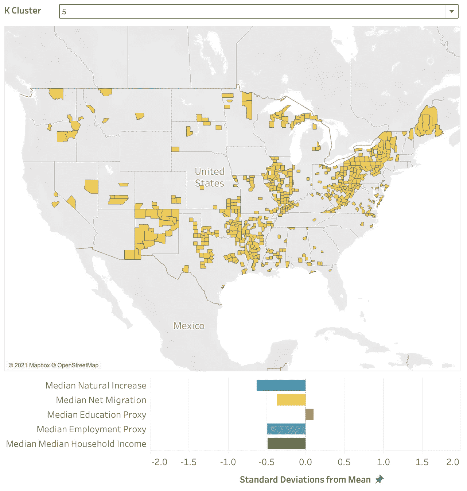

**集群 5:铁锈郡**

第五组主要由几个地理上相关的不同县组成，但有一个共同点:他们通常不如以前做得好。相对农村而言，第 5 组受教育程度稍低，但在所有其他指标上都低于平均水平，特别是自然增长率，在所有组中排名最低。这个集群包含了许多以前的制造业地区和其他失去了主要产业且未能恢复的地区。因此，集群 5 就业不足，人口减少。事情很糟糕，但至少不像第六组那么糟糕。

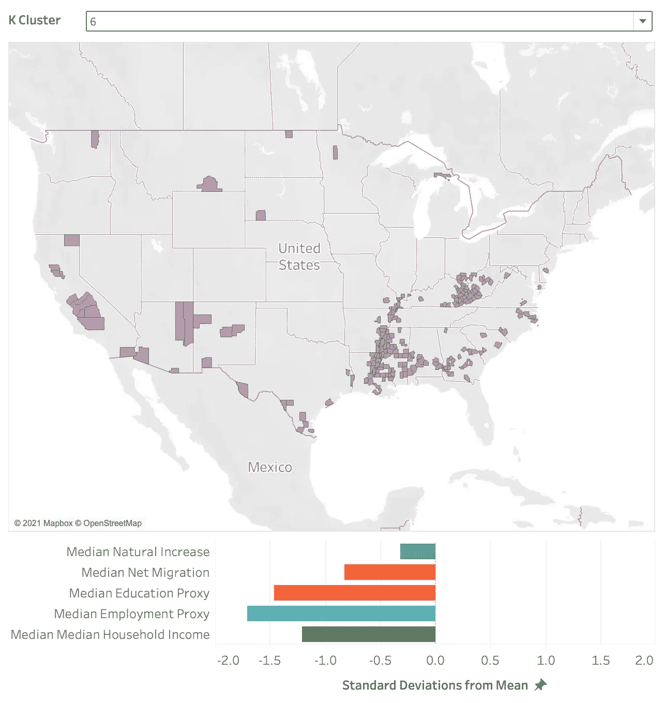

**集群 6:历史上被剥夺**

群组 6 中的县都是农村地区，集中在几个不同的地区，形状极其粗糙。在所有指标中均低于平均水平，并且在大多数指标中特别低于平均水平，集群 6 拥有最低的净移民、教育、就业和收入记录。它也深受极度贫困之苦。不幸的是，原因很明显:第 6 组的大多数国家属于四个不同的组别。第一个大致呈月牙形的群体沿着密西西比河谷延伸，深入南方，这就是**黑带——这是一片肥沃的土壤，曾是美国奴隶制的中心。在奴隶制度、种族歧视和系统性种族主义之间，这些地区从未完全恢复。下面是聚类 6 的一部分与 1861 年地图的比较，该地图是根据 1860 年的人口普查编制的，其中各县根据被奴役人口的百分比进行着色。**

**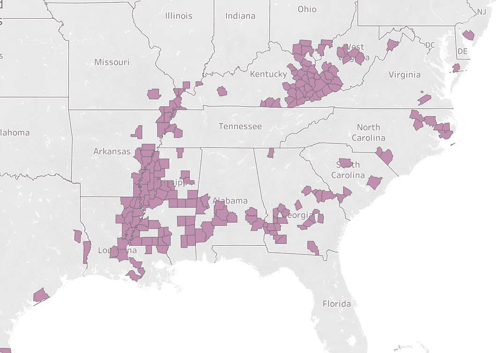****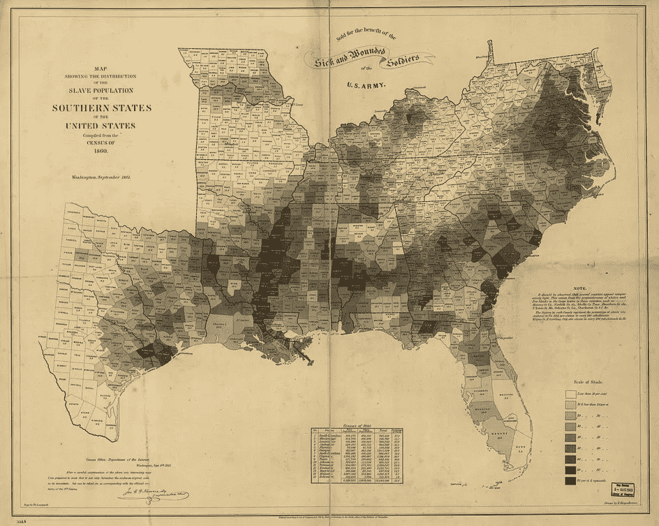**

**See any similarities? They’re not a coincidence. [Historic map from the Library of Congress.](https://lccn.loc.gov/99447026)**

**组成第 6 组的其他三个组也有类似的经历。密西西比州西部的许多分散的县直接与联邦印第安人保留地**相对应，这些保留地有自己经历歧视和贫困的历史。加利福尼亚中央山谷的大部分地区也属于这个集群。作为一个高度农业化的地区，该地区与该州的其他地区相当隔绝，历史上曾有大量的西班牙裔人口，包括许多流动农业工人。不对应于少数民族人口的群 6 的一个重要部分是肯塔基东部的阿巴拉契亚地区和西弗吉尼亚的一部分。**曾经的煤炭之乡**，这个美丽但[难以开发的](https://www.nytimes.com/2014/06/29/magazine/whats-the-matter-with-eastern-kentucky.html)地区除了资源开采之外从来没有太多的工业，随着资源的消失，它与其他历史上贫困的地区一起陷入了代际贫困的深度循环。****

**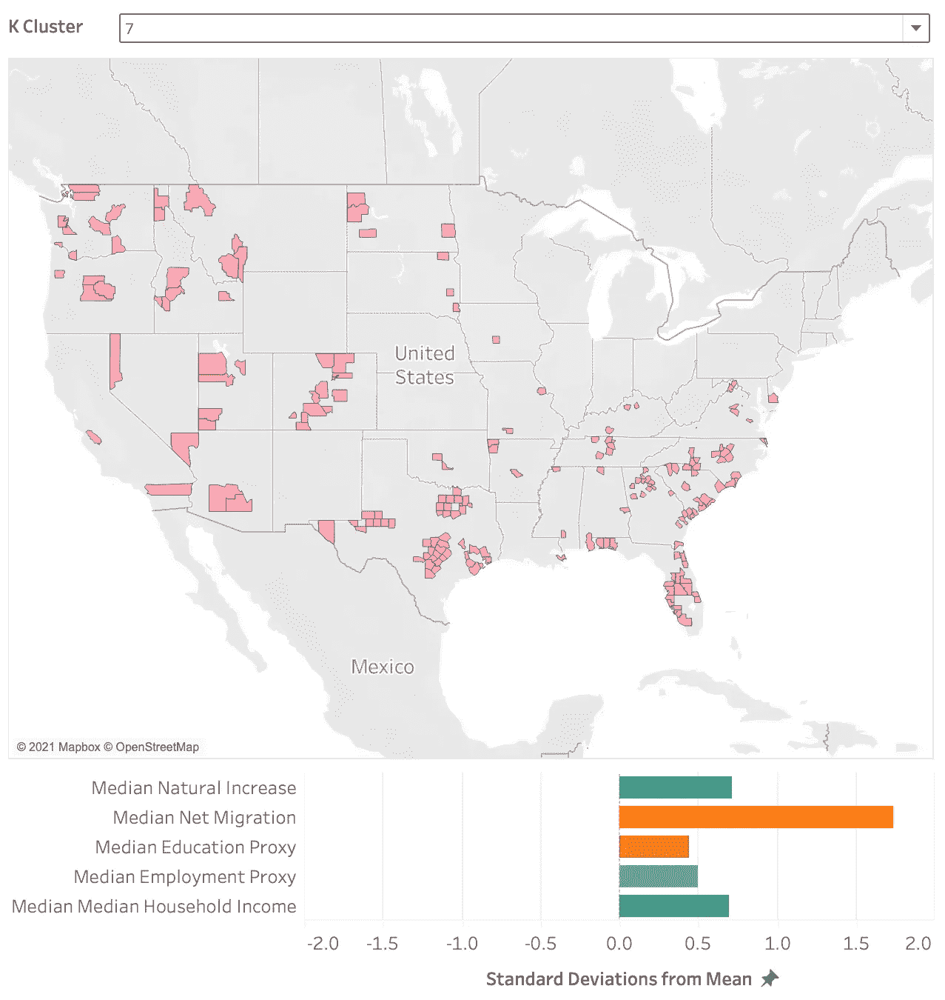**

****集群 7:新兴城镇****

**最后但肯定同样重要的是集群 7——一个人口相当多的城市集群，在每个指标上都高于平均水平，但最重要的是其爆炸式的增长。这些县中有许多位于南部和西部，反映了美国人向阳光地带的迁移以及年轻产业和大都市地区的增长。该集群中的一些县出乎意料地小且偏远，但仔细观察会发现它们绝对符合要求:北卡罗来纳州威廉姆斯县乍一看可能不像是一个“新兴城镇”，但随着该地区处于石油繁荣期，人口在十年内翻了一番。像集群 1 一样，集群 7 通常不单独定义一个区域，而是一个清晰的区域生态系统的一部分。在中西部和东北部的老增长地区，集群 7 几乎不存在。**

**那么，这一切给我们带来了什么？**

**事实证明有几件事。首先，我们可以使用聚类标签来更好地了解各个县。了解一个县所在的聚类使我们一眼就能掌握该县的基本状态，并可以增强预测建模(如果您对统计细节不感兴趣，请随意跳过本段的其余部分)。如果你还记得的话，早些时候我把贫困的百分比放在一边，并没有把它传递到聚类算法中。因此，我现在可以使用看不见的贫困数据来检查聚类的有用性。仅通过传递到聚类中的要素及其交互项预测贫困百分比的基本线性回归模型解释了数据中 79%的方差-当聚类标签添加到预测模型中时，它解释了 82%的方差。均方误差同样有所改善，从 7.55 降至 6.51。由于要素在不同聚类中的交互略有不同，因此了解一个县所在的聚类有助于我们更准确地预测贫困程度。这应该适用于与用于创建聚类的要素相关的任何要素，并且考虑到聚类惊人的地理一致性，这可能是相当多的。这种聚类有可能被用来了解投票习惯、人口老龄化和少数群体分布等特征的区域趋势。**

**集群的地理一致性给了我们第二个主要好处:区域化。聚类标签不仅使我们能够更好地了解单个县，而且还使通常过于复杂而不容易掌握的区域分组变得可见。虽然一些集群自己界定区域，但其他集群在区域系统中相互作用。有一些编程方法可以定义这些区域组，但那是另一篇文章的主题。现在，这里有一张地图勾勒出了星团形成的大致区域:**

**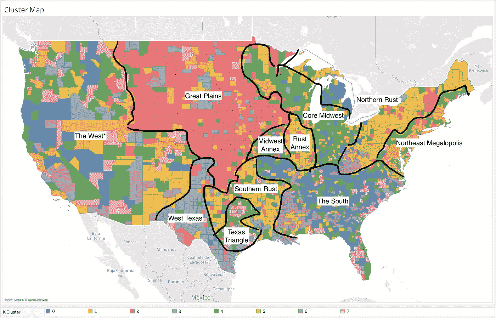**

**Map created by the author in Tableau… with some additional scribbling in Preview**

**在东北部，沿着阿巴拉契亚山脉分布着群集 4 和 2 中的城市的群集 5 被群集 0、2 和 6 的小块连接起来，形成一个人口相对较少的连续区域。由于老工业的失败，整个地区经历了不同程度的经济衰退。从这个北方锈带分离出来，芝加哥地区之外的伊利诺伊州表现出许多相同的特征，因此被称为 T2 锈带。在北部 Rust 的东部，由集群 4 环绕的集群 1 中的县群定义了东北大都市**的边界**。在西部，将北部的 Rust 与 Rust 附件分开的是核心的中西部地区，这是一个相对繁荣和人口稠密的区域，位于集群 4 中，点缀着集群 1 的城市和一些农村集群 0。被铁锈地带与中西部核心分开的是类似的密苏里州北部和爱荷华州部分地区的中西部附件。与所有这些区域接壤的是**南部**，这是一个主要由 0、4 和 7 星团组成的杂乱复合体，从欧扎克到佛罗里达，黑带形成了穿过中心的 6 星团的狭长地带。这个地区，也许是这里所描述的最复杂的地区，是由最近的城市增长和几代人的农村贫困的鲜明对比所定义的。从南方穿过密西西比河谷，一个**南方 Rust** 区域重复了在北方 Rust 中看到的簇 5 的公式，点缀着簇 4 和簇 2，但是簇 3 和簇 7 的侵入标志着这个区域与人口减少的北方明显不同。达拉斯、休斯顿、奥斯汀和圣安东尼奥周围的快速城市化地区构成了**德克萨斯三角**，在那里，集群 3 和集群 7 以类似于东北大都市的方式环绕在集群 4 中。围绕着德克萨斯三角和南拉斯特的连续的 3 簇弧线，构成了西德克萨斯干旱和大量西班牙人居住的地区。在这个国家的中心是一片广阔的大平原，第二集群在这里至高无上。最后，穿过落基山脉到达太平洋海岸的是西方的 T21。与其他地区不同，西部更确切地说是县变得如此之大，以至于县级区域化几乎不可能的地区。单个的县组清晰可见，例如，加利福尼亚州的湾区以及亚利桑那州和新墨西哥州的纳瓦霍族，但只有五个县将洛杉矶和盐湖城分开，这些区域的粒度不足以形成适当的区域。不过，在整个西方有一点是清楚的:在各种集群的水果沙拉中，集群 1 的显著斑点和集群 7 的高比例表明一些富裕的城市地区和大量的增长。**

****结论和后续步骤****

**聚类*能够揭示单个县的情况，并定义一些可用于形成区域的重要分组，但也出现了一些问题。我已经提到的西部大县的规模—这可能通过使用更细粒度的单位(如人口普查区)来解决，尽管这样做需要在该级别找到一致的数据，并有效地从头开始。第二个问题更微妙:因为这是人口普查数据，它只涉及人们*居住的地方*——而不是他们工作的地方。这就是为什么一些地区具有复杂的集群模式，如达拉斯周围的同心环，以及为什么城市中心会有意想不到的分类。匹兹堡、罗切斯特和锡拉丘兹是被北部 Rust 的集群 5 的海洋包围的城市地区，但他们自己在集群 2 中——在大平原上更常见。为了更好地理解这些县系统，并寻求一种比“目测”更程序化的区域化方法，我打算引入 FIPS 编码的通勤流人口普查数据。就其本身而言，这些数据可以用于美国各县的网络分析。在聚类的同时，我希望它能进一步加强对地区和各县如何互动的理解。***

***对于我的聚类，我选择将我的范围限制在美国邻近地区的 2018 年数据，并利用具有七个经济和人口特征的 k 均值聚类，k 值为 8，选择该聚类是因为具有接近解释所需聚类数量的局部最大剪影得分。传递到聚类中的特征是高中文凭以下的成年人的百分比、自然增长(出生与死亡)、净移民、失业率、家庭收入中位数、2010-2018 年失业变化以及 2010-2018 年人口变化百分比。**

*** *该图由该聚类中的县地图和一个图表组成，该图表显示了该聚类中的县在五个指标上的中值，这些指标代表了传递到聚类中的那些指标。所有指标都以偏离全国平均值的标准偏差数给出，显示的就业和教育指标是传递给聚类的实际指标的加性倒数，因此正的标准偏差代表所有五个指标的积极结果。**