# 在云端

> 原文：<https://medium.com/geekculture/up-in-the-clouds-1f0d8f6d013b?source=collection_archive---------11----------------------->

我最近在做一个数据科学小组的项目，关于使用自然语言处理来辨别真假新闻。我和其他小组成员(Elliot 和 Brian)有一个非常大的数据集，大约 100 兆字节，都是最近的新闻文章。手头拥有所有这些数据确实很有趣，但我们很快意识到其中一个缺点是处理这些数据需要时间。甚至在建模过程之前，我们必须执行标记化、词干化、情感分析、词性标注，所有这些步骤每个都要花一个小时。真是一场噩梦！我记得我的电脑在整理这些行时发出的巨大噪音。当我浏览和运行其他程序的时候，它不仅噪音大而且速度慢。

我现在意识到当涉及到数据科学、大数据甚至软件工程时，硬件的重要性。拥有一台可以依赖的电脑是必不可少的！问题是，我们不打算为这台投影仪购买新电脑，停止使用我们的电脑，以便能够更快地完成数据的预处理。这就是云计算发挥作用的时候了！在本文中，我想演示如何设置一台远程计算机，并从本地机器上使用它执行任务。我也不想让你听到我不得不忍受的噪音，我知道你以后会感谢我的！云服务提供商有很多，主要的有微软 Azure、IBM Cloud、Google Cloud 和亚马逊网络服务(也称为 AWS)。价格可能会因公司而异，但我想告诉你如何设置一个 AWS 帐户，并让一个实例运行，而不花费一毛钱使用他们的免费层选项。

# 1.创建 AWS 帐户

第一步非常简单！我们需要前往 AWS 地址:[https://aws.amazon.com/](https://aws.amazon.com/)并创建一个帐户:

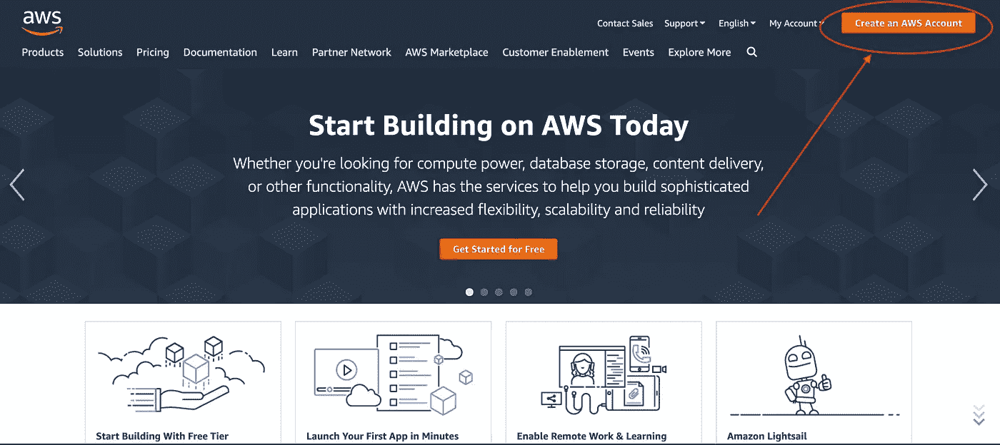

接下来，系统会提示您输入电子邮件地址，选择密码和帐户名:

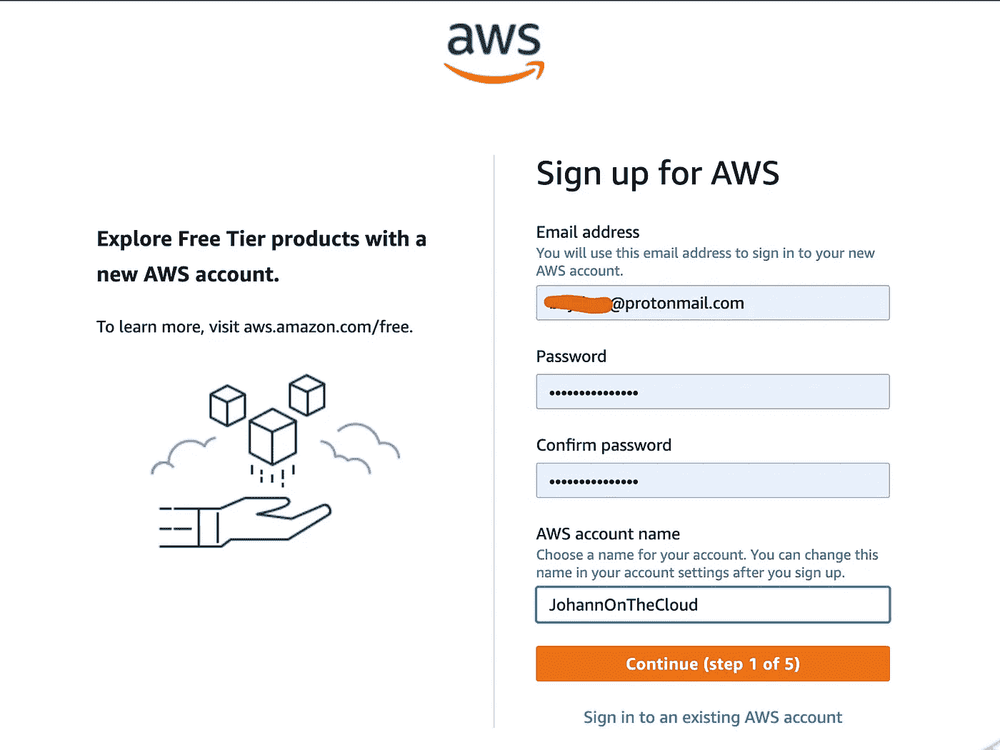

注册的第二步非常相似，你需要提供你的姓名、地址和电话号码。您还需要指定帐户的预期用途，是用于商业目的还是个人项目。

第三步可能会吓到你一点，我在第一次，但你需要输入你的信用卡信息进行验证。同样，我的目的是演示免费层选项，因此如果您遵循我的指示，将不会产生任何费用:

快好了！第四步是一个基本的电话号码验证，就像建立一个优步帐户。您输入您的电话号码，然后会收到一个代码，您需要在 AWS 网站上输入验证码:

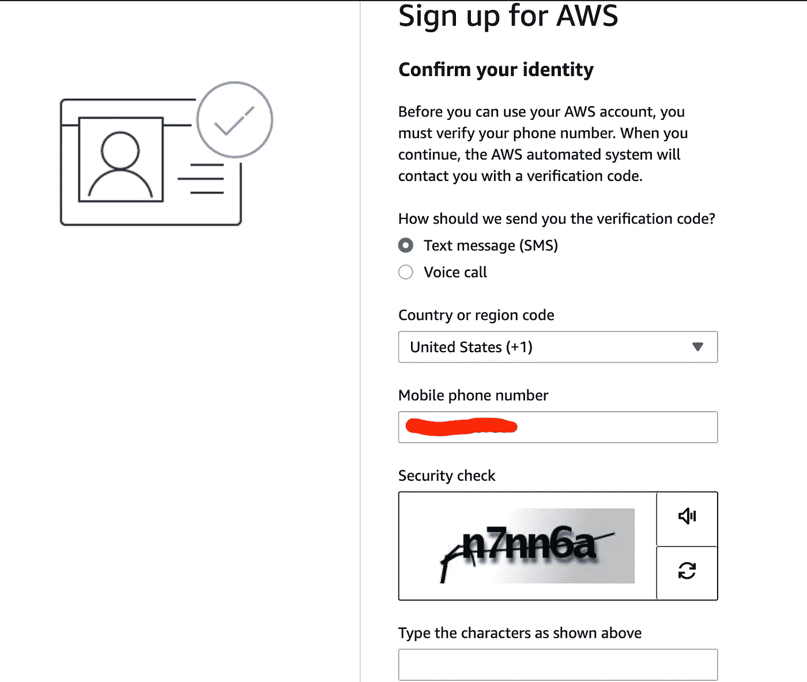

注册的最后一步我保证！！这是你必须选择你想要的账户类型的地方。您可以选择基本帐户、开发人员支持帐户和业务支持帐户；我们将选择基本选项:

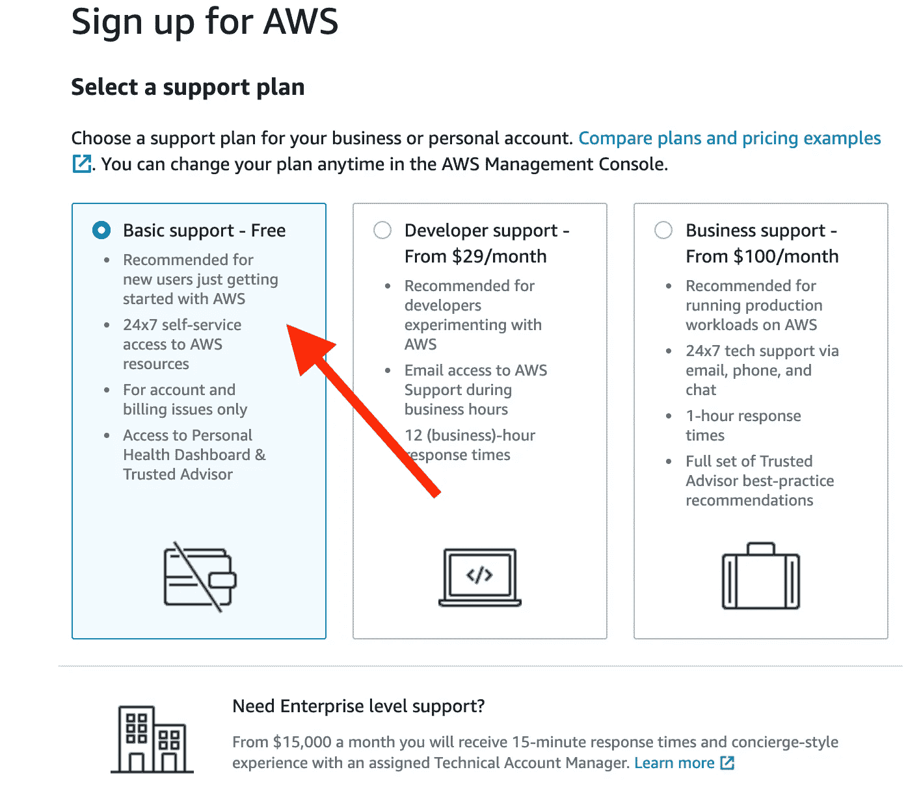

我们现在有一个 AWS 注册帐户。登录后，您就可以访问列出所有可用服务的 AWS 管理控制台。我们对启动虚拟机感兴趣，因此此处可供选择的选项是 EC2:

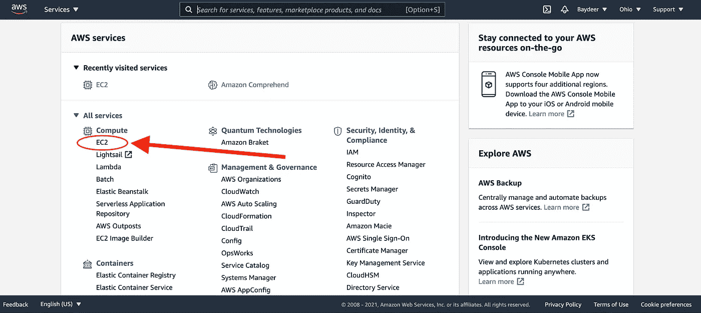

# 2.设置安全组

选择 EC2 选项后，我们将进入 EC2 仪表板，在这里我们可以配置安全性并启动一个实例。我必须强调安全性是多么重要，当谈到云计算时，你不想让每个人都可以访问你的数据，特别是当你为一家公司工作时。在开始之前，您必须创建一个安全组，作为防火墙来控制来自服务器的传入和传出流量。选择 EC2 服务后，安全组选项将出现在右侧选项卡上:

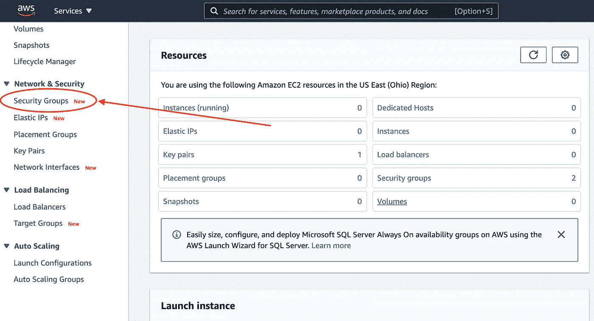

有一个默认的安全组，但是如果有多个人连接到该服务器，并且还接收我稍后将谈到的密钥对文件，您需要创建自己的安全组来分配权限:

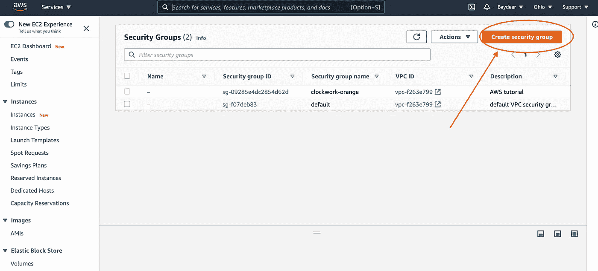

你可以在上面的图片中看到，我之前已经创建了一个名为“发条橙”的安全组，是的，这是一个斯坦利·库布里克参考。底部还有一个默认的安全组，但让我们创建一个新组，这样我可以带您完成整个过程。单击“创建安全组”按钮后，系统会提示您输入安全组的名称和描述。这也是您将配置入站和出站规则的步骤，换句话说，就是谁有权访问您的服务器。它通常被分配到一个 SSH 或 IP 地址，因此每个可以访问您的虚拟计算机的人都将被添加到这里，并附上他们的 IP 地址。在本次演示中，我们将向任何人开放，但这是关键的一步，例如，当您仅考虑添加您的同事时。因此，首先我们需要添加一个入站规则，选择 SSH 参数并将其设置为 anywhere:

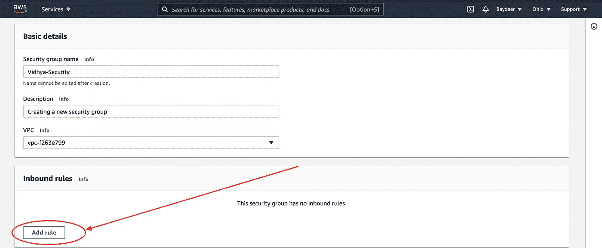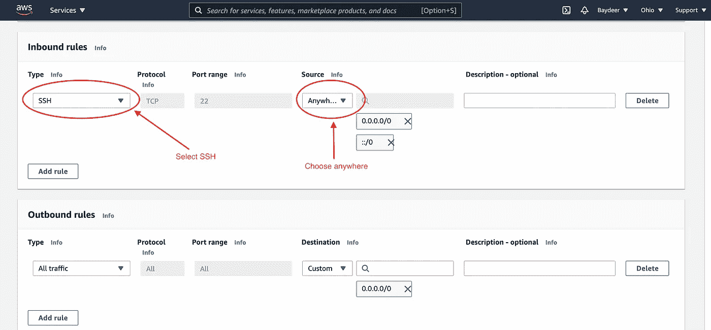

我们只是通过添加 SSH 来访问实例。接下来是出站规则，它是来自实例的出站流量。在这种情况下，我们将它设置为任何地方，但在工作环境中，您还需要指定与您一起工作的不同人员的 SSH 或 IP 地址。下一步是单击页面底部的“创建安全组”按钮:

# 3.创建密钥对

就是这样！我们已经创建了我们的安全组！现在我们需要创建一个 key-pair，它是一组公钥和私钥，将用于连接到您的实例。一旦创建了密钥对，您将收到一个. pem 文件，该文件将用于验证您的身份，就像密码一样。让我们在启动实例之前创建一个密钥对:

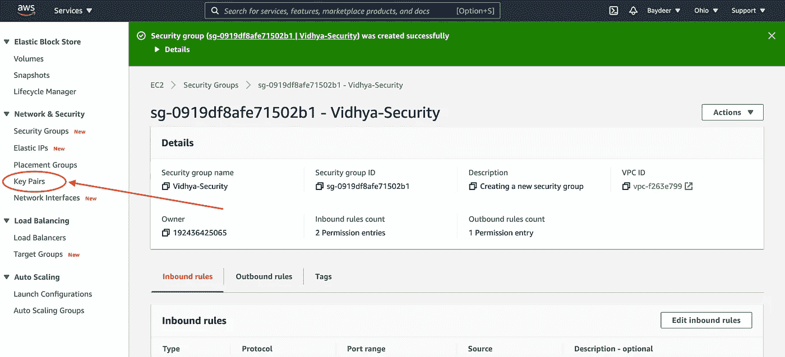

同样的过程也适用于此处，您单击选项卡，然后单击“创建密钥对”，然后为其指定一个名称:

我之前已经创建了一个密钥对，你可以在上图中看到，但是我们正在创建一个新的。下一步是给密钥对分配一个名称，并选择。用于 SSH 的 pem 格式:

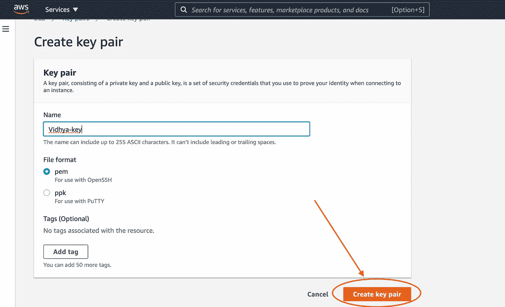

嗯，好像亚马逊只会说一种语言！但是我们不要生气。我们仍然可以继续这个过程。单击创建密钥对按钮后，将开始下载，您将收到一个. pem 文件形式的密钥。如果将它从下载文件夹中移走，记住它的存储位置是非常重要的，因为您将需要连接到实例的路径。

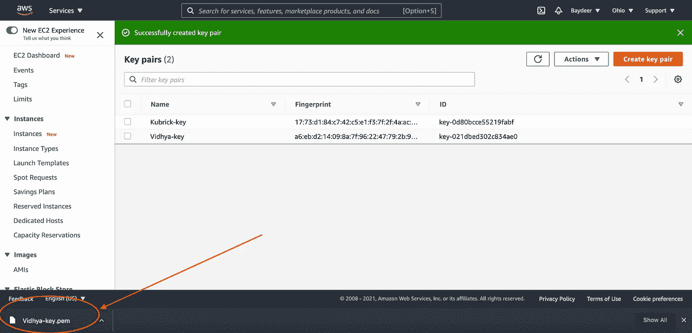

# 4.实例配置

我移动了我的。pem 文件保存到库中名为 projects 的目录中。如果你像我一样，你可能会觉得这是一个有点长的设置，但让我们开始令人兴奋的部分。是时候启动一个实例了！这将分几个步骤完成，第一步是转到“实例”选项卡，单击“启动实例”按钮，然后选择一个操作系统:

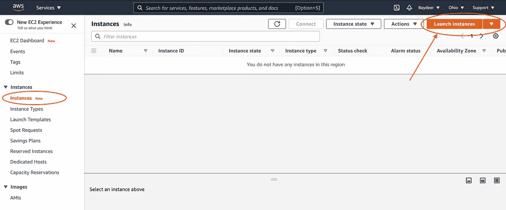

接下来是我们选择操作系统的部分。基于 Linux 的操作系统 Ubuntu 是最常见的选择。我从导师那里得到的唯一建议是永远不要选择 windows 真不敢相信

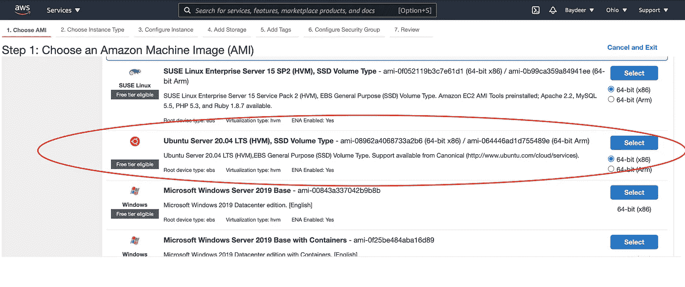

关于 CPU、RAM 或存储，我们的实例有许多可用的配置。你的选择将取决于你的项目是什么和你的组织的规模，但价格会相应变化。我将坚持使用一些默认设置，因为这些都是免费的，并选择配置实例详细信息:

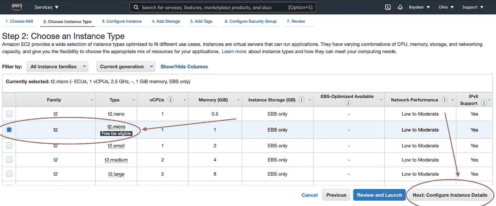

在下一步中，您可以选择几个并行运行的实例，并让许多计算机处理一项任务。多酷啊。出于演示目的，让我们坚持使用 1:

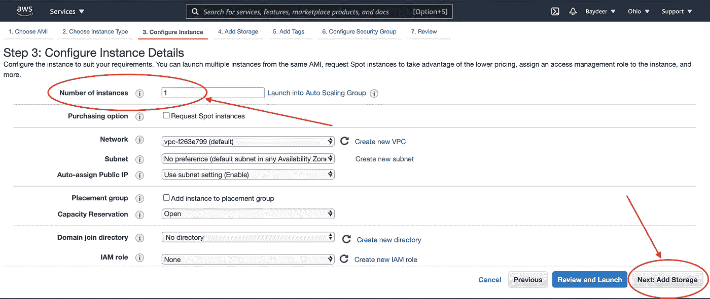

下一步是增加存储空间。我将再次坚持默认设置，但有许多选项可用。我们不能立即选择“查看并启动”,因为我们想进入“配置安全组”部分:

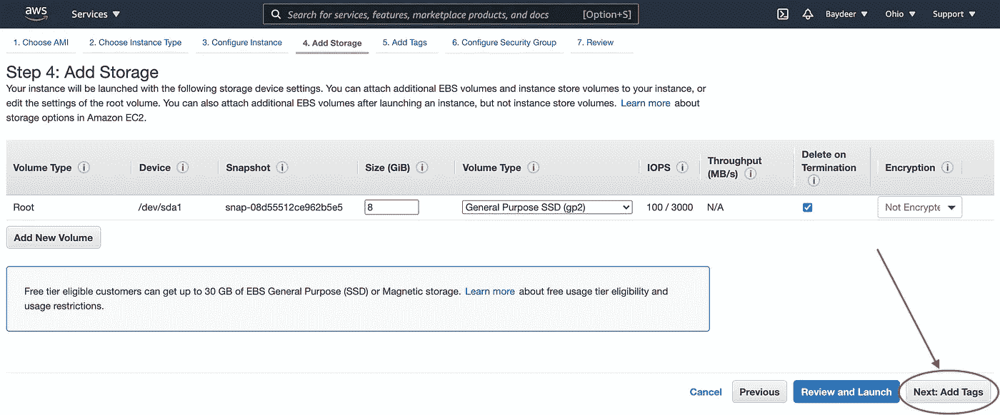

自由层客户可以获得高达 30 GB 的存储。真有意思！接下来是添加标记部分，但我们可以跳过它，因为它是可选的，并进入配置安全组部分，我们希望在这里选择我们在上面创建的现有安全组(是的，在那里！):

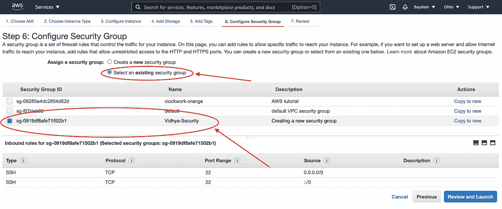

这是审查和启动我们的实例的时候了。亚马逊会给我们一个关于安全设置的警告，因为我们允许任何 IP 地址连接(只是为了演示！).我们现在可以直接启动我们的实例:

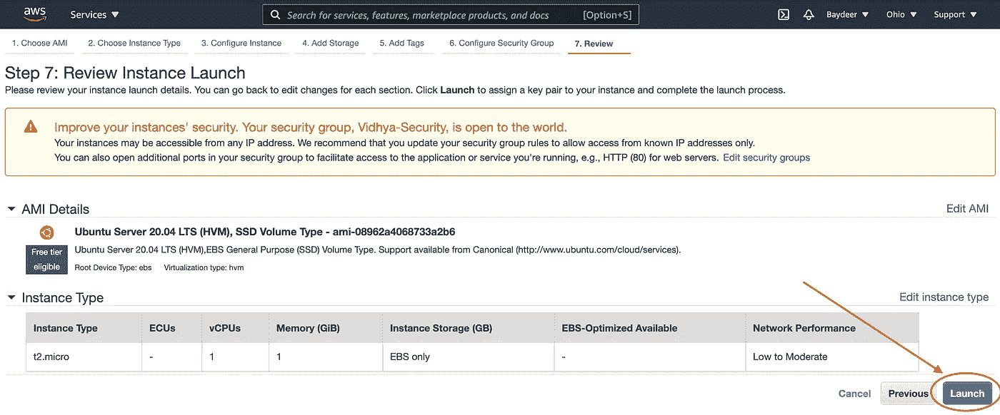

我们将被要求选择之前下载的密钥，并确认我们拥有该密钥来连接到我们的实例:

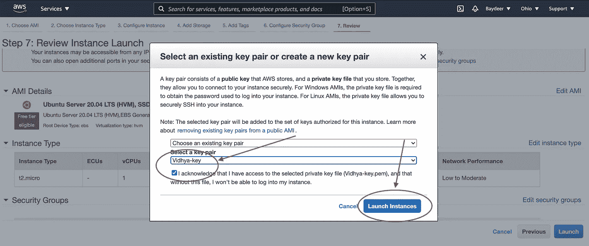

让我们祝贺自己！！我们现在有一个实例在运行，我们的远程计算机启动了！

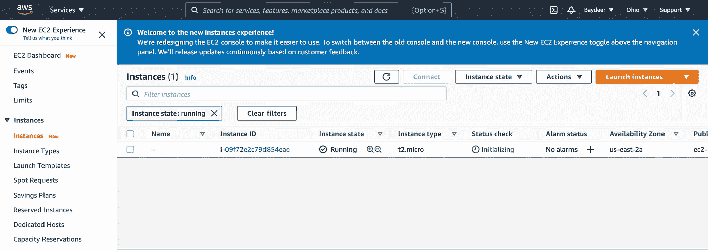

# 5.使用终端连接到我们的实例

现在我们已经创建并启动了一个实例，我们需要从终端连接到它。在我们连接到我们的实例之前，我们需要增加一个安全层，因为我们的密钥对每个访问我们计算机的人都是可读的。出于这个原因，我们需要“chmod”它，并且只给我们管理员读写这个文件的权限(以下说明仅适用于 mac):

这里的命令是 sudo chmod 700 和 key.pem 文件的路径，它只给管理员读写权限，其他人没有。你将被要求输入你的密码，瞧！我们增加了一些必要的额外安全措施。下一部分是连接到我们的实例。首先，我们需要返回 amazon，单击我们的实例，复制连接所需的公共 IPv4 地址:

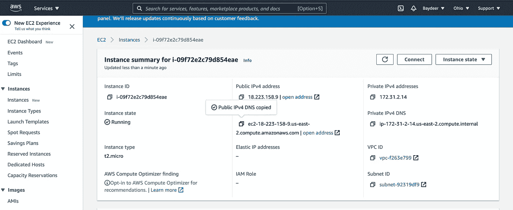

现在我们回到终端，下一个命令是 ssh-I[你的密钥文件的路径]Ubuntu @[在这里粘贴你复制的 ipv4 回车；然后在安全提示后键入 yes:

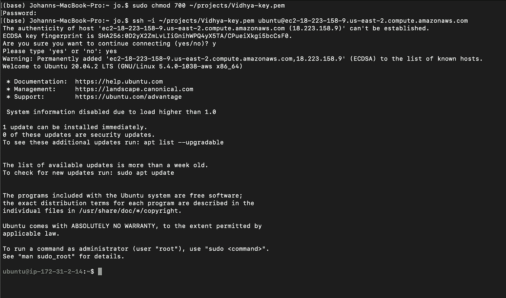

就是这样！我们连接到了我们的远程计算机！我们可以执行打印工作目录命令来确认:

工作目录不再在我们的本地机器中！从那里天空是极限！我们可以安装 python、anaconda 以及您的项目所需的所有包和库。我认为那篇文章将是第二篇文章的引子，所以这篇文章不会太长！现在，记住终止实例是很重要的，因为在大多数情况下它不是自由的，所以最佳实践是在完成任务后终止它:

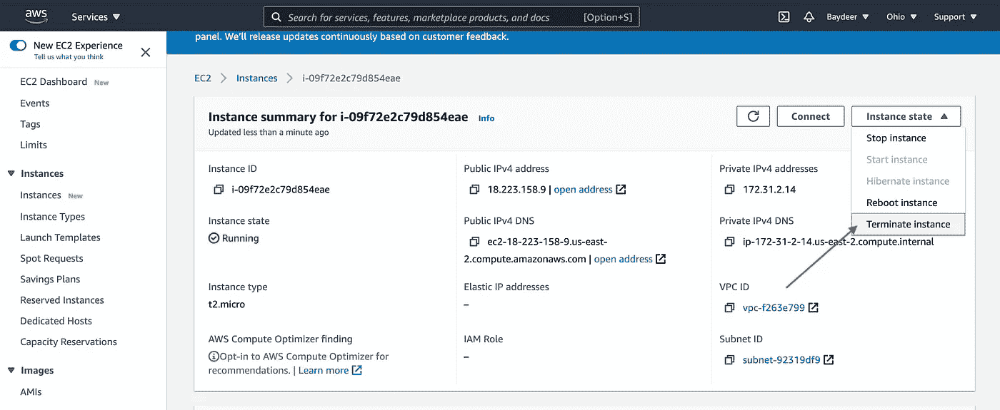

您的终端现在将恢复到您的本地机器！

这是一个漫长的过程，但当你做一次，它就变得非常简单。我想在下一篇文章中继续这个主题，并演示如何远程运行 python 脚本和模型。就目前而言，希望有所帮助！