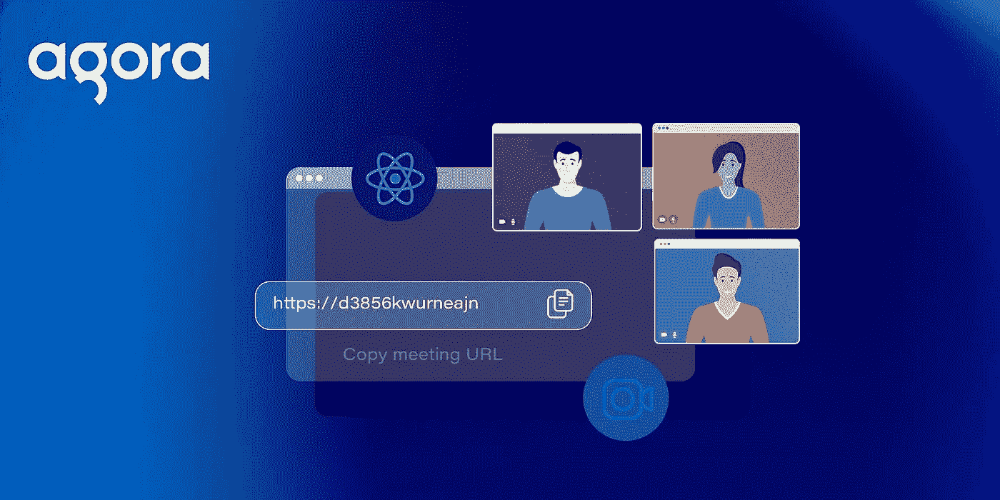

# 通过 React 原生 UIKit 将会议 URL 用于 Agora 视频通话

> 原文：<https://medium.com/geekculture/use-meeting-urls-for-an-agora-video-call-with-the-react-native-uikit-d289dc5d9aa2?source=collection_archive---------4----------------------->



**更新 20-3-22**:博客已经更新，可以与 Agora React Native UIKit 的 4.0.0 版协同工作。

加入视频通话最简单的方法是分享一个独特的链接。在本教程中，我们将学习如何使用 React Native 的通用链接来打开您的视频通话或使用 React Native UIKit 构建的直播应用程序。

要了解更多关于 React Native UIKit 的信息，您可以阅读[发布博客](https://www.agora.io/en/creating-a-react-native-video-chat-app-in-a-few-lines-of-code-using-agora-uikit/)或访问 [GitHub](https://github.com/AgoraIO-Community/ReactNative-UIKit/) 。你也可以在这里找到这篇博文[的完成项目。](https://github.com/EkaanshArora/Agora-RN-UIKit-Universal-Link)

# 先决条件

*   一个 Agora 开发者账号(免费！[在这里报名](https://sso.agora.io/en/signup?utm_source=medium&utm_medium=blog&utm_campaign=use-meeting-urls-for-an-agora-video-call-with-the-react-native-uikit)
*   Node.js LTS 版本
*   世博会 CLI ( `npm i -g expo-cli`
*   对 React Native 和 Expo 的理解

为了让我们快速了解基本的样板文件，我使用`expo-cli`来创建一个使用`tabs (TypeScript)`模板的项目。当提示输入模板时，您可以通过执行`expo-cli init`并选择制表符选项来使用相同的起点。你可以在任何使用[反应导航](https://reactnavigation.org/)库的应用上遵循同样的步骤。

要在 Expo 项目中使用 UIKit，我们需要安装`expo-dev-client`包(`expo install expo-dev-client`)和 Agora React Native UIKit 包(`yarn add react-native-agora agora-react-native-rtm agora-rn-uikit`)。

# 使用 Expo 的链接

链接一个 app 有两种方式:深度链接和通用链接。深度链接是这样的:`exp://com.uikit/screen-one?data=hello`。它不是使用 http/https 协议，而是以一个方案开始，在 Expo 应用程序的情况下，该方案被设置为`exp`。您可以将其更改为您的应用程序的任何内容。我们就用`uikit://`。

通用链接是您的应用程序也支持的普通 web URLs。例如，像`https://myapp.com/screen-one?data=hello`这样的 URL 可以在你的网站上打开，但如果支持的话，也可以直接打开你的应用。我们将讨论如何使用深层链接和通用链接。如果你对这里描述的任何概念感到困惑，世博会文件是一个很好的资源。

让我们更新`app.json`文件来定义对我们的通用链接的支持。让我们把`example.com`作为我们的主机名称:

```
"scheme": "uikit",
...
"ios": {
	"supportsTablet": true
	"supportsTablet": true,
	"bundleIdentifier": "com.ekaansh.uikitlink",
	"infoPlist": {
		"LSApplicationQueriesSchemes": ["uikit"],
		"NSCameraUsageDescription": "camera perm",
		"NSMicrophoneUsageDescription": "mic perm"
	},
	"associatedDomains": ["applinks:example.com"]
},
...
"android": {
	...
	"package": "com.ekaansh.uikitlink",
	"intentFilters": [
	{
		"action": "VIEW",
		"data":{
			"scheme": "https",
			"host": "*.example.com"
		},
		"category": [
			"BROWSABLE",
			"DEFAULT"
		]
	}
	]
},
```

保存更改，然后执行`expo prebuild`。这将修改本地项目文件(如`AndoidManifest.xml`和`info.plist`)来添加我们的域配置。

# 设置域

## iOS 的 AASA 配置

要在 iOS 上实现通用链接，您必须首先通过从您的 web 服务器提供苹果应用程序站点协会(AASA)文件来设置验证您拥有您的域名。文件应该从`/.well-known/apple-app-site-association`开始提供(没有扩展名)。向您的 CDN 添加适当的头文件，以确保该文件使用了`Content-Type=application/pkcs7-mime`头文件。
AASA 文件示例如下:

```
{
  "applinks": {
    "apps": [],
    "details": [{
      "appID": "<APPLE_TEAM_ID.APP_BUNDLE_ID>",
      "paths": ["*"]
    }]
  }
}
```

要设置 vercel 的头，您可以使用以下示例 vercel.json 文件:

```
{
  "headers": [{
    "source": "/apple-app-site-association"
    "headers" : [{
      "key" : "Content-Type",
      "value" : "application/pkcs7-mime"
    }]
  }]
}
```

访问[苹果文档](https://developer.apple.com/documentation/bundleresources/applinks)了解更多关于 AASA 格式的细节。

## 验证 Android 的域(可选)

默认情况下，使用通用链接时，您会看到选择应用程序对话框。如果您希望您的链接总是打开您的应用程序而不显示选择应用程序对话框，您必须在`/.well-known/assetlinks.json`发布一个 JSON 文件，指定您的 Android 应用程序 id 以及您的应用程序应该打开哪些链接。详见[安卓文档](https://developer.android.com/training/app-links/verify-site-associations)。

# 设置链接

在`navigation/LinkingConfiguration.tsx`文件中，我们将更新前缀以支持通用链接:

```
prefixes: [‘https://example.com', Linking.createURL(‘/’)]
```

这使得应用路由器可以处理通用链接和深层链接。

让我们修改第二个屏幕(`./screens/TabTwoScreen.tsx`)来打开 UIKit。我们将通道存储为状态变量。我们将为 URL 添加一个监听器，从查询中提取通道并更新我们的状态:

接下来，我们将创建一个`useEffect`钩子，当应用程序从通用链接打开时，从查询中获取频道。我们将使用`getInitialUrl`和`parse`方法提取通道并更新状态:

最后，我们可以渲染 UIKit。你可以在这里阅读更多关于如何设置[的信息。确保将您自己的应用 ID 添加到`rtcProps`:](https://www.agora.io/en/creating-a-react-native-video-chat-app-in-a-few-lines-of-code-using-agora-uikit/)

要从应用程序中打开 UIKit 屏幕，我们可以使用 expo 中的`Linking`并调用 deeplink `uikit://two?channel=test`。我将添加一个`<Text>`组件来导航到`./screens/TabOneScreen.tsx`中的 UIKit:

# 奖励:生成链接

生成唯一链接的一种快速方法是使用 JavaScript 中的`Date`对象使用当前时间戳。这里有一个创建新房间的简单函数:

# 结论

相对而言，这是一种使用 React Native 和 Expo 在 Android 和 iOS 中设置通用链接的无痛方式。你可以阅读 [Expo](https://docs.expo.dev/guides/linking/#aasa-configuration) 和 [React 导航](https://reactnavigation.org/docs/deep-linking/)文档了解更多信息。

如果您在使用 Agora React Native UIKit 时有任何问题，我邀请您加入 [Agora 开发者 Slack 社区](https://agora.io/en/join-slack)，您可以在`#react-native-help-me`频道中提问。欢迎提出功能请求或在 [GitHub Repo](https://github.com/AgoraIO-Community/ReactNative-UIKit/issues) 上报告错误。