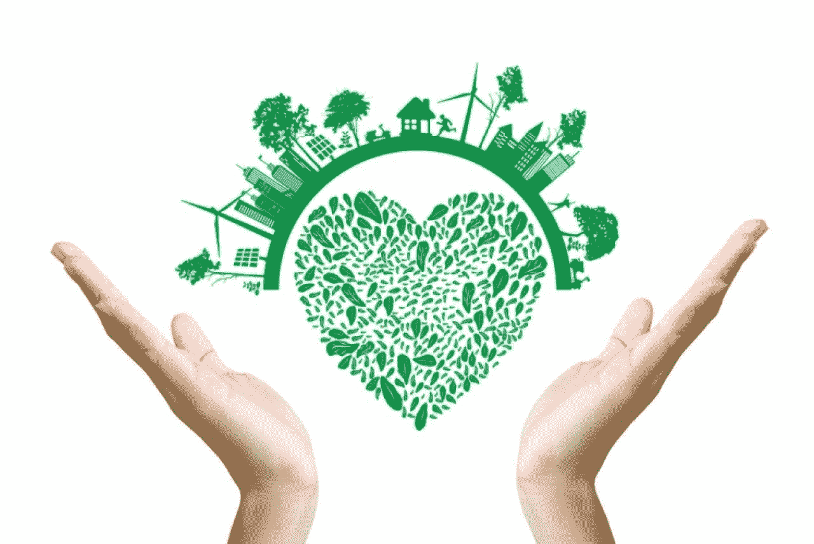
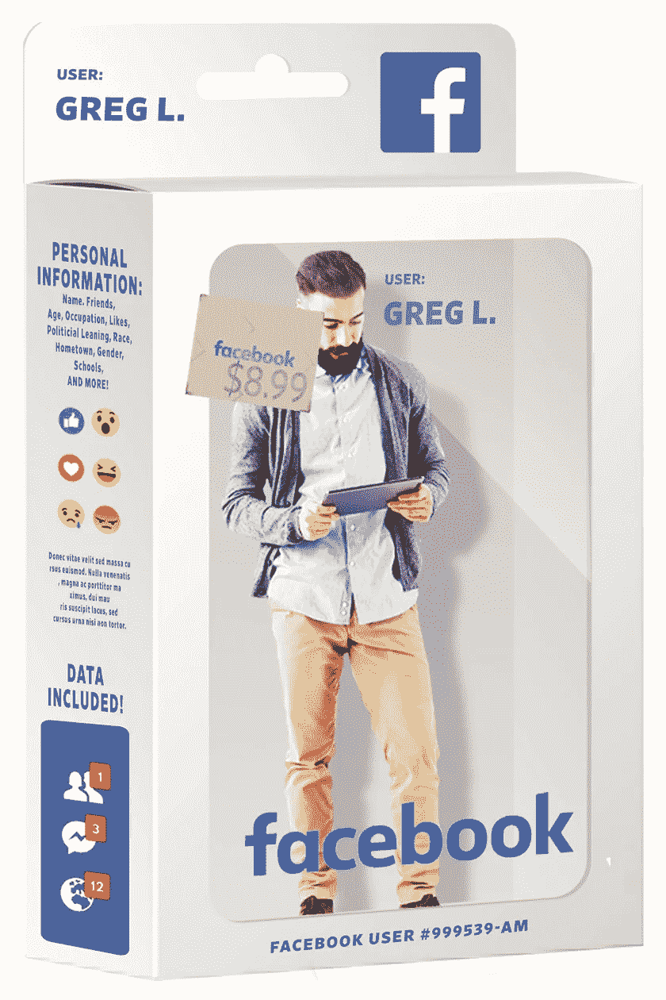
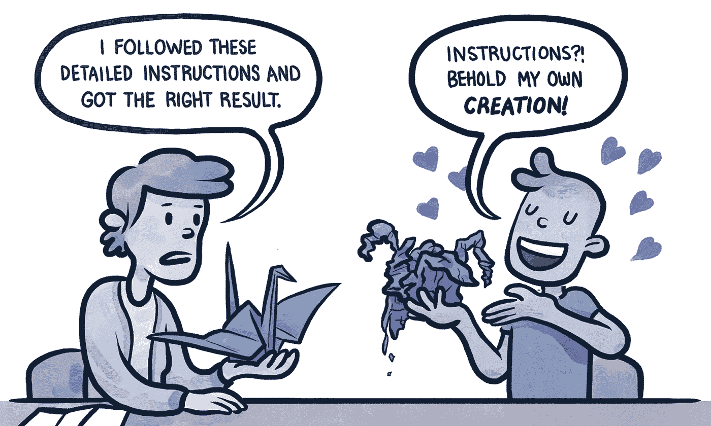

# 作为道德消费者的用户:从注意力经济到环境意识系统

> 原文：<https://medium.com/geekculture/user-as-an-ethical-consumer-from-an-attention-economy-to-an-environmentally-conscious-system-6fe37dd0f6b9?source=collection_archive---------20----------------------->

Photo by Ethical consumer

*本文旨在讨论从用户被视为科技巨头营销策略的产品，到质疑他们如何引导这种注意力经济，以确保企业在他们的方法中更加道德和环保的转变。它进一步理解了异质劳动及其与宜家效应的对比，以及其在更可持续系统中的应用。最后，它强调了新冠肺炎疫情对消费者的影响，以及组织如何开始支持道德消费主义。*

# **一、注意力经济**

在过去的日子里，当我们思考稀缺资源时，我们会想到石油或煤炭等原材料。但是在今天的信息时代，甚至我们自己的注意力范围也可以被认为是一种稀缺资源。我们不断受到来自社交媒体和电视的数据轰炸，很难让一个特定的来源抓住我们的注意力并真正影响我们。

因此，容易分心的观众意味着营销人员有机会设计新的策略，无论是通过令人上瘾的用户界面还是通过支持其产品的社交媒体影响者。2019 年，89%的营销人员表示，Instagram 对他们的影响者营销战略具有重要的战略意义——这比业内任何其他社交媒体渠道都重要。随后，人类的注意力变得商品化，在各种各样的商业模式中，获取这种注意力是产生收入的重要部分。

著名的 O'Reilly Media 的创始人 Tim O'Reilly 最初在推特上发布了这个概念，如果你不为产品付费，那么默认情况下你就是被销售的产品。例如，谷歌及其像谷歌搜索这样的消费者服务是免费的。即便如此，其 80%以上的收入来自谷歌广告，去年的收入为 1470 亿美元。不仅如此，这种广告具有很强的针对性，因为谷歌跟踪用户的历史。(《福布斯》，2012 年)

像电视广告这样的媒体来源是吸引注意力的主要中心，而注意力又被卖给广告业的客户。以脸书为例。其每人 7.05 美元的收入来自广告，广告商可以根据位置、人口统计信息或个人资料信息出价购买向用户投放广告的能力。收集的观众越多=卖出的注意力越多，从而推高广告价格。我们自己的注意力基本上被当作一种针对我们的产品，这样我们就成了特定服务或产品的顾客。

**图 1** :一位艺术家对 facebook 的印象，它捕捉每个用户的数据，作为一个
单独的产品，用于定向广告。

Photo illustration by Natalie Matthews-Ramo/Slate. Photos by Thinkstock.

那么，我们如何打破成为注意力经济产品的循环呢？

# **二。产品作为用户的延伸:在产品的形成过程中给予用户更多的控制权**

像宜家这样的公司使用心理所有权的概念，而不是通过持续的广告链来瞄准潜在顾客:

“想象你做了一张桌子。可能出来的时候有点歪。可能你的室友或邻居会看到它的本来面目，你知道，可能是一件粗制滥造的作品。但对你来说，那张桌子可能看起来真的很棒，因为是你创造了它。这是你的劳动成果，这就是“宜家效应”背后的理念”(丹尼尔·莫琼，2019)

图 2:插图描述了即使是一个错误的折纸作品对创建它的用户来说也是有吸引力的

(TED Ideas, 2019) Retrieved from [https://ideas.ted.com/why-were-so-attached-to-our-own-creations-even-when-theyre-ugly/](https://ideas.ted.com/why-were-so-attached-to-our-own-creations-even-when-theyre-ugly/)

这正是广受欢迎的家具连锁店宜家的 DIY 哲学所体现的:如果用户自己组装，他/她会觉得和他/她购买的东西更有联系。再举一个例子，t 恤公司 Threadless 允许用户提交 t 恤设计，然后投票选出最受赞赏的。在 2006 年推出这一功能后，form 每月售出 6 万件 t 恤，利润率比其他传统服装零售商高出 35%。(HBR，2018 年)

# **三世。硬币的两面:DIY 产品作为异质劳动和可持续发展的推动者**

“在自动化领域，机器可以轻松高效地完成人类无法完成的任务，而在异形领域，情况正好相反。换句话说，其他人在做大量的工作，而机器得到了荣誉。”(埃克比亚纳尔迪 2019)

著名教授哈米德·r·埃克比亚和邦妮·a·纳尔迪的这篇文章，在我们尊敬的讲师赛·什鲁提·奇武库拉的“人机交互基础”讲座中进行了讨论，指出异质劳动涉及到人们真正的努力、劳动和时间的经济贡献，这些人实际上正在做以前由有偿工人和机器所做的事情。**这与宜家等 DIY 产品服务形成鲜明对比。**

这家家具公司通过优化包装来减少浪费和提高效率。例如，IKE 每年节省超过 120 万美元，因为将他们的沙发分成许多部分可以减少 50%的包装尺寸。此外，金钱并不是包优化的唯一好处。每年，他们帮助减少 100 吨二氧化碳排放，每年拯救近 3，000 棵树，每年减少 9，500 加仑柴油的运输消耗。(Chainanalytics，未注明日期)事实上，这对顾客来说是双赢的，因为该公司可以在不影响质量的情况下将沙发的购买价格降低 14%。因此，即使该公司的工厂没有组装沙发并将其发送给消费者，而消费者必须自己组装，这也有利于环境和沙发的人类所有者。购买环保产品的顾客被认为是**道德消费者**的一部分。

# **四。支持有环保意识的公司**

现在问题来了，为什么所有的企业都想变得更加道德？对于后者有没有更多的激励措施？

“想象一个购买力紧紧围绕环境保护、人权、公平贸易和社区发展理念的世界。一个品牌基于社会和道德平台相互竞争以吸引消费者注意力的世界。”(柏林，2021 年)

卢克·柏林(Luke Berlin)的这篇关于良好贸易的文章谈到了一个未来的世界，在这个世界中，品牌将在参与可持续发展和社会改善的基础上，在企业社会责任的基础上取得成功。事实上，这种变化已经开始了。在最近 Forrester 对 600 名美国成年人的调查中，47%的受访者将首席执行官的社会、环境和政治观点与其领导的企业联系起来。事实上，43%的人表示，当他们对社会和环境问题采取立场时，他们更有可能信任品牌。(斯旺特，2021 年)

# **诉黑天鹅事件:新冠肺炎疫情对消费者的影响**

根据管理咨询公司埃森哲(Accenture)2020 年的一项全球调查，自疫情开始以来，60%的消费者报告进行了更环保的购买。它补充说，这一比例中有 90%的人表示他们可能会继续这样做。这使得疫情成为一个黑天鹅事件，即一个具有重大、持久影响的意外事件。由于稀有，它们不可能被发现。(纳西姆·尼古拉斯·塔勒布，2010 年)

甚至购买有机食品的人数也增加了，预计美国有机产品市场去年的销售额将增长 9.5%，达到 2520 亿美元。越来越多的人也选择在当地购物，从小企业购物，从而通过缩短供应链的长度来减少产品交付对环境的影响。英国服装公司 Frugi 去年的销售额增长了 60%，其服装全部由回收塑料和有机棉制成。(英国广播公司，2021)

# **六世。支持道德消费主义的组织**

英国有一个名为道德消费者研究协会(ECRA)的组织，成立于 1989 年，它发行一份杂志，根据 19 项标准公布产品评级:这包括动物试验、污染、工人权利、政治活动和公司精神。我们应该让更多的公司意识到这一点。(道德消费者，2020 年)

在美国，B Lab 是一个非盈利网站，认证“符合最高标准的经核实的整体社会和环境绩效、公共透明度和法律责任”的公司。就连中国也实施了一种创新的方法，通过一个新的社会信用体系来监控和监管企业的行为，该体系进而在政治、社会和环境领域应用信用评级。例如，违反排放目标的公司将获得较低的评级，导致负面措施、更高的税收或其他制裁。(沃特金斯，2019 年)

# **七。结论**

尽管一开始对许多公司来说，仅仅将环境问题作为首要目标来做一个商业案例是有挑战性的，但这应该是与道德和带来更多忠诚客户相互依赖的。此外，道德消费者-意图差距需要进行分析，而不是在客户日常生活的翻译中丢失。单纯陷入注意力经济的危险可以转化为建设一个更可持续的未来，而自制产品的异质劳动可以培养技能，减轻人类所有者的负担，甚至在上述物流案例中对环境更加环保。

## **参考文献**

1.  m . swant(2021 年 4 月 20 日)。沉默不是一种选择:研究显示，消费者希望首席执行官在政治问题上表明立场。福布斯。[https://www . Forbes . com/sites/martys want/2021/04/19/silence-is-not-a-option-research-shows-consumers-expect-CEO-take-a-stand-on-political-issues/？sh=46abf60c46c
    6](https://www.forbes.com/sites/martyswant/2021/04/19/silence-is-not-an-option-research-shows-consumers-expect-ceos-to-take-a-stand-on-political-issues/?sh=46abf60c46c6)
2.  Joy，A. (2021 年 2 月 18 日)。注意力经济:顾客成为产品。今日商业在线杂志。[https://journal . business today . org/Bt-online/2021/the-attention-economy-asher-joy](https://journal.businesstoday.org/bt-online/2021/the-attention-economy-asher-joy)
3.  顾客如何将产品视为自身的延伸。(2018 年 9 月 26 日)。哈佛商业评论。[https://HBR . org/2018/09/how-customers-come-to-think-a-product-as-a-extension-of-self](https://hbr.org/2018/09/how-customers-come-to-think-of-a-product-as-an-extension-of-themselves)
4.  医学博士诺顿、医学博士莫琼和医学博士艾瑞里(2012 年)。宜家效应:当劳动带来爱。消费者心理学杂志，22(3)，453–460 页。[https://doi.org/10.1016/j.jcps.2011.08.002](https://doi.org/10.1016/j.jcps.2011.08.002)
5.  肖博士(2015 年 1 月 23 日)。伦理消费中的关心和承诺:商业伦理杂志。[https://link . springer . com/article/10.1007/s 10551-014-2442-y？error = cookies _ not _ supported&code = 62 b25b 10-2b3a-414 e-b6d 7-69315097 D8 a2](https://link.springer.com/article/10.1007/s10551-014-2442-y?error=cookies_not_supported&code=62b25b10-2b3a-414e-b6d7-69315097d8a2)
6.  新泽西州塔勒布(2010 年)。《黑天鹅:极不可能的脆弱性的影响》(第二版。，第 1 卷)。兰登书屋出版集团。
7.  b . k . Latham(2021 年 1 月 14 日)。冠状病毒让我们成为更有道德的消费者了吗？BBC 新闻。https://www.bbc.com/news/business-55630144
8.  Quoteresearch，A. (2017 年 7 月 16 日)。你不是顾客；你是产品报价调查员。齐。【https://quoteinvestigator.com/2017/07/16/product/ 
9.  我们的道德评级。(2021 年 2 月 22 日)。道德消费者。https://www . ethical consumer . org/about-us/our-ethical-ratings
10.  Goodson，S. (2012 年 7 月 31 日)。如果你不付钱，你就成了产品。福布斯。[https://www . Forbes . com/sites/market share/2012/03/05/if-you-not-pay-for-it-you-be-the-product/？sh=5c21b1115d6e](https://www.forbes.com/sites/marketshare/2012/03/05/if-youre-not-paying-for-it-you-become-the-product/?sh=5c21b1115d6e)
11.  纳尔迪大学(2017 年)。自动化和异质化:劳动的未来(和现在)。鸭嘴兽。[https://blog . castac . org/2017/05/automation-and-heteromation/](https://blog.castac.org/2017/05/automation-and-heteromation/)
12.  埃克比亚，人力资源和纳尔迪，文学学士(2019)。凯恩斯的孙子和马克思的临时工:为什么人类劳动仍然重要。《国际劳工评论》,第 158(4)卷，第 653-676 页。[https://doi.org/10.1111/ilr.12146](https://doi.org/10.1111/ilr.12146)
13.  t .布兰克(2021 年 10 月 15 日)。宜家如何通过包装优化节省数百万美元。连锁分析。[https://www . chain alytics . com/IKEA-save-millions-packaging-optimization/](https://www.chainalytics.com/ikea-save-millions-packaging-optimization/)
14.  Llp，L. W. (2019 年 6 月 10 日)。中国的环境社会信用体系鼓励到 2020 年实现自我监管。环境、土地和资源。[https://www . global elr . com/2019/06/China-environmental-social-credit-system-comes-self-regulation-by-2020/](https://www.globalelr.com/2019/06/chinas-environmental-social-credit-system-encourages-self-regulation-by-2020/)