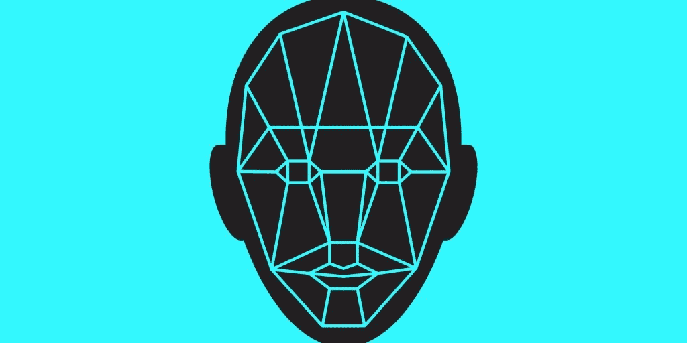

# 使用面部识别在 Python 中启动 AWS 实例

> 原文：<https://medium.com/geekculture/using-facial-recognition-to-launch-an-aws-instance-in-python-2b6ea2765bcb?source=collection_archive---------39----------------------->

[](https://www.americancityandcounty.com/2020/08/17/facing-the-controversy-of-facial-recognition-technology/)

# 介绍

Python 为有趣的项目提供了许多库，所以这是我做的另一个有趣的任务。虽然当你的脸被识别时在 AWS 上启动一个资源的想法可能看起来很随意，但我在这里的意图只是展示这种语言可以多么通用，以及如果你只是对一些细节有一个小想法，它可以多么容易。所以让我们开始有趣的事情吧。

# 面部识别

## 创建样品组

首先，我们需要所需的库:`opencv-python`、`opencv-contrib-python`、`numpy`。如果您没有安装这些，请先使用 pip 安装它们。

```
import cv2
import numpy as np
```

为了检测人脸，我们将使用哈尔级联。哈尔级联可以用来检测图像中的各种对象，但对于我们在这里的使用，我在我的工作空间中有`haarcascade_frontalface_default.xml`文件(用于检测人脸)。你可以在这里下载文件。

我们现在可以使用这个文件作为预先建立的人脸分类器。使用函数`cv2.CascadeClassifier()`将文件加载到 python 中，作为一个现成的分类器。

```
# Load HAAR Cascade face classifier
face_detector = cv2.CascadeClassifier('haarcascade_frontalface_default.xml')
```

接下来，我设置目录的路径，我将在其中保存我所有的样本图像。请随意将其更改为任何其他有效的目录路径。

```
# Setting file path for storing and retrieving data
path = './faces/user/'
```

接下来，让我们定义一个函数，该函数将网络摄像头捕捉的每一帧作为参数，将该帧的颜色空间从 BGR 转换为灰度，然后使用`face_detector`分类器将检测到的人脸作为矩形列表返回。然后，该函数获取坐标，并返回作为参数传递的原始帧的裁剪部分。

```
# Function detects faces and returns cropped image | Returns None if no face detected
def face_extractor(frame):
    gray = cv2.cvtColor(frame, cv2.COLOR_BGR2GRAY)
    face = face_detector.detectMultiScale(gray, 1.3, 5)

    if len(face) == 0:
        return None

    # Crop detected face
    (x, y, w, h) = face[0]
    cropped_face = frame[y:y+h, x:x+w]
    return cropped_face
```

接下来，我们可以通过调用上面的函数来创建收集样本的代码部分。使用`cv2.VideoCapture()`将网络摄像头设置为视频捕捉设备。我还声明了一个变量`count` 来定义样本集的大小；这里我制作了一组 500 张图片。在 while 循环中，使用视频捕获对象的`read()`方法捕获图像，并使用捕获的图像作为参数调用`face_extractor()`方法。如果返回的对象不是`None`，则减少计数值，将图像大小调整为 200x200，将其颜色空间更改为灰度，然后将图像写入给定的文件路径。我们还通过使用`cv2.putText()`和`cv2.imshow()`方法显示帧上的计数值，向用户显示捕获的图像，以验证拍摄的图像数量。如果用户按下 Return 键或计数达到 0，则循环中断，样本收集完成。这是该部分的外观:

```
cap = cv2.VideoCapture(0)
count = 500    # size of sample (number of images needed)while True:
    ret, frame = cap.read()
    face = face_extractor(frame)
    if face is not None:
        count -= 1
        face = cv2.resize(face, (200, 200))
        face = cv2.cvtColor(face, cv2.COLOR_BGR2GRAY)

        # Save file in the specified directory with a unique name
        file_path = path + str(count) + '.jpg'
        cv2.imwrite(file_path, face)

        cv2.putText(face, str(count), (10, 190), cv2.FONT_HERSHEY_SIMPLEX, 0.5, [255,0,0], 1)
        cv2.imshow('samples', face)

    else:
        print("Face not found")
        pass

    if cv2.waitKey(10) == 13 or count <= 0:
        break

cv2.destroyAllWindows()
print("Sample Collection Complete")
cap.release()
```

## 训练模型

我正在从`os`导入一些模块来读取目录中的图像。

```
from os import listdir
from os.path import isfile, join
```

然后，使用 for 循环，我们可以将图像存储在一个数组`training_data`中。`file_paths`列表存储目录中每个图像文件的名称。

```
# Fetching the paths of sample data for training
data_path = path
file_paths = [f for f in listdir(data_path) if isfile(join(data_path, f))]# Lists for training data and labels
training_data, labels = [], []# Open images from the file paths and create numpy array for training data
for i, f_path in enumerate(file_paths):
    image_path = data_path + f_path
    images = cv2.imread(image_path, cv2.IMREAD_GRAYSCALE)
    training_data.append(np.asarray(images, dtype=np.uint8))
    labels.append(i)
```

我们正在使用`cv2.face_LBPHFaceRecognizer.create()`方法初始化一个模型。然后使用`training_data`阵列训练模型。

```
# Initialize the face recognizer model
my_model = cv2.face_LBPHFaceRecognizer.create()# Training the model
my_model.train(training_data, labels)
print("Model Trained")
```

## 运行模型

这类似于样本集合中的提取部分。我们开始视频捕捉，读取图像，并将其传递给一个函数来检测面部并返回裁剪后的图像。然后，我们将这个图像传递给我们的`model.predict()`方法并存储结果。然后，结果的可信度可以计算为百分比，并使用`cv2.putText()`方法作为文本放在框架上。如果置信度得分在 90%以上，我们可以设置一个标志为真，并打破循环。您会注意到，我声明了一个变量`correction`，它是为了确保在确认确实是用户之前，足够多的用户图像被集体预测正确。在这里，我设置了`correction=50`，这意味着必须连续预测 50 帧作为用户的面部，否则校正值将被重置。

```
cap = cv2.VideoCapture(0)
correction = 50 # Number of times the user's face must bre read correctly before sending the mail
recog = False
while True:
    ret, frame = cap.read()
    face = detect_face(frame)

    try:
        grayface = cv2.cvtColor(face, cv2.COLOR_BGR2GRAY)

        # Passing face to the model for prediction
        result = my_model.predict(grayface)

        if result[1] < 500:
            confidence = int(100 * (1 - result[1]/400))
            display_str = 'Confidence score : ' + str(confidence) + '%'

        cv2.putText(frame, display_str, (230, 450), cv2.FONT_HERSHEY_SIMPLEX, 0.5, [255,120,150], 1)

        if confidence > 90:
            cv2.putText(frame, "Hello User", (276, 430), cv2.FONT_HERSHEY_SIMPLEX, 0.5, [178, 255, 25], 1)
            c += 1
            if c >= correction:
                recog = True
                break
        else:
            cv2.putText(frame, "Face not recognized", (240, 430), cv2.FONT_HERSHEY_SIMPLEX, 0.5, [80,19,247], 1)
            c = 0

    except:
        cv2.putText(frame, "Face not found", (260, 430), cv2.FONT_HERSHEY_SIMPLEX, 0.5, [255,255,255], 1)
        cv2.putText(frame, "Looking for a face", (250, 450), cv2.FONT_HERSHEY_SIMPLEX, 0.5, [255,255,255], 1)
        c = 0
    cv2.imshow('Face Recognition', frame)

    if cv2.waitKey(10) == 13:
        breakcv2.destroyAllWindows()
cap.release()if recog:
    res = createEC2Instance()
```

如果标志`recog`设置为 True，那么我们可以进入下一个阶段，调用函数`createEC2Instance()`，这将启动一个 AWS EC2 实例，但是您可以在这里选择执行您希望的任何其他操作。

# 在 AWS 上发布资源

为了在 AWS 中使用资源，我们需要为 Python 安装名为 **boto3** 的 AWS SDK。它允许我们从 Python 脚本中创建、更新和删除 AWS 资源。通过运行`pip install boto3`来安装它。

管理 AWS 资源。我们还需要 IAM 用户的凭证，这可以通过使用 AWS CLI 或手动创建包含以下内容的凭证文件`~/.aws/credentials`来完成，(更多信息，请参考[这里的](https://docs.aws.amazon.com/cli/latest/userguide/cli-configure-files.html)

```
[default]
aws_access_key_id = YOUR_ACCESS_KEY
aws_secret_access_key = YOUR_SECRET_KEY
```

接下来，我们可以导入 boto3 库并定义一个函数来创建一个实例。这方面的基本参数(如映像 ID、实例类型、安全组和密钥对)存储为字符串。这里，我给出了我的控制台中已经存在的安全组和密钥对，但是如果您没有它们，您可以使用 python 程序创建密钥对和安全组，或者在 AWS 控制台中手动创建。

```
import boto3def createEC2Instance():
    image = 'ami-06a0b4e3b7eb7a300'
    instType = 't2.micro'
    secGroup = 'default'
    keyPair = 'testKey'
```

接下来，我们可以使用`boto3.resource()`方法初始化 EC2 资源对象。然后，我们可以使用资源对象和传递上述参数的`create_instances()`方法来创建实例。我还将实例 ID 值保存在变量`instId`中，以便使用`create_tags()`方法向我的实例添加标签。

```
 ec2 = boto3.resource('ec2')
    print("Creating EC2 Instance...")
    instance = ec2.create_instances(
    ImageId=image, InstanceType=instType, SecurityGroups=[secGroup],
    MinCount=1, MaxCount=1, KeyName=keyPair)

    instId = instance[0].id
    ec2.create_tags(
        Resources=[instId],
        Tags=[
            {
                'Key': 'Name',
                'Value': 'testInstance'
            }
        ]
    )
```

您可以选择使用 boto3 SDK 添加 AWS 的许多其他功能，比如创建一个 EBS 卷并将其附加到实例，创建安全组、S3 桶、存储对象等。在此参考 boto3 文档[。](https://boto3.amazonaws.com/v1/documentation/api/latest/index.html)

希望这对你有用。请随意检查我上传到 GitHub 上的全部代码，其中包含一些发送电子邮件和 WhatsApp 消息的功能。

**谢谢:)**