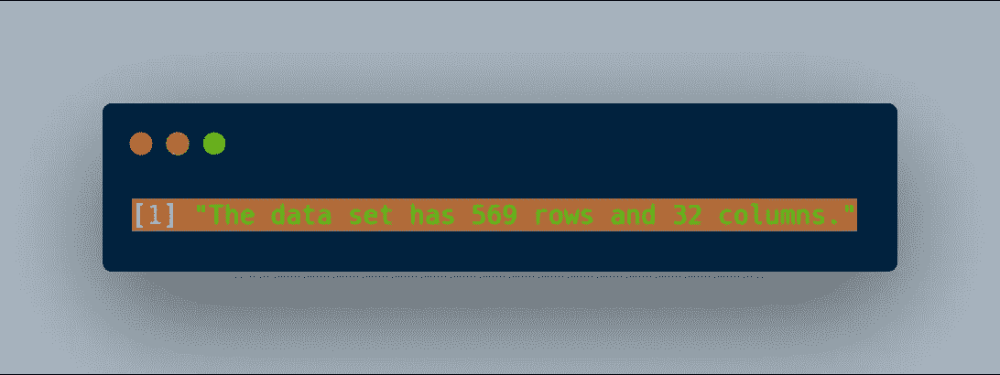
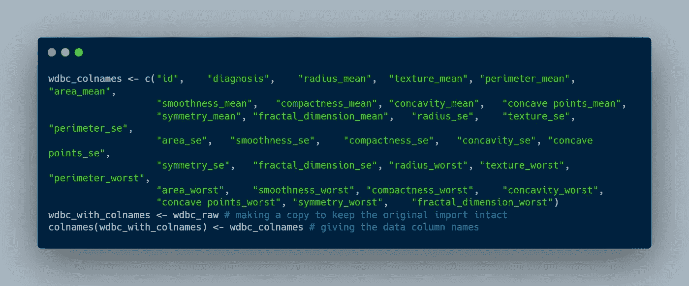
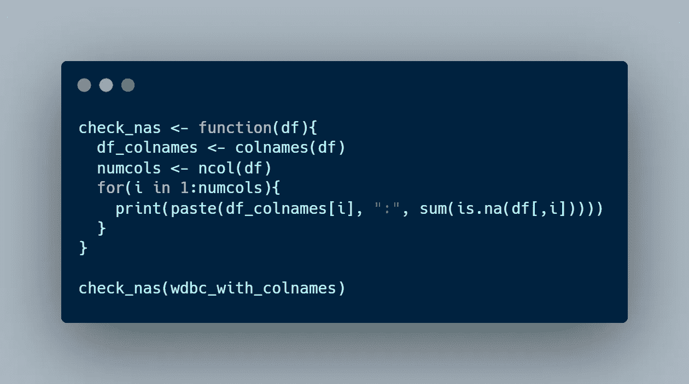
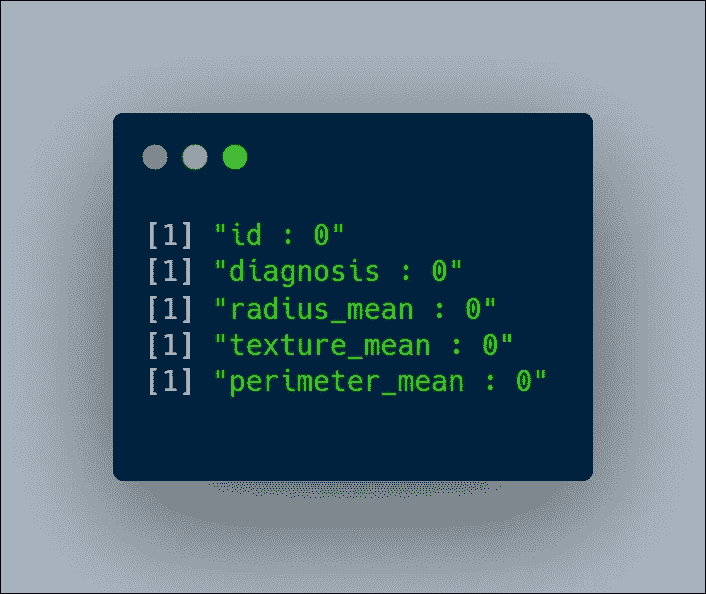
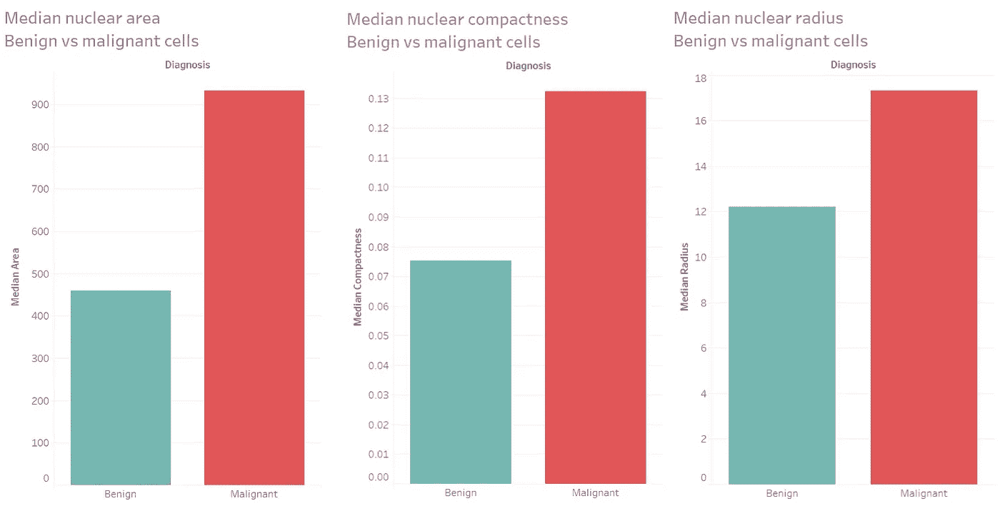
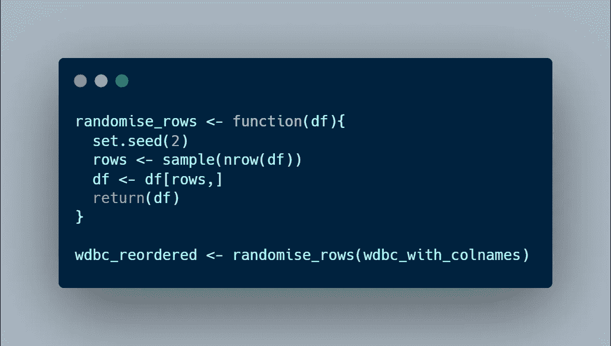
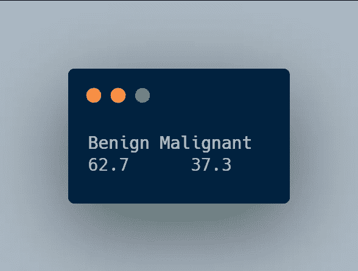
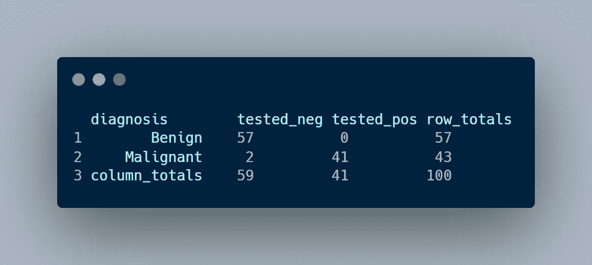

# 使用 K-最近邻(KNN)来识别癌症

> 原文：<https://medium.com/geekculture/using-k-nearest-neighbours-knn-to-identify-cancer-7aa29f2e80b?source=collection_archive---------44----------------------->

嗨！我叫鲁本，是一名医生，目前住在印度。这是我的第一篇文章，我希望这将是一系列基于在医疗保健问题的背景下使用数据科学的文章。我不认为自己是数据科学或机器学习算法方面的专家，但我对这个主题有浓厚的兴趣，我希望使用这个博客来发布我的进展和我感兴趣的项目。

在我的第一个项目中，我决定在一个包含各种细胞参数信息的数据集上测试 KNN 算法，以区分恶性细胞和良性细胞。虽然我尝试过使用 R 和 Python，但我个人更喜欢 R。所以这是我将在整个项目中使用的。我将使用一个名为 RStudio 的应用程序，作为测试代码和执行分析的环境。

KNN 算法是这样一种算法，它基于一个数据集进行训练，查看一个新的、以前从未见过的测试观察，然后识别它的“K 个最近邻居”(因此得名)，其中“K”是一个预先确定的数字。

但是“最近邻居”是什么意思呢？它只是引用数据集中与新测试观察最接近的观察。例如，在一个根据甜度等级 1-10 将各种食物分为水果或蔬菜的数据集中，在该数据集中训练的 KNN 算法将查看一个新的测试观察值(也许是一颗葡萄)，并确定它与数据集中的其他观察值有多相似。它通过测量每个观测值各自变量之间的欧几里德距离(是的，我稍后会解释这个术语)来做到这一点。葡萄的甜味更接近芒果，而不是黄瓜。所以猕猴桃和黄瓜之间的甜度差异比猕猴桃和芒果之间的要大。如果“k 个最近邻居”中的大多数物品被分类为水果，则该算法也将葡萄分类为水果。

好吧，让我们检查一下“欧几里德距离”这个术语，这样一旦实际的机器学习开始，我们就能真正理解发生了什么。假设我的水果蔬菜数据集中的黄瓜脆度为 8，甜度为 2。另一方面，芒果的松脆度为 2 分，甜度为 9 分。让我们称之为我们的训练观察，因为这是我们的算法将被训练的。如果这个算法看到一个新的食物项目，比如一颗松脆度为 4 分、甜度为 7 分的葡萄，这就是它如何计算不同项目之间的距离。

dist(葡萄，黄瓜)=√[(8–4)+(2–7)]≈6.4

dist(葡萄，芒果)=√[(2–4)+(9–7)]≈2.8

与黄瓜相比，葡萄显然更接近芒果。KNN 算法识别“K”个最接近的邻居，然后基于哪个类别在这些邻居中出现得最多来确定测试的类别。如果我们的假设数据集更大，并且我们决定 K=7，算法将寻找在 7 个最近的邻居中出现次数最多的类别(水果或蔬菜),并确定测试观察值属于该多数类别。

事不宜迟，让我们开始工作吧。我将从讨论数据集本身开始。我从 repository^[1]. UCI 机器学习中心获得了数据它由一个包含 569 个观察值(行)和 32 个变量(列)的数据框组成。每次观察代表细胞核的不同维度(面积、曲率等)。)从乳房组织的细针抽吸物(从器官取样组织的诊断方法)的图像中计算。

code to import the data into RStudio as a data frame and print its rows/ columns

上述代码将数据集导入 RStudio，然后输出以下内容:

在探索数据之前，我必须更好地理解一些关键参数。例如，列有名字吗？算法本身并不关心列名，但是我确实想使用列中的数据来准备一些图表。如果我不知道每根柱子代表什么，那就太难了！下图显示了我用来检查前五个列名的代码以及该代码的结果。

code to check the first five column names

显然，这些数据的列是未命名的。所以我做的第一件事就是从这里的[获取列名。](https://github.com/stedy/Machine-Learning-with-R-datasets/blob/master/wisc_bc_data.csv)

将列名添加到数据框是一件相当简单的事情。我使用了下面的代码。

我不打算重复这些列名的含义。事实上，我们甚至不需要知道使用 KNN 算法意味着什么。这是机器学习如此有趣的众多方面之一。

不过，我将浏览几个感兴趣的专栏。第一列只是每个观察的标识符。就我们的目标而言，这个绝对没用。标识符不会给你任何关于底层数据的实际信息，所以我们很快就会删除整列。

第二列包含我们对每个样本的诊断——良性或恶性。这是我们的目标变量——我们想要预测的东西。其他列只包含各种细胞维度的数据。

继续，我想确保数据集没有丢失值。丢失的值可能是一个很难处理的问题，所以最好尽早检查它们。我编写了一个函数来检查丢失的值，并将数据帧传递给该函数。该函数检查每一列是否有缺失值，然后报告该列缺失值的数量。

为了节省空间，我在下面的图片中只包括了前五列的结果。然而，对我们来说幸运的是，没有一列被证明有任何丢失的值。

在我训练这个数据集之前，我想分享一些非常基本的可视化，以加强算法的逻辑。以下是良性和恶性样本的细胞核面积、密度和半径的差异。虽然我可以用 R 编写这些图形，但我选择使用 Tableau Public，因为使用 GUI 总是更容易。

我随机选取了这些参数。从我在医学上对恶性肿瘤的总体了解来看，DNA 的损伤及其周围蛋白质的变化会导致细胞核的大小和形状异常。所以我确实期望看到这些差异。但是，即使是对恶性细胞一无所知的人也可以通过这些可视化来得出两种组织之间差异的结论。重要的是这种可测量的差异是存在的。KNN 算法将利用这些差异将我们的测试样本分为良性或恶性。

在训练数据集之前，我决定随机对行进行重新排序，以防止数据以特定方式预先排列后出现问题。例如，如果所有恶性组织都放在末尾，因为我将使用前 80%的行来训练数据，所以算法没有足够的恶性样本来学习。

code to randomise rows

诊断列包含我们存储为“字符串”的诊断。这只是意味着该列中的数据可以是任意数量的字符(字母或数字)的“字符串”。理想情况下，我们希望数据存储为“因子”。因子只能取有限的一组值。预定义集合之外的任何值都将被拒绝。当使用分类算法时，最好使用因子，因为你不必担心字符串输入错误。这可以通过一行简单的代码轻松解决。

code to turn a column of strings into a column of factors

我们差不多到了激动人心的部分了。在此之前，我想做的最后一件事是检查恶性和良性样本的相对分布。如果其中一个太多而另一个不够，这可能会使算法无效，因为没有足够的样本来概括一个模式。

code to check the proportion of malignant samples in the dataset

这可能看起来是一个倾斜的比例，但它将为我们想要做的事情工作。超过三分之一的样本是恶性的，因此有大量的例子可供算法学习。

制作 KNN 模型时，数据准备的最重要步骤之一是将数据标准化。这意味着每一列都必须用 0-1 来表示。我们这样做的原因是，KNN 算法通过测量每个观察值各自变量之间的差异来寻找测试观察值和数据集中的观察值之间的相似性。因此，如果一个变量在比大多数其他观察值大得多的尺度上测量(例如，如果它以厘米为单位测量，而其他变量以微米为单位测量)，它将对算法确定相似性的方式产生很大影响。因此，我编写了一个函数来规范化数据，并将数据帧传入。我将除了包含诊断的列之外的每一列都传递到函数中，因为这是我们需要预测的目标变量。此外，非数字值不能正常化。

code to run the created ‘normalise’ function over all the variables of the dataset

然后，我在其中一列上运行了一个快速测试，以确保这些值确实正常化了。为此，任何列中的最小值和最大值必须分别为 0 和 1。

好的，看起来我们都准备好了。现在，我们需要将数据集分成两部分—一个训练集和一个测试集。我们将使用训练集来训练 knn 算法，然后使用测试集来测试我们的模型的准确性。我们还将分别提取训练和测试标签，因为它们需要作为单独的参数传递给 knn 函数。我选择了 80-20 的比例(更像是 82-18)。因此，我们将使用大约 80%的数据集来训练算法，另外 20%来测试它。在有足够的样本来训练数据和有足够的样本来测试数据之间总是有一个折衷。

我们需要的 knn 函数在“类”包中。如果你还在读这篇文章，感谢你的耐心。你的耐心现在会得到回报。让我们实现 KNN 吧！

Yes, it really is this simple

经过一点尝试和错误，我发现 11 是寻找邻居的最佳数字。奇数比偶数好，因为这消除了平局的可能性(就像 k 个最近邻居中的良性和恶性组织一样多)。11 接近样本总数的平方根的一半。knn()函数返回预测诊断的列表。但它们与实际诊断相符吗？让我们找出答案。

这段代码产生的实际输出实际上非常混乱。所以我写了一些代码将这些结果转换成一个整洁的小列联表。让我们看看结果吧！

在上表中，行代表实际诊断，而列代表通过我们的算法分配给每个测试样本的诊断。在我们的测试数据集中有 57 个良性样本和 43 个恶性样本。其中，所有 57 个良性样本都被正确识别！在 43 个恶性样本中，只有 2 个被误诊为良性。这使得该算法的特异性为 100%，准确性为 98%。这里可以实现更先进的技术。例如，我可以给每个变量分配不同的权重。也存在处理图像的技术。这样就不需要首先测量不同的细胞尺寸，并准备一个包含所有这些信息的数据集。相反，能够处理图像的模型可以简单地查看细胞组织的图像来执行这种分类。
然而，这个练习的目的只是为了展示将机器学习实践整合到医疗保健工作中的好处。
我希望在不久的将来从事更复杂的项目。我相信那些会比这个更有用。但是，机器学习和数据科学的巨大潜力，即使只是从一个小小的 KNN 模型中诞生，也足以让我对其在医疗保健领域的未来感到兴奋。

参考资料:

1.  Dua d .和 Graff c .(2019 年)。UCI 机器学习知识库[http://archive . ics . UCI . edu/ml]。加州欧文:加州大学信息与计算机科学学院。