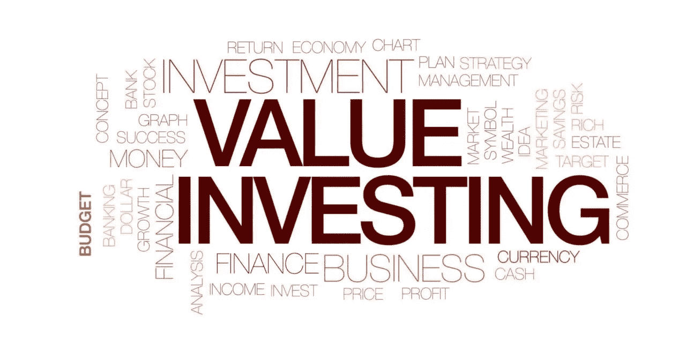

# 利用股票内在价值进行价值投资

> 原文：<https://medium.com/geekculture/value-investing-using-intrinsic-stock-value-29b1f1d62283?source=collection_archive---------19----------------------->

沃伦·巴菲特做了什么使他和他的投资方法不同于大多数投资者？他阅读。这听起来很简单，但却是他作为投资者取得成功的最重要因素之一。根据美国消费者新闻与商业频道的说法，巴菲特每天早上都会阅读《华尔街日报》、《今日美国》和《福布斯》。这些(当然还有很多其他的)阅读让他在投资界做了人们所说的“价值投资”。

如果你是一个长期投资者，那么价值投资应该是你在做出股票购买决定之前一直考虑的事情。简单来说，价值投资意味着当优质公司的股票相对于其内在价值折价交易时，买入这些股票。举个简单的例子，如果股票 X 的当前价格是 100 美元，而内在价值是 120 美元，那么该股票正在折价交易，应该考虑购买。同时，如果相反的情况成立(内在价值低于当前市场价格)，那么这意味着股票正在溢价交易，因此不应该在这个价格买入。这个等式中有两个变量——当前市场价格和内在价值。找到当前的市场价格是直截了当的，你可以只做一个简单的网络搜索。

棘手的问题是——你如何找到一只股票的内在价值？行业中使用了多种方法，例如:

*   **现金流量折现法**:这种方法着眼于公司所有的未来现金流量，根据贴现率计算每笔现金流量的现值。如果第一年的现金流= C1，第二年= C2 等等，那么内在价值= C1 / (1+r) + C2 / (1+r) + …..Cn / (1+r)^n.这里 r 是你把钱投资到其他地方的回报率。对于新手投资者来说，这种方法可能很难应用，因为它需要了解公司未来的现金流，而现金流很难预测。你可以从公司当前和历史的财务报表开始，查看现金流，为未来做一些估计。
*   **基于资产负债的估值:**这是一种非常简单的方法，利用公司资产和负债的差额计算内在价值。虽然简单，但这种方法有很多缺点，因为它是静态的，没有考虑公司未来的发展前景。这也将导致公司的内在价值更低(因此更保守)。对于低风险偏好的谨慎投资者来说，这可能是一个有用的方法(因为这种方法会建议以较低的价格购买股票)。同时，由于简单，这种方法很容易被早期投资者采用。
*   这是另一个简单的(也是我最喜欢的)计算内在价值的方法。这种方法所需的大部分数字都可以通过网络和公司财务报表轻松获得。假设公司 X 的每股收益为 10 美元。公司的平均市盈率(比如过去 5 年)= 20。该公司的每股收益(EPS)预计未来将增长 15%(你可以看看多个分析师的报告来评估这一增长率)。这给出了股票的价值 x = 10 美元* 20 *(1.15)⁵= 402 美元。但是，请注意，这是 5 年后的预期价格，我们需要将其折现为现值。假设折现率为 10%(投资大型股票市场指数的平均长期收益率)。这给出了当前的内在价值= 402 / (1.1)⁵ = $250。这意味着如果价格低于这个值，你应该买入股票。

通常，不同的方法会给出不同的内在价值。作为投资者，理想的方法是使用不同的方法计算内在价值，并确定你可以放心购买股票的价格范围(例如，你可以低于所有方法中的最低价格或最高和最低价格之间的任何价格)。如果当前市场价格高于所有估值选项的最高值，那么最好等待价格修正，一旦股票进入你的买入范围就买入。

如果你喜欢这个博客，可以在我的网站[**Getmoneyinsights**](https://getmoneyinsights.com/)**上找到更多这样的博客。**