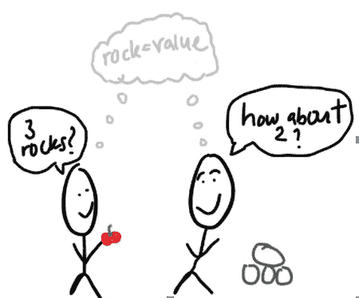
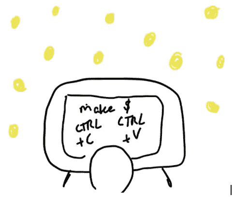
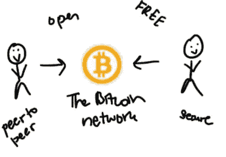
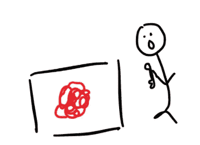
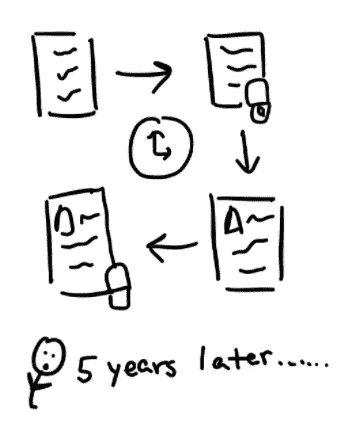
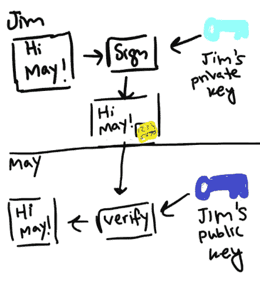
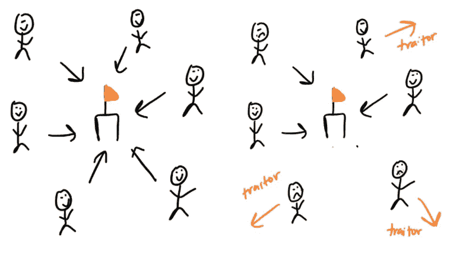
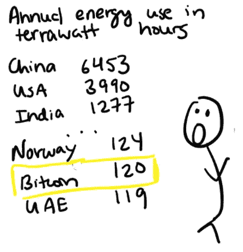
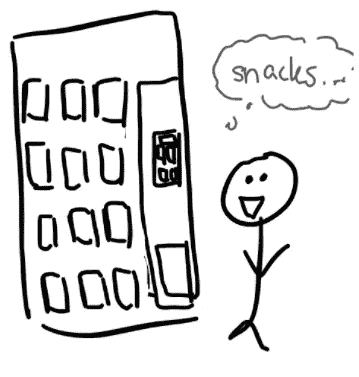
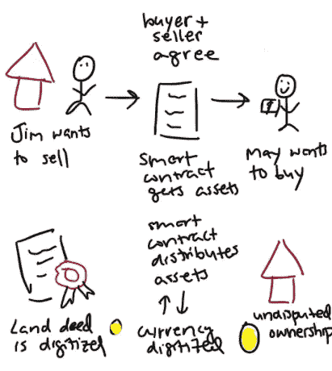

# 自动售货机、玻璃盒子和谷歌文档:区块链介绍

> 原文：<https://medium.com/geekculture/vending-machines-glass-boxes-and-google-documents-2dd16d098fe1?source=collection_archive---------12----------------------->

如果你和我一样，你可能在过去几年里听到人们谈论这种超级酷的变革性技术，称为区块链。在某个时候，你可能会想，**“区块链到底是什么？!"**

大约 25 年前，互联网的兴起席卷了整个世界，不仅改变了我们的生活方式，也改变了我们对“在线”事物的看法。虽然它已经成为获取信息和与他人沟通的强大手段，但随着数据泄露和安全威胁的新闻不断出现，它也受到了不信任。什么使某事可信或有价值？

作为现实世界中的交易媒介，货币具有价值和可信度。人们用钱作为交换的代币。这样做的原因只有一个——买卖双方都认同它的价值。

在引入货币和金钱之前，作为一种文明，我们依赖银和金等贵金属。这些金属的稀缺创造了价值。如今，任何东西(艺术品、奢侈品，甚至去年的卫生纸和洗手液)的稀缺性都增加了它的(货币或感知)价值。然而，如果只是在互联网上“复制和粘贴”东西是可能的，那么任何数字化的东西真的能被认为是有价值的吗？

区块链技术让不可能变成了可能。有了区块链，我们能够为数字事物提供安全性，完全重新定义了社会对数字资产的看法。区块链就像一个不断更新的记录簿(不可能篡改或破解)记录着谁拥有什么。区块链的固有特性消除了对中介的任何需求，使其**分散化**。这个**一个**特性给了区块链彻底革新我们与中央集权实体(如政府和银行)互动方式的力量！

## **区块链从根本上**

现在您已经知道了什么是区块链以及它的功能，让我们来了解一些关键术语，它们将帮助您了解区块链是如何工作的！

*   区块链上的每个**块**都是一个事务的记录。
*   **个体节点**是区块链网络的人的一部分(可以是世界上的任何人)。
*   每个**节点**都有一个区块链的副本(这使得区块链分散化)。
*   比特币和以太坊是使用区块链技术构建的加密货币的例子(加密货币只是区块链的一个应用)。

要了解区块链是如何运作的，我们需要谈谈区块链最重要的特征——权力下放！

## **权力下放(无银行特征)**

权力下放允许区块链在没有第三方参与的情况下工作。

A centralized system needs to go through a middleman

A decentralized network doesn’t rely on middlemen.

缺少第三方创造了一个对等网络，在这个网络中，交易可以以更高的速度进行，并且更加安全和可信。

考虑去中心化最简单的方法是想象控制和决策从一个集中的实体(如个人或组织)转移到一个分布式网络。为什么这很重要？

1.  分散式网络不需要任何信任。这是什么意思？如果事情涉及到区块链，你实际上不需要相信任何事或任何人！
2.  区块链的性质阻止了任何参与者对彼此施加任何可能危及网络功能的权限或控制的能力。
3.  区块链不太可能失败，因为它们依赖于许多独立的组件。如果一个节点停止工作，或者甚至 100 个节点停止工作，假设至少有一个节点正常运行，区块链将继续存在。

## **玻璃盒子的钥匙和地址。**

此时，您可能想知道，“区块链实际上是如何工作的？是什么让 T2 天生如此安全？”想象一个银行金库，里面有一排排没有标签的盒子。每个箱子(**区块链**上的一个街区)都是由玻璃制成的，这样银行里的每个人都能看到箱子里的东西。然而，因为它在一个盒子里，他们不能访问他们所看到的。

区块链就像一系列玻璃盒子，里面的内容每个人都可以看到和验证，但不能改变。每个人都知道盒子在哪里，里面装的是什么。当有人为他们的加密货币打开钱包时，实际上**会在区块链创建一个新地址**(玻璃盒子)。他们的私人钥匙可以打开这个地址。

## **更新区块链:来自谷歌文档的页面**

通过协作共享文档的传统方式是将 Microsoft Word 文档发送给另一个收件人，并要求他们对其进行修改。问题是您需要等到收到返回的副本后才能看到或进行其他更改。这是因为在其他人完成编辑之前，您无法编辑它。这就是今天数据库和许多机构(如银行)的工作方式。

使用 Google Docs，双方可以同时访问同一个文档，并且该文档的单一版本对双方都是可见的。它的工作方式类似于**共享分类账**。当共享涉及大量人员时，分布式部分就发挥作用了。

虽然谷歌文档确实有它的优势，但是是什么阻止人们在你的化学报告中加入一篇关于猫迷因历史的 30 页文章呢？是什么阻止人们举报区块链上的非法交易？没人能篡改玻璃盒子里的东西，但是没有什么能阻止坏人把非法的盒子添加到金库里(据你所知)。谷歌文档还没有解决这个问题，但区块链肯定已经解决了😎。

## 数字签名和加密

签名的传统功能是将一个人独特的、不可否认的自我身份永久地附在文件上，作为该人个人见证的实物证据，并证明文件的全部或特定部分的内容。

签名的传统功能是使一个人能够将其作为一种手段，将自己的身份与实物证据联系起来。它应该作为特定文档内容的不可否认的自我识别和认证。今天，伪造一个物理签名是如此容易，你可能已经做了几次，甚至没有思考两次。

与传统签名类似，数字签名的功能是为每个人提供唯一的数字身份。数字签名是一种数学系统，用于验证数字信息、文档或区块链的真实性和完整性。数字签名可以提供区块链上交易和协议的来源、身份和状态的证据。

使用区块链的每个人都有一个私钥和一个公钥(像“密码”一样使用的一串位)。公钥是私钥的一个函数，但是不可能从别人的公钥中得到他们的私钥。要获得公钥，需要使用复杂的数学算法。解决这个数学算法来破译公钥将需要几乎 35 代的工作！

那么，公钥是用来做什么的呢？还记得我们讨论过如何让每个人都可以在不改变玻璃盒内任何东西的情况下取出里面的东西吗？公钥允许任何人(是的，任何人)这样做。使用公钥，您可以验证消息的任何部分或区块链的交易部分的真实性。

## 拜占庭将军的问题

在一个无法验证信息可信度的网络中，分散系统特有的一个大问题变得显而易见。每个人如何在一个单一的真理上达成一致？每个能进入保险库的人怎么能就单个玻璃盒子里的东西达成一致呢？拜占庭将军问题是一个博弈论问题，涉及几个试图攻击拜占庭的将军。他们已经包围了这座城市，但他们需要决定何时进攻。他们不能发送信息，因为他们很容易被截获，也没有其他方式与将军们沟通。古老的问题是:**将军们如何同时协调进攻？**

拜占庭将军的问题凸显了权力下放的一个重大缺陷——如果不依靠可信的第三方给你正确的信息，就很难达成共识。在网络中，**没有一个成员能够验证另一个成员**的身份，那么成千上万的节点怎么可能能够在区块链上达成共识呢？

## 共识机制

共识机制是网络上的节点就区块链中的单个值达成一致的一种方式。共识机制有助于核查和记录。在比特币区块链上，共识机制被称为工作证明(PoW)。解决一个难题需要大量的计算能力。

在比特币网络中，任何人(甚至是你！)可以开采比特币。当一个事务发生时，它被添加到挖掘池中，网络上的每个矿工都可以看到该事务的发生。工作证明机制中的工作本身是任意的。对于比特币，它的核心是 SHA-256 哈希算法。赢得这一轮散列的矿工将来自采矿池的事务编译并记录到下一个块中。因为“幸运的”矿工是随机选择的，与完成的工作量成比例，它激励网络上的每个人诚实行事，只记录真实的交易。为了让加密货币有价值，需要有一定数量的加密货币。比特币哈希算法的难度不断调整，因此每 10 分钟只有一个“幸运”的矿工，这有助于控制加密货币的供应，帮助它保持其价值。

工作证明共识机制的主要问题之一是，它需要大量的电力，并且可能是昂贵的，从长远来看这是不可持续的。较小的工作证明区块链容易受到 51%的攻击，这使得它们在早期非常容易受到攻击。还有其他共识机制，如利害关系证明和权重证明。工作证明仍然是比特币和以太(以太坊的本地加密货币)最常用的使用方式。

## **以太坊和自动售货机**

区块链似乎以比特币和加密货币结束，但这与事实相去甚远。虽然比特币只不过是一种货币，但以太坊是世界上最受欢迎的加密货币之一，是一种实际上可以用来构建新程序的账本技术(稍后将详细介绍)。

以太坊最基本的特征之一是智能合约。想象一下自动售货机是如何工作的。你投入钱，做出选择，你要求的任何东西都会出来。

很简单，除了这不是网上或者现实生活中的工作方式。当我们想要零食时，我们需要中间人来确保我们的意图和交易是合法的。聪明的合同消除了中间商。

以太坊是第一个引入智能合约的。智能合同允许系统独立运行，不需要任何中介或第三方。我们世界中的许多事情都严重依赖中间人(这意味着智能合同可能会在这些领域产生影响)。

*   房地产经纪人从房屋销售中收取佣金。
*   尽管做了所有的工作，优步的司机还是为每次乘车支付优步。
*   唱片公司从付给音乐艺术家的钱中提成。
*   众筹网站稀释了支持者给创始人的宝贵资金。
*   投票由政府官员监督，以确保选举结果不被篡改。

以太坊的目标不是像比特币那样去中心化金钱，而是去中心化*一切*。从医疗信息、政府决策、音乐版税到网络安全、稀有艺术品(包括非专利艺术品)和房地产，区块链技术的可能性实际上是无限的，以太坊将在很大程度上影响几乎每一家在线公司。

> ***如果你喜欢这篇文章或者有一些想法或反馈想分享，我很乐意在***[***LinkedIn***](https://www.linkedin.com/in/anya-singh/)***上与你联系。如果你想了解我的近况，你可以在推特上关注我*** [***这里***](https://twitter.com/_anyasingh) ***。***