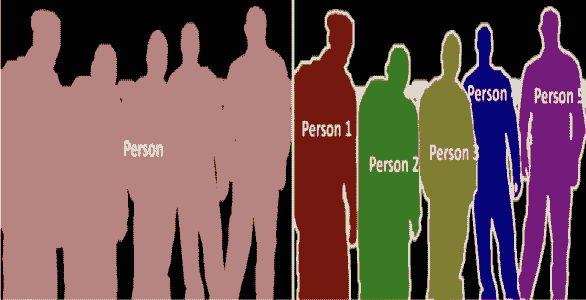
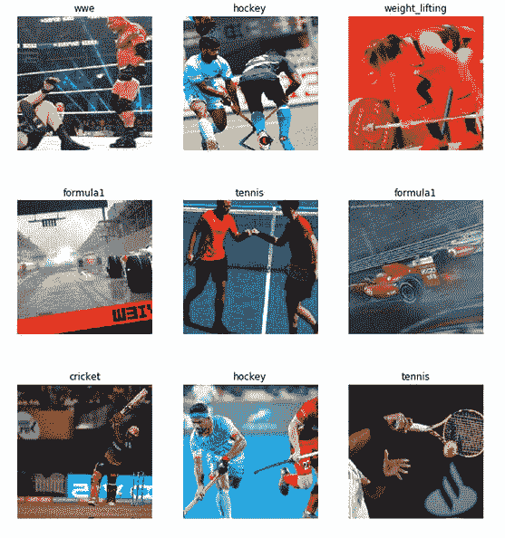
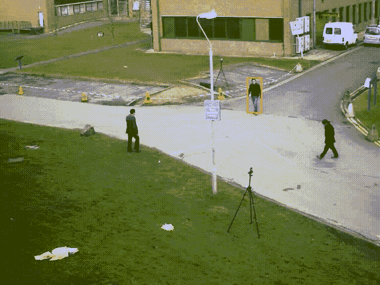

# 视频级计算机视觉推进商业洞察

> 原文：<https://medium.com/geekculture/video-level-computer-vision-tasks-a714ae3d6301?source=collection_archive---------13----------------------->

## 从空间到时空的视觉加工

*Image By mnbb on Getty Images*

图像中基于实例的分类、分割和目标检测是计算机视觉领域中的基本问题。与图像级信息检索不同，视频级问题旨在检测、分割和跟踪时空域中具有空间和时间维度的对象实例。

视频域学习是基于摄像机和无人机系统的时空理解的一项关键任务，可应用于视频编辑、自动驾驶、行人跟踪、增强现实、机器人视觉等等。此外，它有助于我们将时空原始数据与视频一起编码成有意义的见解，因为与视觉空间数据相比，它具有更丰富的内容。随着我们解码过程中时间维度的增加，我们得到了关于

*   运动，
*   视点变化，
*   照明，
*   闭塞
*   变形
*   局部歧义

从视频画面来看。因此，视频级信息检索作为一个研究领域越来越受欢迎，它吸引了沿着视频理解研究路线的社区。

从概念上讲，视频级信息检索算法主要是通过添加额外的头部来捕获时间信息，从而从图像级过程中改编而来。除了更简单的视频级分类和回归任务，视频对象检测、视频对象跟踪、视频对象分割和视频实例分割是最常见的任务。我就把提到的问题简单描述如下。

[Gif](https://gfycat.com/accuratepoliticalkiskadee) on [Gfycat](https://gfycat.com/)

首先，让我们回忆一下图像级实例分割问题。

**图像级实例分割**

实例分割不仅将像素分组到不同的语义类中，还将它们分组到不同的对象实例中[1]。通常采用两阶段范式，首先使用区域提议网络(RPN)生成对象提议，然后使用聚合 RoI 特征预测对象边界框和遮罩[1]。与仅分割不同语义类别的语义分割不同，实例分割也分割每个类别的不同实例。这是示例图。

Left Figure: Semantic Segmentation, Right Figure: Instance Segmentation ([Image by Vinorth Varatharasan/ResearchGate](https://www.researchgate.net/profile/Vinorth-Varatharasan) [6])

**视频分类**

视频分类任务是图像分类对视频领域的直接适应。不是给图像作为输入，而是给模型视频帧来学习。本质上，时间相关的图像序列被提供给学习算法，该算法结合空间和时间视觉信息的特征来产生分类分数。

[Image](https://github.com/anubhavmaity/Sports-Type-Classifier/blob/master/readme_images/sports.png) by [anubhavmaity/Github](https://github.com/anubhavmaity)

**视频字幕**

视频字幕是通过理解视频中的动作和事件来为视频生成字幕的任务，这有助于通过文本有效地检索视频[5]。因此，给定视频帧，我们正在生成描述视频概念和上下文的自然语言。

Video Captioning Example (Image By Author)

**视频对象检测**

视频对象检测旨在检测视频中的对象，它最初是作为 ImageNet 视觉挑战的一部分提出的[2]。即使关联和提供身份提高了检测质量，这种挑战也仅限于用于每帧检测的空间保留的评估度量，并且不需要联合对象检测和跟踪[3]。然而，与视频级语义任务相反，没有联合检测、分割和跟踪。

Video Object Detection (Gif by Author)

**视频对象跟踪(VOT)**

视频目标跟踪任务通常被认为是基于检测和无检测的跟踪方法。在基于检测的跟踪算法中，联合检测和跟踪对象，以便跟踪部分提高检测质量，而在无检测方法中，我们给出一个初始边界框，并尝试跨视频帧跟踪该对象[3，4]。

Video Object Tracking ([Image By Zhongdao/GitHub](https://github.com/Zhongdao/Towards-Realtime-MOT))

**视频实例分割**

视频实例分割是最近引入的计算机视觉研究，旨在对视频域中的实例进行联合检测、分割和跟踪。由于视频实例分割任务是受监督的，因此它需要面向人的高质量注释，用于边界框和具有预定义类别的二进制分割遮罩。它需要分割和跟踪，与图像级实例分割相比，这是一项更具挑战性的任务。因此，与以前的基本计算机视觉任务相反，视频实例分割需要多学科和聚合的方法。VIS 就像一个当代的一体化计算机视觉任务，是一般视觉问题的组合。

Video Instance Segmentation Prediction (Image By Auther)

**知识带来价值:视频级信息检索在行动**

承认视频级信息检索任务的技术边界将从实践的角度提高对业务关注和客户需求的理解。例如，当客户说，“我们有视频，只想从视频中提取行人的位置，”你会意识到你的任务是视频对象检测。如果他们想在视频中定位和跟踪他们呢？那么你的问题就转化为视频对象跟踪任务。假设他们也想跨视频分割。你现在的任务是视频实例分割。然而，如果一个客户说他们想为视频生成自动字幕，从技术角度来看，你的问题可以表述为视频字幕。理解项目的范围和绘制技术业务需求取决于客户想要获得的洞察力的种类，对于技术团队来说，将问题作为优化问题来阐述是至关重要的。

文章到此结束。如果你有任何问题，让我知道。以下是方法。

**我在这里**

[Twitter](https://twitter.com/canKocagil2)|[Linkedin](https://www.linkedin.com/in/can-kocagil-970506184/)|[Medium](https://cankocagil.medium.com/)|[Mail](mailto:cankocagil123@gmail.com)

**最初发布于**

 [## 视频级计算机视觉推进商业洞察

### 图像中基于实例的分类、分割和对象检测是图像处理领域中的基本问题

venturebeat.com](https://venturebeat.com/2021/11/11/video-level-computer-vision-advances-business-insights/) 

**参考文献**

[1] G. Bertasius、L. Torresani 和 J. Shi。时空采样网络视频中的对象检测，2018。

[2]陈光诚、庞俊杰、王俊杰、熊毅、李、孙、冯、刘志军、史俊杰、欧阳文俊、吕春春和林大林。用于实例分段的混合任务级联，2019

[3]戴俊杰、齐海波、熊燕燕、李燕燕、张广国、胡海波和魏燕燕。可变形卷积网络，2017。

[4]褚晓东，田志军，王燕燕，张，任，魏，夏，沈。双胞胎:重新审视《视觉变形金刚》中空间注意力的设计，2021。

[5]辛格、阿洛克、图达姆·多伦·辛格和西瓦吉·班卓帕迪亚伊。" Nits-vc 系统的 vatex 视频字幕挑战 2020 . "arXiv 预印本 arXiv:2006.04058 (2020)。

[6] Varatharasan，Vinorth & Shin，Hyo-Sang & Tsourdos，Antonios & Colosimo，Nick。(2019).提高复杂背景中物体检测和分类的学习效率。78–85.10.1109/reduas . 19967