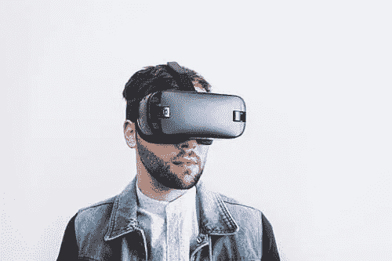

# 虚拟现实公司律师用旧法律解决新法律问题

> 原文：<https://medium.com/geekculture/virtual-reality-company-lawyers-use-old-law-for-new-legal-issues-bb76043eb4c8?source=collection_archive---------22----------------------->

Image credit: [Piqsels](https://www.piqsels.com/en/public-domain-photo-jfzyh)

元宇宙已经准备好对 21 世纪的社会产生变革性的影响。沉浸在这个领域的律师必须能够调整他们的法律培训，以应对新的、意想不到的挑战。一家虚拟现实公司的总法律顾问在快速发展的监管环境中处理广泛的法律问题。

## **增强现实与虚拟现实**

有时人们会互换使用增强现实和虚拟现实这两个术语。然而，这些现实以不同的方式实现不同的目标。简单来说，增强现实使用真实世界的设置，而虚拟现实用模拟的体验取代了真实世界的环境。

增强现实是一种增强现实世界环境的交互式体验。计算机生成的感知信息丰富了自然环境。增强现实技术可以增强多种感官形式的现有环境，包括视觉、听觉和嗅觉。

当用户处于虚拟现实中时，用户观察到的特征或物品模拟了他们周围的物理障碍。虚拟现实耳机有助于在人工数字环境中模拟声音和感觉。

Meta 原名脸书，推出了一款名为[地平线工作室](https://www.oculus.com/workrooms/)的虚拟现实远程工作应用。该应用程序创建了一种体验，以促进人们使用该公司的 Oculus Quest 2 耳机进行协作。

Image credit: [Piqsels](https://www.piqsels.com/en/public-domain-photo-zktmc)

增强现实的消费耳机的销售正在上升。咨询公司 Omdia Research 预测，这个市场到 2026 年将达到 160 亿美元。增强现实小组估计，这两种现实之间的界限将越来越模糊。

有一个高度集中在通过虚拟现实功能。此功能允许您观察耳机外部，实时观察周围环境。这个特征有时被称为混合现实。它融合了数字和物理环境。

## **虚拟现实行业总法律顾问经验**

从 2016 年 9 月到 2022 年担任 Unity Technologies 总法律顾问的 Ruth Ann Keene 将长期存在的法律规则应用于新的法律情况。“我们仍然学习 19 世纪的侵权法是有原因的，”基恩女士说。在加入 Unity Technologies 之前，Keene 女士曾在国际律师事务所 Morrison & Foerster LLP 私人执业多年。

专业律师事务所 Gamma Law 为使用这两种现实的行业客户提供量身定制的建议。Gamma Law 的法律团队专门研究与增强现实、虚拟现实和混合现实相关的复杂法律问题。例如，他们的律师团队为客户提供 M&A 交易、技术许可、证券投资和谈判策略方面的建议。

为虚拟现实设计手持追踪软件的公司 Ultraleap 认为，它的律师必须擅长开拓新的法律领域。Tom Kaweski 在 2012 年至 2017 年期间担任 Leap Motion 的总法律顾问和首席财务官。这是在 Ultrahaptics 于 2019 年收购该公司并将其更名为 Ultraleap 之前。他认为在这样的公司做一名内部律师需要多种多样的法律技能。“日常事务是许可、开发协议、监督专利顾问和处理就业事宜，”卡维斯基先生说。

## **两种现实的交集**

新的增强现实和虚拟现实技术的出现带来了许多以前没有解决的法律问题。然而，法律分析经常涉及应用几个世纪以来的法律概念和原则。

增强现实和虚拟现实技术的使用越来越多，也可能会影响到意想不到的法律领域。例如，更多地使用增强现实和虚拟现实可能会导致人身伤害责任。因为这种体验可能导致用户失去对其真实世界环境的意识。因此，他们在使用该技术时可能会有受伤的风险。确定人身伤害的责任是属于虚拟现实耳机的设计者还是个人用户，涉及复杂的法律分析。

## **元宇宙的隐私和网络安全**

元宇宙的网络安全法律挑战很可能不仅限于互联网带来的挑战。加密货币和 NFT 的大量使用可能会导致金融网络犯罪的增加，如欺诈、盗窃和洗钱。如今盛行的网络犯罪，如勒索软件、网络钓鱼和黑客攻击，也可能会频繁发生。

在隐私方面，脸书告密者 Frances Haugen 将个人数据的使用聚焦在元宇宙。元宇宙提供商负责聚合大量个人数据。随着虚拟现实的发展，社交媒体平台将对个人数据的收集、使用和存储拥有更多控制权。这些未来公司的总法律顾问将如何应对未来的法律挑战，还有待观察。