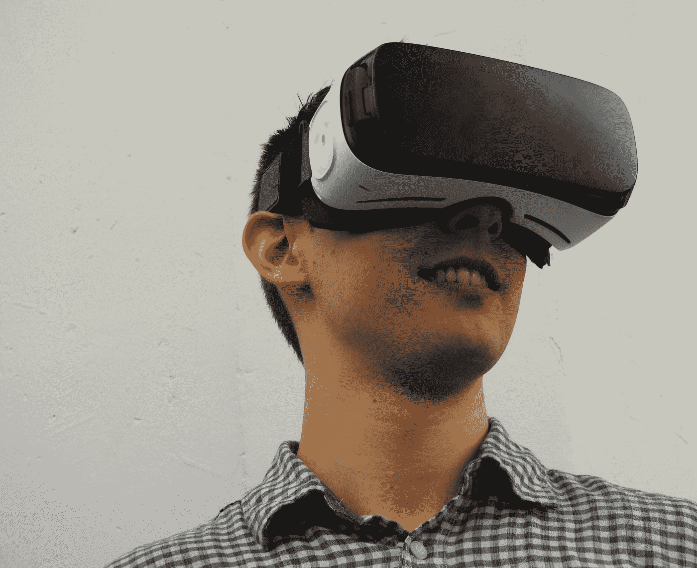
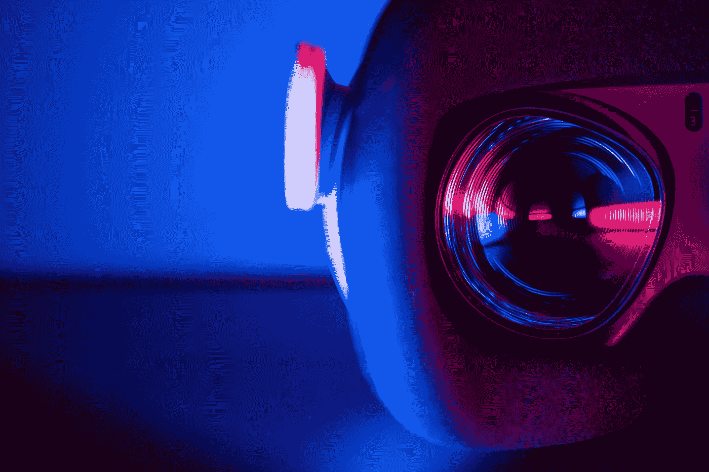

# 面向消费者的虚拟现实:关于虚拟现实如何融入客户体验的博客

> 原文：<https://medium.com/geekculture/virtual-reality-for-consumers-a-blog-about-what-vr-is-how-it-can-be-used-and-how-it-can-be-315267f8861e?source=collection_archive---------23----------------------->

你想通过虚拟现实让你的顾客开心吗？看下面！

Photo by [stephan sorkin](https://unsplash.com/@sorkin?utm_source=medium&utm_medium=referral) on [Unsplash](https://unsplash.com?utm_source=medium&utm_medium=referral)

虚拟现实现在风靡一时，而且在商业领域的发展速度越来越快。许多公司陷入了对该技术的大肆宣传，而不是了解 VR 是什么以及它如何影响他们的业务。这篇博客将从消费者的角度来看待虚拟现实，以及它将如何成为下一个大事件。

# 什么是虚拟现实？

虚拟现实是计算机生成的三维图像或环境的模拟，可以由一个人使用特殊的电子设备(如 VR 耳机)以看似真实或物理的方式进行交互。虚拟现实体验可以通过运行在计算机上的软件来创建，也可以通过使用特殊投影仪将物理环境投影到屏幕上来创建。虚拟现实已经使用了很长一段时间，但它现在才开始被大众消费者所接受。如今，世界如此习惯于技术的进步，以至于我们认为这是理所当然的。我们生活在这样一个时代，我们只需轻触一个按钮就可以点餐，我们可以与我们的朋友和家人交谈，而不必共处一室。那么，为什么虚拟现实如此重要呢？

虚拟现实(VR)是创建一个虚拟环境，可以由一个人使用特殊的电子设备(如 VR 耳机)以看似真实或物理的方式进行交互。虚拟现实人工创造感官体验，包括视觉、触觉、听觉和嗅觉。

# 虚拟现实对消费者来说有什么样的未来？

2016 年，谷歌推出了自己的虚拟现实平台 Daydream。2017 年，该公司与联想合作推出了首款支持 Daydream 的智能手机。2018 年，谷歌推出了自己的 VR 头戴设备“谷歌 Daydream View”，并推出了用于教育的 VR 平台。毫无疑问，虚拟现实是 21 世纪最激动人心和最有前途的技术进步之一，而我们才刚刚开始。有了虚拟现实，我们现在可以沉浸在一个完全不同的世界，在那里我们可以实现我们最疯狂的梦想和幻想。然而，与任何新技术一样，也有一些障碍需要克服。第一个也是最大的问题是，虚拟现实对普通消费者来说并不容易实现。安装起来非常昂贵和复杂，并且需要很大的空间。第二个问题是 VR 还没有找到它的杀手级应用。没有一个杀手级应用程序会让人们购买一个 VR 耳机并开始使用它。第三个问题是，VR 目前遇到了先有鸡还是先有蛋的情况:主要的 VR 平台——Oculus 和 Vive——没有太多的内容，反过来，也没有内容，因为没有人拥有 VR 耳机。

Photo by [Bermix Studio](https://unsplash.com/@bermixstudio?utm_source=medium&utm_medium=referral) on [Unsplash](https://unsplash.com?utm_source=medium&utm_medium=referral)

Oculus Rift 首次出现在 Kickstarter 上并大受欢迎已经有一段时间了，但直到几年前，它还是一个只有少数游戏玩家感兴趣的小众话题。然而，如今，普通民众越来越了解虚拟现实及其越来越受欢迎，特别是在三星 Gear VR 和最近的谷歌 Cardboard 出现之后。对虚拟现实感兴趣的人数正在迅速增长，很有可能在不久的将来，它将成为我们日常生活中的一个常见特征。那么，虚拟现实和你的生意有什么关系呢？目前不多，但它的受欢迎程度肯定在增长。随着这项技术的不断改进，它的应用将会越来越广泛，将会应用于游戏之外的更多领域。企业已经开始看到在营销策略中使用虚拟现实的优势，但要让它成为每个企业都会使用的标准功能还需要一段时间。

我们大多数人都熟悉虚拟现实(VR)这个术语，但并不是每个人都熟悉它到底是什么。的确，这项技术已经存在了一段时间，但只是在最近几年才开始商业化。那是什么呢？嗯，它可以被定义为计算机生成的三维图像或环境的模拟，可以由一个人使用特殊的电子设备以看似物理的方式与之交互。VR 开启的可能性是无穷无尽的。有了它，顾客可以沉浸在你的品牌中，以一种超乎你想象的方式体验你的产品。但是这项技术已经以游戏和娱乐的形式进入了消费者市场。但是企业必须利用它的潜力呢？

虚拟现实(VR)是客户体验的下一件大事。这是一种身临其境的体验，可以在许多方面使用，但它在客户体验领域的最大用途之一是通过培训。如果你试图在一个实践环境中培训你的员工，使用虚拟现实是最好的方式。如果你试图训练你的客户如何处理某些情况，虚拟现实也是一个很好的方法。这比 2D 屏幕好。更真实，更动手，更身临其境。

Photo by [Hammer & Tusk](https://unsplash.com/@hammerandtusk?utm_source=medium&utm_medium=referral) on [Unsplash](https://unsplash.com?utm_source=medium&utm_medium=referral)

# 消费者虚拟现实的未来

虚拟现实(VR)在消费者中越来越受欢迎。毫无疑问，在不久的将来，VR 将成为最重要的技术之一。即使技术变得越来越先进，仍然有一些问题需要解决。这就是为什么我认为为消费者谈论虚拟现实的未来很重要。不久的将来会带来什么？虚拟现实会很快成为主流还是需要几年才能到达大多数消费者手中？就我个人而言，我认为这项技术将呈指数级增长。虚拟现实有如此多不同的应用，很难想象它不会成为主流。

用于增强现实和虚拟现实的技术正在快速发展。从医疗行业到游戏世界，它都被广泛应用。随着它们越来越受欢迎，越来越多的公司希望以一种有益于客户的方式将该技术融入到他们的业务中。虚拟现实是一项已经存在了一段时间的技术，但使其成为消费品所必需的技术最终变得可用。虚拟现实不仅是一种大众负担得起的技术，也是一种容易获得的技术。

# 为什么是 VR？

我们正在进入一个新的技术时代。虚拟现实(VR)是数字世界发展的下一步。想象一下，如果你愿意，一个电脑屏幕。它为你创造了一个互动的世界。但这只是虚拟的。现在，想象这些相同的经历，但不是通过电脑屏幕。通过虚拟现实耳机的镜头想象他们。你被传送到这些新世界。你和他们互动。就像生活在电脑里一样。这是数字世界的未来。它已经在这里了。

虚拟现实(VR)行业正在流行起来。大多数人都知道 VR 用于游戏行业，但 VR 在其他行业越来越盛行。虚拟现实可以用于广告，培训，旅游，甚至是性满足。随着每一次新的迭代，VR 变得越来越身临其境和真实。随着谷歌新的虚拟现实耳机 Daydream View 的出现，虚拟现实对于普通消费者来说越来越实惠。

绿光虚拟现实和虚拟现实之路的一份新报告表明，到 2020 年，虚拟现实将是一个 300 亿美元的市场。300 亿美元是一大笔钱，对于我们这些自 Oculus 首次在 Kickstarter 上筹集 240 万美元以来一直关注 VR 的人来说，这非常令人兴奋。但是，更大的问题是:我们用它做什么？绿光虚拟现实和虚拟现实之路的分析师预测，我们将在硬件和软件以及沉浸式体验和应用程序的创建上花费 300 亿美元。

Photo by [James Yarema](https://unsplash.com/@jamesyarema?utm_source=medium&utm_medium=referral) on [Unsplash](https://unsplash.com?utm_source=medium&utm_medium=referral)

# VR 相比传统营销渠道有什么好处？

过去，让消费者试用产品是一项简单的任务。你可以在广告牌、杂志或电视上为产品做广告，人们会去尝试。然而，当涉及到虚拟现实时，事情变得有点复杂。为了让消费者在虚拟现实中试用产品，你必须让他们去一个可以在虚拟现实中试用产品的地方。这是一个小问题。为了解决这个问题，企业一直在以几种不同的方式使用虚拟现实，不需要用户拥有虚拟现实耳机。例如，一些企业已经购买了移动 VR 头戴设备，可以轻松地运输到活动或场所，允许您分发虚拟现实样品。另一种解决问题的方法是根本不发放虚拟现实耳机。相反，企业可以使用 360 度视频创建虚拟现实体验。用户不再使用耳机，而是在手机或电脑屏幕上观看视频。企业也可以使用增强现实在虚拟现实中展示产品。企业可以简单地使用覆盖图来展示他们正在销售的东西，而不是创造一个供用户探索的整个世界。

消费者的虚拟现实:虚拟现实如何融入营销组合？虚拟现实是现在的热门话题。从 Oculus Rift 到三星 Gear VR，VR 不再只是开发者使用的东西，也是消费者使用的东西。根据 2016 年 VR/AR 行业报告，超过一半的受访消费者表示，他们有兴趣将 VR 用于娱乐、教育和游戏。调查还发现，大多数受访消费者表示，与传统营销渠道相比，他们更喜欢 VR。那么，VR 能为你的营销策略做些什么呢？

虚拟现实给企业带来的好处是显而易见的——但消费者呢？是的，它仍然是一项新技术，但虚拟现实作为虚拟购物体验以及观看电影的新方式具有很大的潜力。简而言之，虚拟现实可以成为体验内容的一种全新方式。如果你没有关注虚拟现实新闻，你可能会想知道它与增强现实有什么不同。从某些方面来说，三星 Gear VR vs 谷歌 Cardboard 是一个很好的对比。在很大程度上，这两种技术非常相似。两者都利用智能手机来观看虚拟或增强现实体验。两者的主要区别在于，增强现实是将一个计算机生成的物体放在真实物体之上，而虚拟现实是将你完全沉浸在计算机生成的世界中。更具体地说，虚拟现实用一个虚构的现实取代了你的现实。另一方面，增强现实增加了你的真实性。如果这听起来令人困惑，不要担心。重点是虚拟现实是一种比增强现实更具沉浸感的体验。

说到营销，企业可以使用许多工具。其中包括电视广告、广播广告、广告牌和传单。尽管许多企业已经使用这些策略很多年了，但一些企业已经开始实施一种新的营销趋势:虚拟现实。虚拟现实是一种新技术，允许企业创建一个真实的世界，客户可以通过他们的耳机体验。

Photo by [XR Expo](https://unsplash.com/@xrexpo?utm_source=medium&utm_medium=referral) on [Unsplash](https://unsplash.com?utm_source=medium&utm_medium=referral)

# 当今虚拟现实应用的例子

随着 Oculus Rift 的推出，PlayStation VR、HTC Vive、三星 Gear VR、谷歌 Cardboard 和谷歌探险的发展，虚拟现实现在对大多数消费者来说都是可行的。尽管这些只是该技术的第一步，但目前正在使用的应用有哪些呢？

想想在过去的几十年里，视频游戏变得有多复杂。想想创建一个高质量的视频游戏需要多少时间。现在将这个时间乘以 10，因为这是创建一个令人惊叹的虚拟现实体验所需要的时间，这将为消费者提供最佳体验。沉浸感也是 VR 如此强大的原因。由于存在的感觉，人们能够以前所未有的方式与虚拟世界联系起来。当你看电影时，你会意识到你看到的不是真实的东西。但是当你在虚拟现实中经历一些事情时，你不仅能够看到它，而且能够感觉到它。这也是 VR 对消费者如此强大的原因。

虽然虚拟现实仍处于早期阶段，但已经有一些令人兴奋的虚拟现实体验。例如，在 360°视频中的红牛飞行比赛，你可以在令人惊叹的 360°镜头中观看飞行员比赛他们的翼服穿过狭窄的峡谷。或者，红牛 Stratos 项目，它让你在 2012 年观看了菲利克斯·保加拿破纪录的 108，969 英尺自由落体。其他体验包括从国际空间站观看地球或探索废弃的切尔诺贝利核反应堆的能力。可能性是无限的。

Photo by [Alexas_Fotos](https://unsplash.com/@alexas_fotos?utm_source=medium&utm_medium=referral) on [Unsplash](https://unsplash.com?utm_source=medium&utm_medium=referral)

> **结论**

众所周知，虚拟现实是下一件大事。很快，消费者将能够享受虚拟现实的好处，而不需要昂贵的硬件。我们希望您喜欢我们关于消费者虚拟现实的文章。如果您对虚拟现实的未来或如何将其融入您的业务有任何疑问，请随时联系我们。感谢您的阅读！