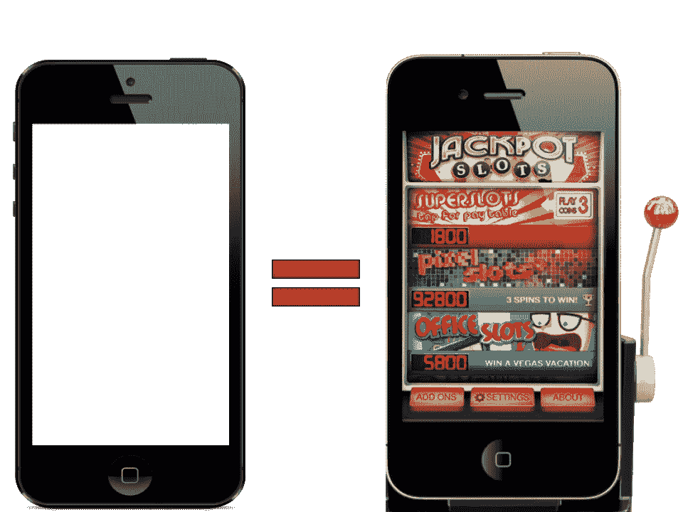

# 大规模分散注意力的武器:随机奖励

> 原文：<https://medium.com/geekculture/weapons-of-mass-distraction-random-rewards-c211e82d9fca?source=collection_archive---------0----------------------->

Image from [TechDetoxBox.com](https://www.techdetoxbox.com/weapons-of-digital-manipulation/random-rewards/)

你是否曾经决定只花 5 分钟查看你的社交媒体，然后发现几个小时后你还在浏览？或者想在睡觉前沉迷于 YouTube 上的一个视频，然后狂欢到凌晨 2 点？或者发动了一辆车，看了一眼你的手机，半小时后还坐在车道上回复信息，发动引擎，浪费汽油，污染环境？

我们都被卷入了屏幕上一些有趣和意想不到的东西的漩涡中，而这些东西正是我们需要看到的。

## **那是行动中的随机奖励。它内置于我们使用的每一个数字媒体产品中。**

随机奖励只是众多数字操纵工具中的一种。这是它的工作原理。

随机奖励，或间歇性可变奖励，是 20 世纪上半叶由实验心理学家 [B.F .斯金纳](https://en.wikipedia.org/wiki/B._F._Skinner)最先发现的行为心理学原理。你看，斯金纳教授用强化原理来控制他的实验对象的行为。他的实验对象是谁？老鼠和鸽子。

原来我们人类并没有那么不同。

斯金纳博士建造了一个相当简单的装置，作为斯金纳盒子载入史册，或者如果你更喜欢一个花哨的科学术语——一个[操作条件反射室。他把实验鼠放在一个盒子里，这个盒子把它们与外部环境隔离开来，并有一个行为指示器，比如一个杠杆或一个按钮。当动物按下按钮或拉动控制杆时，盒子会传递积极的行为强化(食物)以及噪音和灯光。](https://en.wikipedia.org/wiki/Operant_conditioning_chamber)

Source: Wikipedia

## ***一个与世隔绝的主体，按下按钮就有奖励？***

它让你想起什么了吗？或许是电子游戏？或者我们中的任何一个疯狂地在手机上打字？

动物和人类都可以通过奖励和惩罚来训练重复这种行为。动物训练师利用[操作性条件反射](https://en.wikipedia.org/wiki/Operant_conditioning)训练狗服从命令，或者训练马戏团动物耍把戏。在剥皮箱里的老鼠和鸽子被训练敲击按钮来获取食物。

> 正如我们都被训练在我们的设备上点击和滑动来获得我们的数字奖励:对我们的帖子的“喜欢”,对我们的照片的标签，对我们的频道的新“关注”,在视频游戏中的战利品，一条丑闻的新闻更新，我们收件箱中的新邮件——奖励的列表是无尽的。

当我们拿起电话时，我们通常不知道会接到哪一个。这绝非偶然。

斯金纳博士在他的操作性条件反射实验中发现了一个有趣的事实:激励重复行为的最有效方法之一是 ***让奖励的时间表随机*** *。当他的实验鼠和鸽子不知道奖励何时到来时，它们会更多地敲击按钮。可变比率强化是关键。当奖励是可预测的和有规律的，他们对这种行为的热情就会降低。就像当他们知道将要发生什么的时候，他们有点…无聊？*

# 如今，在竞争日益激烈的数字媒体环境中，用户的注意力是一种宝贵的商品。

屏幕上的眼睛意味着广告收入和盈利的数据挖掘。技术开发人员不能让他们的客户感到无聊。永远不会。人类的平均注意力持续时间现在少得可怜，只有 8 秒钟——比金鱼还短。

> 如果用户在 8 秒钟内对你的页面不感兴趣、不惊讶、不感兴趣或不感兴趣，他们会转向另一个应用或屏幕。

救援随机奖励！

> 有效的应用程序设计背后的黑暗心理可以归结为 3 个步骤:设计一个提示、活动和奖励，让人们尽可能多地使用应用程序。

一个官方的行业术语是“用户参与”。数码产品的用户体验(UX)设计是**技术和心理的融合**业外很少有人知道。

数字习惯存在于我们的潜意识中，它们被高度吸引人的消费技术的创造者巧妙地植入其中。首先，这些应用程序只是完成各种生活任务的便捷捷径，比如与朋友保持联系。然后它们就成了必需品。今天有一个运动开始称它们为“数字公用事业”，显然像自来水和电一样必不可少。

# 像转基因作物一样，这些数字杂草生长并占据了我们生活的花园。

可以预见的是。回过头来看，就连它们的创造者也承认，这些工具被设计成会让人上瘾。相比之下，人类传统的社交和娱乐方式既慢又无聊，因此被淘汰了。

这是一个进化过程——适者生存。

随机的数字奖励往往比真实世界的景象和声音更刺激。一个设计良好的应用程序变得不可抗拒，用户被吸引住了。他们将无法抵抗诱惑，无法查看下次应用程序中有什么惊喜在等着他们。他们会一次又一次的回来。

我们只是很好奇。我们喜欢新奇和惊喜。

# 庄家总是赢

斯金纳教授自己把他的发明比作老虎机，承认他让他的鸽子变成了赌博成瘾者。人们可以对人类做同样的事情，这正是赌场几十年来所做的。[吃角子老虎机占赌场利润的 80%](https://www.forbes.com/sites/davidschwartz/2018/06/04/how-casinos-use-math-to-make-money-when-you-play-the-slots/)，他们利用可变比率强化原理达到这个结果。赌徒们不断按下按钮，期待着随机的奖励，但他们不知道奖励什么时候会到来。该系统被编程为让他们尽可能长时间地赌博，但不会达到他们会放弃和退出的沮丧程度。

> 胜利最终到来，多巴胺充斥了他们大脑的奖赏中心，强化了赌博成瘾。

被吃角子老虎机困在“区”里的赌瘾者其实没那么开心。老鼠可能也不太高兴，因为它们被迫继续按下按钮，希望奖励会在下一次尝试时出现。操作性条件反射不是让受试者快乐。而是改变他们的行为。

# 对老鼠和人来说，用户界面都是为了让他们尽可能长时间地参与进来。

斯金纳的行为矫正方法在公开后受到了很多批评。他的反对者有理由担心这些技术会被暴虐的政府用来控制他们的公民。

> 批评家们一点也不知道，几十年后，地球上的数十亿人将成为实验室的小白鼠，在他们的口袋里带着叫做智能手机的小剥皮器。自愿的。

当斯金纳教授回家的时候，即使是老鼠也会在晚上休息。但是我们经常把手机放在床边，不让自己作为数字操作的实验室小白鼠而睡个好觉。

因为我们不能忍受错过我们的设备在一天中随机发出的奖励，给我们大脑的快乐中心带来令人上瘾的多巴胺。

> 玩社交媒体更新、在线游戏、网上购物和意想不到的可爱猫咪视频的老虎机。一个真正的老虎机不能跟随你离开拉斯维加斯，但网上赌场可以。

最初的剥皮器盒子很少有奖励和惩罚的选择:基本上是食物和电击。今天的数字技术没有这种愚蠢的限制。

> 通过收集每个用户的大数据，他们有数千甚至数百万个高度个性化的“压力点”，可用于行为矫正。

大型科技公司利用操作性条件反射来精确编程用户行为。

这里只是几个熟悉的例子。

# 插图 1:你的智能手机屏幕

Photo by Sara Kurfeß on Unsplash

我们的手机发出嗡嗡声，一条弹出消息，应用程序角落里一个红色的新活动圈释放出一股期待的浪潮:等待我们的是什么样的奖励呢？让我们拿起电话了解一下吧！

# 说明 2:脸书

社交网站的商业模式核心是随机奖励，以吸引用户。他们设计的社会方面是一个单独的话题。

***脸书的“随机奖励”feed 提供了一系列专门为你挑选的内容。***

基于特定用户(你)广泛的在线数据档案，算法选择有机(来自朋友的更新)和付费(广告)流量来奖励他们。

# 插图 3: Instagram

同样的原则，但更具视觉效果:重点是图片内容:照片和视频。Instagram 归脸书所有。有人喜欢我的照片——是谁？那是我想要的人吗？还是完全意料之外的人？

> 随机奖励的老虎机被激活:紧张，期待，奖励。冲洗并重复。令人作呕。

这些更新是由一直在变化的算法挑选的，机器学习在猜测你想看什么方面每天都在变得更好。

# 例证 4:推特

由于推文的简短格式，Twitter 可以比其他社交网络在一个页面中打包更多的随机奖励。用户可以快速浏览推文，挑选出他们最感兴趣的。

保证了持续的用户参与。

# 插图 5:谷歌搜索

这些结果是相关的，也是发人深省的。他们立即回答我们的问题。奇怪的是，两个不同的用户问同一个问题，会根据他们以前的搜索历史和地理位置得到不同的个性化搜索结果。给他们最相关(也最有价值)的答案。

这可能没有反映事实，可能会证实他们现有的偏见，但这是题外话。

用户很高兴。

# 说明 6:堡垒之夜

堡垒之夜是一款给孩子们任务和目标的游戏，然后奖励他们额外的皮肤和表情(舞蹈/手势)。按下按钮的奖励——还记得老鼠吗？

> 免费奶酪只能在捕鼠器里找到。孩子们着迷地玩着这个游戏。

电子游戏设计师是随机奖励的大师。人工智能是游戏背后的上帝，如果它感觉到玩家变得无聊或沮丧，就会给玩家分配奖励。战利品箱、虚拟盔甲、武器、额外生命、钥匙、硬币、被壮观杀死的怪物——玩家立即重新参与到游戏中。这才是重点。

应用内购买的掠夺性赌博策略也用于用真金白银购买奖励，并且通常针对年轻用户。《堡垒之夜》的创作者被指责这一点，但实际上任何带有应用内购买的游戏都可能是一个滑坡。

游戏化——将游戏设计用于非游戏性的数字产品，比如卖给我们孩子学校的教育技术，是另一个令人不安的操纵操作性条件反射的例子。

# 插图 7: Pinterest

你梦想的终极捕梦网！一个虚拟的愿景板，上面有你想完成的一切，要参观的地方，要重新装修的房间，要记住的励志人生名言。和源源不断的随机的，意想不到的，美丽的图片来激励你。

把它钉在你的板上。

# 说明 8:亚马逊

他们拥有我们的整个采购历史。他们非常了解我们，他们可以在我们的页面上巧妙地推荐最吸引人的产品，这些产品会引起我们的兴趣。你看到的都是“与你的观点相关的物品”和“受你购买的启发”。

因此，你最有可能买的东西。

# 插图 9: YouTube

YouTube 会分析你以前的观看历史(以及你的其他数字足迹),推荐那些能让你保持兴趣的视频——即使它奖励的是人性中最基本的本能。

如果你忘记关闭自动播放，它甚至会自动播放——这是另一种利用最小阻力路径的设计技术。

# 说明 10:网飞

“网飞狂欢”是英语中的一个真实术语，这要归功于该平台的观看建议算法。

你好，睡眠不足！

例子可以一直举下去，但我们就此打住。一些应用程序比其他的更邪恶:想想 Tinder——以屏幕上接受或拒绝的真实人类的形式提供随机奖励。

随机奖励被整合到每一个数字平台中——从你的工作邮箱到你的社交生活、教育、娱乐、健身——它们无处不在。

他们一天比一天复杂。

# 如何抵制随机奖励的诱惑

问题是:我们能做些什么？我们是像实验室的小白鼠一样玩下去，还是真的有选择？

解决方法来自经典的智慧。著名心理学家卡尔·荣格给了我们公式:

> **“直到你让无意识变得有意识，它会指引你的生活，你会称之为命运。”**

这就是我们的答案。自动数字习惯接管了我们的生活。它们位于我们有意识理解的水平之下。这些习惯不是我们选择的，而是说服技术大师植入我们大脑的。

> 为了他们的利益而优化，而不是为了我们的幸福。

除非我们学会识别他们的操控技术，否则我们将无法控制我们的数字生活。这种代理权丧失的影响是灾难性的。随着越来越多的人类活动转移到数字空间，这意味着我们将自己的命运交给了谷歌、脸书、亚马逊和其他成千上万的傀儡主人。

> 不再有自由意志。

我们必须将我们的冲动带到我们的意识中，并让我们的理性思维参与决策。在数字触发器和我们的反应之间有一个空间。一个停顿。我会选择顺从消费科技行业植入我大脑的冲动，还是这次说不？此时此刻，哪一个选择对我最有利？

这不是道德困境。哪个都可以，只要选择权在你。

> 我们的目标是从我们的数字工具中提取价值，而不会对我们的生产力、人际关系和心理健康产生负面影响。

我们需要扰乱自动反应，放慢速度，反思:“我为什么要这样做？这让我有什么感觉？线下能满足这个需求吗？”

# 还有一种方法可以破坏“用户参与”的界面。

在埃隆·马斯克在我们的大脑中植入一根电线之前(我不建议这样做)，我们对抗数字操纵武器的终极防御策略是通用、简单和免费的。

走出剥皮箱。至少每天几个小时。

# 拔掉插头。

[TechDetox 妈妈](https://www.techdetoxbox.com/mission-screentime-children-wellbeing/)发现自己的孩子在[接受令人上瘾的技术](https://www.techdetoxbox.com/screen-time-problems/)并决定反击。

她对技术和心理之间关系的研究试图揭示数字行为操纵是如何影响人类福祉的。

她在她的博客[TechDetoxBox.com](https://www.techdetoxbox.com/)上写道，要找到[解决方案](https://www.techdetoxbox.com/digital-wellbeing/)来保护我们的家庭，重塑我们的人性。