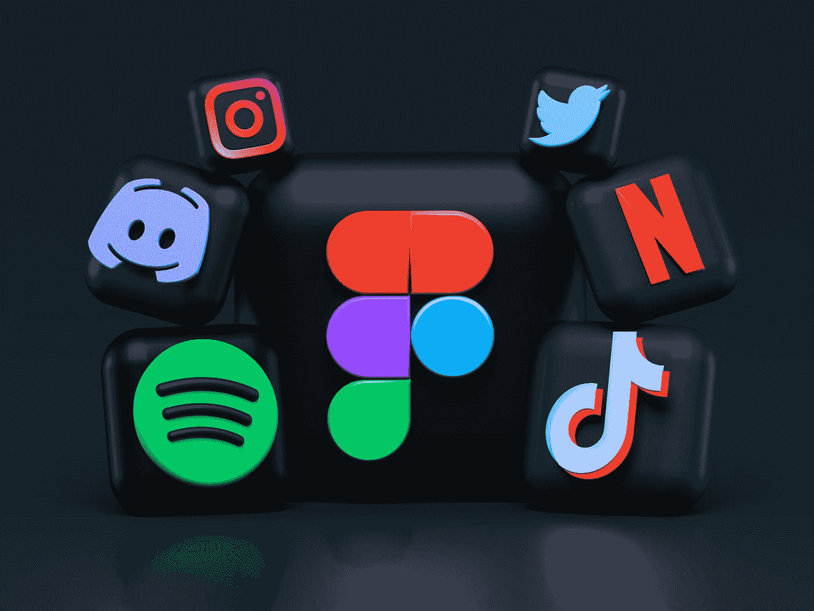

# Web 3.0:与老一代的比较。

> 原文：<https://medium.com/geekculture/web-3-0-in-comparison-with-older-generations-db2d3809e1e8?source=collection_archive---------9----------------------->

在 Web 1.0，2.0，3.0 之间迷茫，让我们一劳永逸的了解一下。

因此，我们都使用不同种类的网络技术，浏览互联网，在 youtube 上观看视频，查看我们的社交媒体账户等。但是如果我说，在理解了这个话题之后，会帮助你理解它的重要性，所以下次当你拿着你的手机的时候，你会意识到事情的背景。

Photo by [Dmitry Zmiy](https://unsplash.com/@zzzmeysss?utm_source=medium&utm_medium=referral) on [Unsplash](https://unsplash.com?utm_source=medium&utm_medium=referral)

从技术上来说，迄今为止，已经有两代网络，但是区块链的发展导致了技术的发展。总的来说，像比特币、dogecoin 和其他加密货币这样的各种硬币已经获得了很多关注。

除非你生活在岩石下，否则我怀疑你没听说过区块链。区块链可以定义为一个区块链，由每个人管理，但不归任何人所有。区块链运行在去中心化的逻辑上，遵循一种称为智能合同的合同来保持一致性。

系好安全带，我们就要开始了。

# 网络 1.0 (1990 年至 2004 年)

我们在互联网上做的任何事情都可以很容易地被称为 Web。Web 1.0 是第一代互联网。这是最低预期，因为这是开始。用户可以搜索任何文本内容，但他们不像现在这样容易上传内容。用户界面非常简单，唯一的目的是让用户相互连接。

Photo by [Lauren Mancke](https://unsplash.com/@laurenmancke?utm_source=medium&utm_medium=referral) on [Unsplash](https://unsplash.com?utm_source=medium&utm_medium=referral)

接入互联网的费用相当高。页面是静态的，如果与现在相比，大多数 Z 世代甚至不会对使用那个版本感兴趣。

我们中任何一个出生于 1991 年至 2004 年的人都有机会体验 web 1.0，如果你是那些有机会看到即将发生的不可思议的事情的开始的幸运儿之一，请分享你的经历。

当时占主导地位的主要浏览器是 Internet Explorer 和 Netscape，这两种浏览器目前都不存在，尽管微软已经推出了更好的替代产品，即 Microsoft Edge for web 2.0+。

# 网络 2.0 (2005 年至 2020 年)

脸书(现名 Meta)创始人的一句名言。

> 未来是私有的。

因为顾名思义，web 2.0 被称为第二代 web。各种组织，如 Youtube、脸书、Instagram、Medium 等。所有这些都在 web 2.0 的保护伞下蓬勃发展。可以肯定地说，2004 年后的世界是在 web 2.0 下运行的。与 web 1.0 不同，用户是信息的消费者，但现在随着数据变得如此重要，最终用户变得像一种产品。

Photo by [Alexander Shatov](https://unsplash.com/@alexbemore?utm_source=medium&utm_medium=referral) on [Unsplash](https://unsplash.com?utm_source=medium&utm_medium=referral)

现在，许多基于用户偏好的个性化被创造出来，我们使用的每个应用程序都试图从我们这里获取某种信息。当然，基于我们浏览的东西，我们观看的视频，我们购买的东西，数字档案是为每个人创建的。使用机器学习和其他类似的技术，我们可以看到最精确的内容。

例如，在脸书、Youtube 等网站上的双人视频。略有不同。根据我们的在线足迹，广告也会有所不同。

Web 2.0 做出了很多创新，互联网在这段时间里增长了许多倍。我们已经看到了机器学习、人工智能、机器人和网络课程开发的巨大增长。许多新的职业，如 vlogging，博客和影响者出现了。

尽管在 web 2.0 期间有了巨大的增长，但仍有各种各样的缺点需要解决甚至替换。隐私已经成为一个神话，每个人都试图获取用户数据。用户不再是互联网的唯一消费者，而是成为了一种商品。

甚至政党也利用这种大量可获得的最终用户数据。向选民展示了玩弄他们情绪的政治活动，并影响他们投票给任何特定的候选人。

因此，我们可以自豪地说，消费互联网的方式在这一次发生了变化，我们能够在这场前所未有的灾难中生存下来。想想我们中有多少人能够在家工作，仅仅是因为在线生态系统。让我们向前看一点，现在理解 web 3.0 将如何帮助我们解决一些这样的问题。

# 网络 3。0 (2020 + + +)

Web 3.0 是未来，当然也是第三代互联网。web 3.0 背后的目标是从大组织中分散权力，让每个人都可以使用它。区块链的力量将被充分开发。

Photo by [Pierre Borthiry](https://unsplash.com/@peiobty?utm_source=medium&utm_medium=referral) on [Unsplash](https://unsplash.com?utm_source=medium&utm_medium=referral)

说用户隐私的所有问题都将一次性解决是非常不现实的，当然，这不会很快发生。但是我们已经选择了方向，我们将能够实现它。

由于区块链上的所有数据都将被更新，我们将获得一个代币作为奖励，这个代币具有货币价值。如果没有挖掘该区块链的其他用户的内容，则不能修改或删除该数据。

虽然区块链有各种各样的好处，但我们必须为此付出代价。挖矿是一件昂贵的事情，其中需要大量的能源来运行各种服务器。所以这导致了全球变暖，这对地球母亲来说是一个更大的福音。

中间人在这个过程中被消除了，因为所有东西都将成为开源的，所有权在那些拥有令牌的人之间。如果你在 Github 上做了一些开源的贡献，可以理解这个概念。

NFT，不可替代的令牌是这样的概念之一，其中产品的唯一权利以令牌的形式给予最终用户。

所以我们可以说，任何事物都有利弊，作为负责任的人，我们必须根据孰轻孰重来判断。在比较了所有事情的利弊之后，我想出了一个解决方案，这个方案以最小的代价解决了最大的问题。

道是一个数字化的去中心化的自治组织，所以它是一个由区块链推动的虚拟组织。道没有任何中央领导。他们负责管理平台，构建区块链网络运行的智能合约。DAO 的成员将成为平台的参与者，任何参与者的权限将取决于他们将拥有的堆栈。

你应该多研究一下去中心化，因为这是未来的趋势。有很多机会会帮助你取得成功。成长是巨大的，只是不要忽视它，就好像它是你的异类。我们中的许多人已经在购买各种加密货币。如果你拥有这样一枚硬币，请在评论区分享你的观点。

# 最后的想法。

所以现在你一定已经理解了所有网络版本之间的区别。我们可以看到，随着第二代网络的发展，互联网有了很大的发展，希望一切都随着第三代网络的发展而成倍增长。

区块链力量加密货币似乎是金融市场的未来。我们将以象征或 NFT 的形式拥有一切的权威。一个这样的例子已经让我兴奋不已，我们可能不必从某个第三方组织购买存储，但我们可以直接从另一个最终用户那里购买，这通常被称为点对点通信。

搜索更多关于 web 3.0 区块链和其他类似的技术，有一个大范围的成长与领域。

**关于作者**
Apoorv Tomar 是软件开发者，隶属于**。你可以在 [**Twitter**](https://twitter.com/apoorvtomar_) 、 [**Linkedin**](https://www.linkedin.com/in/apoorvtomar/) 、 [Telegram](https://t.me/ApoorvTomar) 、 [**Instagram**](https://www.instagram.com/apoorvsinghtomar/) 上和他连线。订阅 [**简讯**](https://www.mindroast.com/newsletter) 了解最新策划内容。不要犹豫在任何平台上说“嗨”,只要说明你是在哪里找到我的资料的。**