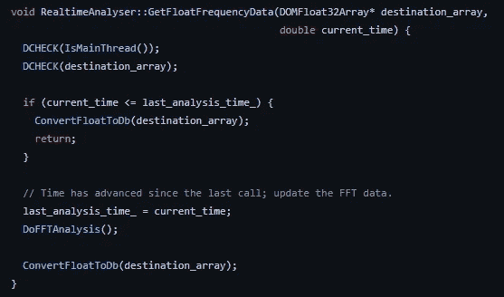
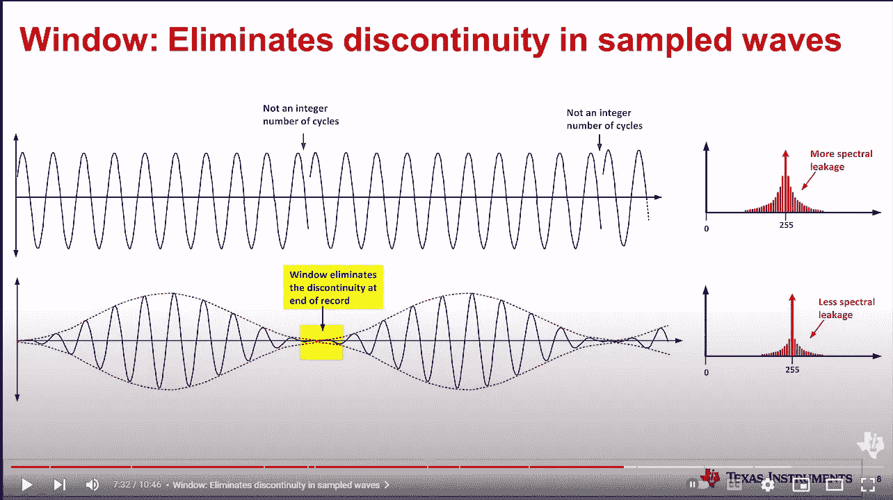
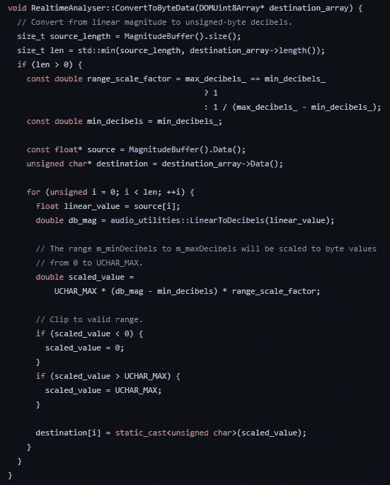
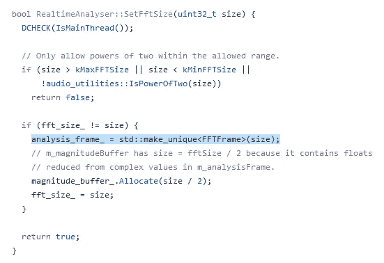

# 网络音频 API 和计算机音频学习

> 原文：<https://medium.com/geekculture/web-audio-api-and-computer-audio-learnings-f5390acdb3ec?source=collection_archive---------6----------------------->

# 文章的意图

这将作为我未来学习电脑音频和网络音频 API 的笔记。如果我有新的收获，我会试着更新这篇文章。

我会试着把它变成一个问答，这样我问自己的相关问题就会在这里得到回答。

## **一般问题**

***web 音频 api 如何工作***

web audio api 使用一些操作功能(音频节点)构建源(声音输入，如麦克风、web 视频/音频标签或音频流)和最终到达目的地(如扬声器)之间的节点图


Image from [https://developer.mozilla.org/en-US/docs/Web/API/Web_Audio_API/Using_Web_Audio_API](https://developer.mozilla.org/en-US/docs/Web/API/Web_Audio_API/Using_Web_Audio_API)

## 问题提交给分析器

***它是如何工作的？***

示例中的函数调用非常简单，上游节点会将声音信号传递到分析器节点，我们可以获得时域或频域数据。

***那么 fftsize 是什么呢？***

FFT 是快速傅立叶变换的简称，其大小将控制输出点的数量。文档含糊地解释了如下的效果/结果:


from [https://developer.mozilla.org/en-US/docs/Web/API/Web_Audio_API/Visualizations_with_Web_Audio_API](https://developer.mozilla.org/en-US/docs/Web/API/Web_Audio_API/Visualizations_with_Web_Audio_API)

从我的理解来说，fftsize 就是目标 bin 的大小(或者应该是正弦波频率的多少？)快速傅立叶变换(FFT)将应用于信号。

根据 chromium 实现的源代码，实际的核心代码在 [realtime_analyser.cc](https://github.com/chromium/chromium/blob/main/third_party/blink/renderer/modules/webaudio/realtime_analyser.cc) ，getFloatFrequencyData 或 getByteFrequencyData API 引用 C 文件中的同名函数。



主调用是 DoFFTAnalysis()，逻辑是“大致”:

```
1\. copy data from input buffer to temp buffer for FFT
2\. call ApplyWindow(buffer, fft_size) # this is to transform the data with a Blackman window to facilitate FFT
3\. call DoFFT(...) on the buffer
4\. Take the return from FFT, combine the real and complex number into magnitude and scale it
```

***那么为什么最终的 bin 大小是 fftsize 的一半呢？***

我相信这是由于奈奎斯特极限，任何超过 1/2 采样频率只是重复(？)和冗余(这也可能与 FFT 将输入样本信号视为无限重复波有关)。

***为什么代码看不到实际的 FFT 实现？***

我认为，尝试执行实际 FFT 操作的代码行是特定于平台的，并且依赖于其他库


This line is the line calling the DoFFT function

当我们检查文件夹时


这些不同的文件夹对于 analysis_frame 有它们自己的实现细节(我“相信”核心实现是 pffft，但我不是 100%确定)

下面是 pffft 实现，我们看到这里实现了 len = fft_size / 2:


***什么是布莱克曼窗？***

我相信这两个视频([视频 1](https://www.youtube.com/watch?v=Q8N8pZ8P3f4) ，[视频 2)](https://www.youtube.com/watch?v=pD7f6X9-_Kg) 会比我给出更好的解释。我有限的理解是，这有助于 FFT 减少泄漏(并产生更好的结果来更精确地捕捉频率)

请注意，Blackman windows 只是不同类型的 windows 中的一种。



screen capture from video: [https://www.youtube.com/watch?v=Q8N8pZ8P3f4](https://www.youtube.com/watch?v=Q8N8pZ8P3f4)

【getByteFrequencyData()和 getFloatFrequencyData()有什么区别？

get byte 函数执行与 get float 函数相同的操作，只是在返回之前增加了一个标度(到 0–255)。

这里我有一个问题:当我检查浮点返回的值时，这些值都是-ve 分贝范围从-20 到-190，字节转换是如何工作的(因为 min _ 分贝 _ 是默认值= -100，max 分贝是默认值-30 <= these are written in realtime_analyser.h)



Compare to above, it just add the lines after the call to audio_utilities::LinearToDecibels(…);

***分析器返回的 bin 的大小/单位是多少？***

如上所述，仓的大小与 fftsize 有关，因此如果我们将 2048 作为 fftsize，我们将得到 1024 (2048 / 2)个数字(以分贝或字节为单位)，每个数字对应于特定频率范围的信号幅度，该范围与我们的采样速率有关。

如果我们以 44100 Hz 对音频进行采样，那么每个 bin /数据代表“采样率/频率”下的信号幅度。

在我们的示例中，该值为 44100 / 2048，约为 21.5 Hz，因此返回数组中的第一个数据应构成对应于 0–21.5Hz 的振幅，第二个值为 21.5–43Hz…

***我们测量/采样信号需要多长时间？***

对于这一点，我不是 100%确定，但据我了解，它与帧大小和采样率有关。这个框架就是代码中的" analysis_frame"。


帧大小由提供的 fftsize 定义。



因此，我们可以得出这样的结论:我们正在获取一帧样本大小= 2048(在我们的示例中)，采样率= 44100 Hz(每秒样本数)，因此我们正在分析 1 / 44100 * 2048 = 0.046(秒)的声音

我还参考了[这本书的在线章节“频率和时间分辨率的权衡”](http://musicandcomputersbook.com/chapter3/03_05.php)(以及以下章节)。

(更多内容请点击此处……)

(下一项是 MDN 示例的可视化)

## 参考

以下是我阅读的参考资料:

***关于编码和实现***

官方网络音频 API 文档 —在一定程度上有帮助，你会得到基本的基础，有他们引用的示例代码(在 github 中)，你已经可以做一些东西了，但是当我想知道为什么和如何实现它时，我们需要找到其他来源

[Chromium 音频处理的源代码](https://github.com/chromium/chromium/blob/9841ee86b710dc649cf41772f560600324cadf45/third_party/blink/renderer/modules/webaudio/realtime_analyser.cc)(或【blink webaudio 的原始回购 )—每个浏览器在支持下实现 web audio API 的方式不同，这个是针对 Chromium 的(Chrome 的基础)，从这里我了解到一些 API 是如何实现的，并回答了我的一些“为什么”问题

[Neil McCallion 的视频【我玩 JavaScript:制作网络音频合成器(Neil McCallion)】](https://www.youtube.com/watch?v=uasGsHf7UYA)—观看涵盖编码和一些音乐理论的视频很有趣，一步一步的解释有助于完成 MDN 文档中的未知内容。

[关于构建 nice analytic 的视频【面向初学者的 JavaScript 音频速成班】](https://www.youtube.com/watch?v=VXWvfrmpapI) —适合初学者水平，web 音频 API 上的编码并没有超出 MDN 文档太多，但很高兴看到可视化如何与 azalyser 节点输出联系起来。

[制作交互式旋律播放器的视频【使用普通 JavaScript、HTML Canvas 和 web audio API 的 Melody Maker 应用】](https://www.youtube.com/watch?v=JNtuLw2fybo) —这太有趣了，是使用 Web Audio API 的另一个很好的例子。

[音频深度学习制作了简单系列](https://towardsdatascience.com/audio-deep-learning-made-simple-part-1-state-of-the-art-techniques-da1d3dff2504) —即使它更专注于深度学习，第一篇和第二篇文章解释了音频数据是如何被处理和理解的，澄清了许多基础问题

***论***

很好的音频编程概念和数学的报道，如果你喜欢视频的话，有一个 youtube 频道

音乐和电脑书——这本书很好地涵盖了电脑音乐，有声音示例和微型网络程序来帮助说明这个想法(仍在阅读)

马克·纽曼的傅立叶变换课程——他的解释比我那时的大学教授好得多，至少值得看看免费视频

[MTU](https://pages.mtu.edu/~suits/Physicsofmusic.html)的音乐物理学笔记——他们班上的课程笔记，可能会有用(还没读完)