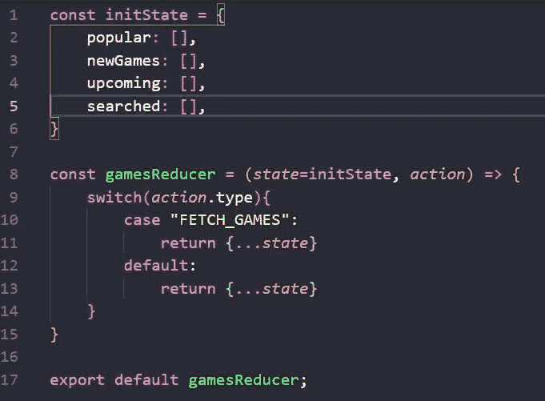
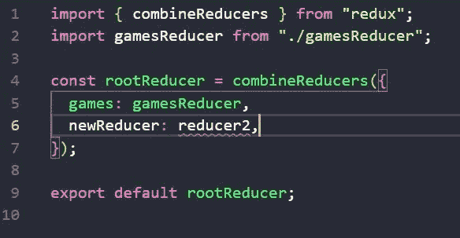
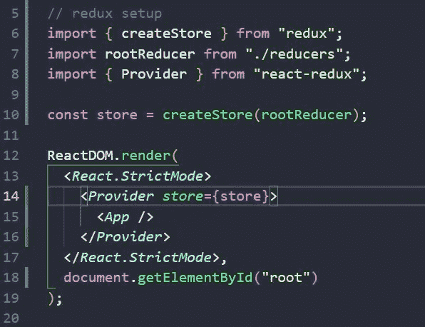
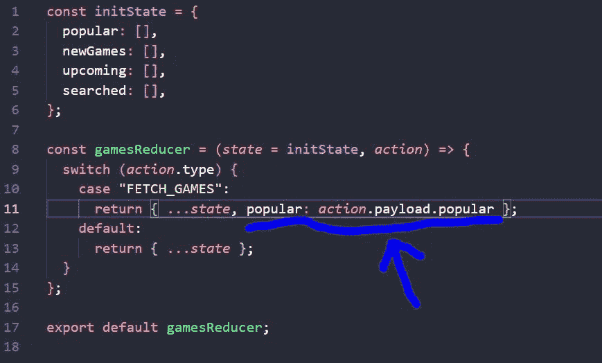
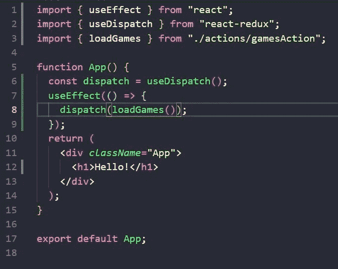
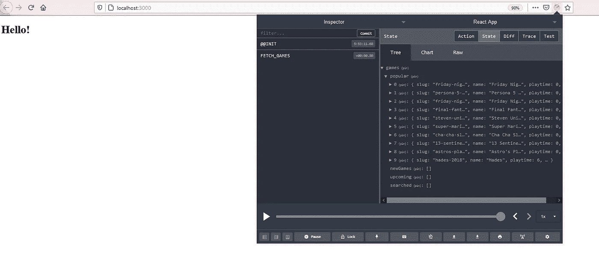

# 网络开发:反应还原一个快乐与痛苦的故事

> 原文：<https://medium.com/geekculture/web-developing-react-redux-in-all-its-glory-b77359950c2b?source=collection_archive---------36----------------------->

React redux 是一个强大的工具，用于管理大型应用程序中的信息。我想您已经熟悉 react，以及它通过组件传递道具的方法。然而，当你有一个包含大量组件的大型应用程序时，传递所有这些信息并跟踪它们会变得很麻烦。Redux 引入了自己的高门槛(对于新手来说确实很难)，但是一旦清除了障碍，它就大大简化了管理状态和信息的过程。

花点时间研究一下上面的模型。无 redux 模型从一个组件跳到另一个组件。信息只能通过这种方式向下传递，不能横向传递，也不能向上传递。使用 redux，您可以创建一个存储对象来管理您的信息以传播信息。看起来相当简单，但是设置可能有点复杂，而且在典型的编程方式中，术语令人困惑。我将尽我所能来打破它，所以跟着我编码员。我们将减轻你生活中的压力。

开个玩笑，我要增加它，然后希望你会有适当的顿悟。典型的程序员编码生命周期。

将必要的软件包安装到您的应用程序后(**NPM install redux react-redux**)，我们将创建商店。商店是保存信息的地方。这是一个全球化的国家。在我们的索引文件中，我将导入 **createStore** 函数来开始。

接下来，我们需要设置商店/状态。为了保持整洁，我将创建一个名为“reducers”的文件夹和一个名为“gamesReducer”的文件，因为这是一个游戏应用程序。Reducers 基本上是一个过滤动作的功能。我们可以对状态执行多种操作，而归约集就是那些规则。它接受两个参数:存储的初始状态，以及可以对它们执行的操作。这是我的。

你可以看到，我现在用空数组设置了 **initState** ，但是这个函数基本上是一个 switch 语句，用于在被某些动作提示时做什么。别担心，我们一会儿会设置动作，但现在我只放入“FETCH_GAMES”，以及一个默认的，简单地用 spread **…** 操作符返回所有的状态。

现在，要知道一件事:我们上面创建的 store 函数将只接受一个 reducer 作为参数。如果我想要一个登录功能的缩减器呢？为此，我必须将我的减速器组合成一个，redux 有一个**组合减速器**功能。因此，在 reducer 文件夹中的它自己的文件中设置它总是一个好的做法。我把它命名为 index.js。

你可以在上面看到我的组合减速器。我添加了 **newReducer** 作为示例，只是为了说明您可以继续添加这个 Reducer。我将它命名为 **rootReducer** ，它将是我传递到存储参数中的内容。

我就导入 **rootReducer** 就通过了。设置好商店后，我们如何将商店连接到应用程序中？我们将用“react-redux”中的**提供者**函数包装我们的应用程序，并将商店作为参数传入。

现在店铺居然在 app 里！

我们可以向我们的 **createStore** 函数添加第二个参数，那就是 [redux dev 工具](http://extension.remotedev.io/)。这是一个很好的功能，可以清楚地看到我们商店的状态，以及信息传递到哪里。它配得上它自己的文章，但是加“**窗口。_ _ REDUX _ dev tools _ EXTENSION _ _()**”作为第二个参数，随便玩玩。

好吧，去拿啤酒和香烟。我们已经谈了很多。回来，我们将进入下一部分…

They say smoking takes years off your life, but what about all that time smokers get back during work breaks? Disclaimer: Don’t smoke in all seriousness.

让我们转到第二部分，这将涉及动作创建者和调度。

行动不是你想象的那样。脸书的聪明人不会让事情变得那么简单。动作只是一个描述我们想要执行的动作类型的对象。它不起作用。是动作明星的 Nic 凯奇…有点混乱(没有不尊重凯奇的意思)。还记得我上面做的“FETCH_GAMES”动作吗？这只是开关中的一个选择。

如果你不想把你的动作设置成一个对象，你可以使用一个返回动作的函数。这些人被称为*动作创建者*。它们很有用，因为这些函数可以有参数来在动作之上添加更多信息。

我们必须手动添加的东西(或者您可以从 gitHub 复制 pasta)是 redux 的异步功能。我不明白为什么这不是内置的，但我不会抱怨。毕竟是免费的。

我们必须从“redux-thunk”中添加“thunk ”,并将其作为参数放入我们的 **createStore** 函数中。然而，我们不能添加第三个参数，所以我们需要使用 **applyMiddleware** 和 **compose** 来自‘redux’的函数来实现这一点。

go ahead — be mad.

好的，让我们在分离动作文件夹中创建动作。记住，我们的行动是对我们想要做的事情的描述。由于这是一个游戏应用程序，我想让它立即打开最流行的游戏。我的 API 已经在我上一篇[文章](https://agarrido84.medium.com/web-developing-api-basics-d0509707fc1c?source=your_stories_page-------------------------------------)中设置好了。

使用 axios，我将创建一个特殊的函数来导出函数 **loadsGames** 。因为我使用了 thunk，所以我的函数在一个函数中:

**出口常量 loadGames = () = () = > {…}**

Nic 笼元。

然而，我们需要等待从 API 中检索到我们的数据。这是调度将要要求做的，所以我们将为它添加一个**异步**。我们将使用 **axios** 来处理 XMLHttpRequest，一旦我们有了这些数据，我们将发出一个调度来填充我们的 reducer，这就是 **initState** 流行数组。

咻！

code-ception

注意，为了填充 **initState** ，我将它作为*有效载荷*插入。让我将这个有效负载添加到 reducer 中，这样当“FETCH_GAMES”被触发时，它将接受它。

好吧，让我看看这是否可行。现在，我将在 App.js 文件中使用它。一旦应用程序打开，我将使用 **useEffect** 来调度动作 **loadGames** 。

因此，让我看看使用开发工具，如果我的流行阵列填充了去年最流行的游戏…

太棒了，成功了！现在我可以再次做同样的事情来填充 initState 对象中的其他数组。

第一次看 Redux 时，它是一个复杂的工具，但一旦你开始从事大型项目，它就非常值得学习。我希望这有助于驱散迷雾，并鼓励你继续学习。请在下面给我留言和一些耳光！