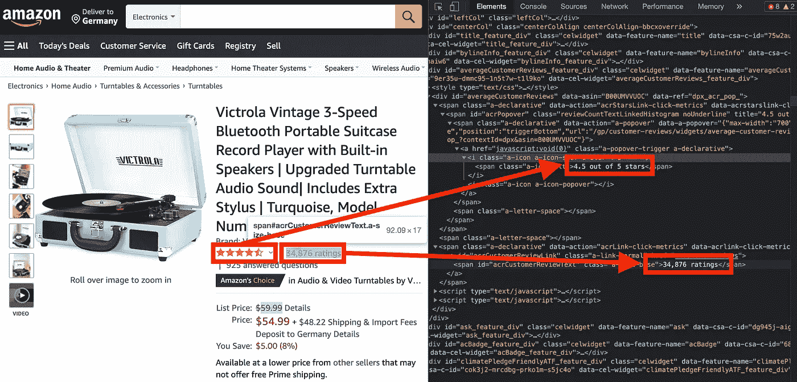
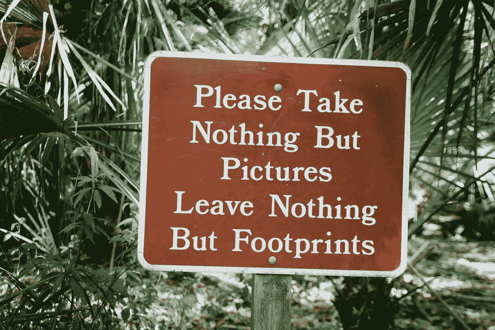
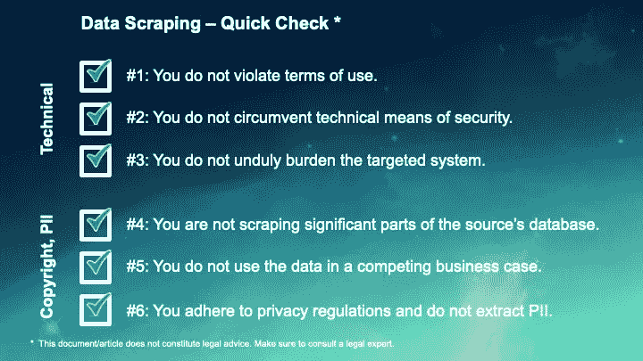

# 网页抓取。太容易了，这可能是非法的。

> 原文：<https://medium.com/geekculture/web-scraping-so-easy-it-could-be-illegal-b113f013a0d3?source=collection_archive---------21----------------------->

Scraping — not just for cocktails. Photo by [Kike Salazar N](https://unsplash.com/@kikesalazarn?utm_source=medium&utm_medium=referral) on [Unsplash](https://unsplash.com?utm_source=medium&utm_medium=referral)

网络抓取——从网站上提取数据——很流行。关于如何高效刮痧的文章不胜枚举。这当然很有吸引力，因为抓取可以获得大量有趣的数据。人们可以分析、处理和出售的数据。随着数据科学越来越受欢迎，对原材料(数据)和如何获取数据的信息的需求也同样增长了。

然而，讨论刮痧的合法性并不常见。当它发生时，多个方面有时是混合的:法律，法院裁决，技术壁垒，刮擦框架等。据推测，处理数据的兴奋感太强了，以至于无法考虑所有的后果。一个人为个人项目提取数据的**影响**，例如在学习新技术时，太小而感觉不到相关。

本文希望解开这个线索，并对潜在的问题进行分类。给你一个循序渐进的清单，看看你的抓取项目是否处于法律的灰色地带。

最初，我们看你的技术方法是否可以接受。一旦我们确定了这一点，我们就转向如何计划使用收集的数据。最后，但同样重要的是，我们关注个人数据。

**免责声明:我不是律师。**不过，我参加并监督了法律、技术、数据科学、数据工程和咨询团队之间的几次讨论。不同国家的法律情况千差万别。针对您的具体情况，请一位具有技术和本地知识的法律顾问。以下几点适用于德国，它们给你一个最初的起点。如果你认为他们很苛刻:宁可谨慎。它会保护你的安全。最后但并非最不重要的一点是，情况永远不会稳定。政府通过新法律。法院通过裁决。我们今天接受的可能明天就不再正确了。

If it was real, it would sell (created with O RLY Parody Cover Generator [https://dev.to/rly](https://dev.to/rly))

此外，请注意，这是对法律和法院建立的合法性的一种看法——而不是对它应该如何如何、法律是否需要改变、或者你是否支持效力的看法。有理由支持免费数据。保护你的个人数据也是一个强有力的理由。有理由保护你的生意和投资。让我们保持重点突出，尽可能简洁。

# 刮痧基础

首先是基本的。“抓取”，即网页抓取，是从一个网站中提取数据。不考虑工具。你可以卷曲源代码，你可以使用 Selenium，PhantomJS，Scrapy…有很多工具可以让抓取变得更容易。还有许多方法可以增加吞吐量:隐藏谁在访问站点的代理，以及编排多个并发查询的框架。

如上所述，如果你是一名开发人员或数据科学家，正在寻找原材料——数据——来磨练你的技能，并且你利用了许多[准备好的数据集](https://opendatascience.com/show-me-the-data-8-awesome-time-series-sources/)中的一个，那么这就不是网络搜集。

抓取还处理您需要提取的大部分非结构化数据。为了以可伸缩的、稳定的方式访问数据，API 总是更好的选择。因为它们提供结构化的回答，并且通常这种结构(相对)简单。在一个网站的源代码中，需要找到相关的数据。根据这个源代码构建得有多好，您的收获可能会有所不同。有些元素可能比其他元素更容易访问。这也取决于开发者和维护者投入到网站中的工作量和勤奋程度。

下面是一个网页抓取工作原理的例子。例如，亚马逊上的产品页面显示总平均评分和评论数。在右边的源代码中，我突出显示了包含这些数据的元素。要抓取它，需要找到一个描述这个 HTML 文档内部位置的锚点。这可能是一个元素 ID、CSS 类或另一个元素的第 n 个子元素。而这就是网页抓取的症结所在。如果开发人员决定重新构建代码或重命名 CSS 类，您的 scraper 就会崩溃，您必须更改它。web 刮刀的维护成本通常很高，并且是一项持续的工作。

但是，也许没有 API。抓取可能是访问您真正想要的数据源的唯一选择。

Example: scraping reviews from Amazon product page. (Image by author)

# 技术方面

这突出了第一个潜在的冲突:“您真正想要的的*数据”。其他人已经创建了一个对您的目的有益的数据集。你想提取属于别人的东西。这合法吗？*

**第一:当你收集数据时，你接受使用条款了吗？**当您创建帐户时，或当您登录时？这些术语是否禁止抓取或数据提取？如果是这样，你的刮是*不*合法的。

有时数据是公开的。不需要登录或帐户。不需要接受任何条款。然后你跨过了第一道坎。

A fence is usually there for a reason. Photo by [Simon Maage](https://unsplash.com/@simonmaage?utm_source=medium&utm_medium=referral) on [Unsplash](https://unsplash.com?utm_source=medium&utm_medium=referral)

**第二:有没有防止刮擦的机制？**验证码或 IP 查询过多后黑名单？还是老好人 robots.txt？多因素认证？如果是这样，您是否实施了巧妙的对策来规避它们？那样的话，你的刮是*不*合法的。有时，服务的运营商不希望您自动访问他们的数据。然后他们建一个围栏，你需要遵守它。拆掉篱笆去绿草地是不合法的。

可以说，Robots.txt 不是一种强大的防御手段，你可能会忽略它。它是一个简单的文本文件，告诉搜索引擎哪些页面可以访问，哪些应该忽略。然而，它声明了托管网站不被抓取器和爬行器访问的愿望——无论是全部还是部分。忽略它不会是你的刮刀合法性的决定因素，美国法院规定，忽略它[不构成“黑客”](https://www.theregister.com/2007/07/26/wayback_firm_suit/)一个网站。然而，结合其他要点(见下文)，这可能会扭转局势。

在美国,《计算机欺诈和滥用法案》( CFAA)强制执行这一规定。由于一个主要目标是惩罚非法侵入/入侵他人的计算机系统或实施网络犯罪，法院已将其应用于抓取。2012 年，Craigslist 指控 3Taps 和 PadMapper 通过使用代理绕过一个 IP 拦截器，未经同意就在 Craigslist 上抓取分类广告。相反，如果没有技术壁垒，也没有检索公共数据必须接受的使用条款，那么 HiQ v. LinkedIn 声称 CFAA 不适用于防止抓取。

在德国，德国联邦法院 2014 年的[裁决规定了类似的要求。一个价格比较网站从一家航空公司的网站上搜集数据来提供预订服务。该航空公司没有防止刮擦的技术壁垒。也不需要接受他们的使用条款来查看航班信息。](http://juris.bundesgerichtshof.de/cgi-bin/rechtsprechung/document.py?Gericht=bgh&Art=en&Datum=Aktuell&nr=67581&linked=pm)

如果数据是公开的，那么到目前为止一切都很好，你已经跨过了第二个障碍。

Scrape responsibly, take only what you need. Photo by [Florida Guidebook](https://unsplash.com/@florida_guidebook?utm_source=medium&utm_medium=referral) on [Unsplash](https://unsplash.com?utm_source=medium&utm_medium=referral)

**第三:你刮得负责吗？刮削可能是一个漫长的过程。获取 web 源代码，处理它，扔掉 95%的代码，只留下 5%的相关代码。效率不是很高。为了加速这个过程，抓取通常通过各种代理利用多个同时查询。无论哪种方式，结果都是对 web 服务器的更多查询，他们的系统上的更多负载，以及其他常规用户的更慢体验。作为补偿，网站运营商将增加服务器容量。这给他们带来了成本。或者如果他们不这样做，当您使他们的服务器过载时，您可能会对他们进行无意的拒绝服务攻击。这肯定会损害他们的业务。**

如果你这样做，你的刮擦活动是非法的。您的清理活动不得对目标系统的性能产生重大负面影响。“重大”在可衡量的意义上是什么？这方面没有确切的数字，并且您无法检查您对目标系统的影响。较大的公司通常已经处理了大量的流量，而较小的网站可能会感受到你的活动的影响。例如，如果您减少并发查询的数量，缓存已经检索到的数据，并且不给系统增加压力，那么您就克服了第三个障碍。请注意，这些是一般性建议，而不是法律要求。不管出于什么原因，不缓存数据并不意味着你的抓取行为就是非法的。只是缓存数据并不意味着它自动合法。

# 版权方面

第四:你从他们的系统里拿了多少？我们现在正离开技术领域，进入版权保护领域。网站的所有者是包含您想要的数据的数据库的所有者。并授予他们复制和分发存储在其系统中的数据的权利。

如果数据是用户生成的内容，如评论、博客帖子、图像，那么创建用户仍然保留对其内容的所有权利。将图片上传到社交网络后，其他权利(如在其他地方发布或出售图片)在上传后仍会保留。并且社交网络可以存储、备份、删除和显示照片的数字副本。

这有什么关系？以表明您正在抓取的 web 服务对您试图提取的数字内容拥有权限。即使他们最初没有生产它。同样，争论这是好是坏超出了本文的范围。

根据目前的规定，如果你提取的内容超过“非实质性”数量，你的抓取是*不*合法的。请注意，尽管德国联邦法院在 2011 年将 10%确定为“非实质性”，但德国的其他法院已经裁定，在特定案件中，10%或更少已经是实质性的。

如果您只提取整个数据库的一小部分，例如，一个国家，或者一个产品子集，或者一个产品信息子集，那么您就遇到了第四个障碍。即使您可能永远不会知道实际提取的数据的确切百分比。

**第五，你打算如何处理你取回的数据？**您打算提供类似的服务吗？或者更糟的是，基于搜集的数据提供同样的服务？你是不是把提取的数据不加修改就卖了？那么你就违反了版权法(可能还有竞争法)，你的抓取是*不*合法的。

第四和第五个障碍是相互关联的。如果你只是从一个网站上收集了一小部分数据，你很难说你是在试图建立一个竞争性的企业。如果你提取所有的数据，那么问题将是:为什么？

如果您处理、分析、聚合或组合来自其他来源的数据来提供额外的价值，那么您就遇到了第五个障碍。

Respect privacy. Photo by [Matthew Henry](https://unsplash.com/@matthewhenry?utm_source=medium&utm_medium=referral) on [Unsplash](https://unsplash.com?utm_source=medium&utm_medium=referral)

# 数据隐私方面

**第六，您提取的是什么类型的数据？**离开版权法，我们现在进入隐私法。虽然欧盟的 GDPR 可能不适用于所有国家，但它仍然可以提供一些指导，即使你不属于它的范围。事实上，像中国[这样的国家起草了类似 GDPR 的隐私法](https://www.natlawreview.com/article/china-issues-second-version-draft-personal-information-protection-law-public)，以此为指导方针:个人信息保护法。它规定未成年人的个人数据值得保护，你需要得到父母的同意才能处理他们孩子的数据。如果你抓取一个网站，得到*任何*用户的同意是不现实的。

如果提取的数据包含个人数据，你的抓取是*不*合法的。究竟什么构成个人数据是一个单独的讨论。通常，任何足以识别特定个人的数据点——无论是其本身还是与其他数据点相结合——都是个人数据。电子邮件地址肯定是个人数据。在组合中，姓名、邮政编码和出生年份也可以。您可能不需要这些数据。不要提取它。或者在真正需要时应用散列算法。

Summing it all up. Photo by [JESHOOTS.COM](https://unsplash.com/@jeshoots?utm_source=medium&utm_medium=referral) on [Unsplash](https://unsplash.com?utm_source=medium&utm_medium=referral)

# 摘要

**综上:**抓取可能是获得有趣数据的唯一途径。有时，实际上可能没有人知道你是否违反了法律。如果你在更大范围内或以盈利为目的搜集数据，建议你对照当地法律检查自己行为的合法性。

首先，考虑下面针对您的具体情况的简明清单。你确信你能检查所有的盒子吗？无论你的项目是大是小，是独立的，还是已经建立的，共性都是一样的。

Do not wander off into dark or gray areas. Check your compass. (Image by author)

由于每个案例都是独一无二的，运用你的最佳判断，用理性的头脑考虑上面的障碍。在精神上扭转局面——想想如果你是被刮擦的目标，你会有什么感觉。

记住刮痧可以触及多种法律领域。从数据安全到竞争和潜在的个人信息。每一个都有自己的挑战。而且只有当你澄清了一切并得到法律顾问的帮助，你才能真正确定。