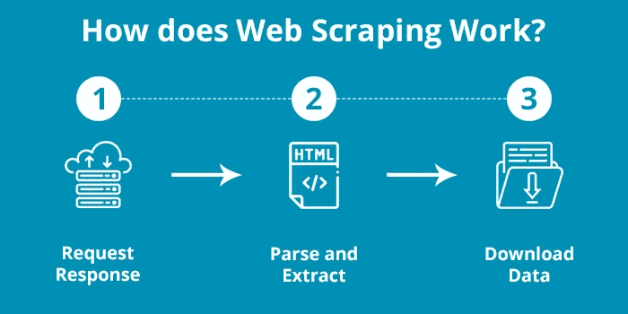

# 使用 Python 和 Selenium 进行 Web 抓取

> 原文：<https://medium.com/geekculture/web-scraping-using-python-and-selenium-c1f5084a6cbc?source=collection_archive---------12----------------------->

Web 抓取涉及从网站提取数据，然后将这些数据传输到另一个环境，在那里可以对其进行存储、转换、分析，并用于生成洞察。当组织需要从外部来源获取大量数据时，web 抓取是直接从出售数据的供应商那里购买数据的一个很好的替代方法。这提供的关键优势是能够定义组织想要的数据范围，从而仅识别和提取需要的数据。此外，web 报废是一个可重复的过程，由于最近计算和存储成本的下降，成本可能不会那么高。

在过去的几十年里，web 报废的应用呈指数级增长，从线索生成、社交媒体和情感分析、价格监控到搜索引擎结果的生成。机器人的使用也增加了刮削的规模。在我们的例子中，我们将看看如何使用 Python 和 Selenium 进行抓取。稍后，我希望介绍如何使用 AWS Lambda 和 Azure 函数等无服务器服务来扩展和监控这个过程。

Selenium Webdriver 是一个 web 框架，旨在以自动化的方式执行跨浏览器测试。它的功能包括点击按钮、在输入字段中插入值、打开和关闭窗口、重新加载页面、切换标签以及基于 Xpaths、HTML 标签和 CSS 属性导航网页的特定部分。从用户测试的角度来看，这些功能对工作是有益的，但也可以用来从网页中检索数据。

*让我们假设，当在 Indeed 上搜索多伦多的数据工程职位招聘时，我们想要抓取结果的前 3 页。*如何着手此事？

为了完成这里的案例，我们需要这个脚本来:

*   打开一个 chrome 窗口— ( *假设正在使用的浏览器是 Chrome)。*
*   打开一个网址，特别是真正的网页。
*   将职位名称输入字段填写为“数据工程师”。
*   将工作地点输入字段填写为“安大略省多伦多”。
*   单击搜索。
*   获取职位名称、公司、具体信息、地点、评级和工资(如果有)。
*   完成后，关闭 chrome 窗口退出程序。

首先，使用 pip 安装 Selenium 和其他一些依赖项/包，如果您还没有的话。

*皮普安装硒*

*pip 安装网络驱动程序管理器*

下面的文档脚本执行上述所有必需的过程

在制造刮刀时，需要考虑以下要点:

*   *Chrome 浏览器假设—* 上面的代码是在假设使用的浏览器是 Chrome 的情况下工作的，其他流行的浏览器如 Microsoft Edge 也有可用的驱动程序。
*   *位置输入问题—* 根据您当前的浏览器，位置字段可能已经设置为您当前的位置。对此有两种可能的解决方案，您可以在输入位置信息之前清除输入字段，或者禁用浏览器上的定位功能。在上面的代码中，我选择了前一个选项。
*   *窗口最大化—* 作为选项部分的一部分，我们最大化了窗口的大小，这样做是为了确保我们从开发人员工具窗格生成的 Xpaths 的一致性。根据开发人员如何针对各种媒体(如桌面、移动或平板电脑)优化网站，生成的 Xpaths 可能不总是相同的，因此将窗口设置为最大化版本将解决这一问题。

无论组织从内部收集什么数据，在存储和/或用于分析之前，都需要某种形式的转换。这一阶段通常取决于数据的最终用例。在提取之前，通常会有某种映射文档或文档，详细说明提取的数据应该是什么样子、需要提取的数据量是多少以及数据可能存在的潜在来源。该文档还应包含关于可以对数据执行何种分析以及预期收益的详细信息。

在上面的例子中，我们希望提取关于多伦多空缺的数据工程职位的数据。可以从少量数据中提取洞察，例如公司的空缺职位数量、多伦多数据工程职位的平均评级、多伦多职位的位置分布。如果我们收集了一些其他指标，如帖子的长度、生成帖子的评论数量和职位描述细节，那么我们就可以通过包括评论的平均年龄、评论的情感分析比率和数据工程职位发布中最常见的词以及数据工程职位发布的平均寿命来改进我们的分析。以上是我们从废弃数据中获得洞察力的一个例子。

尽管我提倡使用网络抓取，但还是有一些陷阱，在某些情况下可能不容易被忽视。

*   *网页加载问题—* 在开始任何抓取之前，页面必须完全加载，但是，在某些情况下，这种情况永远不会发生，这可能是由于连接不良问题或主机服务器停机或对请求无响应。如果在报废过程中出现上述问题，程序超时之前的数据可能会丢失。为了解决一些问题，建议在给定的迭代次数后保存输出，而不是在完成抓取过程时明确保存。此外，我建议维护一个日志系统，它可以记录程序在失败前运行了多远，在重置时，这些日志可能会有所帮助，因为我们可以在错误点重新启动程序，而不是重新运行整个程序。
*   *防刮擦工具—* 由于对服务器的影响，一些刮擦可能会被认为是侵入性的或令人讨厌的，因此，一些开发人员已经采取措施纳入防刮擦技术，如使用验证码，并要求第三方服务进行多因素身份验证以访问他们的网站。任何使用这些的组织都会减少他们网站上的抓取活动。
*   *网站 HTML/UI 更改—* 对网站 HTML 的任何更改都可能导致抓取程序失败，这是网页抓取的最大陷阱之一。一个是有效地控制 HTML 和 UI 的变化被推向生产的频率。
*   *异常处理—* 编写 web scraper 的一个关键部分是能够确定如何有效地设置异常来解决可能出现的问题。最常见的异常错误是“没有这样的元素异常”，这并不一定意味着元素不存在，因为它可能没有完全加载。
*   *散列标签名称—* 一些大型网站，如 Google，使用编程生成的 class、div、id 和 anchor 标签名称，这些名称经常变化，因此使得搜集变得非常复杂。

我希望这篇文章能够提供 web 抓取及其在数据空间中的作用的详细想法。

感谢阅读。

**参考文献**

刮图像:[https://encrypted-tbn0.gstatic.com/images?q = tbn:and 9 gcqi 4c 0 yz 5 tulqfujyxeyaom 8 nragf-X2-Xgw&usqp = CAU](https://encrypted-tbn0.gstatic.com/images?q=tbn:ANd9GcQIY4c0Yz5tUlqFuJYXeYaom8nRAGf-X2-Xgw&usqp=CAU)