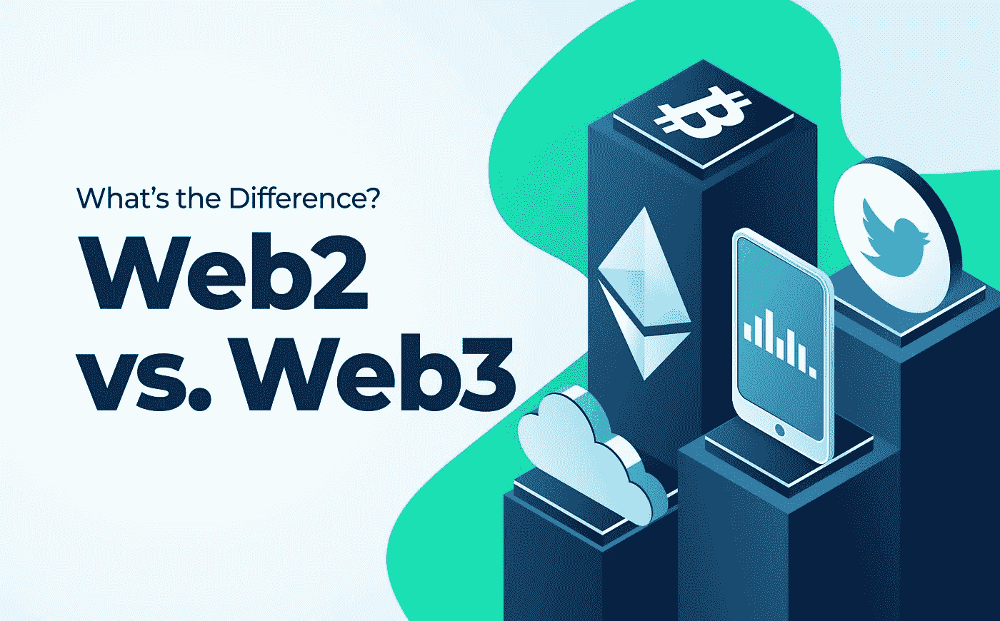
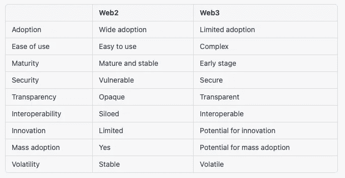
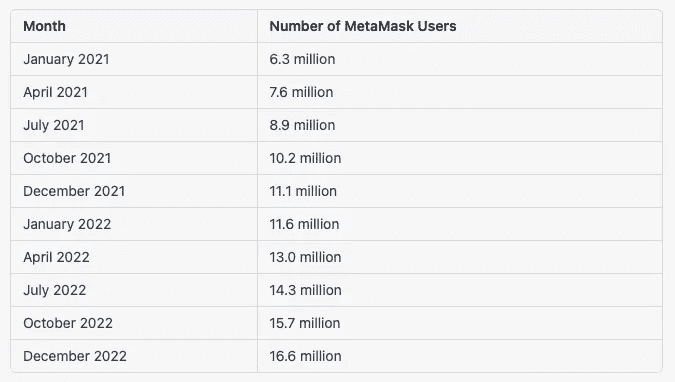

# Web2 vs. Web3:理解互联网的演变

> 原文：<https://medium.com/geekculture/web2-vs-web3-understanding-the-evolution-of-the-internet-8162548ec94d?source=collection_archive---------12----------------------->

# 介绍

自 20 世纪 60 年代末诞生以来，互联网已经走过了漫长的道路。从早期的拨号连接和静态网站，互联网已经发展成为一个庞大而复杂的网络，几乎触及到我们生活的方方面面。

在 21 世纪初，“web2”一词被用来描述第二代互联网，这给我们使用互联网和与互联网互动的方式带来了重大变化。今天，我们看到了“web3”的出现，新一代互联网有望带来更多变革。

在本文中，我们将探讨 web2 和 web3 之间的差异，以及它们如何适应互联网的发展。我们将看看每一个的关键特性和技术，以及它们对企业和个人的潜在影响。

到本文结束时，您将对 web2 和 web3 之间的差异有更好的理解，以及它们如何适应互联网发展的大环境。让我们开始吧！

# 什么是 Web2？

Web2 是用于描述 21 世纪初出现的第二代互联网的术语。它给我们使用互联网和与互联网互动的方式带来了巨大的变化，并以许多关键功能和技术为特征。

web2 的一个关键特性是能够以更加动态和互动的方式与网站和 web 应用程序进行交互。在 web2 之前，大多数网站都是静态的，缺乏交互性。随着 web2 的出现，网站变得更加交互式和用户友好，具有表单、论坛和社交媒体集成等功能。

Web2 技术和应用包括:

*   Web 浏览器:Web2 带来了 Web 浏览器的显著改进，允许更多的交互式和动态网站。
*   社交媒体:Web2 见证了脸书、Twitter 和 LinkedIn 等社交媒体平台的出现，这些平台彻底改变了我们在线交流和分享信息的方式。
*   电子商务:Web2 带来了亚马逊和易贝等电子商务平台的增长，这使得企业和消费者更容易在网上购买和销售商品和服务。

web2 对互联网和社会的影响是巨大的。它改变了我们交流、分享信息和在线做生意的方式。随着流媒体服务和在线内容平台的兴起，它也对我们消费和创建内容的方式产生了重大影响。

总体而言，web2 对互联网和社会产生了重大影响，并将继续塑造我们今天使用互联网和与互联网互动的方式。

# 什么是 Web3？

Web3，也被称为“语义网”，是目前正在开发的下一代互联网。它的特点是许多关键功能和技术，这些功能和技术有可能改变我们使用互联网和与互联网交互的方式。

web3 的关键特性之一是能够以分散的方式与其他设备和系统连接和交换数据。与依赖集中式服务器和系统来存储和处理数据的 web2 不同，web3 使用分布式分类帐技术(如区块链)以分散的方式存储和处理数据。这使得数据具有更高的安全性、透明度和互操作性。

Web3 技术和应用包括:

*   区块链:Web3 依靠区块链技术以去中心化的方式存储和处理数据。这有可能彻底改变我们在线交易和交换价值的方式。
*   分散式应用程序(dapp):web 3 支持分散式应用程序(dapp)的开发，这种应用程序建立在区块链技术之上，以分散的方式运行。
*   物联网(IoT): Web3 有潜力实现物联网设备和系统的无缝集成和通信，从而实现更高的自动化和效率。

web3 对互联网和社会的潜在影响是巨大的。它有可能改变我们在线交易和交换价值的方式，以及我们存储和处理数据的方式。它还有可能实现物联网设备和系统的集成和通信，从而提高各行业的自动化程度和效率。

# 比较 Web2 和 Web3

既然我们已经探索了 web2 和 web3 的关键特性和技术，现在是时候比较两者并了解它们的主要区别了。

web2 和 web3 的主要区别之一是它们存储和处理数据的方法。Web2 依靠集中式服务器和系统来存储和处理数据，而 web3 使用分布式分类帐技术(如区块链)以分散的方式存储和处理数据。这种差异对数据的安全性、透明性和互操作性有许多影响。

web2 和 web3 之间的另一个关键区别是用户对其数据的控制和所有权级别。在 web2 中，用户数据通常由集中的实体控制和拥有，如社交媒体平台或搜索引擎。在 web3 中，用户对他们的数据拥有更大的控制权和所有权，因为数据存储在区块链上，可以由用户直接访问和管理。

就优势和劣势而言，web2 和 web3 都有自己独特的优势和劣势。

web2 的一些优势包括:

*   广泛采用:Web2 技术和应用程序已经存在了一段时间，因此它们被广泛采用，并为许多用户所熟悉。
*   易用性:Web2 技术和应用程序通常易于使用和理解，这有助于它们的广泛采用。
*   成熟度:Web2 技术和应用已经存在了一段时间，因此，与较新的 web3 技术相比，它们通常更加成熟和稳定。

web2 的一些缺点包括:

*   缺乏安全性:集中式系统容易受到黑客攻击和数据泄露，从而危及用户数据和隐私。
*   缺乏透明度:集中式系统在如何使用和利用用户数据方面可能不透明。
*   缺乏互操作性:Web2 技术和应用程序通常是孤立的，彼此之间不能互操作，这可能成为创新的障碍。

另一方面，web3 的一些优势包括:

*   去中心化:Web3 技术和应用程序是去中心化的，这允许更高的安全性、透明度和数据的互操作性。
*   用户控制和所有权:Web3 技术和应用程序使用户对其数据拥有更大的控制权和所有权，因为数据存储在区块链上，用户可以直接访问和管理
*   创新:Web3 技术和应用仍处于早期阶段，这意味着有很大的创新和增长空间。
*   大规模采用的潜力:Web3 技术和应用程序具有大规模采用的潜力，因为它们提供了许多优于传统 web2 技术的优势。

web3 的一些缺点包括:

*   复杂性:Web3 技术和应用可能很复杂，难以理解，这可能是采用的一个障碍。
*   缺乏采用:Web3 技术和应用仍处于早期阶段，因此，与 web2 技术相比，它们的采用有限。
*   波动性:Web3 技术和应用通常依赖于加密货币，加密货币具有波动性和投资风险。

总之，web2 和 web3 都有自己独特的优势和劣势。Web2 技术和应用已经成熟并被广泛采用，但是它们容易受到安全威胁，并且缺乏透明性和互操作性。另一方面，web3 技术和应用程序提供了更好的安全性、透明度和互操作性，但它们仍处于早期阶段，可能会很复杂和不稳定。

最终，web2 和 web3 之间的选择将取决于项目的具体需求和目标。如果你正在寻找一个被广泛采用的可靠的解决方案，web2 可能是更好的选择。然而，如果你愿意承担使用新技术的风险和复杂性，web3 可以在安全性、透明性和创新性方面提供许多好处。

我希望对 web2 和 web3 的比较有助于您理解两者之间的主要区别，以及各自的优缺点。

# 互联网的未来:Web2 vs. Web3

正如我们所看到的，web2 和 web3 都有自己独特的优势和劣势，很难预测哪一个会最终胜出。一些专家认为，web3 技术和应用最终将取代 web2，而另一些专家认为，web2 和 web3 将以不同的方式共存和互补。

一种可能性是，web3 技术和应用将变得越来越主流，因为它们比传统的 web2 技术提供了许多好处。例如，web3 技术的去中心化特性可以使它们更加安全和透明，从而吸引更多的用户和企业。此外，web3 的创新潜力可能会导致新的令人兴奋的应用程序的开发，从而颠覆传统行业。

另一方面，web2 技术和应用程序已经存在了一段时间，它们拥有大量的用户基础和基础设施。这可能会使 web3 技术很难完全取代 web2，因为这需要人们和企业使用互联网的方式发生重大转变。

最终，很难准确预测 web2 和 web3 未来将如何发展和互动。然而，很明显，web2 和 web3 都有潜力以重要的方式塑造互联网的未来。能够适应和利用 web2 和 web3 的优势的企业和个人将有可能在数字领域拥有显著的优势。

我希望这次关于 web2 和 web3 未来的讨论能让你更好地理解互联网发展的潜在影响和可能性。一如既往，关注 web2 和 web3 的最新发展，并在新技术和创新技术出现时保持开放态度是非常重要的。

# 结论

在本文中，我们探讨了 web2 和 web3 之间的差异，这是互联网发展的两个不同阶段。Web2，也被称为“社交网络”，其特点是像脸书和谷歌这样的集中式平台和应用程序。这些对我们如何在网上交流和分享信息产生了巨大的影响。

另一方面，Web3 代表了向分散化和使用区块链技术的转变。这有可能给数据隐私、安全和所有权等领域带来巨大变化。

随着互联网的不断发展，观察 web2 和 web3 如何共存并相互影响将会非常有趣。web3 最终会取代 web2 吗，还是会以不同的方式共存互补？

有一点是肯定的:互联网的未来将由 web2 和 web3 技术的进步和采用来塑造。作为开发人员、企业主和互联网用户，为了在数字世界中保持相关性和竞争力，保持消息灵通和适应这些变化是很重要的。

**不要错过我即将推出的内容和技术指南:**

 [## 每当 Nic Chong 发布时收到电子邮件。

### 每当 Nic Chong 发布时收到电子邮件。注册后，如果您还没有，您将创建一个中型帐户…

medium.com](/@nicchong/subscribe) 

如果你有什么问题，我在这里帮忙，在评论区等你:)