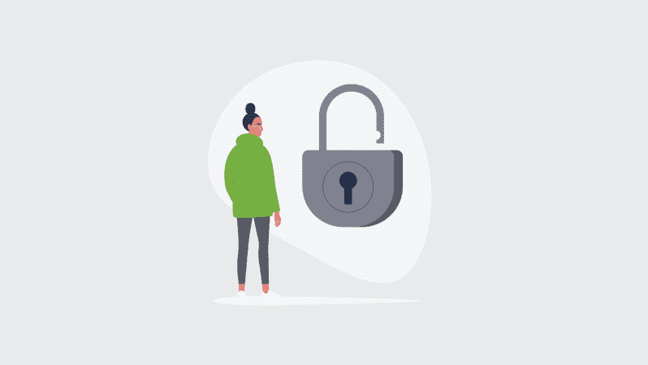

# WebRTC 安全性:2021 年你需要知道什么

> 原文：<https://medium.com/geekculture/webrtc-security-what-you-need-to-know-in-2021-2ef08351dd82?source=collection_archive---------21----------------------->

将您的机密业务信息和敏感对话交由视频会议技术处理需要信任。尤其是当您几乎每天都在新闻中听到安全漏洞时。

2019 年，group [FaceTime bug](https://9to5mac.com/2019/01/28/facetime-bug-hear-audio/) 就是视频会议如何受到威胁的一个例子。虽然在那种情况下，FaceTime 群组呼叫功能被禁用，并且很快发布了修复程序，但它提出了关于视频会议安全性的问题。

随着[视频会议](https://www.liveswitch.io/conferencing?hsCtaTracking=1d2f97b7-f383-4532-a6e2-26aaf87cf821%7C8b74c63f-8346-4836-b454-f5406ce7d9c3)成为开展业务的重要组成部分，组织需要选择安全的视频解决方案。[就通信安全而言，网络实时通信(WebRTC)](https://webrtc.org/) 是最好的[实时视频流](https://www.liveswitch.io/virtual-events?hsCtaTracking=614d6005-6eac-40ae-96db-d78c076a3ba0%7C668fc0f8-1f09-4039-a91d-25a70c9f8b4b)选择之一。让我们来探索这项技术是如何构建的，以便您可以确信您的对话和信息是安全的。

**浏览器保护**

WebRTC 允许用户在浏览器和设备之间直接建立视频连接，而无需使用插件。浏览器提供的保护是与其他视频会议技术的重要区别。浏览器有助于以多种方式增加安全保护:

*不再有插件*

如果没有 WebRTC，在开始视频会议之前，必须在客户端的计算机/设备上安装插件。由于几个原因，这增加了视频会议的风险。首先，邪恶的行为者可以设计恶意插件，旨在将您置于风险之中。虽然其中一些可能很容易被发现，但其他一些则伪装得看起来像它们的知名同行。其次，即使是信誉良好的插件也可能存在漏洞。它们可能服务于一个合法(且有用)的目的，但是它们可能具有可被第三方利用的漏洞。WebRTC 本质上更安全，因为它不使用插件。它消除了与可能伪装成插件的恶意软件或其他不受欢迎的软件安装相关的风险。

*快速安全补丁*

苹果、谷歌、微软和 Mozilla 等主流浏览器厂商非常重视安全性。当安全风险被他们的团队内部发现，或者被外部的 bug 赏金程序猎人发现时，他们会非常迅速地创建和部署补丁，通常比 UC 平台供应商快得多。虽然理论上仍然可以发现安全漏洞，但是 WebRTC 的用户仍然可以相信这些问题会被方便地自动解决。

*自动软件更新*

主流浏览器也提供自动软件更新。这使得任何潜在的安全威胁都可以得到解决，而不需要最终用户选择加入更新。依靠您的员工或其他最终用户来保持软件更新是不可靠的。虽然一些用户可能会勤于更新，但其他人会忽略、延迟或忘记更新，这可能会给组织带来风险。WebRTC 安全性受益于自动浏览器更新，降低了所有这些风险。

**媒体访问**

我们都听说过网络摄像头被第三方劫持来记录私人谈话的故事。例如，上面提到的 FaceTime 漏洞允许用户监听他们正在通话的人，甚至可以透过他们的摄像头看到，而无需他们接听电话。

但是 WebRTC 规范采取了积极的措施来确保类似 FaceTime bug 这样的问题永远不会发生。首先，未经您的同意，WebRTC 应用程序不可能任意访问您的摄像头或麦克风。虽然允许应用程序或网站要求用户进行一次性或永久访问，但在没有明确许可的情况下，它无法获得访问权限。当发出媒体请求时，会弹出一个窗口，要求您在传输任何信息之前允许访问您的设备。此外，无论何时使用设备，WebRTC 都要求浏览器 [UI 清楚地指示麦克风或摄像头何时在使用](https://www.html5rocks.com/en/tutorials/webrtc/basics/)，这样你就可以确保没有潜在的窃听风险。

*加密*

加密是 Web 实时通信的必要组成部分，并且在建立和维护连接的所有方面都强制执行。它使得某人实际上不可能获得对通信流内容的访问，因为所有媒体流都是通过标准化和久经考验的加密协议安全加密的。只有那些具有秘密加密密钥的应用程序才能解码这些流。

这方面的最佳实践是在 DTLS(数据报传输层安全性)握手中使用完全前向保密(PFS)密码来安全地交换密钥数据。对于音频和视频，密钥数据可用于生成 AES(高级加密标准)密钥，进而被 SRTP(安全实时传输协议)用于加密和解密媒体。这种缩写丰富的技术组合转化为极其安全的连接，用当前的技术是不可能破解的。WebRTC 和 ORTC 都要求这种特殊的堆栈，它是向后兼容的，并可与 VoIP 系统互操作。

*HTTPS —增加了保护*

WebRTC 引入了新的要求，规定启用 WebRTC 的连接只能通过安全连接建立，从而使安全性更进一步。这意味着所有的 WebRTC 应用程序必须是(超文本传输协议安全)HTTPS 兼容的。

HTTPS 的“S”负责认证网站以及对网站上的数据交换进行编码，以保护您的数据传输免受黑客或其他恶意方的攻击。这意味着不仅页面需要安全才能建立连接，还意味着从该页面与您通信的服务器也需要安全。

**总结**

在安全性方面，WebRTC 比其他视频会议解决方案有很大的优势。有些应用程序将安全性视为可选的，而 WebRTC 将安全性作为规范的一部分。因此，如果你正在考虑使用 [WebRTC](https://www.liveswitch.io/) 作为你的实时通信解决方案，你可以放心，你的对话是安全的。