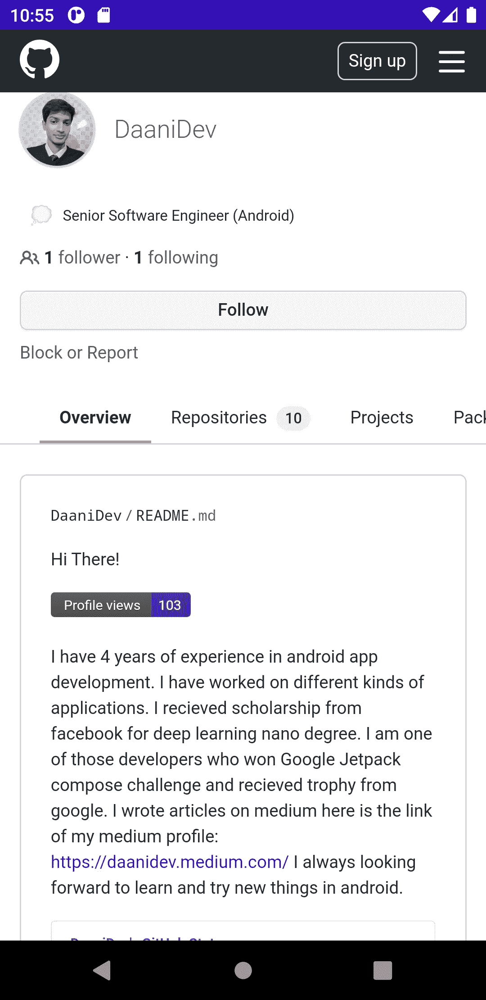

# Jetpack 中的 Webview 编写 Android

> 原文：<https://medium.com/geekculture/webview-in-jetpack-compose-android-4ac0ca70fb4d?source=collection_archive---------0----------------------->

[https://android-developers.googleblog.com/2020/08/announcing-jetpack-compose-alpha.html](https://android-developers.googleblog.com/2020/08/announcing-jetpack-compose-alpha.html)

在本文中，我将向您展示如果您使用 jetpack compose，如何在您的 android 应用程序中创建 webview，以及如何向外部浏览器发送意图以加载 web url。对于 xml，我们需要在布局中定义 webview 标签，然后在活动/片段中使用它。但是我们知道在 jetpack compose 中，你不需要定义 xml 文件。

在 jetpack compose 中没有创建 webview 的函数/类，因为 webview 是 android view 本身的一部分。要在片段或活动中创建 webview，您需要像下面的代码一样定义 webview:

下面是上面函数的输出。

现在，我们如何将网址发送到其他应用程序来加载它？为此，我们需要发送一个意图，告诉其他浏览器加载我们的 web url。

上面代码的输出:

 [## GitHub-DaaniDev/jetpack _ compose _ animations

### 此存储库包含在 jetpack compose with animations 中设计自定义视图的源代码。你只需要…

github.com](https://github.com/DaaniDev/jetpack_compose_animations)