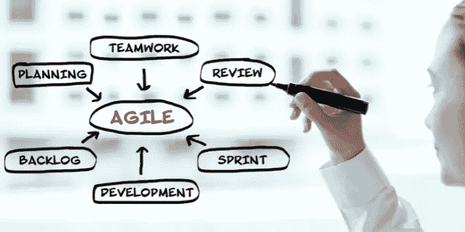

# 软件开发的 5 大敏捷最佳实践是什么？

> 原文：<https://medium.com/geekculture/what-are-the-top-5-agile-best-practices-for-software-development-2993c29092e?source=collection_archive---------14----------------------->

最近，敏捷软件开发模型已经成为所有开发模型之王。它是一组基于迭代开发的软件开发方法，通过各种跨职能团队之间的协作来讨论问题和解决方案。

敏捷软件开发过程避免大规模的发布，而倾向于小规模的增量开发。敏捷中的每一个小增量都被称为一次冲刺。在每个 sprint 完成后，开始自我评估和反馈，以识别开发过程中需要的任何错误和修改。

# 使用敏捷方法进行软件开发的好处

1.  **发展速度:**

*   敏捷方法的开发速度很快。这是因为敏捷中的任务优先级。在设计阶段，团队将工作分成更小的块。这有助于减少不必要的功能，探索[敏捷软件开发](https://www.botreetechnologies.com/blog/agile-benefits-custom-software-development/)的最佳实践。学习如何最大限度地利用敏捷开发有助于尽早交付经过更好测试、性能更好的产品。

**2。风险降低:**

*   敏捷软件开发方法通过召集频繁的敏捷经理、客户和团队，使每个人都在同一页上。因为敏捷专注于逐个 sprint 地交付项目，所以团队可以快速地对变更和错误做出反应。

**3。团队赋能:**

*   敏捷开发团队比传统团队有更大的自主权。敏捷团队对工作拥有更多的所有权，并更频繁、更成功地合作，寻找创新的方法来消除任何障碍。

**4。客户满意度高:**

*   与其他公司相比，遵循敏捷的软件开发公司能够让客户更开心。敏捷促进了更好的客户-供应商沟通，并对市场和项目本身的变化做出更快的反应。所有这些都对客户的快乐商数有重大影响。

**5。灵活性:**

*   敏捷[企业软件开发公司](https://www.botreetechnologies.com/software-development-company)维持着小型开发团队。敏捷的反馈循环和所有利益相关者之间的持续沟通使得在每个 sprint 中能够顺利地接受变更和控制错误。这有助于控制项目开发时间和成本。

# 软件开发的 5 大敏捷实践

敏捷使用软件开发的迭代框架。它在很大程度上依赖于一个自组织的团队，以跨职能的方式开发、测试和发布一个高质量的产品。但是，仅仅知道敏捷如何帮助你以及如何使用它是不够的。您需要实现一些最佳实践，这样敏捷开发人员就可以发挥他们的最大能力。

1.  **增强利益相关方:**

*   在传统的开发设置中，开发人员和客户通常只在信息收集的开始阶段交谈，随后是在软件测试和交付时的第二轮谈话。
*   然而，敏捷开发包括将工作分成更小的冲刺。在每个 sprint 的开发阶段，开发人员与所有的涉众合作，考虑变更和问题(如果有的话)。

**2。团队合作必不可少:**

*   敏捷方法非常强调通过协作进行开发。敏捷团队相信，如果他们能够相互依赖，而不是仅仅依赖于一些敏捷软件开发工具，他们就能给出更好的结果。
*   通过合作，团队可以相互授权，并采取更具想象力和更勇敢的步骤。

**3。团队交流:**

*   沟通是关键。在自我施加的单独监禁中工作并没有什么了不起。敏捷项目经理应该创造一个开放的环境，让每个人都觉得他们的意见很重要。
*   在后大流行时代，越来越多的团队转向远程工作模式，促使公司通过不同的工具开发新的敏捷通信原则。一些敏捷项目管理工具，如 ProofHub、Wrike 等，以及视频会议工具，如 Skype，也有助于改善远程工作模式中的团队合作。

**4。个人动机:**

*   有上进心的员工表现会好 10%,并且更有可能热爱他们的工作。这样的员工高度关注团队目标，并能更好地相互支持。被激励的敏捷团队见证了他们工作中更多的节奏和流动，因此他们的工作节奏非常快。
*   管理者必须确保每个敏捷团队都有精通各种最好的敏捷项目管理工具和其他必要技能的成员。这将有助于覆盖总体积压和一些开发人员的缺席。

**5。Sprint 设置和回顾:**

*   正确遵守 sprint 设置是至关重要的。然而，团队需要在待办事项中有足够的任务来完全填满 sprint，但是不要太多，否则会有失去焦点的风险。
*   在每个 sprint 开始之前，确定依赖关系以避免将来出现任何问题是非常重要的。在每个 sprint 完成之后，团队应该召开一个回顾会议，以确定哪些敏捷软件开发工具、资源和计划有效，哪些无效。

# 最佳敏捷项目管理工具

*   **周一网:**
*   这是一个促进团队交流的实时项目管理应用程序。
*   **里克:**
*   该工具用于处理、任务和时间管理。它的模板使管理项目、人员和资源变得更加容易
*   **点击:**
*   该工具用于流程管理、任务管理和时间管理。它有模板，使管理项目，人员和资源更容易
*   **智能表:**
*   敏捷工具可用于自动化工作流程、管理任务，并通过实时查看正在进行的项目来促进团队协作。
*   **JIRA:**
*   它是敏捷项目管理中最常用的工具之一。该工具主要由在任何共享环境中工作的 IT 专业人员、机构设计人员和工程师使用。

# 结论

敏捷方法的美妙之处在于，不管项目是大是小，简单还是复杂。敏捷对于组织总是最有效的。一旦团队能够使用上面提到的敏捷实践，工作就会变得更有组织性，反馈循环会成为一种习惯，区分优先级会变得容易。

敏捷已经成为软件开发的一种强大而简单的方法。然而，许多业外人士也在使用它。如果你想在你的工作场所实施敏捷，请记住，成功实施敏捷的关键是交流并保持一致，同时不要害怕犯错误。

*原载于 2022 年 7 月 21 日 https://www.stridepost.com***。**