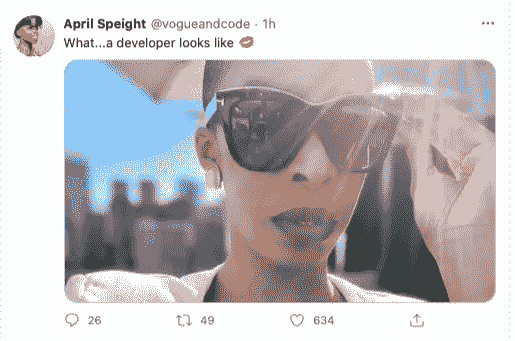
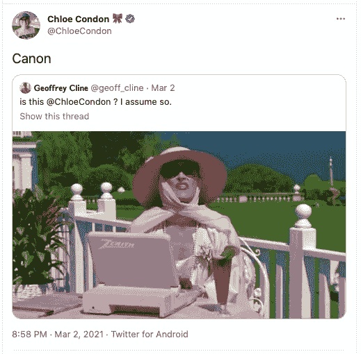
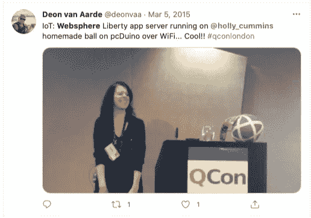
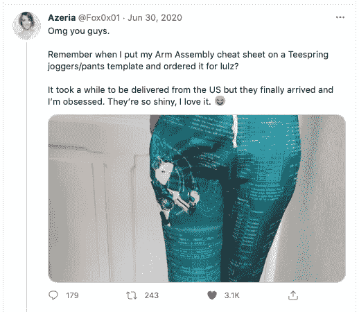
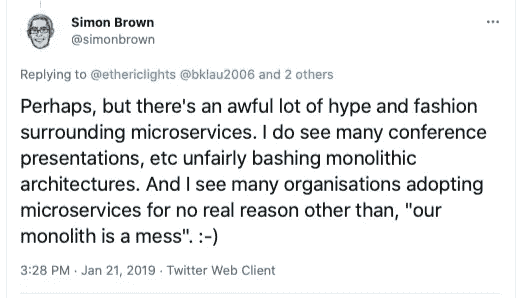
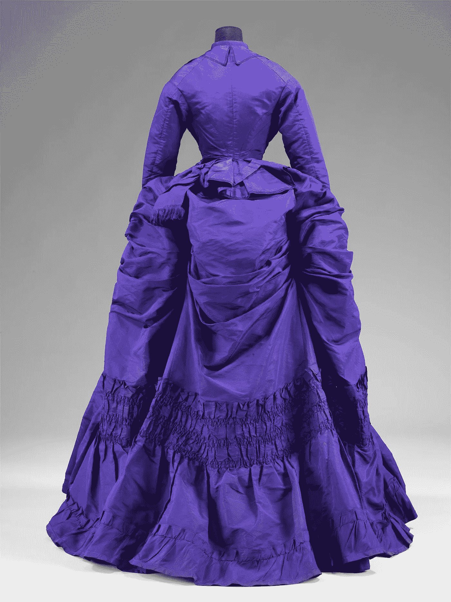

# 时尚和编程有什么关系？

> 原文：<https://medium.com/geekculture/what-do-fashion-and-programming-have-to-do-with-one-another-d3b04f7b83a4?source=collection_archive---------19----------------------->

*Photo by Flaunter on Unsplash. It looks like binary, right? Maybe?*

昨晚我梦见罗杰·达尔特里的妻子让我写关于时尚和编程的文章。我们在一家小滑板朋克店。一直不清楚她是怎么认识我的，也不知道她为什么关心我。

在梦结束时，我几乎已经写了一篇“为什么时尚和编程实际上是联系在一起的”博客，所以我醒来后疯狂地记下了笔记，试图在 T2 离开之前记住它。虽然从表面上看，它们似乎截然不同，但实际上时尚和编程之间有一些有趣的联系——或者至少我是这样认为的。让我们在同一个博客里讨论性别、创造力、劳动道德、气候和趋势。

# 性别

时尚与女性有着紧密的联系，作为一名从事科技行业的女性可能会感到不舒服。我的应对策略之一就是不要过分女性化。谈论*女孩话题*比如时尚让我感觉脆弱，所以这可能是我写过的最私人的博客。(有几次，我差点把整件事都扔了，因为我太紧张了，害怕暴露自己的娘娘腔，被人认为索然无味)。

我喜欢做一个女人，我喜欢在科技行业工作，我很幸运我没有遇到太多这两者结合的问题。我的应对策略之一是，我尽量把工作和女性生活严格分开。我有一套“工作服”和“家居服”，它们分别放在房间两边不同的抽屉柜里。在家里，我喜欢穿裙子，有时是很短的裙子，但当我在工作时，我会穿宽松的上衣，而且总是穿着裤子。

老实说，我不认为有人真的被骗了。几年前，当我在一次会议上担任展位工作时，我是我们 work slack 频道中唯一一个问展位 t 恤是什么颜色的人，这样我就可以搭配眼线了。我只是太喜欢高跟鞋和[妆容](https://www.theguardian.com/commentisfree/2021/mar/10/make-up-not-frivolous-allows-us-to-rebuild-ourselves)，所以我很可能没有自己想象中的[融入](https://link.springer.com/article/10.1007/s11199-019-01115-y)中。

我在 IBM 面试的时候是粉发，很多年都是蓝发。我爸爸指出，粉红色的头发绝对*不*融合在一起，但我的克雷奥拉锁感觉 *punky* ，不少女。这是我，就在我接受 IBM 采访之前，做一个量子计算实验，无意中成为 BBC 的股票照片。

我非常钦佩像特里莎·吉这样的人，他们有足够的勇气把自己的全部精力投入到工作中，而且,[还对此进行了深思熟虑的写作。像 Chloe Condon 和 April Speight 这样的人走得更远，在他们的公众形象中直接将他们的编码和时尚兴趣联系起来。看看 April 的推特账号。](https://trishagee.github.io/post/st_what_to_wear/)

对克洛伊来说，非常粉红和非常科技是她的品牌的一部分。

虽然当时可能感觉更容易，但女性融入男性并没有真正帮助我们的行业。我们应该以开发人员和女性的身份出现，并敲打[# ilooklieadeveloper](https://twitter.com/search?q=%23ilooklikeadeveloper)标签，直到我们改变对开发人员的看法。

# 创造力

抛开性别政治不谈，编程和时尚实际上有很多共同点。我喜欢他们两个的原因是他们很有创造力。当我和设计师在一个团队时，我会很恼火，有人把设计师称为“创意人员”,以区别于那些蹩脚的开发人员。我也在创造！

同样，缝纫比人们有时认为的更加数学化。当我试图表明自己的观点时，我有时会把缝纫称为“纺织工程”。我曾经缝制过很多自己的衣服，后来我转而使用同样的技能缝制物联网演示，这些演示看起来像是产品标识的可爱版本。这是个小众爱好，但总得有人做。

(如果你想知道的话，肯定有一些艰难的工程，弹性是一个持续的挑战。我从来没有得到足够持久的连接，或找到一个良好的散热机制。原来电脑不喜欢被装在填充球里。谁知道呢？)

虽然它有自己的[性别](https://www.edsurge.com/news/2018-06-14-maker-culture-has-a-deeply-unsettling-gender-problem) [问题](https://en.wikipedia.org/wiki/Maker_culture#Gender)，但我喜欢创客社区中充满活力的女性存在，比如[利莫尔弗里德](https://www.forbes.com/profile/limor-fried/?sh=7f03ada24ecc)、[娜奥米吴](https://en.wikipedia.org/wiki/Naomi_Wu)，以及[瑞秋科尼奇瓦凯蒂](https://twitter.com/konichiwakitty)。并非所有人都专注于可穿戴设备——海伦·利用乐器做出了令人惊叹的事情——但衣服确实为许多人提供了一个前进的跳板。我在 IBM 的一位同事缝制了自己的婚纱，并确保在其中加入了大量的发光二极管、互联网连接和其他技术设备。甚至我的雇主也来凑热闹，为大都会歌剧院合作设计了一件“会思考的裙子”。

即使他们不在缝纫机后面，开发人员也能在结合他们的专业和缝纫创造力中找到乐趣:

[Shenova code 连衣裙](https://twitter.com/search?q=%40shenovafashion%20code%20dress&src=typed_query)(可惜已经没有了)可以印上穿着者自己的源代码，确保女性演讲者不会在[几场](https://twitter.com/ShenovaFashion/status/738385207238098945) [会议](https://shenovafashion.com/blogs/blog/123773319-women-in-tech-devon-lindsey-talks-open-source-software-communities-at-react-2016) [舞台](https://twitter.com/MarieGMoe/status/691399241504296960)上混入男生中。

# 劳动伦理

我喜欢缝制自己的衣服的原因之一是，我知道它们是在人道的条件下生产的，而且工人(我！)被善待。服装业拥有世界上最低的工资，危及生命的事故在 T2 并不少见。另一方面，程序员收入丰厚，极不可能死于工作。然而，劳工剥削是一个令人关切的问题，即使对开发商来说也是如此。如果他们不幸创建了一个受欢迎的开源项目，个人有时会发现他们被期望为了盈利公司的利益免费为[工作](https://www.ashedryden.com/blog/the-ethics-of-unpaid-labor-and-the-oss-community)。

即使有了明确的薪酬体系，科技工作者也越来越多地指出，他们的就业条件还有待改善。尽管工资很高，但它并不总是公平地分配给妇女和少数民族。性骚扰案件的处理方式存在令人不安的问题，员工对道德上可疑的合同感到沮丧。所有这些的结果是，工会的努力在科技行业获得了动力。

# 可持续性

时尚产业和科技产业都因其对环境的影响而受到抨击。如果你继续追踪的话，科技行业约占碳排放量的 2%，服装行业约占 10%。许多衣服使用一次后就被扔掉或遗忘在壁橱后面。这很糟糕，但也许比 Grimes 的软件支持的 NFT 作品要好，我不相信它真的会被*用到*。作为一种收藏品，它的主要价值在于其稀缺性。由于 NFT 艺术品依赖区块链来确保稀缺，它们的电力需求令人反胃。据估计，生产 303 个版本的格里姆斯·NFT 作品会产生 70 吨碳，相当于一个普通欧盟居民 33 年的用电量。就服装和 NFT 艺术品而言，根本问题在于一种鼓励明显浪费性消费的文化。

# 趋势

可持续性问题是一种社会效应的症状。我们希望给周围的人留下深刻印象，无论是我们的服装、艺术还是工作。给别人留下深刻印象的最好方法之一就是向他们展示他们从未见过的东西。这种对新奇事物的持续需求驱动着周期性的品味，在[裙边](https://ritholtz.com/2010/09/the-hemline-index/)和软件架构中都是如此。

可可·香奈儿说“时尚就是建筑”，虽然我有点断章取义，因为她没有想到微服务或边缘计算。我们都知道 Gartner 炒作周期，它展示了一项技术如何从“前卫和酷”开始，然后变得流行，然后成为主流，然后过时。许多观察家已经注意到微服务与 SOA 密切相关，SOA 在二十年前是最流行的，但在十五年前就不再流行了。目前，微服务是如此受欢迎，以至于被认为是新软件项目的必不可少的一部分，并在许多不合适的环境中使用。

在我们的行业中，从 20 世纪 60 年代的集中式计算(分时)到分布式计算(微型计算机)，然后回到集中式计算(客户机-服务器)，然后回到 20 世纪 80 年代的分布式计算(个人电脑)，然后回到集中式计算(云)，然后回到分布式计算(边缘计算)，也有类似的循环模式。头晕了吗？

在某些情况下，当一种新模式获得牵引力时，这是因为外部的一些东西改变了它(比如[广泛的快速网络访问](https://softwareengineering.stackexchange.com/questions/171008/why-didnt-cloud-computing-offer-appear-earlier/171010)如何为云创造了合适的条件，或者轻量级容器为微服务创造了合适的条件)。香奈儿对此也有一句话——她坚持认为“时尚不仅仅存在于服装中。时尚在天上，在街上，时尚与想法、我们的生活方式、正在发生的事情有关。”甚至在服装方面，款式也受到技术革新的巨大影响。轻型[钢制成的衬裙](https://www.racked.com/2017/12/7/16717206/cage-crinoline-feminism-class)让维多利亚时代中期的巨大裙子成为可能。几十年后，发现可以从煤焦油中提取色彩鲜艳的染料,引发了“淡紫色狂热”,这是一种对新近可能出现的艳紫色服装的时尚。

*© Victoria and Albert Museum, London.*

所以我们有它。微服务是新的紫色，编程可以是粉红色的。

这篇博客的所有内容都是代表我，而不是我的雇主，但既然我在这篇博客中提到了他们，我就重申一下——这些是我的个人观点。

*原载于 2021 年 3 月 10 日 http://hollycummins.com***。**