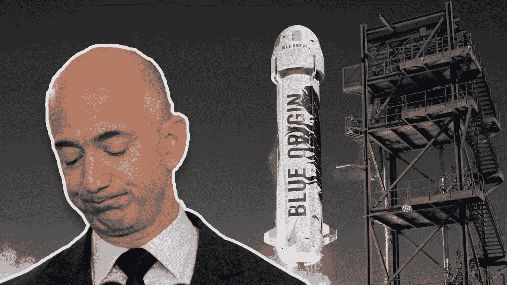
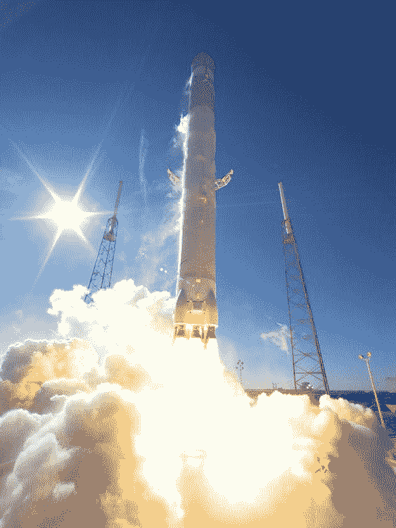
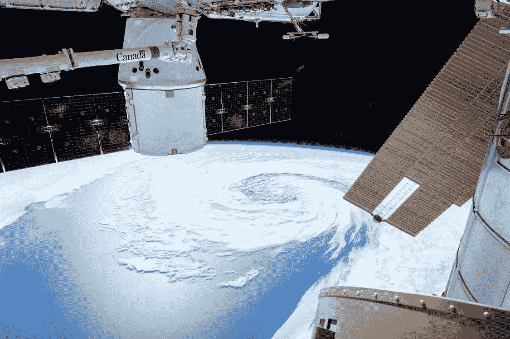
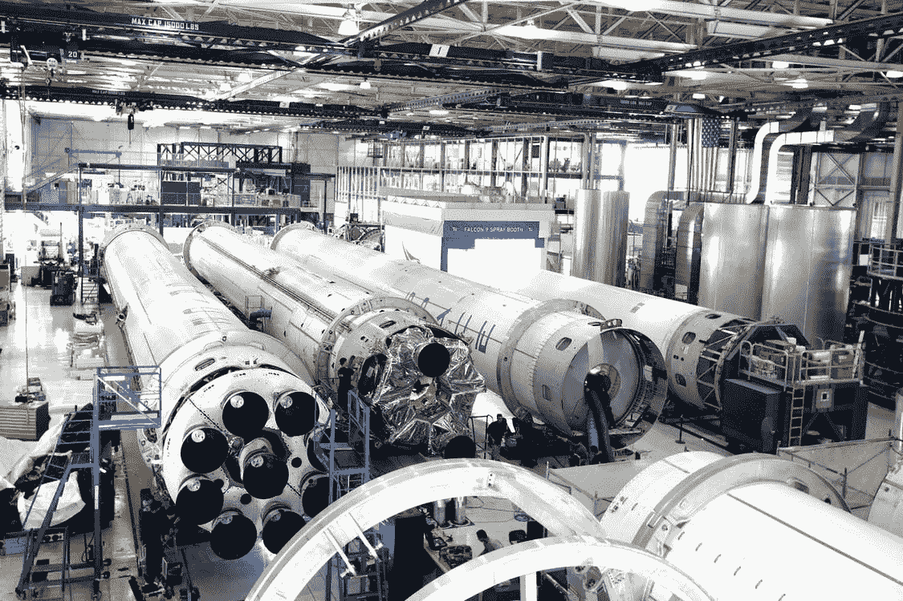
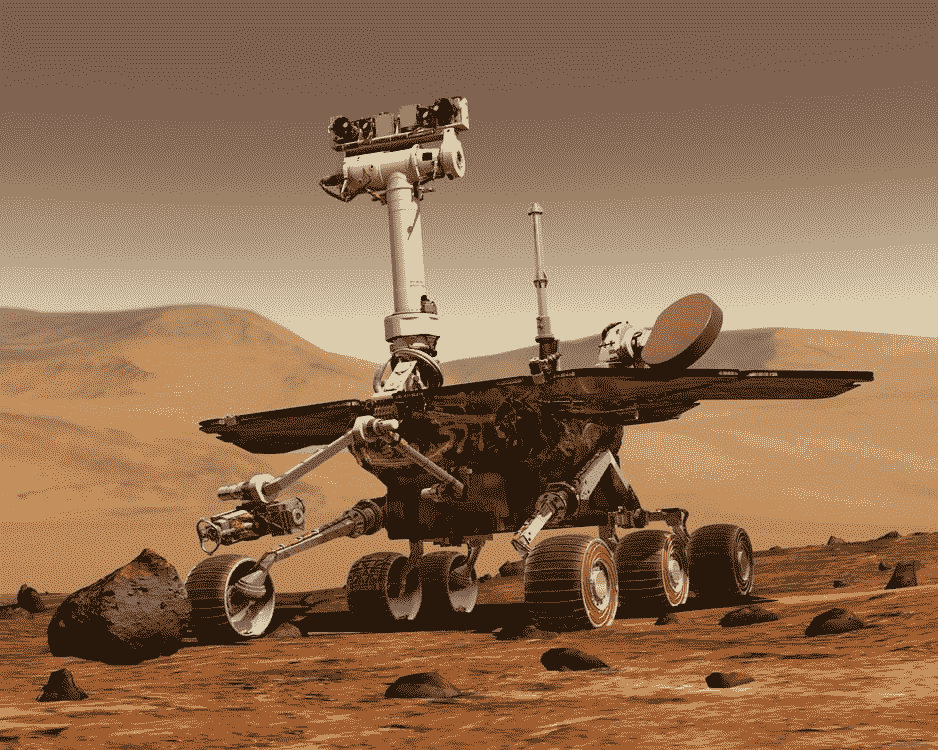

# 蓝色起源怎么了？

> 原文：<https://medium.com/geekculture/what-happened-to-blue-origin-4b3dfa3b4cc2?source=collection_archive---------35----------------------->

Image by Author

那么，杰夫·贝索斯的蓝色背景和征服太空的雄心到底发生了什么？让我们开始吧。

像埃隆·马斯克一样，杰夫·贝索斯也有很多关于太空冒险的计划，所以他成立了一家名为“蓝色起源”的公司。

首先。让我们看看蓝色起源的新谢泼德，它大约 60 英尺，大约是 SpaceX 新猎鹰 9 号的 1/4 高。Space X 已经完成了他们助推器的成功着陆；然而，在 2015 年新谢泼德助推器从太空飞行中着陆后，从技术上讲，蓝色起源将成为第一家安全着陆火箭助推器的公司。这两种火箭有许多不同之处。首先，我们将谈论在下降速度之前。新谢泼德最高可达 3 马赫；但是猎鹰 9 号最高可以达到 5.5 马赫和 7 马赫。第二是他们的着陆方式。

应该注意的是，new Shepard 足够灵活，可以放下发动机并悬停在着陆点上方，允许控制着陆或中止尝试，如果不正确，再重试。它还可以随意降低速度，缓慢而温和地下降到你几乎可以通过手持遥控器来完成的程度。因为猎鹰 9 号需要更大的引擎，而且几乎失去了所有的燃料质量，所以它不能悬停。这意味着它必须通过一种叫做自杀燃烧的方法着陆。

Photo by [SpaceX](https://www.pexels.com/@spacex?utm_content=attributionCopyText&utm_medium=referral&utm_source=pexels) from [Pexels](https://www.pexels.com/photo/rocket-launch-space-discovery-23795/?utm_content=attributionCopyText&utm_medium=referral&utm_source=pexels)

尽管如此，助推器的学习还是令人印象深刻；除了完全可重复使用，新谢泼德预计将进一步促进太空旅游业。新谢泼德将垂直发射大约两分钟半之前，最发动机关闭时，客运航班发生。然后太空舱与火箭分离；在 11 分钟的飞行中，乘客大约有 4 分钟失重，并且在 307，000 英尺或 100 公里的高度足以确定地球的曲率。飞船在重返大气层前会在太空中漂浮几分钟。New Shepard 使用自主的火箭动力垂直着陆系统着陆。

除了六名乘客外，New Shepard 上的航天器可以携带重达 50 磅的标准化实验，并有更广泛的定制请求选项。这项投资的票价约为 20 万美元。然而，维珍银河提供同等价格的服务，可以成为蓝色起源的潜在竞争对手。此外，维珍银河在航班起飞前三天对乘客进行培训，而蓝色起源只要求乘客准备一天。

Photo by [SpaceX](https://www.pexels.com/@spacex?utm_content=attributionCopyText&utm_medium=referral&utm_source=pexels) from [Pexels](https://www.pexels.com/photo/satellite-view-of-earth-586072/?utm_content=attributionCopyText&utm_medium=referral&utm_source=pexels)

我们继续吧。我们即将推出新的格伦火箭。以先驱宇航员约翰·格里恩的名字命名，新格伦是一种单一配置的重型运载火箭，能够定期将人和有效载荷运送到地球轨道及其他地方。它的大小为 95 米，向低轨道的有效载荷能力为 45 公吨，向地球静止转移轨道的有效载荷能力为 13 公吨。New Glenn 是一个可靠的、具有成本竞争力的高可用性框架。7 米长的整流罩的有效载荷是任何现有运载火箭的两倍，这意味着卫星有更多的空间。

New Glenn 还可以在 95%的气候条件下发射和着陆，这使它成为有效载荷客户的可靠选择。新的格伦助推器预计能够持续 25 次发射。民用、商用和国家安全客户都可以在 New Glenn 的高性能配置中找到解决方案。最初，它是由空军资助的。然而，他们在 2020 年晚些时候退出了，并采用了其他竞争者，如 SpaceX 和联合发射联盟。然而，这对该公司来说并不令人沮丧。该公司在新格伦投资了约 25 亿美元，约 10 亿美元用于重建 LC-36 发射台。

Photo by [Pixabay](https://www.pexels.com/@pixabay?utm_content=attributionCopyText&utm_medium=referral&utm_source=pexels) from [Pexels](https://www.pexels.com/photo/rocket-factory-256297/?utm_content=attributionCopyText&utm_medium=referral&utm_source=pexels)

蓝色起源在 LC-36 的工作包括建造一个可以支持在新格伦发射人员的塔，该公司希望稍后完成。我们将不得不等待另一年关于它的发射日期，因为该公司希望发射新格伦 2023。一旦完成，它将把机组人员和设备带到国际空间站，并将成为第一个轨道运载火箭。再来看看这家公司的另一个项目。

蓝月亮是一种灵活的着陆器，可以向月球表面运送各种各样的小型、中型和大型有效载荷，无论是货物还是船员。它提供精确和软着陆的能力将使人类能够在月球上持续存在。这个月球着陆器将利用蓝色起源的新 BE-7 发动机。这些新发动机将由液态氢(LH2)和液态氧(LOX)的混合物提供动力。蓝月亮有一个 7 米的有效载荷舱，当它的四个着陆腿完全展开时，它将站立大约 14 英尺 4 米。当它满载燃料时，着陆器重约 16.5 吨(15 公吨)。当它到达月球表面时，着陆器将只有大约 3.3 吨重，几乎烧掉所有的燃料。

Photo by [Pixabay](https://www.pexels.com/@pixabay?utm_content=attributionCopyText&utm_medium=referral&utm_source=pexels) from [Pexels](https://www.pexels.com/photo/space-research-science-astronaut-41162/?utm_content=attributionCopyText&utm_medium=referral&utm_source=pexels)

蓝月亮旨在向月球表面运送负载，有两种型号，容量分别为 3.6 和 6.5 公吨。它还能发射小型卫星进入月球轨道。预计它将用于载人飞行任务。常规的蓝月亮只设计为单程登月，以最大化有效载荷量；然而，更突出的品牌也将携带足够的燃料和一个登月舱，以实现往返月球。预计美国宇航局将在 2024 年使用其即将到来的太空发射系统将人类重返月球的计划中使用蓝月亮。

观看太空发射系统本身还有相当多的发展空间。该计划是利用蓝月亮让宇航员登陆月球，而不是建立自己的新登月系统。最后，公司的所有者仍然有很多公司的计划，包括对能源危机的关注和建立更大的太阳能电池板以在太空中储存能量并将其传输回地球。除此之外，问题是关于日益增加的空气污染。这可能包括一个在太空建立工业的项目，这些工业不能转化为对地球友好的。最后，蓝色起源正在努力完成它的三个项目，希望能在不久的将来建立月球基地。

Photo by [Pixabay](https://www.pexels.com/@pixabay?utm_content=attributionCopyText&utm_medium=referral&utm_source=pexels) from [Pexels](https://www.pexels.com/photo/gray-and-white-robot-73910/?utm_content=attributionCopyText&utm_medium=referral&utm_source=pexels)

**OUTRO:**

伙计们，这就是我们对蓝色起源现状的解释。我们希望在评论区听到你的意见。如果你喜欢这个视频，请给我们竖起大拇指，考虑订阅我们的频道。我们会在下一集看到你。在那之前，和平！