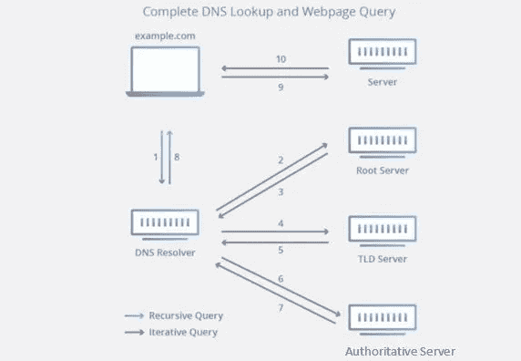

# 什么是域名系统？

> 原文：<https://medium.com/geekculture/what-is-a-domain-name-system-c7ce04a99dab?source=collection_archive---------10----------------------->

首先，我们将讨论什么是 DNS？DNS 代表域名系统。DNS 提供将域名转换成 IP 地址的服务。

例如，我们更容易记住人们的名字，而不是他们的联系电话。因此，每当我们想给某人打电话时，我们就打开电话簿，搜索这个人的名字，然后用他的手机号码打电话。类似地，在互联网上，我们键入网站的 URL，但是对服务器的请求是使用 IP 地址发出的，就像使用手机号码打电话一样，因为我们很容易记住 URL 而不是 IP 地址。使用 DNS 服务将网站的域名(URL)转换为 IP 地址。DNS 只不过是一个将域名映射成 IP 地址的网站电话簿。

每当我们使用 URL 发送请求时，浏览器首先向 DNS 服务器发送一个查询，并获得 IP 地址作为响应。然后，浏览器使用从 DNS 服务器接收到的 IP 地址向该 web 服务器发送加载网站页面的请求。所有 DNS 查询都以纯文本形式发送到端口号为 53 的 DNS 服务器。

**浏览器实际上是如何从域名中检索 IP 地址的？所有网站的 IP 地址都存储在一个地方吗？**

不，不是所有的 IP 地址都存储在一个地方，它们分布在整个地理位置。为了理解 DNS 解析背后的过程，我们需要了解 DNS 服务器的类型。它们基本上有 4 种类型:

1.  **DNS 解析器:**当我们从浏览器发送 DNS 查询时，首先它会到达 **DNS 解析器**，即您的互联网服务提供商的 DNS 服务器。如果找到相应域名的记录，那么它将 IP 地址返回给浏览器。如果没有找到记录，那么它会将 DNS 查询进一步发送到**根 DNS 名称服务器。**
2.  **根 DNS 名称服务器:**DNS 根名称服务器是 DNS 层次结构树中的最高级别。它通过提供相应 TLD(顶级域)的服务器列表来回答根区域中的记录请求和其他请求。根域名服务器非常重要，因为它们是解析域名的第一步。这些是服务于 DNS 根区域的权威名称服务器。它将 TLD 域名服务器的 IP 地址发送给 **DNS 解析器。**
3.  **顶级域名服务器:**DNS 层级中的下一级是顶级域名。目前有许多顶级域名可供使用。正如我们所见，顶级域名分为两个子类别。它们是组织层级和地理层级。组织层级如。gov，。edu。com 等。和地理层级，例如。我们，。在，。fr 等。TLS 域名服务器将权威 DNS 服务器的 IP 地址发送给 **DNS 解析器**。
4.  **权威 DNS 服务器:**最后 **DNS 解析器**服务器向权威 DNS 服务器发出请求。此 DNS 服务器返回请求的域名的 IP 地址。 **DNS 解析器**缓存 DNS 查询的结果，以便在 ISP 配置的 TTL(生存时间)期间无需访问根域名服务器即可完成该请求。

DNS query resolving to get the IP address of web server

# 什么是 DNS 缓存？

缓存的目的是将数据临时存储在一个位置，从而提高数据请求的性能和可靠性。通过将数据存储在离客户端更近的地方，我们可以避免 DNS 查找周期，从而缩短加载时间并减少带宽消耗。DNS 数据可以在多个位置缓存一段时间，这段时间称为生存时间(TTL)。