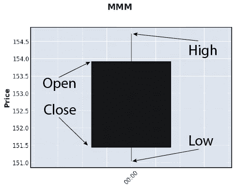
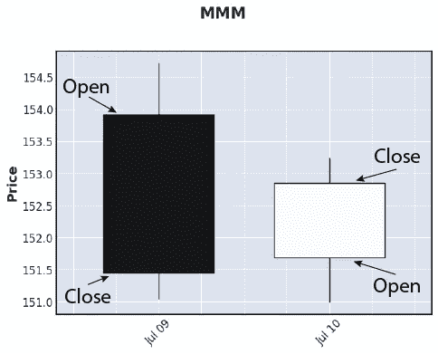

# 如何阅读财务数据

> 原文：<https://medium.com/geekculture/what-is-ohlcv-data-in-finance-5f53527cd5ce?source=collection_archive---------26----------------------->

*喜欢这篇文章？通过订阅我的* [*时事通讯*](https://whynance.substack.com/) *，在您的收件箱中获得更多类似的文章。*

金融数据有多种类型，但最具代表性的是*烛台图表*。在[之前的教程中，](/geekculture/how-to-load-and-visualize-financial-data-for-free-with-python-651beff31cb8)我展示了如何使用 Python 和在线免费数据创建蜡烛图。但是你怎么看那些图表呢？

在本教程中，我将讨论如何阅读烛台图表和它可视化的数据类型:OHLCV 数据。

# 什么是“OHLCV”？

首字母缩略词 OHLCV 代表“开盘价、最高价、最低价、收盘价和成交量”。这不是最优雅的缩写，但它很有效:它是金融分析中最常见的五种数据类型的列表。首先，让我们从雅虎财经下载并可视化一些 OHLCV 数据，使用早先教程[中描述的技术。](/geekculture/how-to-load-and-visualize-financial-data-for-free-with-python-651beff31cb8)

```
import yfinance as yf
import mplfinance as mpf # download some data from yahoo
data = yf.download(
        tickers = ['AAPL', 'GE', 'MMM'],
        period = '52wk',
        interval = '1d'
    )mmm_data = data.stack(level=0).MMM.unstack(level=1)
mpf.plot(mmm_data.iloc[:14], type='candle', title='MMM')
```


我们现在有了所谓的“蜡烛图”，描述了 3M 公司两周的价格变动。“烛台”一词描述了你所看到的盒子:每个盒子都是一根蜡烛，上下伸出的小棍子被称为灯芯。每根蜡烛线描述特定时间间隔内的价格活动。在这个数据中，这个时间间隔是一天，所以每根蜡烛线总结了 3M 公司一整天的交易活动。让我们放大来看一根蜡烛。



A single candle

每根蜡烛线的宽度对应于它所总结的持续时间。因为我们在上面只画了一根蜡烛，它会扩展以适合整个图。

每根蜡烛线有四个维度，分别对应所描述的时段的开盘价、最低价、收盘价和最高价。“开盘价”是 MMM 在我们计划的一天开始时的价格。它对应于蜡烛的顶部边缘。

“收盘”是 MMM 在一天结束时的价格，对应的是蜡烛的底边。最高价和最低价对应的是 3M 在一个交易日内达到的最高价和最低价。它们分别由“灯芯”的最顶端和最底端表示。

# 颜色呢？

你会注意到我们图中的一些蜡烛是黑色的，其他的是白色的。颜色本身并不重要；你会经常看到绿色和红色，而不是白色和黑色。然而，*重要的是*颜色表明蜡烛线指示的是积极的还是消极的价格变动。让我们再次放大，这一次是两个不同颜色的蜡烛。



Two candles of different color. Note that I haven’t labeled the High and Low values — they’re still at the tips of the wicks on both candles.

黑蜡烛和我们之前看到的是同一根蜡烛，但是现在我们看到它旁边有第二根白蜡烛。我没有标出高值和低值，因为它们在两支蜡烛上的位置是一样的(灯芯的尖端)。然而，*的开和关改变了位置*。

黑色蜡烛线表示在蜡烛线描述的时间段内价格已经下跌。白色蜡烛表示价格已经上涨。所以开盘价和收盘价在图上的位置。

换句话说，你应该从上到下阅读黑色(或红色)蜡烛，从下到上阅读白色(或绿色)蜡烛。

# 卷

包括开盘价、最低价、收盘价和最高价。体积呢？成交量是指在某一特定时期内，股票交易的资金总额。它不在我们目前看到的蜡烛图中。为了可视化我们下载的体积数据，我们必须稍微修改我们的绘图脚本。让我们这次用体积来绘制 AAPL 数据:

```
aapl_data = data.stack(level=0).AAPL.unstack(level=1)
mpf.plot(aapl_data.iloc[:14], type='candle', title='AAPL', volume=True)
```


成交量显示在蜡烛线下方较低的新图上。成交量图中的每一条都告诉我们每天有多少钱以美元为单位转手给了苹果公司。例如，7 月 1 日，成交量看起来是 1 亿美元。

# 好了

你现在可以阅读烛台图表，并了解 OHLCV 数据。当然，理解这些定义并不能让你成为解释财务图表行为的专家——但这是一个不错的开始。在未来的教程中，我们将更详细地讨论如何从蜡烛图中提取有用的价格信息。